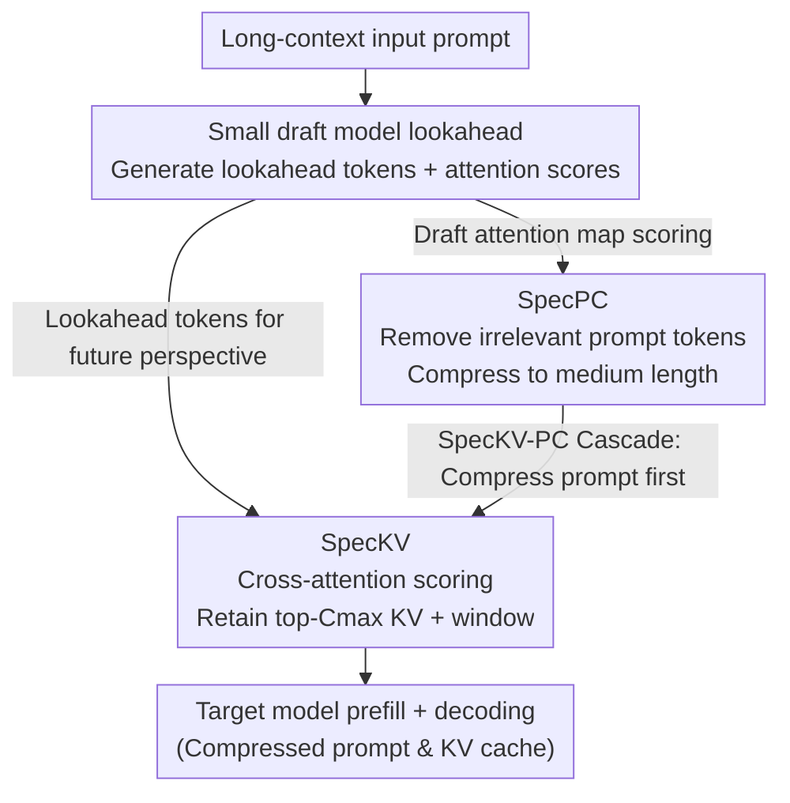

# Draft-based Approximate Inference for LLMs

**Conference**: ICLR 2026  
**arXiv**: [2506.08373](https://arxiv.org/abs/2506.08373)  
**Code**: [GitHub](https://github.com/furiosa-ai/draft-based-approx-llm)  
**Area**: Model Compression  
**Keywords**: Approximate inference, KV cache compression, prompt compression, draft model, sparse attention

## TL;DR

Ours proposes the Draft-based Approximate Inference framework, which utilizes lookahead predictions from a small draft model to more accurately estimate the importance of tokens and KV pairs. The framework includes SpecKV (KV cache dropping), SpecPC (prompt compression), and SpecKV-PC (cascaded compression), consistently outperforming existing baselines on long-context benchmarks.

## Background & Motivation

**Background**: Long-context LLM inference faces two primary bottlenecks: attention computation grows quadratically with context length, and KV cache memory grows linearly (e.g., 128K tokens on Llama-3.1-8B requires over 16GB). 

**Limitations of Prior Work**: Existing approximate inference methods, including KV cache dropping (H2O, SnapKV), sparse attention (MInference), and prompt compression (LLMLingua-2), rely on the attention activations of the current input tokens to estimate importance. This is essentially a "rear-view mirror" strategy that fails to accurately predict **which KV pairs are truly needed for future generated tokens**.

**Key Challenge**: Importance estimation requires future information, but future tokens have not yet been generated. LAQ++ attempts to generate draft queries using a sparse approximation of the target model itself, but it still requires storing the full target KV cache, failing to reduce peak memory.

**Key Insight**: A lightweight draft model (e.g., 0.5B-3B) can be used to generate lookahead tokens. This provides approximate future information at a very low cost, enabling more accurate estimation of token importance while avoiding the memory and computational burdens of the target model.

## Method

### Overall Architecture

Draft-based Approximate Inference employs a small draft model to generate lookahead tokens for the input first. These lookahead signals (draft outputs or attention activations) are then used to determine which KV pairs or prompt tokens the target model should retain. Unlike speculative decoding, the draft's lookahead here is not for verification but to provide a "future perspective" for importance estimation, thereby significantly reducing the total computation and peak memory of the target model.

The framework instantiates this idea into two independent algorithms and one cascade: SpecKV use lookahead tokens to score and drop target KV caches; SpecPC uses draft attention maps to score and remove prompt tokens; and SpecKV-PC connects them into a pipeline—first using SpecPC for coarse prompt reduction, then SpecKV for fine-grained KV pruning. All three share the same draft lookahead front-end but utilize different signals from its output.

### Key Designs

**1. SpecKV (Speculative KV Dropping): Using draft lookahead tokens to decide KV retention**

Existing KV dropping methods (like SnapKV) only consider the attention of current input tokens, effectively using a rear-view mirror to estimate future needs. SpecKV first lets the draft model generate $n_{\text{lookahead}}$ lookahead tokens, which are then concatenated with the original input for the target model's prefill. For each attention head, the queries from the last $n_{\text{window}}$ input tokens plus the lookahead tokens are used to perform cross-attention against the remaining input keys for scoring. Finally, the top-$C_{\max}$ KV pairs and those within the window are retained. Compared to LAQ++, which also uses lookahead, the key difference is that SpecKV does not need to store the target's full KV cache, thus achieving a genuine reduction in peak memory. Theoretically (Theorem 1), the error of this scoring is linearly bounded by the draft embedding error, $\|s - \hat{s}\|_2 \leq \epsilon \|W_q W_k^T\|_2$, meaning as long as the draft model is reasonably accurate, the estimated importance is reliable.

**2. SpecPC (Speculative Prompt Compression): Scoring prompt tokens directly via draft attention maps**

Prompt compression is more aggressive than KV dropping as it removes irrelevant tokens before prefill. SpecPC feeds the full prompt into the draft model and extracts its attention activation tensor $A \in \mathbb{R}^{n_{\text{layer}} \times n_{\text{head}} \times (n_{\text{in}}+n_{\text{lookahead}}-1) \times n_{\text{in}}}$ to measure token importance. To ensure stability, it uses a large window with non-uniform weights (lower weights for queries further from the sequence end), skips the first $l_{\text{skip}}$ layers (where shallow attention is unfocused and noisy), and aggregates scores by averaging within the window and taking the maximum across heads. Theorem 2 provides a guarantee: when the input satisfies the RIP condition from compressed sensing, the attention approximation error is proportional to the final output approximation error, linking "token removal" to controllable output bias.

**3. SpecKV-PC (Cascaded Compression): Coarse prompt removal followed by fine-grained KV pruning**

A single compression method often faces a hard trade-off between compression ratio and accuracy. The cascade combines the strengths of both. SpecKV-PC first uses SpecPC to compress the prompt to a medium length (e.g., 2048 tokens), then SpecKV further compresses the KV cache to a very small size (e.g., 256). Since the target model only processes the shortened prompt, latency and memory are significantly reduced. Interestingly, the cascade can outperform SpecKV alone—SpecPC acts as a pre-filter, removing clearly irrelevant tokens so that SpecKV's subsequent scoring occurs on a cleaner candidate set.

### Loss & Training

All three methods are training-free inference-time optimizations requiring no additional training. Implementation-wise, SpecKV combines sparse prefill (Vertical-Slash pattern) with KV cache dropping to further reduce prefill overhead. SpecPC uses local pooling instead of static chunking to maintain token continuity and prevent semantic fragmentation.

## Key Experimental Results

### Main Results

**Table 1: LongBench Performance Comparison (Qwen2.5 32B, KV cache $C_{\max}$=256)**

| Category | Method | SingleQA | MultiQA | Summ. | Few-shot | Code | All |
|------|------|----------|---------|-------|----------|------|-----|
| Dense | Target | 56.01 | 43.99 | 25.90 | 64.06 | 44.74 | 47.78 |
| KV | SnapKV | 52.54 | 40.21 | 19.89 | 61.18 | 40.12 | 42.98 |
| KV | LAQ++ | 55.15 | 44.14 | 22.24 | 63.25 | 41.19 | 45.79 |
| KV | **SpecKV** | 53.48 | 43.77 | 24.02 | 63.79 | 44.80 | **46.06** |
| KV | **SpecKV-PC** | 52.60 | 44.52 | 24.11 | 63.38 | 48.45 | **46.48** |

**Table 2: Prompt Compression Comparison ($C_{\max}$=1024)**

| Method | SingleQA | MultiQA | Summ. | Few-shot | Code | All |
|------|----------|---------|-------|----------|------|-----|
| LLMLingua-2 | 33.83 | 26.39 | 22.85 | 32.46 | 43.01 | 30.90 |
| SpecPrefill | 45.94 | 39.32 | 23.16 | 62.04 | 43.17 | 42.70 |
| **SpecPC** | 51.23 | 41.40 | 23.37 | 62.26 | 38.23 | **43.66** |

### Ablation Study

- **Lookahead Length**: SpecKV performs best with a maximum token limit, while SpecPC requires only 1.
- **Draft Model Size**: Larger draft models (1.5B vs. 0.5B) reduce $\epsilon$ and improve downstream scores.
- **Importance Score Correlation**: The token importance scores of the Draft (1.5B) and Target (14B) are highly correlated ($R^2$ close to 1).

### Key Findings

- The SpecKV-PC cascade outperforms SpecKV alone, indicating the effectiveness of SpecPC's pre-filtering.
- On a 64K context, SpecKV reduces latency by 75% compared to LAQ++ and saves approximately 25GB of peak memory.
- All methods significantly outperform the draft model itself, demonstrating the framework's robustness to weaker draft models.
- On the RULER synthetic benchmark, the advantage of lookahead-based methods becomes more prominent as context length increases.

## Highlights & Insights

- A unified framework integrates KV cache dropping and prompt compression into a single draft-based system.
- Theoretical analysis elegantly connects compressed sensing (RIP) with attention approximation error.
- SpecKV is the first method to leverage draft model lookahead for KV cache optimization.
- The cascaded compression design is insightful: a coarse-to-fine approach using the most suitable signal at each step.

## Limitations & Future Work

- Draft models introduce additional memory overhead (though they can be offloaded to CPU).
- For very short contexts (<4K), the draft overhead may not be justified.
- Currently, only same-series models are validated (e.g., Qwen2.5-0.5B $\to$ 32B); cross-series effectiveness remains unknown.
- Prompt compression reassigns position IDs, which may affect models that rely heavily on absolute positions.

## Related Work & Insights

- **SnapKV** (Li et al., 2024): Performs KV compression based on the attention of the last few tokens; SpecKV improves on this by introducing lookahead.
- **LAQ++** (Wang et al., 2025): Also uses lookahead but requires the target model's full KV cache, failing to reduce peak memory.
- **SpecPrefill** (Liu et al., 2025): The predecessor to SpecPC, with a fixed window size of 1; SpecPC improves this with larger windows and non-uniform weights.
- **Insight**: Beyond speculative decoding, draft models have broad potential applications in inference optimization.

## Rating

- Novelty: ⭐⭐⭐⭐ Strong framework unity. SpecKV is the first to use draft lookahead for KV dropping, though individual increments are moderate.
- Experimental Thoroughness: ⭐⭐⭐⭐⭐ Comprehensive coverage across RULER, LongBench, multiple models, efficiency measurements, and multimodal extensions.
- Writing Quality: ⭐⭐⭐⭐ Clear theoretical analysis, though multiple method combinations make it slightly long.
- Value: ⭐⭐⭐⭐ A practical solution for long-context inference optimization; the cascaded compression idea is highly transferable.

<!-- RELATED:START -->

## Related Papers

- [\[ICLR 2026\] GradPruner: Gradient-guided Layer Pruning Enabling Efficient Fine-Tuning and Inference for LLMs](gradpruner_gradient-guided_layer_pruning_enabling_efficient_fine-tuning_and_infe.md)
- [\[ICLR 2026\] NLI: Non-uniform Linear Interpolation Approximation of Nonlinear Operations for Efficient LLMs Inference](nli_non-uniform_linear_interpolation_approximation_of_nonlinear_operations_for_e.md)
- [\[ICLR 2026\] Channel-Aware Mixed-Precision Quantization for Efficient Long-Context Inference](channel-aware_mixed-precision_quantization_for_efficient_long-context_inference.md)
- [\[NeurIPS 2025\] Universal Cross-Tokenizer Distillation via Approximate Likelihood Matching](../../NeurIPS2025/model_compression/universal_cross-tokenizer_distillation_via_approximate_likelihood_matching.md)
- [\[ICLR 2026\] Metis: Training LLMs with FP4 Quantization](metis_training_llms_with_fp4_quantization.md)

<!-- RELATED:END -->
