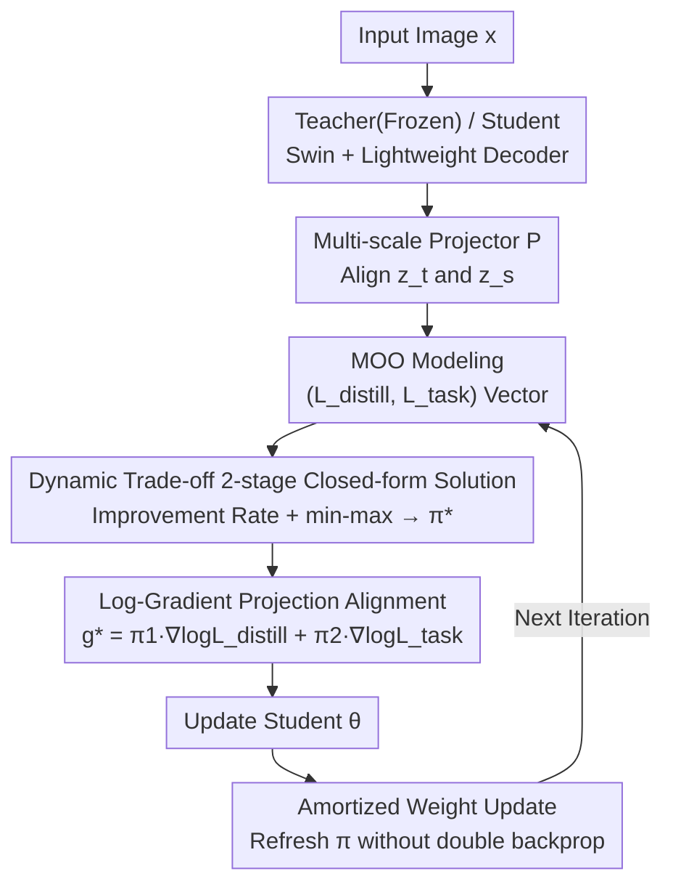

# DTO-KD: Dynamic Trade-off Optimization for Effective Knowledge Distillation

**Conference**: ICLR2026  
**OpenReview**: [https://openreview.net/forum?id=QMItTyQW92](https://openReview.net/forum?id=QMItTyQW92)  
**Code**: To be confirmed  
**Area**: Model Compression / Knowledge Distillation  
**Keywords**: Knowledge Distillation, Multi-Objective Optimization, Gradient Conflict, Pareto Optimality, Dynamic Trade-off  

## TL;DR
DTO-KD treats the trade-off between "task loss vs. imitation loss" in knowledge distillation as a multi-objective optimization problem. It calculates the weights of the two losses dynamically through a closed-form solution at the gradient level to automatically resolve gradient conflict and gradient dominance. This approach eliminates the need for manual weight tuning, achieves SOTA results on ImageNet-1K classification and COCO detection, and converges faster (matching 300-epoch performance in just 240 epochs).

## Background & Motivation
**Background**: Knowledge Distillation (KD) is a mainstream method for compressing large teacher models into compact student models. The standard practice involves a weighted sum of a task loss (classification/detection) and a distillation loss (imitating teacher logits or intermediate features), $L_{tot} = \alpha_1 L_{distill} + \alpha_2 L_{task}$, followed by end-to-end training. Methods range from early logit distillation (Hinton) to feature distillation (FitNets, ReviewKD) and token distillation for Transformers (DeiT, VkD).

**Limitations of Prior Work**: Regardless of the distillation signal design, the fixed weighted sum $\alpha_1 L_{distill} + \alpha_2 L_{task}$ remains problematic. $\alpha_1, \alpha_2$ are hyperparameters requiring manual tuning, and gradient scales for the two losses vary continuously during training, making fixed weights unable to adapt. More critically, mismatches between teacher and student architectures (e.g., CNN teacher and Transformer student) cause gradients to conflict in direction and magnitude.

**Key Challenge**: The authors quantify these issues into two symptoms. First, **Gradient Conflict (GrC)**: when $\langle g_{dist}, g_{task}\rangle < 0$, the distillation and task gradients point in opposite directions, causing the combined gradient $g_{tot}$ to hurt at least one objective. Second, **Gradient Dominance (GrD)**: when the ratio of gradient norms $\frac{\lVert g_{dist}\rVert}{\lVert g_{task}\rVert}$ is extreme, the update direction is dominated by one side, neglecting the other. Existing methods (including heuristic loss balancing) fail to systematically address these optimization-level inconsistencies, which are the true bottlenecks of distillation efficiency.

**Goal**: To develop a training strategy that eliminates manual weight tuning while ensuring "harmonious descent" for both losses at every step—preventing distillation from overwhelming the task or vice versa—and guaranteeing convergence to the Pareto frontier.

**Key Insight**: This is essentially a Multi-Objective Optimization (MOO) problem. While gradient manipulation tools for Pareto solutions exist in multi-task learning (e.g., PCGrad, FAMO), they have not been cleanly applied to KD. By rewriting KD as the optimization of a two-objective vector $(L_{distill}, L_{task})$, GrC and GrD can be handled simultaneously within a single framework.

**Core Idea**: Model distillation as a multi-objective optimization of "task loss + distillation loss." Use a **closed-form solution** at the gradient level to dynamically calculate the weight $\pi$, aligning the update direction with both objectives and ensuring equal contributions to both losses. This automatically resolves conflict and dominance, removing the need for manual $\alpha$.

## Method

### Overall Architecture
DTO-KD takes the same image $x$ as input for both the frozen teacher and the trainable student (both are Swin Transformers with lightweight decoders in the paper). Teacher features $z_t$ and student features $z_s$ are aligned via multi-scale lightweight projectors $P$, then fed into a DistillHead and a TaskHead to compute $L_{distill}$ and $L_{task}$. The core innovations lie not in the head designs, but in **how these gradients are synthesized into a single update direction**. The DTO module treats training as the optimization of the vector $L_{tot}(\theta) = (L_{distill}(\theta), L_{task}(\theta))^\top$, dynamically calculating weights $\pi=(\pi_{distill},\pi_{task})$ at each step to move toward the Pareto front and refreshing $\pi$ based on the "improvement rates" of both losses.

### Key Designs

**1. MOO Modeling: Replacing "Weighted Sum" with "Pareto Front"**

The fundamental problem with fixed weights $L_{tot}=\alpha_1 L_{distill}+\alpha_2 L_{task}$ is the assumption of a static linear trade-off. In distillation, gradient scales drift, causing static weights to either fail or require exhaustive tuning. DTO-KD redefines the objective as a vector $L_{tot}(\theta)=(L_{distill}(\theta), L_{task}(\theta))^\top$, seeking a Pareto optimal solution $\theta^*$—where no alternative $\tilde\theta$ exists such that both losses are simultaneously lower ($L(\tilde\theta)\preceq L(\theta^*)$ does not hold). This shift allows $\alpha_1, \alpha_2$ to be determined automatically by the MOO process at each step, while GrC and GrD are explicitly aligned during the search for the Pareto solution.

**2. Dynamic Trade-off Two-stage Closed-form Solution: Optimal Weights $\pi$**

Following the two-stage logic of Liu et al. (2023), the authors developed an analytical version specific to KD. **Stage 1** defines the "improvement rate" for each loss by testing a candidate update $\theta_{t+1}=\theta_t-\eta g_t$: $r_{dist}(g_t)=\frac{L_{distill}(\theta_t)-L_{distill}(\theta_{t+1})}{L_{distill}(\theta_t)}$, and similarly for $r_{task}$. **Stage 2** seeks a $g_t$ that maximizes the improvement of the "worst-performing" objective (min-max): $\max_{g_t}\min_{i\in\{dist,task\}}\frac{1}{\gamma}r_i(g_t)-\frac{1}{2}\lVert g_t\rVert^2$. Crucially, the paper proves that the dual of this problem—minimizing $\frac{1}{2}\lVert J_t\pi\rVert^2$ on the simplex $\pi_1+\pi_2=1$ (where $J_t=[\nabla\log L_{distill}(\theta_t)\,\vert\,\nabla\log L_{task}(\theta_t)]$)—has a **closed-form solution** (Theorem 3.1):

$$\pi_1^*=\frac{g_{22}-g_{12}}{g_{11}+g_{22}-2g_{12}},\qquad \pi_2^*=\frac{g_{11}-g_{12}}{g_{11}+g_{22}-2g_{12}}$$

where $g_{11},g_{12},g_{22}$ are elements of the Gram matrix $G=J_t^\top J_t$. Unlike numerical iterations, this $O(1)$ analytical solution allows weights to keep pace with the rapidly changing dynamics of distillation losses.

**3. Log-gradient Projection Alignment: Harmonizing the Update**

With $\pi^*$, the update direction is $g^*=\pi_1\nabla\log L_{distill}(\theta_t)+\pi_2\nabla\log L_{task}(\theta_t)$. Using log-losses acts as a scale normalization to mitigate dimensional disparities. The paper provides three properties: **Alignment (Corollary 3.2)**—$g^*$ is positively correlated with both $g_1$ and $g_2$, eliminating GrC; **Equal Contribution (Corollary 3.3)**—$\langle g^*,g_1\rangle=\langle g^*,g_2\rangle$, ensuring both objectives decrease at the same rate, eliminating GrD; and **Boundedness (Corollary 3.4/3.5)**—$\frac{1}{\sqrt2}\min(\lVert g_1\rVert,\lVert g_2\rVert)\le\lVert g^*\rVert\le\frac{\lVert g_1\rVert\lVert g_2\rVert}{\lVert g_1\rVert-\lVert g_2\rVert}$, preventing update collapse or explosion.

**4. Amortized Weight Update: Avoiding Double Backpropagation**

Ideally, computing $J$ requires two separate backpropagations per step. DTO-KD uses an **amortized** update: instead of explicit calculation, weights are treated as parameters and updated via gradient descent on a proxy objective, $\pi(t+1)=\pi(t)-\eta_\pi\nabla_\pi\frac{1}{2}\lVert\pi_{distill}(t)\log L_{distill}(\theta_t)+\pi_{task}(t)\log L_{task}(\theta_t)\rVert^2$, followed by a softmax normalization. This maintains a single backpropagation per step while outperforming SOTA—specifically in convergence speed, where DTO-KD matches the 300-epoch results of VkD (2024) in only 240 epochs.

### Loss & Training
$\pi_{distill},\pi_{task}$ are initialized to 0.5; the teacher is frozen. The optimizer is AdamW (classification lr=0.001/wd=0.05, detection lr=$10^{-4}$, optimization trade-off lr=0.025/wd=0.01). Classification follows DeiT recipes and VkD augmentations; detection follows ViDT configurations. Experiments were conducted on 4 NVIDIA H100 GPUs using PyTorch, with gradient clipping for stability.

## Key Experimental Results

### Main Results
ImageNet-1K Classification (Teacher RegNetY-160, Student DeiT, 300 epochs unless noted):

| Student Model | Method | Top-1 | Comparison |
|---------------|--------|-------|------------|
| DeiT-Ti (6M)  | VkD (CVPR24)| 78.3 | Prev. SOTA |
| DeiT-Ti (6M)  | **DTO-KD** | **79.7** | +1.4 pp Gain |
| DeiT-S (22M)  | VkD (CVPR24)| 82.3 | Prev. SOTA |
| DeiT-S (22M)  | **DTO-KD** | **83.1** | +0.8 pp Gain |

DTO-KD-Ti improves by 5.2 pp over the baseline; DTO-KD-S (83.1) even surpasses the teacher RegNetY-160 (82.6) and the original DeiT-S (79.8).

COCO Detection (Teacher ViDT-base, 50 epochs, AP):

| Student | Token-Matching | VkD | **DTO-KD** | Gain |
|---------|----------------|-----|------------|------|
| Swin-nano (16M) | 41.9 | 43.0 | **43.7** | +0.7 pp |
| Swin-tiny (38M) | 46.6 | 46.9 | **47.4** | +0.5 pp |
| Swin-small (61M) | 49.2 | 48.5 | **49.6** | +1.1 pp |

### Ablation Study
Component impact (Student DTO-KD-nano / Teacher ViDT-base, COCO AP):

| Proj | Optimization | Grad.Clip | AP | Description |
|------|--------------|-----------|----|-------------|
|      |              |           | 41.0 | Baseline |
| ✓    |              |           | 41.8 | Projector only (+0.8) |
|      | ✓            |           | 43.1 | Dynamic Trade-off only (+2.1, largest contributor) |
| ✓    | ✓            |           | 43.6 | Proj + Optimization |
| ✓    | ✓            | ✓         | **43.7** | Full Model |

### Key Findings
- **Dynamic Trade-off Optimization is the primary performance driver**: Adding it alone raises AP from 41.0 to 43.1, proving that gradient-level trade-offs are more significant than feature alignment itself.
- **Interpretable evolution of $\pi$**: In detection, DTO-KD prioritizes distillation loss (imitating the teacher) early on, then shifts focus to task loss (localization/classification) later—an automatically learned curriculum.
- **Faster Convergence**: 240 epochs match the 300-epoch SOTA. Error analysis shows simultaneous reduction in classification and localization errors, whereas prior methods often degrade classification performance compared to non-distilled baselines.

## Highlights & Insights
- **Converting "Loss Weight" issues into MOO and then into Closed-form Solutions**: While others rely on heuristics or grid search, this paper proves the two-objective case has a simple analytical $\pi^*$, effectively applying multi-task learning theory to KD.
- **Simultaneous resolution of GrC and GrD**: The single combined update direction ensures alignment, equal contribution, and boundedness through logically linked corollaries rather than a collection of tricks.
- **Amortization trick reduces overhead**: By using a proxy objective and softmax normalization, the "double backpropagation" requirement is bypassed without sacrificing performance.
- **Students surpassing teachers**: DeiT-S reaching 83.1 over a 82.6 teacher suggests that superior optimization dynamics can act as a form of regularization.

## Limitations & Future Work
- **Data Dependency**: Like most KD methods, it relies on training data; the min-max optimization may make it harder to extend to data-free distillation.
- **Visual Tasks Only**: Validated on classification and detection, but NLP, multi-modal tasks, and segmentation were not explored.
- **Closed-form Boundary Conditions**: The upper bound $\frac{\lVert g_1\rVert\lVert g_2\rVert}{\lVert g_1\rVert-\lVert g_2\rVert}$ can diverge when gradient norms are nearly equal, requiring gradient clipping for stability.
- **Future Directions**: Generalizing the two-objective closed-form solution to $K$ objectives for multi-teacher distillation.

## Related Work & Insights
- **vs. VkD / Token-Matching**: These focus on *what* signals to distill; DTO-KD focuses on *how* gradients coexist, making it orthogonal and stackable with signal-based methods.
- **vs. Heuristic Balancing (GradNorm, Uncertainty Weighting)**: DTO-KD provides theoretical guarantees under the Pareto framework rather than human-defined rules.
- **vs. MOO/Gradient Manipulation (PCGrad, FAMO)**: DTO-KD brings these from a multi-task setting to KD, offering a specific closed-form $\pi^*$ for the two-objective case that general MOO methods lack.

## Rating
- Novelty: ⭐⭐⭐⭐
- Experimental Thoroughness: ⭐⭐⭐⭐
- Writing Quality: ⭐⭐⭐⭐
- Value: ⭐⭐⭐⭐

<!-- RELATED:START -->

## Related Papers

- [\[ICLR 2026\] Navigating the Accuracy-Size Trade-Off with Flexible Model Merging](navigating_the_accuracy-size_trade-off_with_flexible_model_merging.md)
- [\[ICCV 2025\] EA-KD: Entropy-based Adaptive Knowledge Distillation](../../ICCV2025/model_compression/ea-kd_entropy-based_adaptive_knowledge_distillation.md)
- [\[ICCV 2025\] ACAM-KD: Adaptive and Cooperative Attention Masking for Knowledge Distillation](../../ICCV2025/model_compression/acam-kd_adaptive_and_cooperative_attention_masking_for_knowledge_distillation.md)
- [\[ICML 2025\] Rethinking the Stability-Plasticity Trade-off in Continual Learning from an Architectural Perspective](../../ICML2025/model_compression/rethinking_the_stability-plasticity_trade-off_in_continual_learning_from_an_arch.md)
- [\[ACL 2025\] Beyond Logits: Aligning Feature Dynamics for Effective Knowledge Distillation](../../ACL2025/model_compression/beyond_logits_aligning_feature_dynamics_for_effective_knowledge_distillation.md)

<!-- RELATED:END -->
