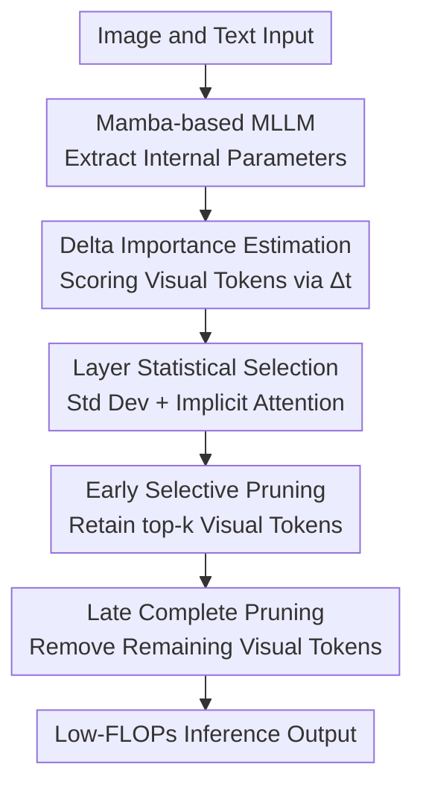

# DTP: Delta-Guided Two Stage Pruning for Mamba-based Multimodal Large Language Models

**Conference**: ICLR2026  
**OpenReview**: [https://openreview.net/forum?id=uqT7TAhwrm](https://openreview.net/forum?id=uqT7TAhwrm)  
**Code**: To be confirmed  
**Area**: Model Compression  
**Keywords**: Mamba, Multimodal Large Language Models, Vision Token Pruning, Inference Acceleration, Delta Importance  

## TL;DR
Addressing the vision token redundancy in Mamba-based Multimodal Large Language Models (MLLMs), DTP utilizes the input-dependent internal parameter $\Delta_t$ of Mamba to estimate token importance. It employs selective pruning in early layers and complete pruning in late layers to nearly halve FLOPs while maintaining multimodal task performance.

## Background & Motivation
**Background**: MLLMs typically encode images into a massive number of vision tokens, which are then fed into the language model alongside text tokens for understanding, question answering, or reasoning. Transformer-based MLLMs rely on self-attention, with complexity growing quadratically with sequence length. In contrast, Mamba-based MLLMs replace explicit attention with recursive updates from State Space Models (SSMs), offering linear complexity and lower memory footprints during decoding, making them a more efficient multimodal backbone.

**Limitations of Prior Work**: While Mamba mitigates redundant computation during decoding, it does not eliminate the burden of the prefill stage. The number of vision tokens in multimodal inputs often far exceeds that of text tokens. During prefill, these tokens must still pass through all layers simultaneously. If image tokens contain significant background, redundant patches, or information irrelevant to the answer, the model spends most of its reasoning time on low-value tokens.

**Key Challenge**: Vision token pruning is intuitive in Transformer MLLMs because attention scores serve as direct importance signals. However, Mamba lacks an explicit attention matrix. Directly applying Transformer-oriented methods like FastV or DART loses their underlying basis. The real difficulty is not whether tokens "can" be pruned, but how to find a reliable, training-free signal within Mamba’s internal mechanism that distinguishes the contribution of vision tokens.

**Goal**: Ours decomposes the problem into three sub-problems: first, identifying which internal Mamba parameter is best suited as a vision token importance metric; second, deciding which layers to prune instead of using manual fixed-layer assignments; and third, avoiding performance collapse caused by premature loss of critical visual information while reducing FLOPs and prefill latency.

**Key Insight**: Leveraging the selective state space model of Mamba, the study focuses on the input-dependent timescale parameter $\Delta_t$. This parameter affects discretized state transitions and input injection intensity, making it more representative of how much the "current token influences subsequent states" compared to output $y_t$ or coefficients $B_t, C_t$. Ours further observes the Importance distribution of $\Delta_t$ across different layers and the implicit attention pattern of Mamba, using statistical morphology to select early and late pruning points.

**Core Idea**: Utilize $\Delta_t$ as a Mamba-native vision token importance signal. Top-k vision tokens are selectively retained in early layers, while the remaining vision tokens are completely removed in late layers, thereby compressing redundant visual computation in Mamba-based MLLMs.

## Method
### Overall Architecture
DTP is a training-free inference-time vision token pruning framework designed for MLLMs using Mamba as the language backbone, such as Cobra and RoboMamba. Given image and text inputs, the model initially obtains vision and text tokens as usual. DTP reads $\Delta_t$ within each Mamba block, averages it to compute vision token importance scores, and determines two pruning layers through inter-layer statistics: selective pruning in early layers and complete pruning in late layers.

This "two-stage" approach does not involve training the model twice but reduces vision tokens at two distinct points during a single forward pass. Early pruning removes obviously low-value vision tokens, while late pruning leverages the observed decay in vision token contributions in deeper layers to remove all remaining vision tokens that no longer provide stable discriminative information.

### Key Designs
**1. Delta Importance Estimation: Converting Mamba Selective Parameters into Vision Token Scores**

The first critical judgment of DTP is to avoid forcing a Transformer attention score onto Mamba and instead seek importance from Mamba's own selective SSM. Mamba discretizes continuous SSMs via input-dependent $\Delta_t$, adjusting the discrete state transition $\bar{A}_t$ and input mapping $\bar{B}_t$. Intuitively, a larger $\Delta_t$ for a token triggers stronger state updates; if $\Delta_t$ is very small, its perturbation to subsequent hidden states is weaker, resembling a low-impact input.

Ours defines the importance of the $j$-th token as $s_j = \frac{1}{D}\sum_{d=1}^{D}\Delta_{j,d}$, averaging $\Delta_t$ across the channel dimension. This definition is restrained: it introduces no extra prediction heads, requires no fine-tuning, and does not depend on downstream labels, using only internal quantities already present during the forward pass. Subsequent ablations support this choice: using $\Delta_t$ as importance consistently outperforms $y_t$, $B_t$, and $C_t$ on Cobra and RoboMamba, particularly showing stability in tasks like TextVQA and POPE.

**2. Layer Statistical Selection: Determining Pruning Points via Standard Deviation and Implicit Attention**

A common mistake in vision token pruning is "arbitrary layer selection": pruning too early loses unintegrated information, while pruning too late saves little prefill computation. DTP first calculates the standard deviation of vision token importance scores for each layer as $Std_\ell = \sqrt{\frac{1}{N}\sum_{j=1}^{N}(s_{j,\ell}-\bar{s}_\ell)^2}$, and then observes inter-layer changes. Here, standard deviation is not just a statistical ornament but is used to judge whether token importance has developed a separable structure.

Ours also adopts the interpretation of Mamba's implicit attention: an expanded selective SSM yields a lower triangular kernel matrix $K$, describing how early tokens affect subsequent outputs. The paper finds that in roughly the first $25\%$ of layers, positions where standard deviation is low and implicit token-token interactions begin to form are suitable for selective pruning. In the last $30\%$ of layers, positions where standard deviation exhibits cliff-like mutations and implicit interaction structures weaken indicate that vision tokens no longer provide stable discriminative contributions. Thus, the early pruning layer is set as $k_{early}=\arg\min_\ell Std_\ell, 0\leq\ell\leq0.25L$, and the late pruning layer as $k_{late}=\arg\max_\ell |Std_{\ell+1}-Std_\ell|+1, 0.7L\leq\ell<L-1$.

**3. Early Selective Pruning: Pruning Only Vision Tokens, Retaining High-Delta Top-k**

As early layers still perform visual semantic aggregation, DTP does not crudely remove all vision tokens but sorts them by $\Delta_t$ scores to retain only the top-k. The "visual-only pruning" is vital: text tokens carry the question, instructions, and output conditions. Extending top-k selection to all tokens might erroneously delete text tokens, which ablations show leads to catastrophic performance degradation.

The advantage of selective pruning is the early removal of redundant backgrounds, duplicate patches, and low-impact visual regions, allowing subsequent layers to process shorter sequences and directly reducing prefill FLOPs. Meanwhile, because the retained vision tokens are those $\Delta_t$ deems most capable of altering state updates, the model maintains the core visual evidence needed to answer questions. Compared to random pruning, DTP’s top-k visual-only strategy is significantly more stable in GQA, TextVQA, and OKVQA.

**4. Late Complete Pruning:徹底 Removing Remaining Vision Tokens After Visual Contribution Destabilizes**

The second stage of DTP is more aggressive: in late layers, the paper observes that the importance distribution of vision tokens becomes scattered, standard deviation undergoes mutation, and implicit attention token-token interactions weaken. Ours explains that by this point, visual information has already been injected into the hidden states and text conditions by previous layers. Retaining vision tokens no longer yields stable gains but consumes significant computation.

Therefore, DTP performs complete pruning at $k_{late}$, removing all remaining vision tokens and allowing subsequent layers to continue reasoning primarily around text and already-fused states. While this design seems bold, ablations show it is efficient: with a fixed early keep ratio, adding late complete pruning reduces Cobra FLOPs from 1.26 to 0.97 and RoboMamba from 0.44 to 0.34, with almost no change in metrics like GQA, TextVQA, VizWiz, POPE, and OKVQA. Essentially, late complete pruning provides extra computational savings without significant sacrifice in task performance.

### A Walkthrough Example
Suppose Cobra receives an image and a VQA question; the vision encoder produces 729 vision tokens, and the text side contains the user question and prompts. In the first few layers, DTP does not act immediately as the semantic relationships between vision tokens are still forming. Once the forward pass reaches the early candidate range, DTP reads $\Delta_t$ for each vision token and averages them across channels to get 729 scores.

If the keep ratio is set to $r=0.5$, DTP retains roughly half of the highest-scoring vision tokens near $k_{early}=15$, reducing the count from 729 to 365. The remaining tokens pass through middle layers, completing visual semantic integration with text tokens. Near $k_{late}=45$, DTP determines via layer statistics that the model has entered the late stage where vision token contributions are unstable, thus removing all remaining vision tokens and allowing only text tokens and fused hidden states to complete the remaining layers.

The key to this process is not "the earlier the better," but selectively pruning low-importance vision tokens early and exiting vision token computation entirely late. The former controls information loss, while the latter secures larger FLOPs and latency gains.

### Loss & Training
DTP introduces no new training losses and requires no retraining of Cobra or RoboMamba. It is a plug-in inference-time strategy: first, the $\Delta_t$ importance distribution is profiled on a small set of samples to determine $k_{early}$ and $k_{late}$, then pruning is executed accordingly during formal inference.

In the experiments, early selective pruning is controlled by the keep ratio $r$. A gentle setting like $r=0.9$ aims for near-lossless FLOPs reduction, while a more aggressive setting like $r=0.5$ reduces FLOPs to approximately half. The keep ratio curves in the appendix show that as $r$ decreases from 1.0 to 0.3, the average performance of Cobra and RoboMamba declines smoothly without sudden collapse, indicating that $\Delta_t$ ranking possesses inherent stability in these Mamba-based MLLMs.

## Key Experimental Results

### Main Results
Ours validates DTP on two representative Mamba-based MLLMs: Cobra and RoboMamba. Cobra covers six multimodal understanding benchmarks: GQA, VQAv2, TextVQA, POPE, VSR, and VizWiz. RoboMamba covers five benchmarks: OKVQA, GQA, VQAv2, POPE, and VizWiz. Baselines include adapted versions of FastV, VTW, and DART.

| Model | Method | FLOPs Ratio | Avg Score | Relative Change |
|------|------|-----------|--------|----------------|
| Cobra | Baseline | 100% | 65.8 | 0.0 |
| Cobra | FastV, approx. 70% FLOPs | 72% | 65.3 | -0.5 |
| Cobra | VTW, approx. 70% FLOPs | 71% | 65.7 | -0.1 |
| Cobra | DART, approx. 70% FLOPs | 69% | 65.2 | -0.6 |
| Cobra | DTP, $r=0.9$ | 67% | 65.8 | 0.0 |
| Cobra | FastV, approx. 50% FLOPs | 53% | 64.7 | -1.1 |
| Cobra | VTW, approx. 50% FLOPs | 52% | 54.0 | -11.8 |
| Cobra | DART, approx. 50% FLOPs | 48% | 64.3 | -1.5 |
| Cobra | DTP, $r=0.5$ | 48% | 64.9 | -0.9 |

| Model | Method | FLOPs Ratio | Avg Score | Relative Change |
|------|------|-----------|--------|----------------|
| RoboMamba | Baseline | 100% | 67.0 | 0.0 |
| RoboMamba | FastV, approx. 70% FLOPs | 71% | 66.6 | -0.4 |
| RoboMamba | VTW, approx. 70% FLOPs | 71% | 66.6 | -0.4 |
| RoboMamba | DART, approx. 70% FLOPs | 67% | 66.1 | -0.9 |
| RoboMamba | DTP, $r=0.9$ | 66% | 66.7 | -0.3 |
| RoboMamba | FastV, approx. 50% FLOPs | 53% | 65.6 | -1.4 |
| RoboMamba | VTW, approx. 50% FLOPs | 51% | 53.4 | -13.6 |
| RoboMamba | DART, approx. 50% FLOPs | 51% | 65.4 | -1.6 |
| RoboMamba | DTP, $r=0.5$ | 49% | 65.9 | -1.1 |

On Cobra, DTP's superiority is clear: at $r=0.9$, FLOPs are reduced to 67% while the average score matches the baseline; at $r=0.5$, FLOPs drop to 48% with only a 0.9 point decrease. Since RoboMamba starts with fewer vision tokens (256 vs Cobra's 729), it is more prone to information loss during aggressive pruning, yet DTP still maintains smaller average drops than FastV, DART, and VTW.

### Ablation Study
| Ablation Item | Setting | Representative Result | Description |
|--------|------|----------|------|
| Importance Parameter | $y_t$ / $B_t$ / $C_t$ / $\Delta_t$ | Cobra TextVQA: $\Delta_t$ 56.1, $y_t$ 48.0, $B_t$ 47.4, $C_t$ 44.9 | $\Delta_t$ is better for measuring token contribution to state updates in Mamba |
| Token Selection Scope | Random / Top-k all tokens / Top-k visual only | Cobra GQA: Top-k all 7.01, Top-k visual only 61.4 | Text tokens must not be pruned; pruning must be limited to vision tokens |
| Late Complete Pruning | w/o vs w/ complete pruning | Cobra FLOPs 1.26 to 0.97, GQA 61.5 to 61.4, TextVQA 56.1 (Stable) | Late complete pruning provides ~23% extra FLOPs saving with almost no loss |
| RoboMamba Late Pruning | w/o vs w/ complete pruning | FLOPs 0.44 to 0.34, POPE 84.4, OKVQA 63.9 to 63.8 | Computation savings are stable even on models with fewer initial vision tokens |

### Key Findings
- DTP gains primarily from two complementary stages: early top-k visual-only pruning controls information loss, while late complete pruning drives further compute compression.
- $\Delta_t$ is the most critical signal source in this paper. It is more closely aligned with Mamba's selective mechanism than $B_t$, $C_t$, or output $y_t$, making it a more natural basis for pruning.
- Vision token pruning strategies cannot be simply extended to all tokens. Top-k all tokens strategy mistakenly deletes text conditions, leading to performance collapse in both Cobra and RoboMamba.
- Actual speedup aligns with FLOPs reduction: on Cobra + POPE, DTP reduces mean prefill latency from 98.04 ms to 61.54 ms, total latency from 16m05s to 10m35s, and GPU memory from 8.8 GB to 8.3 GB.
- The performance drop for RoboMamba is slightly less graceful than for Cobra due to its smaller initial vision token count and thus smaller redundancy margin; this suggests DTP is better suited for Mamba-based MLLMs with higher vision token counts.

## Highlights & Insights
- The greatest strength of DTP is avoiding the forced application of Transformer attention pruning to Mamba, and instead returning to the internal variables of selective SSMs to find $\Delta_t$ as a more "native" importance signal.
- The logic of two-stage pruning is clear: early layers still pose risks to visual information integration, thus necessitating selective pruning; late layers see weakened vision token contributions, allowing for complete pruning. This is more aligned with the information flow in deep MLLMs than single-point pruning.
- The analysis combining layer-wise standard deviation and implicit attention patterns provides a useful perspective for interpretable compression of Mamba-based MLLMs. This approach of "finding compression timing from internal state distributions" can be migrated to other Mamba/VSS models.
- From an engineering deployment perspective, DTP’s training-free nature is highly attractive. Many acceleration methods require retraining or complex hyperparameter calibration, whereas DTP relies on forward pass statistics and fixed pruning strategies, offering a relatively low integration cost.
- This paper also reminds us that the efficiency bottleneck of Mamba-based MLLMs is not limited to the decoding stage. Even with a linear complexity backbone, the prefill cost of vision tokens can still dominate overall latency.

## Limitations & Future Work
- The experiments focus primarily on Cobra and RoboMamba, which are representative of current open Mamba-based MLLMs but still limited in scope. Whether $\Delta_t$ distributions maintain the same patterns at larger scales, with stronger vision encoders, or in long-context settings remains to be verified.
- Pruning points in DTP rely on layer statistics from a small sample set. While the paper shows consistent trends across datasets, the early/late pruning layers might need re-estimation if the deployment task and calibration sample distribution differ significantly.
- Complete pruning assumes that late-stage vision tokens no longer provide stable contributions. For samples requiring fine-grained localization, OCR, or long-chain visual reasoning, specific vision tokens might still be valuable in later layers; the current strategy lacking a sample-level dynamic recovery mechanism.
- The evaluation primarily uses benchmarks like VQA/POPE/VSR/VizWiz, with limited discussion on batch size, memory fragmentation, or hardware kernel optimizations in real-world online services. While FLOPs and wall-clock latency align, deployment gains are still influenced by implementation details.
- Future work could consider turning DTP into a sample-adaptive strategy: dynamically adjusting the keep ratio based on the sharpness of the current input's $\Delta_t$ distribution, or setting more conservative pruning gates for OCR, small objects, or high-resolution images.

## Related Work & Insights
- **vs FastV**: FastV originates from Transformer-based MLLMs, relying on attention scores and pruning vision tokens in relatively early layers. DTP differs by replacing explicit attention with Mamba's $\Delta_t$ and automatically selecting dual pruning points through statistics, making it more tailored to the Mamba architecture.
- **vs VTW**: VTW uses KL divergence to determine the layer where vision tokens can be withdrawn, making it relatively architecture-agnostic. DTP does not compare original outputs with withdrawn logits but determines pruning points directly from internal Mamba distributions and implicit attention forms; in experiments, VTW showed large performance drops at ~50% FLOPs.
- **vs DART**: DART focuses on vision token duplication, removing redundant tokens via pivot tokens and similarity. DTP focuses on Mamba state update contributions, basing judgment not on inter-token similarity but on the impact of $\Delta_t$ on hidden state evolution.
- **vs Vision Mamba token pruning / Famba-V**: These works mostly handle unimodal vision Mamba or token fusion. DTP targets the Mamba-based MLLM scenario, emphasizing visual-only pruning when vision and text tokens coexist and validating tasks like multimodal QA, hallucination detection, and visual-spatial reasoning.
- **Insight**: When compressing Mamba-like models, one should rely less on find "attention substitutes" and more on analyzing the selective SSM internal parameters themselves. $\Delta_t$, implicit kernels, and layer-wise distribution mutations can all serve as foundations for pruning, early exiting, or dynamic computation allocation.

## Rating
- Novelty: ⭐⭐⭐⭐☆ Using $\Delta_t$ as a Mamba-native token importance metric combined with two-stage pruning identifies the problem accurately, though it remains within the inference-time token pruning paradigm.
- Experimental Thoroughness: ⭐⭐⭐⭐☆ Covers two Mamba-based MLLMs, over ten task metrics, latency, and multiple ablations, providing solid evidence; larger models and real deployment scenarios could be further explored.
- Writing Quality: ⭐⭐⭐⭐☆ Motivations, formulas, and experimental tables are clear, with layer selection analysis supported by figures; some intuitive explanations regarding "valleys/mutations" in standard deviation could be more rigorous.
- Value: ⭐⭐⭐⭐☆ Highly relevant for the inference acceleration of Mamba-based MLLMs, especially in deployment scenarios with high vision token counts and significant prefill costs.

<!-- RELATED:START -->

## Related Papers

- [\[ACL 2026\] Two-Stage Regularization-Based Structured Pruning for LLMs](../../ACL2026/model_compression/two-stage_regularization-based_structured_pruning_for_llms.md)
- [\[ICLR 2026\] Entropy-Based Block Pruning for Efficient Large Language Models](entropy-based_block_pruning_for_efficient_large_language_models.md)
- [\[ICLR 2026\] RCPU: Rotation-Constrained Error Compensation for Structured Pruning of Large Language Models](rcpu_rotation-constrained_error_compensation_for_structured_pruning_of_large_lan.md)
- [\[ICLR 2026\] ES-dLLM: Efficient Inference for Diffusion Large Language Models by Early-Skipping](es-dllm_efficient_inference_for_diffusion_large_language_models_by_early-skippin.md)
- [\[ICLR 2026\] KBVQ-MoE: KLT-guided SVD with Bias-Corrected Vector Quantization for MoE Large Language Models](kbvq-moe_klt-guided_svd_with_bias-corrected_vector_quantization_for_moe_large_la.md)

<!-- RELATED:END -->
