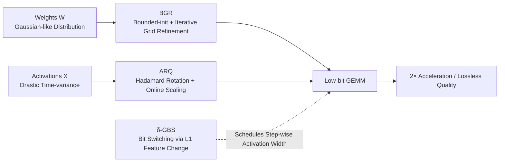

# DVD-Quant: Data-free Video Diffusion Transformers Quantization

**Conference**: ICLR 2026  
**OpenReview**: [https://openreview.net/forum?id=3AnRMvlVDw](https://openreview.net/forum?id=3AnRMvlVDw)  
**Code**: To be open-sourced (Paper promises Code and models will be released)  
**Area**: Model Compression / Post-Training Quantization (PTQ) / Video Diffusion Models  
**Keywords**: Video DiT, Post-Training Quantization (PTQ), Data-free quantization, W4A4, Mixed-precision, Hadamard Rotation  

## TL;DR
DVD-Quant proposes a **completely data-free** post-training quantization framework for Video Diffusion Transformers. By integrating three modules—Bounded-init Grid Refinement (BGR), Auto-scaling Rotated Quantization (ARQ), and $\delta$-Guided Bit Switching ($\delta$-GBS)—it marks the first time a Video DiT achieves W4A4 quantization without quality degradation, while delivering approximately $2\times$ acceleration on HunyuanVideo.

## Background & Motivation
**Background**: Diffusion Transformers (DiT) have become the SOTA architecture for video generation (e.g., Sora, HunyuanVideo, Wan2.1). However, the computational and memory overhead from 50-step iterative denoising and full attention makes deployment extremely expensive. Post-Training Quantization (PTQ) is a plug-and-play acceleration route that requires no retraining; methods like ViDiT-Q have already achieved near-lossless performance at W8A8.

**Limitations of Prior Work**: When activation precision is compressed below 8 bits, existing PTQ methods fail collectively—VBench metrics plunge by 27.5%~61.3%. There are two primary reasons: (1) Mainstream methods rely on **offline calibration pre-scaling**, which is time-consuming and cannot adapt to activation scales in DiT that shift drastically across denoising timesteps; (2) Aggressive W4A4 quantization causes generation quality to collapse.

**Key Challenge**: The difficulty of DiT quantization stems from its inherent **time-variance**—activation distributions drift significantly across 50 timesteps. Calibration sets, being merely snapshots of certain steps, inevitably fail to cover the entire process. Meanwhile, weights follow a Gaussian-like distribution, and fixed MinMax ranges waste bit levels on outliers that constitute only 0.3% of the values.

**Goal**: To completely eliminate the need for calibration data while maintaining video fidelity under W4A6 or even W4A4, achieving practical hardware acceleration.

**Core Idea**: The authors base their approach on three observations: (**Obs 1**) Gaussian-like weights are suitable for iterative quantization grid refinement; (**Obs 2**) Drastic cross-step activation scale changes necessitate online dynamic scaling rather than offline static scaling; (**Obs 3**) Latent features evolve unevenly across different denoising steps, allowing for step-wise adaptive bit-width allocation. Three specific designs were developed accordingly.

## Method

### Overall Architecture
DVD-Quant consists of three complementary modules forming a data-free quantization pipeline: **BGR** handles the weight side by suppressing quantization errors of Gaussian-like weights; **ARQ** manages the activation side by replacing offline calibration with Hadamard rotation and online scaling; **$\delta$-GBS** serves as the scheduler, dynamically switching activation bit-widths based on feature variations at each timestep. Fidelity at W4A4/W4A6 is only preserved when these three collaborate.

### Key Designs

**1. BGR (Bounded-init Grid Refinement): Reducing weight quantization error by 86% via closed-form coordinate descent.** MinMax quantization directly calculates the step size as $\Delta=(\max(W)-\min(W))/(2^b-1)$. This is unfriendly to Gaussian-like weights, where outliers consume too many bit levels and the dense zero-mean region's interval becomes too coarse. BGR reformulates the objective to minimize $\|W-\Delta\odot(W_q-z)\|_F$ and notes that the MinMax solution is merely an initialization. To avoid gradient descent in PTQ, the authors utilize coordinate descent by **fixing two variables to optimize the third**: first, fix $z$ and $W$ to solve for the least-squares closed-form step size $\Delta'=\langle W_q-z,\,W\rangle_{\text{row}}\oslash\langle W_q-z,\,W_q-z\rangle_{\text{row}}$; next, fix $\Delta'$ and $W_q$ to relax the zero point to a real number before rounding to $z'=\text{clamp}(W_q-W\oslash\Delta',0,2^b-1)$; finally, update $W_q$ and iterate until convergence. Instead of using raw MinMax for initialization, a **search boundary** is used—gradually shrinking and clipping the bounds $W_c=\text{clamp}(W,\min(W)+\delta_l,\max(W)-\delta_u)$ to exclude outliers, providing a better starting point for iteration. This process is completed offline on the weight side with zero extra inference overhead, reducing quantization error in HunyuanVideo layers by 86%~91% on average.

**2. ARQ (Auto-scaling Rotated Quantization): Suppressing outliers via rotation and resisting time-variance via online scaling without calibration data.** Activation quantization faces two major hurdles: cross-step dynamic shifts render offline scaling factors ineffective, and pure rotation methods, while suppressing large outliers, may expand certain activations in the transformed space, introducing new errors. ARQ merges the strengths of rotation and scaling: it first applies a Hadamard matrix $H$ to both activations and weights to maintain computational invariance $Y=(XH)(H^\top W)$ (via Fast Hadamard Transform with minimal latency), then calculates scaling factors **online** per channel, applying them only to activations:

$$\widehat{X}=Q(XH\Lambda^{-1}),\quad \widehat{W}=\text{BGR}(WH),\quad Y=\widehat{X}\,\Lambda\,\widehat{W}^\top,$$

where $s_j=\|\widetilde{X}_j\|_\infty$ and $\Lambda=\text{diag}(s_1,\dots,s_c)$. Rotation disperses massive outliers across multiple channels, while post-rotation online scaling reinforces channel consistency and fixes side effects from the rotation. Crucially, scaling factors are **calculated in real-time for every timestep**, naturally adapting to the time-variant distribution of DiT activations without any calibration set. For actual deployment to align with low-bit Tensor Core GEMM granularity, ARQ uses a hardware-friendly **block-wise scaling** variant.

**3. $\delta$-GBS ($\delta$-Guided Bit Switching): Dynamic bit-width switching based on feature evolution across timesteps.** Feature evolution in DiT denoising is highly non-uniform—redundant steps show little change, while key steps undergo drastic transformations. A uniform bit-width either wastes computation or sacrifices quality in critical steps. $\delta$-GBS monitors the normalized L1 distance of adjacent outputs $L_1(F,t)=\|F_t-F_{t-1}\|_1/\|F_{t-1}\|_1$ and performs threshold judgment based on accumulated change since the last reset:

$$B_{t_i}=\begin{cases}b_{\text{low}}, & \sum_{t=t_p}^{t_i-1}L_1(F,t)<\delta\\[4pt] b_{\text{high}}, & \sum_{t=t_p}^{t_i-1}L_1(F,t)\ge\delta\end{cases}$$

When cumulative feature change is below $\delta$, the segment is considered redundant and uses $b_{\text{low}}=4$; when it exceeds $\delta$, it switches to $b_{\text{high}}=8$ to preserve details and resets the accumulator. This error-driven decision **adapts to the input prompt**, outperforming static timestep partitioning. $\delta$ serves as a performance-efficiency knob: $\delta\to0$ degrades to W4A8, while $\delta\to\infty$ degrades to W4A4. Actual experiments use an average bit-width of approximately 6 (W4A6).

## Key Experimental Results

### Main Results (HunyuanVideo, VBench)

| Method | W/A | Aesthetic | Imaging | Overall Consist. | Dynamic Degree |
|---|---|---|---|---|---|
| HunyuanVideo (FP) | 16/16 | 62.53 | 64.78 | 25.86 | 51.39 |
| MinMax | 4/8 | 59.44 | 60.62 | 25.78 | 52.78 |
| SmoothQuant | 4/8 | 60.50 | 64.47 | 25.56 | 51.39 |
| Quarot | 4/8 | 58.80 | 56.86 | 25.33 | 55.56 |
| ViDiT-Q | 4/8 | 57.01 | 59.74 | 24.77 | 48.61 |
| **Ours (DVD-Quant)** | **4/6** | **62.27** | **64.22** | **25.83** | **58.33** |
| MinMax | 4/4 | 24.20 | 24.78 | 4.27 | 0.00 |
| SmoothQuant | 4/4 | 48.41 | 59.46 | 21.09 | 1.39 |
| Quarot | 4/4 | 44.85 | 54.30 | 17.33 | 87.5 |
| ViDiT-Q | 4/4 | 45.36 | 40.10 | 19.66 | 0.00 |
| **Ours (DVD-Quant)** | **4/4** | **61.96** | **61.82** | **25.68** | **56.94** |

W4A6 nearly matches FP16 and outperforms all W4A8 baselines. While other methods collapse under W4A4 (dynamic degree drops to zero or quality halves), DVD-Quant remains stable, becoming the **first W4A4 Video DiT PTQ to maintain quality**.

### Ablation Study (BGR / ARQ)

| BGR | ARQ | W/A | Aesthetic | Imaging | Subject Consist. |
|---|---|---|---|---|---|
| ✓ | | W4A6 | 58.15 | 58.68 | 98.04 |
| | ✓ | W4A6 | 57.85 | 57.72 | 98.23 |
| ✓ | ✓ | W4A6 | **60.46** | **61.93** | **98.91** |
| ✓ | | W4A4 | 53.95 | 52.67 | 97.92 |
| | ✓ | W4A4 | 43.26 | 58.31 | 95.36 |
| ✓ | ✓ | W4A4 | **59.57** | **58.93** | **98.67** |

BGR and ARQ are both essential; their synergy achieves optimal results. Particularly at W4A4, removing either module leads to a significant score drop.

### Key Findings
- **Speed and Memory**: Achieves 3.68× memory optimization on HunyuanVideo. Latency speedup is 1.75× for W4A8, 1.93× for W4A6, and 2.12× for W4A4 (approx. 2×).
- **Synergy with TeaCache**: Combining with TeaCache caching technology further boosts end-to-end acceleration to 4.01× for W4A8 and 4.85× for W4A4 with almost no quality loss.
- **$\delta$ as a Smooth Knob**: Adjusting $\delta$ from 0.06 to 0.18 smoothly reduces bit-width while Imaging Quality slides gracefully from 62.11 to 61.00, avoiding abrupt quality drops.

## Highlights & Insights
- **Completely Data-free** is the primary selling point: BGR uses closed-form refinement for weights, ARQ calculates scaling online, and $\delta$-GBS monitors features in real-time. This bypasses the fundamental contradiction between time-variant DiT activations and static calibration snapshots.
- **Clean Logical Loop**: Three observations neatly map to three designs—Gaussian weights to grid refinement, time-variant activations to online rotation/scaling, and non-uniform features to adaptive bit-widths.
- ARQ combines "rotation for outlier dispersion" and "online scaling for side-effect correction" at a hardware-friendly block-wise granularity, making it a viable engineering solution rather than just theoretical.
- $\delta$-GBS uses cumulative L1 error as a trigger, which naturally adapts to prompt content and provides continuous interpolation between W4A8 and W4A4, offering a substantial advantage over static partitioning.

## Limitations & Future Work
- **Model Scope**: The main results are focused on HunyuanVideo. While Wan2.1 results are in the appendix, the generalizability across more Video DiTs (e.g., CogVideoX, Open-Sora) and text-to-image DiTs requires more systematic validation.
- **VBench Metrics vs. Human Perception**: Some automated metrics appear anomalous (e.g., Quarot W4A4 reporting 87.5 dynamic degree despite visual collapse); the lack of large-scale human evaluation is a drawback.
- **$\delta$ Threshold Tuning**: Although it is a single knob, the optimal $\delta$ for different models or prompts still necessitates empirical setting.
- **Cumulative Overhead**: While ARQ's Hadamard rotation and online scaling are "minimal overhead," their accumulation over extremely long videos or high step counts should be quantified further.

## Related Work & Insights
- **DiT Quantization Landscape**: QAT routes (like Ter-DiT) provide high accuracy but require retraining. PTQ routes like SVDQuant (low-rank branches for outliers) and ViDiT-Q (W8A8 near-lossless) are plug-and-play. DVD-Quant pushes the PTQ boundary from W8A8 to W4A4.
- **Quantization Techniques**: ARQ effectively merges channel scaling (SmoothQuant) and orthogonal rotation (Quarot) into an "online scaling + rotation" upgrade that eliminates the shared calibration dependency of its predecessors.
- **Insight**: For any model where "distributions drift during inference" (diffusion, long-form autoregressive generation), **online dynamic quantization** may be more fundamental than offline calibration.

## Rating
- **Novelty**: ⭐⭐⭐⭐ — The combination of the three modules is novel, and achieving lossless W4A4 PTQ for Video DiT is a clear differentiator; individual techniques are rooted in prior work.
- **Experimental Thoroughness**: ⭐⭐⭐⭐ — Comprehensive VBench comparisons, ablation studies, and synergy with TeaCache; however, the lack of human evaluation on the main table is a slight negative.
- **Writing Quality**: ⭐⭐⭐⭐ — Clear mapping from observations to designs; includes complete formulas and persuasive visualizations.
- **Value**: ⭐⭐⭐⭐⭐ — Addresses the major pain point of video generation deployment costs. 2× acceleration, W4A4 quality preservation, and data-free plug-and-play utility offer high engineering value.

## Related Papers

- [\[ICLR 2026\] Quant-dLLM: Post-Training Extreme Low-Bit Quantization for Diffusion Large Language Models](quant-dllm_post-training_extreme_low-bit_quantization_for_diffusion_large_langua.md)
- [\[ICML 2026\] Selective Coupling of Decoupled Informative Regions: Masked Attention Alignment for Data-Free Quantization of Vision Transformers](../../ICML2026/model_compression/selective_coupling_of_decoupled_informative_regions_masked_attention_alignment_f.md)
- [\[ICLR 2026\] DiffVax: Optimization-Free Image Immunization Against Diffusion-Based Editing](diffvax_optimization-free_image_immunization_against_diffusion-based_editing.md)
- [\[ICLR 2026\] Post-Training Quantization for Video Matting](post-training_quantization_for_video_matting.md)
- [\[CVPR 2025\] Q-DiT: Accurate Post-Training Quantization for Diffusion Transformers](../../CVPR2025/model_compression/q-dit_accurate_post-training_quantization_for_diffusion_transformers.md)

<!-- RELATED:END -->

<!-- RELATED:START -->

## Related Papers

- [\[ICLR 2026\] Post-Training Quantization for Video Matting](post-training_quantization_for_video_matting.md)
- [\[ICLR 2026\] DiffVax: Optimization-Free Image Immunization Against Diffusion-Based Editing](diffvax_optimization-free_image_immunization_against_diffusion-based_editing.md)
- [\[ICLR 2026\] Quant-dLLM: Post-Training Extreme Low-Bit Quantization for Diffusion Large Language Models](quant-dllm_post-training_extreme_low-bit_quantization_for_diffusion_large_langua.md)
- [\[ICLR 2026\] SERQ: Saliency-Aware Low-Rank Error Reconstruction for LLM Quantization](serq_saliency-aware_low-rank_error_reconstruction_for_llm_quantization.md)
- [\[ICLR 2026\] Tequila: Trapping-free Ternary Quantization for Large Language Models](tequila_trapping-free_ternary_quantization_for_large_language_models.md)

<!-- RELATED:END -->
