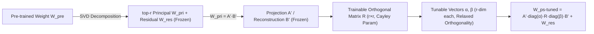

# Efficient Orthogonal Fine-Tuning with Principal Subspace Adaptation

**Conference**: ICLR 2026  
**OpenReview**: [https://openreview.net/forum?id=FSHrinMArK](https://openreview.net/forum?id=FSHrinMArK)  
**Code**: [https://github.com/fei407/PSOFT](https://github.com/fei407/PSOFT)  
**Area**: Parameter-Efficient Fine-Tuning / Model Compression  
**Keywords**: PEFT, Orthogonal Fine-Tuning (OFT), Principal Subspace, Low-rank, Semantic Preservation, Cayley Parameterization  

## TL;DR
PSOFT migrates orthogonal fine-tuning from the "full parameter space" to the "low-rank principal subspace of pre-trained weights." By utilizing SVD to construct dimension-compatible projections and providing a theoretical condition that strictly preserves subspace geometry (angles and norms), while adding two tunable vectors to relax orthogonality, PSOFT—for the first time—matches or exceeds LoRA across three dimensions: parameter count, VRAM usage, and computational overhead.

## Background & Motivation
**Background**: Two main branches exist in Parameter-Efficient Fine-Tuning (PEFT). LoRA uses additive low-rank updates $W=W_{pre}+AB$, which is efficient and adds no inference latency but distorts the angle/norm relationships (i.e., "semantic representation") between pre-trained weight column vectors, potentially degrading quality in generative tasks. Orthogonal Fine-Tuning (OFT) follows a multiplicative approach $W=RW_{pre}$, using an orthogonal matrix $R$ for isometric transformation to strictly preserve column vector angles and norms (hyperspherical energy), leading to better semantic preservation.

**Limitations of Prior Work**: The orthogonal matrix $R\in\mathbb{R}^{d\times d}$ in OFT is too expensive in the full parameter space. Subsequent works introduced sparse structures to save parameters—block-diagonal OFT uses block structures, but rigid blocks limit expressivity; BOFT/qGOFT decompose $R$ into a product of multiple sparse matrices (butterfly / Givens rotations) to recover expressivity. however, chained multiplications generate significant intermediate activations, consuming VRAM and slowing down training. The paper reports that qGOFT is approximately 6× slower than LoRA, and both BOFT/qGOFT often exceed 80GB VRAM on large models, leading to frequent OOM.

**Key Challenge**: Sparsification-based OFT methods cannot simultaneously achieve "expressivity" and "multi-dimensional efficiency (parameters/VRAM/compute)"—saving parameters often comes at the cost of VRAM and speed.

**Goal**: Design a PEFT method that simultaneously achieves **semantic preservation, expressivity, and multi-dimensional efficiency**.

**Key Insight**: **Constrain orthogonal transformations to the low-rank principal subspace of pre-trained weights**. Since substantial evidence suggests that pre-trained models and their task adaptations reside in a low intrinsic rank, there is no need to perform orthogonal transformations in the full space. Rotating only within the subspace spanned by the top-$r$ principal components avoids the inefficiency of full-space OFT while maintaining semantics and expressivity. Three difficulties exist: ① Incompatibility between low-dimensional orthogonal matrices and high-dimensional weights; ② Naive subspace orthogonal transformations destroy subspace geometry; ③ Strict orthogonality limits adaptation to task drift.

## Method

### Overall Architecture
PSOFT freezes pre-trained weights and uses SVD to decompose $W_{pre}$ into "Principal Components $W_{pri}$ + Residual $W_{res}$." $W_{pri}$ is decomposed into a projection matrix $A'$ and a reconstruction matrix $B'$ (both frozen). Only an $r\times r$ orthogonal matrix $R$ and two $r$-dimensional tunable vectors $\alpha, \beta$ are trained during the process. The forward pass is calculated as $h=(A'\,\mathrm{diag}(\alpha)\,R\,\mathrm{diag}(\beta)\,B'+W_{res})^\top x$. This pipeline addresses the three challenges: SVD projection handles dimension compatibility, the theoretical condition $R^\top A^\top A R=A^\top A$ ensures geometric invariance, and tunable vectors provide orthogonality relaxation.

### Key Designs

**1. Dimension-Compatible Subspace Orthogonal Transformation: Projecting high-dimensional weights into the low-rank principal subspace via SVD.** Directly applying $R\in\mathbb{R}^{r\times r}$ to $W_{pre}\in\mathbb{R}^{d\times n}$ results in a dimension mismatch. Thus, $W_{pre}=U\Sigma V^\top$ is computed first, taking the first $r$ singular values/vectors to reconstruct principal components $W_{pri}=U_{[:,:r]}\Sigma_{[:r,:r]}V_{[:,:r]}^\top$, with the remainder being the residual $W_{res}=W_{pre}-W_{pri}$. Representing $W_{pri}$ as $A B$ ($A$ projects weights into the $r$-dimensional principal subspace, $B$ reconstructs them), the orthogonal transformation is applied within the subspace: $W_{ps\text{-}tuned}=ARB$. Regarding parameter efficiency: LoRA trains two matrices, $M=(d+n)r_{LoRA}$, so $r_{LoRA}=M/(d+n)$; PSOFT trains only one orthogonal matrix, $M=r_{PSOFT}^2$, so $r_{PSOFT}=\sqrt{M}$. Since $\sqrt{M}\ll d+n$, **PSOFT can utilize a much larger rank under the same parameter budget**, providing stronger expressivity—this is why its rank $r$ can scale to several hundreds on LLMs while remaining cost-effective.

**2. Geometry-Preserving Theoretical Condition: Not every orthogonal $R$ preserves subspace geometry.** Dimension compatibility alone is insufficient; naively applying a low-dimensional orthogonal matrix to the symmetric decomposition of $A, B$ still distorts the angles and norms of the columns in $W_{pri}$. The paper presents Theorem 4.1: To ensure $W_{ps\text{-}tuned}=ARB$ preserves both inter-column angles and column norms, it must satisfy $R^\top A^\top A R=A^\top A$. Intuition: Subspace geometry is encoded by the Gram matrix $G=A^\top A$; any $R$ satisfying $R^\top G R=G$ acts as a "symmetry" (similar to rotation or reflection) of this geometry. By applying $R$ to the columns of $B$ and then projecting via $A$, high-dimensional angles and lengths remain unchanged. In practice, $A$ is orthonormalized such that $A^\top A=I_r$, reducing the condition to "$R$ is an orthonormal matrix." The decomposition is changed from symmetric to **asymmetric form**: $A'=U_{[:,:r]}$, $B'=\Sigma_{[:r,:r]}V_{[:,:r]}^\top$, with $R$ initialized as an identity matrix. To maintain strict orthogonality at low cost, Cayley parameterization $R=(I-Q)(I+Q)^{-1}$ ($Q$ is skew-symmetric) is used, with a 5-term truncated Neumann series approximating $(I+Q)^{-1}$ as in OFTv2 to avoid expensive Gram-Schmidt processes.

**3. Low-Cost Orthogonality Relaxation: Two tunable vectors provide adaptability to task drift.** While strict orthogonality preserves semantics, it limits adaptation to task-specific shifts, potentially leading to sub-optimal performance. Existing relaxation methods are expensive: qGOFT is flexible but requires 4× parameters; BOFT adds scaling vectors to the output dimension, which scale linearly with the model size. PSOFT inserts two $r$-dimensional tunable vectors on both sides of the orthogonal matrix, changing the forward pass to $h=(A'\,\mathrm{diag}(\alpha)\,R\,\mathrm{diag}(\beta)\,B'+W_{res})^\top x$. $\alpha, \beta$ are initialized as ones (ensuring training starts with strict orthogonality) and then gradually relax during training to allow tunable angles and scalable norms. Since vectors are inserted inside the subspace, the overhead is only $2r$ parameters ($2r\ll n$), and an explicit constraint $\|C^\top C-I\|_F\le\epsilon$ (where $C=\mathrm{diag}(\alpha)R\,\mathrm{diag}(\beta)$) can be applied to prevent significant deviation from orthogonality. Combined, PSOFT's total trainable parameters are only $r(r-1)/2+2r$, and both the number and size of additional matrices are reduced from $\min(d,n)$ to $r$, keeping activation VRAM far lower than other OFT variants.

## Key Experimental Results
Evaluated on 35 NLP+CV tasks across 4 representative models: DeBERTaV3-base, ViT-B/16 (small models), and LLaMA-3.2-3B, LLaMA-3.1-8B (large models).

### Main Results

DeBERTaV3-base / GLUE (average of 5 seeds, VRAM is peak with seq length 64):

| Method | #Params | VRAM(GB) | Avg. |
|------|---------|----------|------|
| FFT | 184M | 5.9 | 86.68 |
| GOFTv2 | 0.08M | 18.5 | OOM |
| qGOFTv2 | 0.33M | 18.5 | OOM |
| BOFT (b=8,m=2) | 1.41M | 6.3 | 86.83 |
| OFTv2 (b=32) | 1.29M | 4.5 | 86.34 |
| LoRA (r=8) | 1.33M | 4.5 | 87.30 |
| DoRA (r=8) | 1.41M | 5.8 | 87.61 |
| LoRA-XS (r=136) | 1.33M | 4.2 | 86.43 |
| **PSOFT (r=46)** | **0.08M** | **4.1** | **88.04** |

PSOFT achieves the highest average score with the fewest parameters (0.08M, ~18× less than LoRA-like methods) and lowest VRAM. Compared to GOFT with the same parameter count, it saves ~80% VRAM and avoids OOM.

ViT-B/16 / VTAB-1K: PSOFT averages 73.4, using ~94% fewer parameters than LoRA variants with the lowest VRAM; GOFTv2/qGOFTv2 OOM directly.

LLaMA-3.2-3B / GSM-8K & MATH:

| Method | #Params | VRAM(GB) | GSM-8K | MATH |
|------|---------|----------|--------|------|
| OFTv2 (b=32) | 11.6M | 35.2 | 61.03 | 15.70 |
| LoRA (r=8) | 12.2M | 32.2 | 60.80 | 15.76 |
| PiSSA (r=8) | 12.2M | 32.2 | 61.26 | 14.96 |
| DoRA (r=8) | 12.9M | 43.4 | 62.62 | 15.48 |
| **PSOFT (r=352)** | 12.2M | 36.2 | **63.08** | **15.98** |

BOFT/GOFTv2/qGOFTv2 all OOM on 3B; PSOFT outperforms LoRA by +2.28% (GSM-8K) and PiSSA by +1.02% (MATH), with VRAM comparable to LoRA variants. On LLaMA-3.1-8B across 8 common sense reasoning benchmarks, PSOFT averages 82.54, leading the field and outperforming OFTv2 by 1.77% while saving ~7GB VRAM compared to DoRA.

### Ablation Study

| Ablation Item | Setting | Conclusion |
|--------|------|------|
| Source of Orthogonality | PiSSA+LoRA-XS with orthogonal reg $\gamma L_{orth}$ vs Cayley Strict Orthogonality | Cayley matches unconstrained variants with half the params and is significantly better when params are aligned; reg methods require fine-tuning $\gamma$. |
| Tunable Vectors $\alpha,\beta$ | none / only α / only β / both | Both enabled is best (GSM-8K 51.63); single-side gains are marginal. |
| Initialization | $A_{orth}R_{orth}B$ / $AR_{orth}B_{orth}$ / $AR_{orth}B$ | $A_{orth}R_{orth}B$ is optimal; imposing orthogonality on $B$ reduces expressivity. |

### Key Findings
- **Parameter count does not necessarily correlate with VRAM**: DoRA's parameters are similar to other LoRA variants, but weight decomposition introduces significant extra VRAM (17.8GB on ViT), highlighting that PEFT design should focus on "multi-dimensional efficiency" rather than just parameter count.
- PSOFT is approximately 3.5× faster than GOFTv2/qGOFTv2 (LLaMA-3.2-3B, Q/K/V); on ViT, peak VRAM remains <4GB even with batch 32, while the BOFT/GOFT series OOM.

## Highlights & Insights
- **Unification of "Low-Rank" and "Orthogonal" paths**: While LoRA follows additive low-rank and OFT follows multiplicative orthogonality, PSOFT bridges them via "orthogonality in the principal subspace," inheriting semantic preservation from OFT and efficiency from low-rank methods.
- **Elegant Theoretical Condition $R^\top A^\top A R=A^\top A$**: Restoring "subspace geometric preservation" to the symmetry group of the Gram matrix and simplifying it to standard orthogonality via normalization is a clean and practical engineering solution.
- **Counter-intuitive Parameter Efficiency**: At the same budget, the rank of an orthogonal matrix can reach the scale of $\sqrt{M}$, far exceeding the $M/(d+n)$ limit of LoRA. This allows PSOFT to use high ranks like $r=352/424$ on LLMs while remaining affordable.

## Limitations & Future Work
- SVD must be performed on each weight matrix to construct the principal subspace, incurring a one-time pre-processing cost (the scale of which is not extensively discussed).
- Cayley parameterization depends on Neumann series approximation ($K=5$); the trade-off between approximation accuracy and stability at very large ranks deserves further analysis.
- The residual $W_{res}$ remains frozen; the sensitivity of the principal subspace dimension $r$ across different tasks/models and the impact of ignoring information beyond the top-$r$ components require exploration.
- Experiments were conducted in FP32 on single-card setups; efficiency conclusions under mixed-precision and multi-card distributed settings need verification.

## Related Work & Insights
- **LoRA Family**: LoRA, PiSSA (altered initialization, tuning principal components), DoRA (magnitude-direction decomposition), LoRA-XS (sandwiching a square matrix between fixed matrices). Both PSOFT and PiSSA utilize SVD components, but PiSSA trains $A$ and $B$, while PSOFT freezes $A, B$ and trains the orthogonal $R$.
- **OFT Family**: OFT/block-diagonal OFT, BOFT (butterfly), qGOFT (Givens rotations), OFTv2 (input-centric + Cayley-Neumann). The primary difference with PSOFT is moving the orthogonal transformation from the full space to the low-rank principal subspace, fundamentally resolving the VRAM/speed issues of sparsified OFT.
- **Insights**: For any adaptation scenario where structural preservation and cost-efficiency are desired, the paradigm of "projecting to a low-rank subspace before applying structural constraints" is powerful; geometric preservation can be designed as algebraic constraints on the Gram matrix.

## Rating
- Novelty: ⭐⭐⭐⭐ Moving OFT to the principal subspace and providing a strict geometric preservation theory is a substantial advancement that bridges the gap between LoRA and OFT.
- Experimental Thoroughness: ⭐⭐⭐⭐ 35 tasks × 4 models, covering Encoder/Decoder and NLP/CV, with multi-dimensional comparisons and convincing OOM baselines.
- Writing Quality: ⭐⭐⭐⭐ Clear correspondence between motivation, challenges, and design; well-explained efficiency math and theoretical conditions.
- Value: ⭐⭐⭐⭐ For the first time, OFT matches LoRA in multi-dimensional efficiency, offering direct practical value for LLM fine-tuning under resource constraints. Open-source.

<!-- RELATED:START -->

## Related Papers

- [\[ICLR 2026\] SumRA: Parameter Efficient Fine-Tuning with Singular Value Decomposition and Summed Orthogonal Basis](sumra_parameter_efficient_fine-tuning_with_singular_value_decomposition_and_summ.md)
- [\[ICLR 2026\] Memba: Membrane-driven Parameter-Efficient Fine-Tuning for Mamba](memba_membrane-driven_parameter-efficient_fine-tuning_for_mamba.md)
- [\[ICLR 2026\] PiCa: Parameter-Efficient Fine-Tuning with Column Space Projection](pica_parameter-efficient_fine-tuning_with_column_space_projection.md)
- [\[ICLR 2026\] Gradient Intrinsic Dimensionality Alignment：Narrowing The Gap Between Low-Rank Adaptation and Full Fine-Tuning](gradient_intrinsic_dimensionalityalignmentnarrowing_the_gap_between_low-rank_ad.md)
- [\[ICLR 2026\] LoFT: Low-Rank Adaptation That Behaves Like Full Fine-Tuning](loft_low-rank_adaptation_that_behaves_like_full_fine-tuning.md)

<!-- RELATED:END -->
