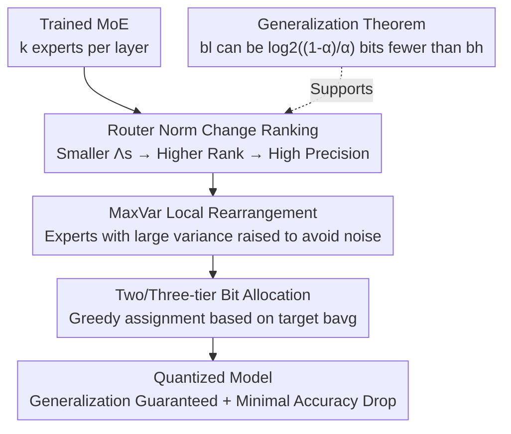

# Efficient Quantization of Mixture-of-Experts with Theoretical Generalization Guarantees

**Conference**: ICLR2026  
**OpenReview**: [https://openreview.net/forum?id=yiMlVBAoQi](https://openreview.net/forum?id=yiMlVBAoQi)  
**Code**: https://github.com/nowazrabbani/moe_quantization  
**Area**: Model Compression / MoE Quantization  
**Keywords**: Mixture-of-Experts, Mixed-Precision Quantization, Router Norm, Generalization Guarantees, Post-Training Quantization

## TL;DR
This paper proposes a **per-expert mixed-precision quantization method with theoretical guarantees**: it assigns bit-widths to each MoE expert based on the "change in router $\ell_2$ norm during training ($\Lambda_s$)." Experts with small norm changes (learning infrequent but critical features) receive high precision, while those with large changes receive low precision. Combined with "Max Intra-neuron Variance (MaxVar)" for local rearrangement, this allows Switch Transformer and Mixtral to be compressed to just over 2 bits with negligible accuracy drop and near-zero allocation overhead.

## Background & Motivation
**Background**: Sparse MoE expands model capacity without increasing inference FLOPs by activating only a few experts per token, making it a mainstream approach for scaling LLMs. However, the massive parameter count still imposes significant memory overhead during inference, limiting deployment. Post-Training Weight Quantization (PTWQ, e.g., GPTQ, AWQ, HQQ) is a primary method to alleviate memory pressure.

**Limitations of Prior Work**: **Uniform quantization** of all experts to the same low bit-width causes severe performance degradation in sub-3-bit regimes because it ignores the varying sensitivity of different experts. Existing mixed-precision methods either operate **across modules/layers** (varying bits between MLP blocks or attention heads) without exploiting the "differing expert-correlation" structure of MoE, or rely on **heuristic metrics** like "expert activation frequency" or "average routing weight" for **per-expert** allocation, which are both suboptimal and lack theoretical grounding.

**Key Challenge**: Which **metric can provably** distinguish experts that "require high precision" from those that "can tolerate low precision"? Existing metrics (usage frequency, mean routing weight) are empirical intuitions; no causal link has been proven between them and "post-quantization generalization loss." Furthermore, current SOTA methods (e.g., PMQ) estimate expert sensitivity by enumerating all experts and bit-widths on a calibration set, requiring 350 GB VRAM and 6000 seconds for Mixtral-8x22B—an exorbitant cost.

**Goal**: ① Identify a theoretically grounded ranking metric for expert importance; ② Ensure negligible computational overhead for the metric; ③ Compress MoE to just over 2 bits on real LLMs while preserving accuracy.

**Key Insight**: The authors analyze MoE training dynamics—studying how experts specialize during fine-tuning within an analytically tractable two-layer MoE model. A key observation is that **the "rarity" of features learned by an expert is reflected in the change of its router norm**, which directly correlates with "quantization sensitivity."

**Core Idea**: Use the "training-induced router $\ell_2$ norm change $\Lambda_s$" as the primary metric for per-expert bit allocation (smaller change necessitates higher precision), supplemented by "Max Intra-neuron Variance" to correct for quantization noise, resulting in a **near-zero overhead + generalization-guaranteed** mixed-precision strategy.

## Method

### Overall Architecture
The method splits the task of "assigning bits to each MoE expert" into two steps: **Step 1: Expert Ranking** (first by router norm change $\Lambda_s$, then local rearrangement by MaxVar), and **Step 2: Bit Allocation** (two-tier or three-tier quantization, greedily assigning high-precision slots to top-ranked experts while meeting the target average bit $b_{avg}$). The entire pipeline requires no forward pass on a calibration set or GPU usage; it only involves calculating and sorting two scalars per expert per layer, making allocation overhead negligible. The "why" behind the ranking is supported by the generalization theorem in Section 4.

### Key Designs

**1. Router Norm Change $\Lambda_s$: Identifying "High Precision" Experts via Training Dynamics**

This core metric addresses the limitation that existing heuristics cannot distinguish expert sensitivity. For expert $s$, let the router vectors before and after training be $w_s^{(0)}$ and $w_s^{(T)}$. The metric is defined as:

$$\Lambda_s^{(T)} := \|w_s^{(T)}\| - \|w_s^{(0)}\|.$$

Sorting Rule: Experts with **smaller $\Lambda_s$ are ranked higher** and assigned higher precision. The intuition is that experts with small $\Lambda_s$ learn "infrequent but critical" features. These experts have weaker activations, making the model's generalization more sensitive to their quantization; thus, they must be preserved at high precision. Conversely, experts with large $\Lambda_s$ learn high-frequency features and are more robust to quantization noise.

Note the distinction from prior work (e.g., Chowdhury et al. 2024, which uses router $\ell_2$ norm for pruning): this paper uses the **change in norm**, providing a "continuous grading of importance" for **multi-tier bit allocation** rather than a binary "relevant vs. irrelevant" split. For purely pre-trained models where $w_s^{(0)}$ is unavailable, the authors use the router norm itself as a proxy for $\Lambda_s$ (as initial weights are typically zero-mean with small variance), requiring no fine-tuning.

**2. Max Intra-neuron Variance (MaxVar): Correcting Ranking Bias from Quantization Noise**

$\Lambda_s$ alone is insufficient: some experts have "wide" or "skewed" weight distributions that inject larger quantization noise at the same bit-width. Thus, the maximum intra-neuron variance of the first layer weights $W_1^{(s,T)}$ of expert $s$ is defined as:

$$\mathrm{MaxVar}_s^{(T)} := \max_{r\in[m]} \frac{1}{d}\sum_{i=1}^{d}\Big(W_1^{(s,T)}[r,i] - \frac{1}{d}\sum_{i=1}^d W_1^{(s,T)}[r,i]\Big)^2.$$

Rearrangement Rule: If a lower-ranked expert $s$ has a MaxVar at least $\zeta$ times (where $\zeta > 1$) that of a higher-ranked expert $s'$, $s$ is moved above $s'$. This is repeated until stability. The authors use $\zeta=3$, as the variance of any bounded distribution is at most 3x that of a uniform distribution over the same interval. This refinement **only affects 4–5% of experts** but allows the average bit-rate to be pushed further (e.g., from 2.5 to 2.125 bits on Switch Transformer) by preventing high-variance experts from generating excessive noise.

**3. Two-tier / Three-tier Bit Allocation: Greedy Performance Preservation**

With the rank established, bit-widths are determined under the constraint "average bits = $b_{avg}$." **Two-tier**: Given $b_h > b_l$, the top $\kappa = \frac{b_{avg}-b_l}{b_h-b_l}$ fraction of experts are set to $b_h$, and the rest to $b_l$. **Three-tier** ($b_h > b_m > b_l$) uses a greedy strategy based on the position of $b_{avg}$:
- $b_{avg} \approx b_h$: Maximize experts in $b_h$.
- $b_{avg} \in \text{mid-range}$: Favor $b_h$, but ensure count of $b_l \leq$ count of $b_m$.
- $b_{avg} \approx b_l$: Minimize experts in $b_l$.

The strategy is to maximize high-precision slots for top experts and minimize experts assigned to the lowest tier, where accuracy risks are concentrated.

**4. Generalization Guarantees: Provable Safety**

Unlike heuristic methods, this work provides a theorem explaining **why this ranking/allocation is safe**. Briefly, the authors prove that by preserving experts with "small router norm change" at $b_h$ and others at $b_l$, the quantized model achieves the same generalization as the full-precision model (zero classification error) with high probability, provided $b_h, b_l$ meet explicit lower bounds. Crucially, low-frequency experts can use **$\log_2\!\frac{1-\alpha}{\alpha}$ fewer bits** than high-frequency ones without harming generalization ($\alpha$ is the feature frequency, $\alpha < 1/4$).

## Loss & Training
The proposed method is **Post-Training Quantization (PTQ)** and introduces no extra training loss. In practice: Switch Transformer is fine-tuned on CNN/DailyMail then quantized with HQQ; Mixtral uses pre-trained weights + GPTQ. Non-MoE weights are uniformly quantized (8-bit for Switch, 3-bit for Mixtral). Expert bits are solely determined by the two scalar ranking metrics.

## Key Experimental Results

### Main Results
Average accuracy across 8 zero-shot LLM tasks on Mixtral-8x7B (46.7B), comparing against SOTA per-expert PMQ and uniform methods (Selection):

| Method | Avg Bits/Expert | VRAM (GB) | 8-Task Avg Acc |
|--------|-----------------|-----------|----------------|
| Full Precision (FP16) | 16 | 96.8 | 72.72 |
| Uniform Quantization | 3 | 19.3 | 70.85 |
| Uniform Quantization | 2 | 13.1 | 58.73 (Fail) |
| **Ours (Router norm + MaxVar)** | 2.75 | 17.7 | **70.01** |
| **Ours** | 2.5 | 16.1 | **68.38** |
| **Ours** | 2.125 | 13.8 | **64.26** |

Uniform 2-bit quantization fails (58.73), whereas the proposed method maintains 64.26 at 2.125 bits (13.8 GB VRAM), significantly outperforming uniform quantization at similar memory. Above 2.0 bits, it consistently outperforms PMQ. Similar gains are observed on Mixtral-8x22B (140.6B) over PMQ and non-per-expert methods like Hessian (layer-wise), BSP, and Slim-LLM.

### Ablation Study

| Configuration | Key Phenomenon | Explanation |
|---------------|----------------|-------------|
| Router-norm-change only | Maintains performance to 2.5 avg bits | The primary metric already outperforms activation frequency/weight baselines. |
| + MaxVar rearrangement | Extends performance to 2.125 avg bits | Rearranging only 3.7% of experts pushes the compressible limit lower. |
| Activation frequency baseline | Earlier performance drop | Assigned high precision to high-freq experts, the opposite of the proposed direction. |
| Activation weight baseline | Earlier performance drop | Similarly suboptimal. |

### Key Findings
- **Metric Strength**: Relying solely on router norm change allows Switch Transformer to maintain generalization down to 2.5 avg bits, surpassing usage-based heuristics.
- **MaxVar as Low-cost Gain**: Adjusting only 3.7%–5% of experts enables pushing the average bit-rate from 2.5 down to 2.125.
- **Faster Inference**: At the same average bit-rate, the proposed method is faster than PMQ because it assigns high precision to **infrequent** experts, whereas PMQ favors high-frequency experts which carry heavier compute loads during inference.
- **Negligible Allocation Overhead**: PMQ requires 110 GB VRAM / 2227s for Mixtral-8x7B and 350 GB / 6000s for 8x22B; this method requires zero GPU and sorts two scalars instantly.

## Highlights & Insights
- **Linking Sensitivity to Training Dynamics**: Using router norm *change* instead of the norm itself identifies "infrequent but critical" experts. This is a theoretically grounded sensitivity proxy, far more robust than empirical metrics like usage frequency.
- **Counter-intuitive Precision Allocation**: While common sense suggests "high-frequency experts are more important," this work proves the opposite—low-frequency experts have weaker activations and are more vulnerable to noise, thus requiring higher precision. This inversion yields **inference acceleration** as a byproduct.
- **Provable Bit Savings**: The explicit expression $\log_2\frac{1-\alpha}{\alpha}$ links "bits saved" directly to "feature imbalance $\alpha$," providing a theoretical ruler for mixed-precision quantization.
- **Transferable Paradigm**: The concept of "using lightweight training statistics to predict component sensitivity" can be extended to pruning, LoRA rank allocation, and KV cache compression.

## Limitations & Future Work
- **Simplified Theoretical Model**: Guarantees are based on a two-layer MoE, binary classification, and synthetic data; while empirically validated, a gap exists between the theorem and large models like Mixtral (e.g., conditions like $d=\Omega(L^8)$ may not strictly hold).
- **Proxy Metrics for Pre-trained Models**: When $w_s^{(0)}$ is unavailable, using the router norm itself relies on the assumption of small-variance initialization, which may be biased for multi-stage trained models.
- **The 2.0-bit Floor**: Accuracy drops sharply below 2.0 bits. For Mixtral-8x7B, going below 2.0 bits (13.1 GB) is less efficient than a comparable dense model (13.6 GB). The "sweet spot" is 2.0–3.0 avg bits.
- **Future Directions**: Extending theory to multi-class/deeper MoE; adaptive selection of $\zeta$; joint weight-activation quantization.

## Related Work & Insights
- **vs. Uniform Quantization (Kim et al. / Frantar & Alistarh)**: Uniform methods ignore expert variance and fail in sub-3-bit regimes; this method preserves accuracy through per-expert allocation.
- **vs. PMQ (Huang et al. 2025a, SOTA Per-expert)**: PMQ requires massive VRAM and time to enumerate errors on calibration sets and favors high-frequency experts. This method uses zero GPU for allocation and achieves better accuracy/speed above 2.0 bits.
- **vs. Expert Pruning (Chowdhury et al. 2024)**: Pruning fails on complex tasks requiring diverse experts and is limited to binary selection; this method provides finer mixed-precision control.

## Rating
- Novelty: ⭐⭐⭐⭐⭐ First to provide generalization guarantees for MoE mixed-precision and link metrics to training dynamics.
- Experimental Thoroughness: ⭐⭐⭐⭐ Validated on Switch Transformer and Mixtral 8x7B/8x22B, though theory relies on synthetic models.
- Writing Quality: ⭐⭐⭐⭐ Clear connection between theory and experiments.
- Value: ⭐⭐⭐⭐⭐ High deployment value for compressing large MoE models to ~2 bits with near-zero overhead.

<!-- RELATED:START -->

## Related Papers

- [\[ICLR 2026\] Coupling Experts and Routers in Mixture-of-Experts via an Auxiliary Loss](coupling_experts_and_routers_in_mixture-of-experts_via_an_auxiliary_loss.md)
- [\[ICLR 2026\] Unveiling Super Experts in Mixture-of-Experts Large Language Models](unveiling_super_experts_in_mixture-of-experts_large_language_models.md)
- [\[ICLR 2026\] CodeQuant: Unified Clustering and Quantization for Enhanced Outlier Smoothing in Low-Precision Mixture-of-Experts](codequant_unified_clustering_and_quantization_for_enhanced_outlier_smoothing_in_.md)
- [\[ICLR 2026\] MoBE: Mixture-of-Basis-Experts for Compressing MoE-based LLMs](mobe_mixture-of-basis-experts_for_compressing_moe-based_llms.md)
- [\[ICML 2026\] DAG-MoE: From Simple Mixture to Structural Aggregation in Mixture-of-Experts](../../ICML2026/model_compression/dag-moe_from_simple_mixture_to_structural_aggregation_in_mixture-of-experts.md)

<!-- RELATED:END -->
