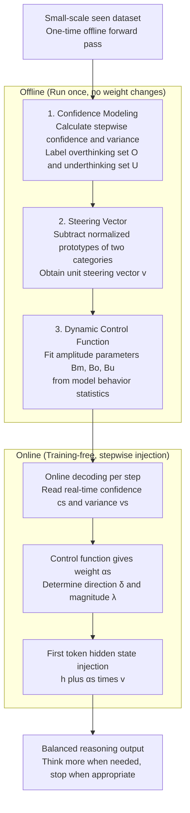

# Efficient Reasoning with Balanced Thinking

**Conference**: ICLR 2026  
**arXiv**: [2603.12372](https://arxiv.org/abs/2603.12372)  
**Code**: [GitHub](https://github.com/yu-lin-li/ReBalance)  
**Area**: Model Compression/Efficient Inference  
**Keywords**: Large Language Model Inference, Overthinking, Underthinking, Hidden State Steering, Training-free Acceleration  

## TL;DR

Proposes ReBalance, a training-free framework that simultaneously alleviates overthinking and underthinking in Large Reasoning Models (LRMs) via confidence-based dynamic hidden state steering, achieving dual improvements in inference efficiency and accuracy.

## Background & Motivation

- **Background**: Large Reasoning Models (e.g., DeepSeek-R1, QwQ) have acquired strong reasoning capabilities through SFT and RL, but face computational efficiency challenges in practical deployment.
- **Limitations of Prior Work**: LRMs suffer from two opposing issues—**overthinking**: spending redundant reasoning steps on simple problems; and **underthinking**: failing to fully explore reasoning paths for complex problems before premature convergence.
- **Key Challenge**: Existing methods to mitigate overthinking (e.g., suppressing reflection keywords, adjusting reasoning length) often induce underthinking, creating a trade-off. As shown in Figure 2(a), prior methods reduce reasoning length for correct samples while also significantly reducing it for incorrect samples, indicating the introduction of underthinking.
- **Goal**: Achieve balanced reasoning by mitigating overthinking without introducing underthinking.
- **Key Insight**: Stepwise confidence and confidence variance can serve as continuous indicators of reasoning states—high variance reflects hesitation/path switching (overthinking), while persistent high confidence reflects premature commitment (underthinking).
- **Core Idea**: Utilize confidence signals to identify reasoning states, construct steering vectors from overthinking to underthinking, and use a dynamic control function to adjust steering strength and direction based on real-time confidence.

## Method

### Overall Architecture

ReBalance aims to let Large Reasoning Models think more when needed and stop when appropriate without retraining. The workflow is divided into offline and online phases, comprising three components: **confidence modeling, steering vectors, and dynamic control functions**. During the offline phase, a single forward pass is performed on a small-scale dataset to label reasoning steps as "overthinking" or "underthinking" using confidence signals (confidence modeling). Feature prototypes are extracted from the hidden states of these steps, and a steering vector (from overthinking to underthinking) is calculated by subtraction. A dynamic control function is then fitted. During online inference, the method reads real-time confidence at each step to determine the steering direction and magnitude via the control function. This vector is injected into the hidden state of the first token to pull the reasoning behavior toward the balance point.

### Key Designs

**1. Confidence Modeling: Explicitly labeling "thinking too much" and "thinking too little" using stepwise confidence and variance**

To correct bias, the system must first identify the direction of the bias for each step. ReBalance uses the model's own stepwise confidence as a probe. It defines stepwise confidence $c_s = \exp\left(\frac{1}{|\mathcal{T}_s|}\sum_{t \in \mathcal{T}_s} \ln p_t^{\max}\right)$—essentially the exponentiated mean log-probability of the most likely tokens within a step, reflecting the model's certainty; and confidence variance $v_s = \operatorname{Var}(c_s; \mathcal{W}_s)$ over a sliding window $\mathcal{W}_s$ to capture oscillation between adjacent steps. These signals distinguish two pathological states: low confidence with high variance indicates path switching and hesitation (overthinking); persistent high confidence with low variance indicates a locked path without exploration (underthinking). Using empirical quantile thresholds $\tau_c^L, \tau_c^H, \tau_v^L, \tau_v^H$, steps are categorized into the overthinking set $\mathcal{O} = \{s: c_s \leq \tau_c^L \wedge v_s \geq \tau_v^H\}$ and the underthinking set $\mathcal{U} = \{s: c_s \geq \tau_c^H \wedge v_s \leq \tau_v^L\}$. Observations in Figure 2(b) confirm this correspondence.

**2. Steering Vector: Extracting the direction by subtracting hidden states of the two categories and injecting into the first token**

After partitioning the steps into $\mathcal{O}$ and $\mathcal{U}$, the next step is to identify the "overthinking → underthinking" direction in the representation space. This is done by averaging the deep hidden states of the first token for each set to obtain prototypes $\bm{\mu}^O$ and $\bm{\mu}^U$, then calculating the normalized unit steering vector:

$$\mathbf{v} = \frac{\bm{\mu}^O - \bm{\mu}^U}{\|\bm{\mu}^O - \bm{\mu}^U\|_2}.$$

During online inference, this vector is injected into the hidden state of the step's first token: $\tilde{\mathbf{h}}_{t_s^{(1)}} = \mathbf{h}_{t_s^{(1)}} + \alpha_s \mathbf{v}$, where $\alpha_s = \lambda_s \delta_s$. A sign $\delta_s = -1$ indicates steering in the $\mathcal{U} \to \mathcal{O}$ reverse direction to mitigate overthinking, while $\delta_s = +1$ indicates steering toward $\mathcal{O} \to \mathcal{U}$ to mitigate underthinking. Deep hidden states are chosen for their higher discriminative power regarding reasoning patterns, and only the first token is modified because it conditions the subsequent generation of the entire step in causal attention.

**3. Dynamic Control Function: Deciding steering magnitude and direction based on real-time confidence**

Using a fixed injection strength is problematic: more severe deviations require stronger correction. ReBalance varies both magnitude and direction based on real-time confidence via a continuous function:

$$g(c_s, v_s) = \text{sign}(c_s - \tau_c^H) \cdot B(c_s, v_s) \cdot \tanh(|c_s - \tau_c^H|)$$

The direction is determined by $\text{sign}(c_s - \tau_c^H)$: negative for $c_s < \tau_c^H$ to mitigate overthinking, and positive for $c_s > \tau_c^H$ to mitigate underthinking. The magnitude consists of two parts: $\tanh(|c_s - \tau_c^H|)$ ensures that greater deviations receive stronger correction while maintaining numerical stability through smooth saturation; $B(c_s, v_s)$ is a variance-aware amplitude term that adaptively switches between amplitudes $B_m$, $B_o$, and $B_u$ based on the current state. Crucially, these parameters are derived from model statistics without manual tuning, ensuring ReBalance remains training-free and plug-and-play.

### Loss & Training

ReBalance is a training-free method and does not involve loss functions or parameter updates. The steering vectors, thresholds, and amplitude parameters are all obtained during a single offline forward pass, and only hidden state injection is performed during the online phase.

## Key Experimental Results

### Main Results

| Model/Dataset | MATH-500 Acc↑ | MATH-500 Tokens↓ | AIME24 Acc↑ | GSM8K Acc↑ |
|---|---|---|---|---|
| R1-Distill-1.5B Baseline | 79.6 | 4516 | 23.3 | 76.0 |
| R1-Distill-1.5B ReBalance | **83.0** | 3474(-23%) | **33.3** | **78.3** |
| R1-Distill-7B Baseline | 89.8 | 3699 | 46.7 | 89.2 |
| R1-Distill-7B ReBalance | **92.6** | 2903(-22%) | **53.3** | **91.6** |
| Qwen3-14B Baseline | 93.8 | 4470 | 66.7 | 95.1 |
| Qwen3-14B ReBalance | **94.0** | 3641(-19%) | **73.3** | **96.3** |
| QwQ-32B Baseline | 94.8 | 4535 | 66.7 | 96.3 |
| QwQ-32B ReBalance | **95.4** | 3551(-22%) | **73.3** | **96.7** |

### Ablation Study

- Using steering vectors without dynamic control: Limited performance gain or even degradation on some datasets.
- Removing variance-aware amplitude $B(c_s, v_s)$: Inability to distinguish between normal, overthinking, and underthinking states.
- Shallow vs. Deep hidden states: Deep layers (e.g., penultimate/ante-penultimate) perform best; shallow layers lack sufficient discriminative power.

### Key Findings

1. ReBalance consistently outperforms all baseline methods across 4 models (0.5B-32B) and 9 benchmarks.
2. It **simultaneously** reduces reasoning length (15-30%) **and** improves accuracy (typically +2-10%), a rare achievement in prior work.
3. Steering vectors extracted from small seen datasets generalize effectively to unseen datasets.
4. Unlike token-level suppression methods (e.g., SEAL, DEER), ReBalance does not sacrifice valuable intermediate reasoning steps.

## Highlights & Insights

1. **Key Insight**: Confidence variance high = overthinking (hesitation); persistent high confidence = underthinking (premature commitment). This observation is both intuitive and experimentally validated.
2. **Value**: Provides a unified framework to solve both overthinking and underthinking rather than addressing them separately.
3. **High Utility**: Training-free, plug-and-play, requires only one offline calculation on a small dataset, making deployment costs extremely low.
4. **Counter-intuitive Finding**: Outputs with shorter reasoning lengths can achieve higher accuracy, indicating that redundant reasoning likely introduces hallucinations.

## Limitations & Future Work

1. Steering vectors are extracted from fixed datasets and may not adapt to all task distributions; explore online update mechanisms.
2. Confidence calculation depends on token probabilities; robustness across different sampling strategies (e.g., top-k, nucleus sampling) is not fully verified.
3. While adaptive, quantile thresholds ($q_L, q_H$) might require different optimal values for different models and tasks.
4. Currently verified primarily on mathematical and code reasoning; effectiveness on natural language reasoning or multi-step planning tasks remains to be verified.

## Related Work & Insights

- **Overthinking Mitigation**: SEAL (Chen et al., 2025b) reduces reasoning length by suppressing reflection keywords but may induce underthinking; NoThinking (Ma et al., 2025b) is more aggressive by skipping the thinking phase entirely.
- **Inference Efficiency**: Unlike RL-based methods for reasoning length control, ReBalance is entirely training-free.
- **Hidden State Manipulation**: Similar to representation engineering but focuses on reasoning patterns rather than behavioral control.
- **Insight**: Using confidence as a probe for reasoning quality can be generalized to extract more fine-grained reasoning dynamics from LRMs.

## Rating

⭐⭐⭐⭐ (4/5)

- **Novelty**: ⭐⭐⭐⭐ Unified modeling of over/underthinking and solution through hidden state steering is novel.
- **Experimental Thoroughness**: ⭐⭐⭐⭐⭐ Extremely comprehensive experiments across 4 models × 9 benchmarks.
- **Writing Quality**: ⭐⭐⭐⭐ Clear motivation and complete mathematical derivation.
- **Value**: ⭐⭐⭐⭐⭐ Training-free plug-and-play approach is deployment-friendly.

<!-- RELATED:START -->

## Related Papers

- [\[ICLR 2026\] SwiReasoning: Switch-Thinking in Latent and Explicit for Pareto-Superior Reasoning](swireasoning_switch-thinking_in_latent_and_explicit_for_pareto-superior_reasonin.md)
- [\[ICLR 2026\] ParoQuant: Pairwise Rotation Quantization for Efficient Reasoning LLM Inference](paroquant_pairwise_rotation_quantization_for_efficient_reasoning_llm_inference.md)
- [\[AAAI 2026\] Efficient Reasoning for Large Reasoning Language Models via Certainty-Guided Reflection Suppression](../../AAAI2026/model_compression/efficient_reasoning_for_large_reasoning_language_models_via_certainty-guided_ref.md)
- [\[ICLR 2026\] FutureMind: Equipping Small Language Models with Strategic Thinking-Pattern Priors via Adaptive Knowledge Distillation](futuremind_equipping_small_language_models_with_strategic_thinking-pattern_prior.md)
- [\[ICLR 2026\] BeyondBench: Contamination-Resistant Evaluation of Reasoning in Language Models](beyondbench_contamination-resistant_evaluation_of_reasoning_in_language_models.md)

<!-- RELATED:END -->
