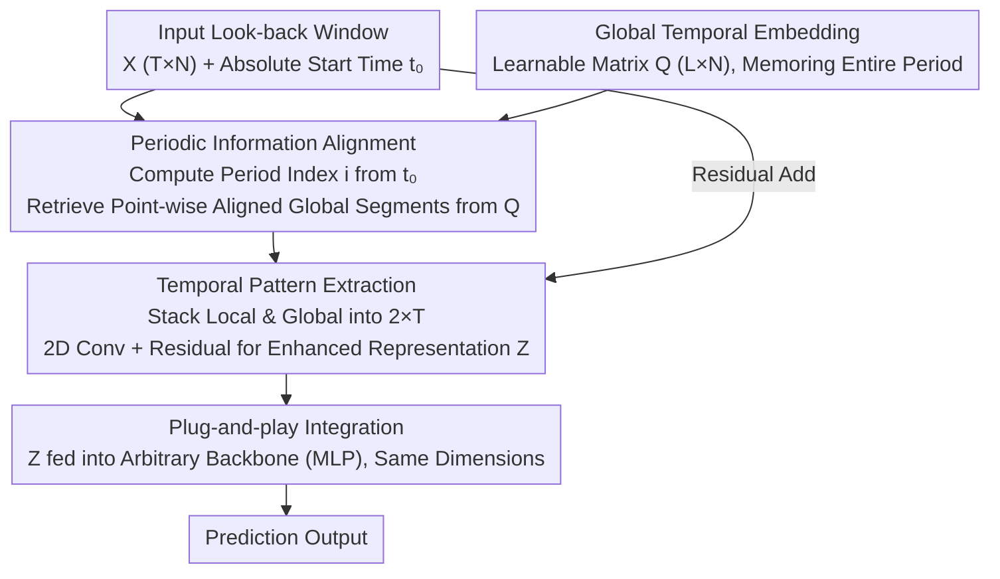

# Enhancing Multivariate Time Series Forecasting with Global Temporal Retrieval

**Conference**: ICLR 2026  
**arXiv**: [2602.10847](https://arxiv.org/abs/2602.10847)  
**Code**: [https://github.com/macovaseas/GTR](https://github.com/macovaseas/GTR)  
**Area**: Video Understanding / Time Series Forecasting  
**Keywords**: Time Series Forecasting, Global Periodicity, Retrieval Augmentation, Plug-and-play Module, 2D Convolution

## TL;DR

Ours proposes the Global Temporal Retriever (GTR), a lightweight plug-and-play module. By maintaining adaptive global periodic embeddings and retrieving aligned global periodic information using absolute time indices, it enables any forecasting model to bypass look-back window limitations and effectively capture global periodic patterns far exceeding the input length.

## Background & Motivation

**Importance of Global Periodicity**: Real-world time series often contain multi-scale periodic patterns (daily, weekly, monthly, seasonal). Global periodic signals frequently carry stronger predictive signals than local adjacent patterns. For instance, in the Electricity dataset, the Pearson correlation of distant global periodic segments (0.96) is higher than that of adjacent local periodic segments (0.94, 0.88).

**Look-back Window Limitations**: Existing methods (decomposition, frequency domain, reshaping, etc.) operate within a fixed look-back window. When the global period length significantly exceeds the input length, models remain "blind" to global patterns.

**Infeasibility of Brute-force Window Expansion**: Simply increasing the input length leads to overfitting on noise, surging computational/memory overhead, and difficulty in extracting effective signals from redundant information.

**Limitations of Prior Work**: Season-trend decomposition methods are limited by decomposition accuracy within the window; frequency-domain methods work well under stationary periodic assumptions but struggle with long-period non-stationary phenomena; retrieval-augmented methods depend on similarity search quality and lack a compact time-aligned representation.

## Method

### Overall Architecture

GTR is a lightweight pre-module inserted before the backbone model. It first maintains a learnable global matrix covering the entire period, explicitly memorizing "the shape of the entire period." During prediction, the current position within the period is calculated using the absolute start time of the input sequence to retrieve global periodic references aligned point-wise with the input. The local input and global references are stacked into a 2D representation, fused by a 2D convolution, and added back to the original signal via a residual connection. This produces a dimension-invariant enhanced representation, which is then passed to the backbone (e.g., MLP) for prediction. This process provides the model with global periodic structures exceeding the input length without expanding the look-back window.

### Key Designs

**1. Global Temporal Embedding: Explicitly memorizing the entire periodic structure**

To allow the model to access global periods beyond the window, the most direct approach is to explicitly store the entire period rather than expanding the input. GTR introduces a learnable parameter matrix $\mathbf{Q} \in \mathbb{R}^{L \times N}$, where $L$ is the global period length and $N$ is the number of variables. The matrix is initialized from zero and automatically learns the temporal shape of each variable over a full period during training. It acts as a "global period lookup table": given any point in time, the corresponding reference value can be retrieved. This allows the model to obtain stable global periodic information without extending the input window, avoiding overfitting and computational explosion.

**2. Periodic Information Alignment: Using absolute time to align "now" with the global period**

Storing the entire period is insufficient; the model must identify which segment of the period the current input belongs to. GTR utilizes the absolute start time $t_0$ of the input sequence to calculate a period index vector $\mathbf{i} = [(t_0 \bmod L) + \tau] \bmod L$ (where $\tau$ iterates through each time step in the window). Based on this, global segments aligned point-wise with the input are retrieved from $\mathbf{Q}$ and enhanced via a linear transformation. The original input and retrieved global reference are then stacked along a new dimension into a $2 \times T$ 2D representation, placing "local observations" and "global periods" side-by-side in the same coordinate system. This precise alignment based on absolute indices ensures the model perceives the specific stage of the global period rather than relying on approximate similarity searches.

**3. Temporal Pattern Extraction: 2D convolution for local-global interaction and intra-period morphology**

After stacking local and global information into $\mathbf{F}_n \in \mathbb{R}^{2 \times T}$, GTR uses a 2D convolution $\mathcal{C}(\mathbf{F}_n; \kappa=(2, 1+2\lfloor P/2 \rfloor))$ for fusion. The kernel height is fixed at 2 to cover both local and global scales simultaneously, while the width is determined by the dominant high-frequency period length $P$, capturing fine-grained intra-period morphology while performing cross-scale interaction. The convolution output is added to the original input via a residual connection $\mathbf{z}_n = \mathbf{x}_n + \text{Dropout}(\mathbf{h}_n)$, injecting global periodic cues while preserving the original signal. 2D convolution is naturally suited for charactering the coupling relationship between these two temporal scales compared to simple concatenation or addition.

**4. Plug-and-play Integration: Dimension-invariant, compatible with any backbone**

The output of GTR maintains the exact same shape as the input. Consequently, it can be non-intrusively inserted before any backbone model such as iTransformer, PatchTST, or DLinear. The entire pipeline is trained end-to-end without modifying the host architecture. This modular design decouples "global periodic completion" from the specific model, enabling existing forecasting systems to gain global periodic awareness simply by adding GTR, maximizing generality and practical value.

### Loss & Training

Standard MSE loss is used for end-to-end optimization, with RevIN (Reversible Instance Normalization) employed to mitigate distribution shifts. The optimizer is Adam, with the learning rate searched within {1e-3, 3e-3, 5e-4}. The MLP backbone utilizes a hidden dimension of $D=512$.

## Key Experimental Results

### Main Results

**Long-term Forecasting (T=96, average of S∈{96,192,336,720}):**

| Model | ETTh1 MSE | ETTm1 MSE | Electricity MSE | Solar MSE | Weather MSE | Top-2 Count |
|------|-----------|-----------|----------------|-----------|-------------|-----------|
| GTR (Ours) | 0.439 | 0.367 | 0.166 | 0.194 | 0.239 | **10/16** |
| RAFT | 0.428 | 0.381 | 0.175 | 0.301 | 0.270 | 3/16 |
| TQNet | 0.441 | 0.377 | 0.164 | 0.198 | 0.242 | 7/16 |
| CycleNet | 0.457 | 0.379 | 0.168 | 0.210 | 0.243 | 3/16 |

**Short-term Forecasting (PEMS Datasets, T=96, average of S∈{12,24,48,96}):**

| Model | PEMS03 | PEMS04 | PEMS07 | PEMS08 | Top-2 Count |
|------|--------|--------|--------|--------|-----------|
| GTR (Ours) | 0.087 | 0.087 | 0.076 | 0.142 | **8/8** |
| TQNet | 0.097 | 0.091 | 0.075 | 0.142 | 7/8 |
| iTransformer | 0.113 | 0.111 | 0.101 | 0.150 | 0/8 |

### Ablation Study

| Model + GTR Tech. | Electricity MSE Improvement | Weather MSE Improvement |
|------------------|---------------------|-----------------|
| iTransformer + GTR | Significant | Significant |
| PatchTST + GTR | Significant | Significant |
| DLinear + GTR | Significant | Significant |

As a plug-and-play module, GTR consistently brings improvements across different backbones, verifying its general applicability.

### Key Findings

1. **Global Period Modeling is Crucial**: GTR outperforms CycleNet by 8.2% MSE on the Solar-Energy dataset due to its strong long-term periodic patterns.
2. **More Pronounced Advantage in Short-term Forecasting**: Achieved Top-2 results on all 8 PEMS tasks, reducing MSE by an average of 18.7% compared to iTransformer.
3. **Cross-model Generality**: GTR technology consistently improves performance across various architectures like iTransformer, PatchTST, and DLinear.
4. **Limitations on Traffic Dataset**: Due to strong spatio-temporal dependencies and delay effects, GTR underperforms compared to models that specifically model inter-variable relationships (e.g., S-Mamba, SOFTS) on the Traffic dataset.

## Highlights & Insights

- **Key Insight**: Global periodic predictive signals are stronger than local adjacent patterns (quantitatively verified via Pearson correlation matrices), yet are obscured by fixed windows.
- **Minimalist yet Effective Design**: Consists of only one learnable matrix, absolute time indexing, and 2D convolution, with minimal parameter and computational overhead.
- **Plug-and-play Characteristic** gives GTR broad practical value, directly enhancing existing forecasting system performance.
- Clean complexity analysis: Total complexity is $O(NT^2 + Nd^2 + NTd + NSd)$, which is linear with respect to the number of variables $N$ and prediction length $S$.

## Limitations & Future Work

1. **Global Period Length L Requires Pre-specification**: An automatic period detection mechanism is needed for time series with unknown or changing period lengths.
2. **Poor Performance on Strong Spatial Dependency Data**: Results on the Traffic dataset indicate that GTR does not fully model relationships between variables.
3. **Static Global Embeddings**: Once training is complete, the global periodic pattern is fixed; adaptation to concept drift or periodic changes would require retraining.
4. **Choice of MLP Backbone**: While cross-model generality is verified, the choice of backbone still impacts final performance.
5. Lacks analysis for non-periodic or weakly periodic time series.

## Related Work & Insights

- **CycleNet**: Explicitly learns recurrent periodic structures but is limited by the observation window. GTR bypasses this via global embeddings.
- **TimesNet**: Transforms 1D sequences into 2D tensors to model intra-period and inter-period variations. GTR's 2D convolution approach is similar but directly models local-global interactions.
- **Retrieval-Augmented Forecasting (e.g., RAFT)**: Expands context by retrieving historical similar segments. GTR replaces explicit retrieval with compact global embeddings, which is more efficient and time-aligned.
- Ideas can be extended to video understanding: Periodic action recognition in videos faces similar "local window vs. global period" issues.

## Rating

- **Novelty**: ⭐⭐⭐⭐ The combination of global periodic embeddings and absolute time indexing is simple and novel, though the overall concept is intuitive.
- **Experimental Thoroughness**: ⭐⭐⭐⭐⭐ Comprehensive coverage across 6 datasets, long/short-term forecasting, cross-model ablations, and complexity analysis.
- **Writing Quality**: ⭐⭐⭐⭐ Motivation visualization (Pearson matrix) is intuitive and compelling; methodology description is clear.
- **Value**: ⭐⭐⭐⭐ Plug-and-play design has high practical utility, although the contributions are primarily at the engineering level.

<!-- RELATED:START -->

## Related Papers

- [\[AAAI 2026\] XLinear: A Lightweight and Accurate MLP-Based Model for Long-Term Time Series Forecasting with Exogenous Inputs](../../AAAI2026/model_compression/xlinear_a_lightweight_and_accurate_mlp-based_model_for_long-term_time_series_for.md)
- [\[ICML 2025\] LightGTS: A Lightweight General Time Series Forecasting Model](../../ICML2025/model_compression/lightgts_a_lightweight_general_time_series_forecasting_model.md)
- [\[ICLR 2026\] Lookup multivariate Kolmogorov-Arnold Networks](lookup_multivariate_kolmogorov-arnold_networks.md)
- [\[ICLR 2026\] Grounding and Enhancing Informativeness and Utility in Dataset Distillation](grounding_and_enhancing_informativeness_and_utility_in_dataset_distillation.md)
- [\[ICLR 2026\] Large Language Model Compression with Global Rank and Sparsity Optimization](large_language_model_compression_with_global_rank_and_sparsity_optimization.md)

<!-- RELATED:END -->
