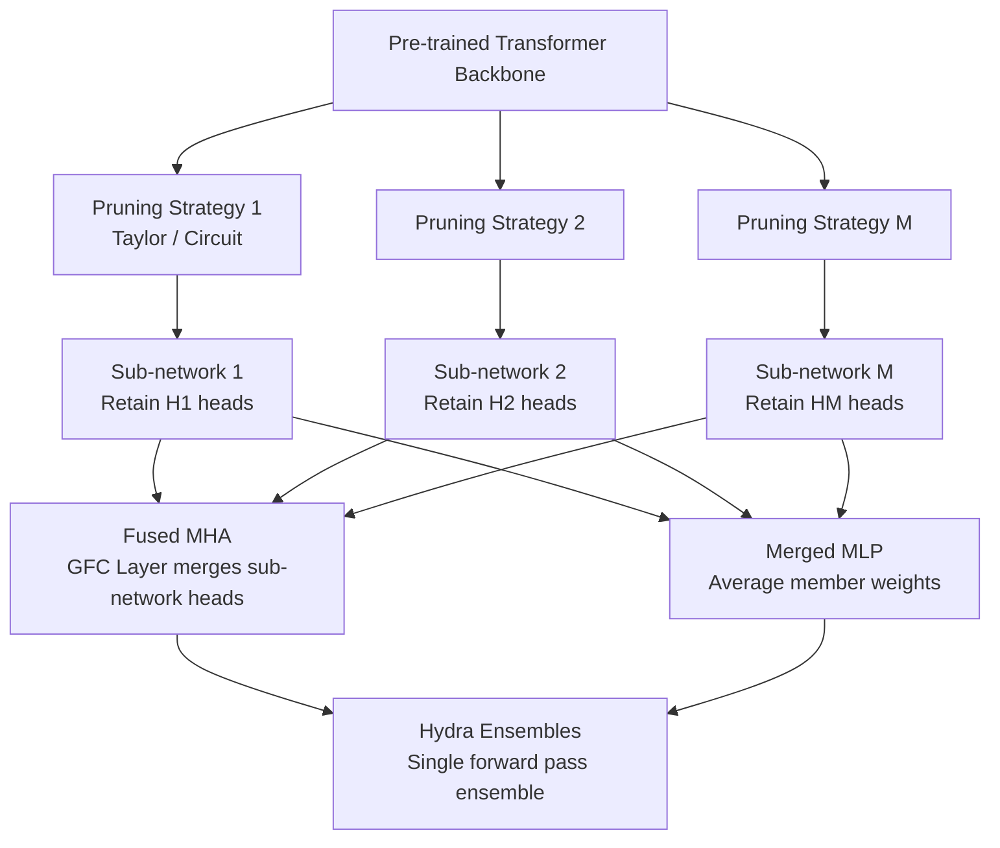

# Ensembling Pruned Attention Heads for Uncertainty-Aware Efficient Transformers

**Conference**: ICLR 2026  
**Code**: To be released (promised in paper)  
**Area**: Model Compression  
**Keywords**: Attention head pruning, Uncertainty quantification, Efficient ensemble learning, Transformer, Calibration

## TL;DR

Hydra Ensembles achieves uncertainty quantification (UQ) performance comparable to or even superior to Deep Ensembles under near-single-model inference overheads (only 1.07×). This is achieved by applying differentiated attention head pruning to the same pre-trained Transformer and then fusing multiple pruned sub-networks into a single ensemble model for a single forward pass.

## Background & Motivation

**Background**: Deep neural networks perform exceptionally well in vision, language, and multimodal tasks, but they must provide reliable uncertainty estimation (UQ) in safety-critical scenarios (e.g., medical, autonomous driving). Deep Ensembles is the current gold standard for UQ, providing optimal accuracy and calibration by aggregating predictions from multiple independently trained models.

**Limitations of Prior Work**: Deep Ensembles is extremely costly—requiring multiple independent pre-training and fine-tuning runs, storage of multiple sets of weights, and sequential model-by-model forward passes during inference. This is nearly infeasible for large-scale foundation models (CLIP, BERT). Existing lightweight ensemble schemes (MC Dropout, BatchEnsemble, Packed Ensembles, LoRA Ensemble) either still require full pre-training or limit member diversity due to parameter sharing.

**Key Challenge**: While pruning individual members of a Deep Ensemble is an intuitive idea, the paper first proves that conventional pruning significantly harms calibration on noisy/OOD data—the loss increase after pruning is greater for out-of-distribution data than for clean data, making it unsuitable for UQ.

**Goal**: Construct a Transformer ensemble model with high diversity and good calibration at near-single-model inference costs without requiring retraining from scratch.

**Core Idea**: Generate $M$ diverse sub-networks by applying multiple differentiated attention head pruning strategies to the same pre-trained backbone. Then, fuse the MHA weights of these sub-networks into a Fused MHA via Grouped Fully-Connected (GFC) layers and average the MLP weights to obtain a Merged MLP, resulting in a single model that completes ensemble inference in one forward pass.

## Method

### Overall Architecture

Starting from a single pre-trained Transformer, differentiated attention head pruning strategies are used to generate $M$ diverse sub-networks. Subsequently, the MHA weights of these sub-networks are fused into a Fused MHA using GFC layers, and the MLP weights are averaged to form a Merged MLP. This constitutes Hydra Ensembles—a compact model capable of ensemble inference in a single forward pass.

### Key Designs

**1. Theoretical Proof of Pruning Harming UQ (Proposition 1)**

The paper first establishes the theoretical foundation for the impact of pruning on noisy data. Let $\tilde{\theta}$ be the parameters after pruning perturbation $\delta\theta$, and define the loss gap between the clean test set and the noisy test set as:

$$\Delta L(\theta) := L_{D_n}(\theta) - L_{D_t}(\theta)$$

Under the conditions where the training set gradient is zero ($\nabla L_D(\theta)=0$) and the pruning perturbation direction is non-negatively correlated with the noise gradient ($\nabla L_{D_n}(\theta)^\top \delta\theta \ge 0$), if $H_n - H_t \succ 0$ (meaning the Hessian for noisy data is larger), then $\Delta L(\theta) \le \Delta L(\theta + \delta\theta)$. This implies that the loss increase from pruning is greater on noisy/OOD data, directly harming uncertainty calibration. This conclusion prompts the authors to shift towards circuit-based head selection rather than blindly pruning the least important weights.

**2. Fused MHA: Single Forward Pass Ensemble via GFC Layers**

The core engineering innovation lies in "packing" the attention heads of $M$ pruned sub-networks side-by-side into the same multi-head attention layer. For the $\ell$-th layer, inputs from $M$ models are concatenated along the batch dimension: $X_{i,\ell} \in \mathbb{R}^{MT \times d}$, then reshaped to $\tilde{X}_{i,\ell} \in \mathbb{R}^{T \times Md}$. Using Grouped Fully-Connected layers, the Q/K/V projection matrices $W_\ell^{Q(m)}, W_\ell^{K(m)}, W_\ell^{V(m)}$ of each model form a grouped linear transformation, computing the attention outputs for all members at once:

$$Q_\ell = \mathrm{GFC}(\tilde{X}_\ell;\ W_\ell^{Q(1)}, \ldots, W_\ell^{Q(M)}) \in \mathbb{R}^{T \times Md_\ell}$$

Since heads from different members are computed independently (no cross-member attention), this reshape + GFC design is mathematically equivalent to parallel forward passes for $M$ sub-networks but effectively requires only one matrix operation, significantly improving GPU utilization.

**3. Merged MLP: Eliminating Redundant Storage via Weight Averaging**

Unlike the structural fusion of MHA, the MLP portion uses a simpler weight averaging strategy:

$$W_\ell^{(j)} = \frac{1}{M} \sum_m W_\ell^{(j)(m)}, \quad b_\ell^{(j)} = \frac{1}{M} \sum_m b_\ell^{(j)(m)}$$

This merging does not introduce additional parameters and does not sacrifice member diversity because diversity is already guaranteed by the differentiated pruned heads in the MHA. Ablation studies (Appendix B.7) verify that MLP merging does not degrade ID/OOD metrics.

**4. Two Member Generation Strategies: Taylor vs. Circuit**

A key question is how to generate $M$ "different but complementary" sub-networks. The paper proposes two strategies:

- **Hydra Ensembles (Taylor)**: Requires no validation set; uses Taylor first-order importance scores (gradient-weighted loss) to prune the least important heads in each MHA block. Diverse members can be generated using different random seeds or pruning ratios. It is easy to implement and suitable for scenarios without OOD validation data, but requires caution in zero-shot settings due to Proposition 1.
- **Hydra Ensembles (Circ)**: When an uncertainty validation set is available, the Headmap algorithm (Wang et al., 2025) is used to extract attention head circuits critical for UQ, retaining these heads while pruning the rest. Circuit extraction is more targeted than blind Taylor pruning, performs better in OOD detection, and supports completely zero-shot (no fine-tuning) CLIP scenarios.

## Key Experimental Results

### Main Results

| Dataset | Metric | Hydra (Circ) | Deep Ensembles | Δ |
|--------|------|-------------|----------------|---|
| ImageNet-1K | Acc ↑ | 80.88% | 82.19% | −1.31% |
| ImageNet-1K | AUROC ↑ | 86.29% | 85.48% | **+0.81%** |
| ImageNet-1K | FPR95 ↓ | 47.62% | 46.93% | −0.69% |
| CIFAR-100 | AUROC ↑ | 89.43% | 86.08% | **+3.35%** |
| CIFAR-100 | FPR95 ↓ | 36.44% | 38.67% | **−2.23%** |
| SST-2 (BERT) | AUROC ↑ | 77.60% | 74.81% | **+2.79%** |
| SST-2 (BERT) | FPR95 ↓ | 55.06% | 62.69% | **−7.63%** |
| ImageNet ZS (CLIP) | AUROC ↑ | 76.82% | — | vs ViLU 75.38%: **+1.44%** |
| ImageNet ZS (CLIP) | FPR95 ↓ | 68.05% | — | vs ViLU 71.59%: **−3.54%** |
| ImageNet ZS (CLIP) | AUPR ↑ | 47.85% | — | vs ViLU 43.81%: **+4.04%** |

**Inference Cost (ImageNet-1K, BF16)**: Hydra Ensembles / Single = **1.07×**; Deep Ensembles / Single ≈ **3×**; Parameter count Hydra ≈ Single < 1/2 Deep Ensembles.

### Ablation Study

| Configuration | OOD AUROC (ImageNet) | Description |
|------|----------------------|------|
| Taylor (Single Model Pruning) | 84.38% | Baseline: No ensemble |
| CircAvg (Single Circuit) | 85.71% | Circuit extraction but no ensemble |
| Hydra (Taylor) | 85.36% | Taylor pruning + Ensemble fusion |
| Hydra (Circ) | **86.29%** | Circuit pruning + Ensemble fusion, optimal |
| Deep Ensembles | 85.48% | Gold standard with 3× overhead |

### Key Findings

- While simple Taylor pruning maintains Top-1 accuracy, calibration drops significantly on OOD and noisy data, confirming Proposition 1.
- The Circuit strategy consistently leads the Taylor strategy in UQ metrics, with the largest gap observed in zero-shot CLIP scenarios.
- MLP weight average fusion does not harm diversity, as the differences between members are sufficiently encoded by the differentiated attention heads.
- An ensemble size of $M=3$ is the inflection point for cost/benefit; gains diminish with more members (Appendix B.6).

## Highlights & Insights

- **Theory-First**: Employs Proposition 1 to prove "naive pruning harms UQ" before designing an avoidance scheme, providing a complete chain of reasoning rather than just an engineering trick.
- **Zero-shot Capability**: Outperforms ViLU (which requires training) in CLIP scenarios without any additional training, making it particularly useful for large-scale foundation models.
- **Explainable Mechanism**: Uses circuit/Headmap analysis to reveal specific attention heads responsible for uncertainty representation, showing that pruning these heads is particularly harmful—this is a novel finding regarding Transformer internal mechanisms (Appendix B.2).
- **Portable GFC Fusion**: The reshape + GFC idea for Fused MHA share roots with Packed Ensembles but is applied here to structural pruning, making it generalizable to other scenarios requiring parallel sub-networks.

## Limitations & Future Work

- The Circuit strategy requires an uncertainty validation set (containing OOD samples), which is not always available in actual deployments.
- While MLP averaging works for $M=3$, the potential loss of diversity in MLPs for larger $M$ warrants further investigation.
- Experiments mainly cover classification tasks (ViT, BERT, CLIP); the UQ effect on generative tasks (LLMs, Diffusion Models) has not yet been verified.
- The pruning ratio (number of heads retained per layer) is currently set manually; introducing structural NAS could further reduce tuning costs.

## Related Work & Insights

- **vs. Deep Ensembles**: Ours is an efficient alternative to Deep Ensembles, even outperforming it in OOD detection at a cost of only 1.07× single-model overhead.
- **vs. Packed Ensembles**: Packed Ensembles also uses GFC but targets MLP grouping and requires training from scratch; Hydra Ensembles focuses on attention heads and requires no retraining, serving as a natural extension for pre-trained large models.
- **vs. MC Dropout / LoRA Ensemble**: High parameter sharing leads to insufficient member diversity, resulting in weaker OOD detection than Hydra; Hydra's head-level differentiation is a better source of diversity.
- **vs. ViLU (CLIP UQ)**: ViLU requires training an additional error prediction head; Hydra (Circ) is completely zero-shot and surpasses it across all OOD metrics, suggesting structured sub-network diversity is more fundamental than post-processing prediction heads.
- **Insight**: The link between circuits and UQ (Appendix B.2) suggests that mechanistic interpretability tools (e.g., activation patching, attention knockout) can be used directly to enhance model reliability rather than just for analysis.

## Rating

- Novelty: ⭐⭐⭐⭐ Synchronizes pruning, ensembles, and circuit interpretability for the first time, with Proposition 1 providing unique theoretical value; while GFC fusion is known, the combination of "differentiated head pruning + merging" is core innovation.
- Experimental Thoroughness: ⭐⭐⭐⭐ Covers image classification (ViT), text classification (BERT), and zero-shot classification (CLIP) across multiple datasets and metrics with complete ablations; slightly lacks generative task verification.
- Writing Quality: ⭐⭐⭐⭐ Clearly structured with a complete theory-method-experiment chain and a substantial Appendix (circuit analysis, diversity analysis, efficiency analysis, etc.).
- Value: ⭐⭐⭐⭐ Highly valuable for practitioners deploying UQ on large foundation models, with zero-shot CLIP results being particularly prominent; lightweight overhead makes it the preferred choice for resource-constrained scenarios.

<!-- RELATED:START -->

## Related Papers

- [\[CVPR 2026\] Trainable Log-linear Sparse Attention for Efficient Diffusion Transformers](../../CVPR2026/model_compression/trainable_log-linear_sparse_attention_for_efficient_diffusion_transformers.md)
- [\[ICLR 2026\] FASA: Frequency-Aware Sparse Attention](fasa_frequency-aware_sparse_attention.md)
- [\[ICLR 2026\] TP-Spikformer: Token Pruned Spiking Transformer](tp-spikformer_token_pruned_spiking_transformer.md)
- [\[ICLR 2026\] TurboBoA: Faster and Exact Attention-aware Quantization without Backpropagation](turboboa_faster_and_exact_attention-aware_quantization_without_backpropagation.md)
- [\[CVPR 2026\] BinaryAttention: One-Bit QK-Attention for Vision and Diffusion Transformers](../../CVPR2026/model_compression/binaryattention_one-bit_qk-attention_for_vision_and_diffusion_transformers.md)

<!-- RELATED:END -->
