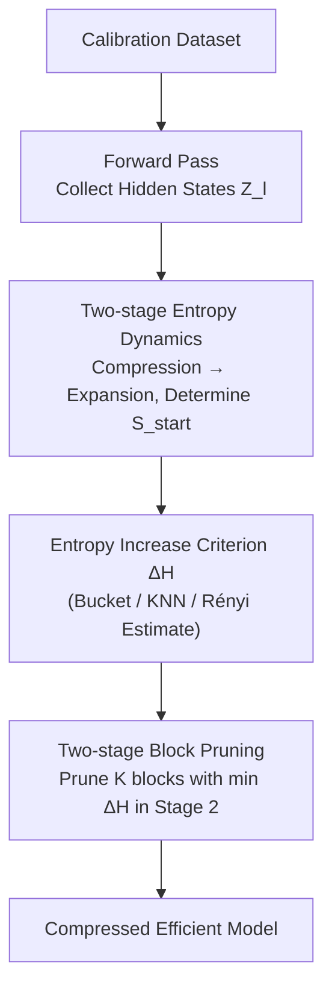

# Entropy-Based Block Pruning for Efficient Large Language Models

**Conference**: ICLR 2026  
**OpenReview**: [https://openreview.net/forum?id=bzQvL797PS](https://openreview.net/forum?id=bzQvL797PS)  
**Code**: https://github.com/SalesforceAIResearch/EntroDrop  
**Area**: Model Compression  
**Keywords**: Block-level Pruning, Entropy Increase Criterion, Efficient LLM Inference, Redundancy Analysis, Calibration Dataset

## TL;DR
This paper proposes EntroDrop, which utilizes the "entropy increase" of hidden states instead of traditional cosine similarity to measure the redundancy of Transformer calculation blocks. It identifies a two-stage pattern in LLM hidden state entropy—"compression followed by expansion." By pruning blocks with the minimum entropy increase only during the expansion stage, the method removes 37.5% of attention layers in Llama3.1-8B while retaining 95%+ performance, consistently outperforming cosine similarity-based pruning methods.

## Background & Motivation
**Background**: As LLM parameters have expanded from millions to billions, the computational and storage pressure for deployment has increased significantly, making structured pruning a mainstream efficiency solution. Recent studies have found significant layer-level redundancy in pre-trained LLMs—removing a substantial portion of layers results in almost no performance drop, indicating unequal layer contributions. LLMDrop further notes that attention blocks are more redundant than MLP blocks, refining pruning granularity from "entire layers" to "intra-block components."

**Limitations of Prior Work**: Whether utilizing layer pruning (LaCo, ShortGPT) or attention pruning (LLMDrop), existing methods almost exclusively use **cosine similarity** to determine redundancy—comparing a block's input $X$ and output $Y$. If $\cos(X,Y)$ is high (output and input are nearly identical), the block is considered redundant and pruned.

**Key Challenge**: Cosine similarity essentially characterizes the **geometric alignment** of two vectors, which does not equate to the actual **information** a block contributes. A block might hardly change the hidden state in a geometric direction (high cosine similarity) but perform important reorganization of the information distribution; conversely, a large directional change may not increase information content. Therefore, pruning decisions based solely on cosine similarity tend to mistakenly remove useful blocks or retain redundant ones, leading to sub-optimal results.

**Goal**: To identify a pruning criterion capable of directly quantifying "block output information" and to design a unified strategy applicable to both layer pruning and attention block pruning.

**Key Insight**: The authors shift focus from "geometry" to "information theory"—calculating the Shannon entropy of discretized hidden states block-by-block to observe how entropy evolves with depth. A key empirical discovery supports this approach: entropy first decreases in the early layers and then continuously increases in most subsequent layers, exhibiting a stable two-stage pattern.

**Core Idea**: Use "entropy increase" $\Delta H = H(Z_l) - H(Z_{l-1})$ instead of cosine similarity to measure block importance. Blocks with minimal entropy increase contribute the least to information expansion and should be prioritized for pruning.

## Method

### Overall Architecture
EntroDrop is a block-level pruning workflow that is **training-free and relies on a small amount of calibration data**. Given a pre-trained Transformer (with $L$ blocks—either entire Transformer blocks or specific Attention blocks), it generates a pruning order to remove the $K$ most redundant blocks as needed. The pipeline consists of four steps: feeding calibration samples into the model to collect hidden states; estimating Shannon entropy for each block's hidden state; identifying the "Compression (Stage 1)" and "Expansion (Stage 2)" phases to determine the boundary point $S_{start}$; and calculating entropy increase within Stage 2 to rank and prune the $K$ blocks with the smallest increase. All decisions are based on forward propagation statistics without updating weights.

### Key Designs

**1. Two-stage Entropy Dynamics: Information Flow Pattern from "Compression" to "Expansion"**

This serves as the empirical foundation, addressing the limitation that cosine similarity fails to capture information contribution. The authors use entropy to directly quantify the information content of each block's output. Hidden state activations are discretized to calculate Shannon entropy $H(Z) = -\sum_z p(z)\log p(z)$ (higher entropy represents more uniform activation and richer info, lower indicates concentrated representation). Across models like Llama3.1-8B and Mistral-7B-v0.3 and four datasets (C4, Law, Medicine, Wikitext2), a consistent two-stage behavior was observed: **Stage 1 (approx. layers 1–3) shows entropy decrease**, corresponding to strong information compression, noise filtering, and compact representation formation; **Stage 2 (layer 3 to the end) shows gradual entropy increase**, corresponding to context expansion and feature enrichment. This implies early layers have unique, irreplaceable roles, while later layers perform similar tasks (stacking information uniformly), making those with the least entropy increase in Stage 2 natural pruning candidates.

**2. Entropy Increase Criterion ΔH: Replacing Geometric Similarity with Information Content**

To address the fundamental flaw of cosine similarity, this work replaces the importance criterion $g(X,Y)=1-\frac{X\cdot Y}{|X||Y|}$ with **entropy increase**:

$$\Delta H_l = H(Z_l) - H(Z_{l-1})$$

where $Z_l = f_l(Z_{l-1})$ is the output hidden state of the $l$-th block. $\Delta H_l$ directly measures the net information added after passing through a block. To calculate $H(\cdot)$, three estimators were explored: **Bucket-based** (frequency distribution estimation), **KNN** (local density estimation), and **Rényi entropy** (a tunable generalization of Shannon entropy). All have low overhead, with experiments showing Bucket and KNN to be most effective.

**3. Two-stage Block Pruning: Freezing Compression Zone and Pruning K Blocks in Expansion Zone**

The two-stage dynamics are directly implemented in the pruning strategy: **Stage 1 is entirely frozen** with no pruning, as these layers provide irreplaceable compression. **Stage 2 is the pruning target**. The boundary $S_{start}$ is determined automatically by the calibration data. Within the range $S_{start} \le l \le L$, blocks are ranked by entropy increase in **ascending order**: $\text{Rank}(\Delta H_l) = \text{argsort}(\Delta H_l)$. The $K$ blocks with the smallest increase are pruned:

$$S_{prune} = \{ f_i \mid f_i \in \text{Rank}(\Delta H_l)_{S_{start}:L}[:K] \}$$

This design **unifies granularity**: when $f_l$ refers to a full Transformer block, it performs layer pruning; when it refers to an Attention block, it performs attention pruning. $K$ serves as the primary budget knob for balancing compression and performance.

### Loss & Training
EntroDrop is a **training-free pruning method** involving no loss functions or fine-tuning. It requires only one forward pass on the calibration set to collect states, estimate entropy, and rank blocks. All experiments were conducted on a single 40G A100.

## Key Experimental Results

### Main Results
Average accuracy across 13 benchmarks on Llama3.1-8B after pruning $L$ blocks ($L=0$ is the original model at 0.5872). Ours(Layer) is compared vs. layer pruning baselines, and Ours(Attn) vs. attention pruning baselines:

| Pruned Blocks $K$ | ShortGPT (Layer) | Ours (Layer) | LLMDrop (Attn) | Ours (Attn) |
| :--- | :--- | :--- | :--- | :--- |
| 4 | 0.5054 | **0.5170** | 0.5955 | 0.5949 |
| 8 | 0.3015 | **0.4583** | 0.5932 | 0.5909 |
| 12 | 0.3346 | 0.3346 | 0.5467 | 0.5467 |
| 16 | 0.2956 | 0.2980 | 0.4207 | **0.4603** |

The advantage is most prominent in layer pruning: at $K=8$, Ours(Layer) outperforms ShortGPT by ~15.7 percentage points. For attention pruning under heavy compression ($K=16$), Ours(Attn) at 0.4603 significantly exceeds LLMDrop at 0.4207. Results were consistent on Mistral-7B-v0.3. Pruning 12 attention layers (37.5%) retains 95%+ of original performance.

### Ablation Study

| Dimension | Comparison | Key Finding |
| :--- | :--- | :--- |
| Importance Criterion | Entropy Increase vs. Cosine | Entropy increase (Bucket/KNN) curves decay more gracefully, outperforming Cosine. |
| Entropy Estimation | Bucket / KNN / Rényi | Bucket and KNN are most effective; Rényi is slightly lower. |
| Calibration Set | C4 / Wiki / Law / Med | Negligible difference in heatmaps and performance across sets; robust to domain shifts. |

### Key Findings
- **Entropy increase is the source of performance**: Replacing cosine similarity with entropy increase results in significantly less performance degradation, validating the core assumption that "geometric similarity $\neq$ information redundancy."
- **Redundancy in deeper layers**: Heatmaps show deeper layers have smaller entropy increases, making them natural pruning candidates.
- **Robustness to calibration data**: Average accuracy remains stable even with domain-specific calibration sets (e.g., Medicine, Law), suggesting entropy estimates generalize well.
- **Attention blocks are more prunable than whole layers**: Attention pruning (Ours(Attn)) retains more performance than layer pruning at all compression rates.

## Highlights & Insights
- **Perspective shift as a performance lever**: Shifting from "geometric similarity" to "information entropy" changes the criterion from "how much direction changed" to "how much information was added." This simple shift is effective for any modular redundancy measurement.
- **Solving "where to prune" via dynamics**: The "compression followed by expansion" pattern not only provides a metric but also defines the pruning region (freezing Stage 1), avoiding the common trap of pruning crucial early layers.
- **Unified granularity, training-free, single knob**: The same entropy criterion covers both layer and attention pruning without fine-tuning, using only $K$ as a hyperparameter.

## Limitations & Future Work
- While the two-stage entropy dynamics were observed across multiple decoder-only models, the authors acknowledge they **may not be universal to all architectures**.
- Experiments were primarily verified on 7B–8B scale models; **applicability to very large models (hundreds of billions) or MoE models remains to be fully tested**.
- Pruning is done **block-wise greedily**, without considering interactions between pruned blocks or cascading error accumulation, leading to performance drops under heavy pruning ($K=16$).
- Future directions: Combining entropy increase with light fine-tuning/distillation; exploring global combinatorial optimization of entropy; and adaptive determination of $S_{start}$.

## Related Work & Insights
- **vs. ShortGPT / LaCo (Layer Pruning)**: These use cosine similarity for layer redundancy; the current work uses entropy increase, resulting in significantly better performance at identical pruning volumes.
- **vs. LLMDrop (Attention Pruning)**: LLMDrop identifies attention blocks as redundant using cosine similarity; current work adopts this fine-grained granularity but replaces the criterion with entropy increase, showing advantages in heavy compression.
- **vs. Entropy-lens**: Entropy-lens studies the entropy dynamics of **predicted logits** (output layer perspective); this work analyzes **raw hidden representations** (internal perspective) at a finer granularity suitable for block-wise decisions.

## Rating
- Novelty: ⭐⭐⭐⭐ The shift to entropy increase is concise and powerful; the two-stage observation provides new insights.
- Experimental Thoroughness: ⭐⭐⭐⭐ Covering two model families, 13 benchmarks, and multiple ablations; however, testing on larger models is absent.
- Writing Quality: ⭐⭐⭐⭐ Clear logic from motivation to observation to method.
- Value: ⭐⭐⭐⭐ Training-free and unified granularity provides direct utility for efficient LLM deployment.

<!-- RELATED:START -->

## Related Papers

- [\[ICLR 2026\] RCPU: Rotation-Constrained Error Compensation for Structured Pruning of Large Language Models](rcpu_rotation-constrained_error_compensation_for_structured_pruning_of_large_lan.md)
- [\[ICLR 2026\] MicroMix: Efficient Mixed-Precision Quantization with Microscaling Formats for Large Language Models](micromix_efficient_mixed-precision_quantization_with_microscaling_formats_for_la.md)
- [\[ICLR 2026\] GPTailor: Large Language Model Pruning Through Layer Cutting and Stitching](gptailor_large_language_model_pruning_through_layer_cutting_and_stitching.md)
- [\[ICLR 2026\] Knowledge Fusion of Large Language Models Via Modular Skillpacks](knowledge_fusion_of_large_language_models_via_modular_skillpacks.md)
- [\[ICLR 2026\] Distillation of Large Language Models via Concrete Score Matching](distillation_of_large_language_models_via_concrete_score_matching.md)

<!-- RELATED:END -->
