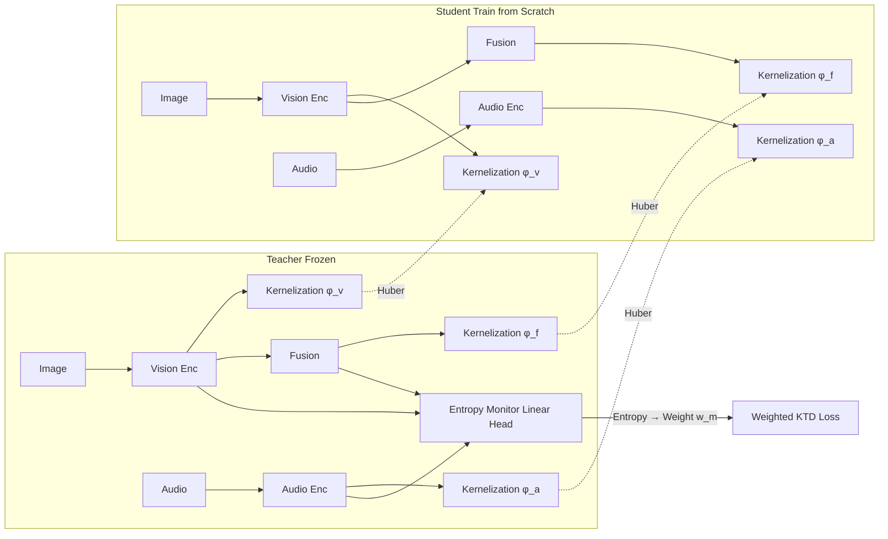

# Entropy-Monitored Kernelized Token Distillation for Audio-Visual Compression

**Conference**: ICLR 2026  
**OpenReview**: [https://openreview.net/forum?id=nspzrcvzcB](https://openreview.net/forum?id=nspzrcvzcB)  
**Code**: TBD  
**Area**: Model Compression / Knowledge Distillation  
**Keywords**: Knowledge Distillation, Kernel Methods, Audio-Visual, Token Distillation, Entropy Adaptation

## TL;DR
Instead of directly distilling latent space features or outputs of the teacher, this work distills pairwise similarity relations between tokens using kernel functions (Gram matrices). It adaptively adjusts distillation weights based on the predicted entropy of each modality, achieving architecture-agnostic audio-visual model compression that retains ~97% performance with a 94% parameter reduction.

## Background & Motivation
**Background**: Audio (mel-spectrograms) and vision (RGB) typically utilize independent large encoders. Performance scales with the number of parameters, but limited computing power on edge devices necessitates distilling large teacher models into small student models. Knowledge distillation (KD) is typically performed either in the **latent space** (more effective but requires matching dimensions or architectures) or the **output space** (architecture-agnostic but less effective).

**Limitations of Prior Work**: (1) Latent space distillation relies on projection modules for dimensional alignment, which introduces extra parameters and may learn over-expressive projection functions that directly map student features to teacher features, bypassing actual distillation. (2) The most related work, MTST, only handles audio and performs softmax normalization on masked token similarities—masking loses information, softmax erases linear offsets of similarities, and token relationships within the same sample change based on which tokens are masked. (3) Traditional KD distills all modalities **uniformly**, yet if a modality is uninformative for the current task (e.g., visual occlusion), forced distillation can pollute the supervision signals.

**Key Challenge**: To achieve architecture-agnosticism (the advantage of output space) while retaining latent space expressiveness (the advantage of latent space), while avoiding blind distillation of uninformative modalities.

**Goal**: An architecture-agnostic audio-visual distillation framework with higher expressiveness than output-space methods and the ability to selectively distill based on modality informativeness.

**Core Idea**: The distillation target is not the latent vectors themselves but the **pairwise relationships** between tokens, calculated via Gram matrices using kernel functions. Furthermore, predicted entropy for each modality serves as an uncertainty proxy to adaptively weight the distillation loss of each modality.

## Method

### Overall Architecture
The Teacher (frozen) and student both receive RGB images and audio mel-spectrograms, each containing vision, audio, and fusion branches. For each branch and instance, the token vectors from the final transformer block undergo kernelization (calculating the Gram matrix). Huber loss is used to align the student's Gram matrix with the teacher's. Simultaneously, a linear task head is attached to each modality to calculate predicted entropy; lower entropy (higher certainty/informativeness) leads to higher distillation weights.

### Key Designs
**1. Kernelized Token Distillation (KTD): Distilling Relationships Not Features**
Instead of mimicking the teacher's latent vectors, the student mimics the **geometric structure** of the latent space (discriminative power stems from the separability between points). For the token matrix $z_m \in \mathbb{R}^{N_m \times C}$ of modality $m$, the intra-instance Gram matrix $\varphi_m[i,j] = z_m^{i\top} z_m^j$ is calculated using a linear kernel (with tokens first normalized to unit vectors). Both teacher and student matrices are aligned using Huber (smooth-L1) loss:

$$L_{KTD} = \sum_{m \in \{a,v,f\}} \frac{1}{N^2}\sum_{i}\sum_{j} L_{Huber}(\varphi_m^T[i,j], \varphi_m^S[i,j]).$$

Diagonal elements (self-similarity) naturally cancel out, and supervision is derived from off-diagonal elements. This completely eliminates requirements for dimension/architecture matching and, by **avoiding masking and softmax**, preserves the teacher's original similarities—a core improvement over MTST. Kernels are calculated instance-wise (not across the batch) to avoid quadratic complexity explosion.

**2. Flexible Kernels: Increasing Expressiveness without Dimensionality Expansion**
KTD kernels can be substituted to enhance expressiveness without explicitly projecting data into high-dimensional spaces (kernel trick). Beyond the linear kernel, extensions include the polynomial kernel $\varphi_m[i,j] = (z_m^{i\top}z_m^j + c)^d$ (expansion of degree $d$, complexity $O(C^d)$) and the RBF kernel $\varphi_m[i,j] = \exp(-\gamma\|z_m^i - z_m^j\|^2)$ (mapping to infinite-dimensional space). $\gamma$ controls the steepness of the peak; RBF ($\gamma=0.5$) proved optimal in experiments.

**3. Entropy-Monitored Distillation: Selective Distillation by Informativeness**
Not all modalities are equally informative. A linear task head $g_m(\cdot)$ (linear probe for classification; pixel-wise linear probe for segmentation) is attached to each modal branch of the frozen teacher to calculate the entropy of its predicted distribution as an uncertainty proxy:

$$H_m(z_m^T) = -\sum_{c=1}^{C} \sigma(g_m(z_m^T))[c] \log \sigma(g_m(z_m^T))[c].$$

Higher entropy represents higher uncertainty or lack of information. Negative exponents convert entropy into weights $w_m = e^{-\lambda H_m(z_m^T)}$ to adaptively suppress the influence of high-uncertainty modalities. The final EM-KTD loss is:

$$L = \sum_{m \in \{a,v,f\}} \frac{w_m}{N^2}\sum_{i}\sum_{j} L_{Huber}(\varphi_m^T[i,j], \varphi_m^S[i,j]).$$

The authors compare the Entropy Monitor to a "proctor" supervising the quality of teacher-student distillation. The Monitor is trained independently before the distillation process (with a frozen teacher and cosine annealing schedule).

## Key Experimental Results

### Main Results

| Dataset | Task/Metric | Ours (EM-KTD) | Strongest Baseline (MTST) | Teacher |
|--------|------|------|------|---|
| VGGSound | Acc | 62.0 | 57.6 | 63.9 |
| VGGSound | mAP | 63.4 | 58.5 | 65.0 |
| VGGSound | mAUC | 97.9 | 97.0 | 97.9 |
| AVS-S4 | mIoU (MJ) | 79.81 | 77.19 | 83.15 |
| AVS-S4 | F-score (MF) | 87.86 | 86.03 | 90.4 |
| AVS-MS3 | mIoU (MJ) | 64.43 | 59.60 | 61.95 |
| AVS-MS3 | F-score (MF) | 74.73 | 69.89 | 70.9 |

The Student utilizes only **6%** of teacher parameters (ViT-Tiny 10M vs. ViT-Base 164M) while retaining 96.9%/97.0% performance; for AVS, the visual student PVTv2-b0 uses only 3.4M (Teacher 81.4M, ~4.5%).

### Ablation Study

| Configuration | Metric (VGGSound Acc) | Description |
|------|------|------|
| MTST+KD (Linear) | 57.6 | Linear kernel with softmax+mask |
| KTD (Linear) | 60.2 | Switched to original similarity preservation → +2.6 |
| KTD (Polynomial-2) | 60.5 | 2× matrix multiplication complexity |
| KTD (RBF γ=2) | 60.9 | — |
| KTD (RBF γ=0.5) | 61.4 | 3× multiplication, best kernel |
| Input reduced to 112×112 EM-KTD | 60.0 | Token count reduced by 1/4; still stronger than all baselines |

### Key Findings
- KTD alone (without entropy) leads across four baselines: Acc +6.61%, mAP +3.86%, mAUC +0.85%; adding traditional KD further improves performance.
- Using the same linear kernel, KTD outperforms MTST by 6.25% Acc—verifying that **preserving original similarity (no softmax/no mask)** is crucial.
- Adding the Entropy Monitor further improves KTD (62.0 vs. 61.4), especially in the MS3 multi-source scenario where gains are significant.
- KTD is insensitive to input resolution: downsampling student visual tokens to 1/4 still outperforms all baselines, making it suitable for real-world scenarios with inconsistent sensor resolutions.

## Highlights & Insights
- Integrates classical kernel methods (Gram matrices + kernel trick) into token distillation, elegantly achieving both "architecture-agnosticism" and "latent space expressiveness."
- Diagnoses that MTST’s softmax discards linear offsets of similarity and that masking causes token relationships within samples to change randomly; this diagnosis is verified by reverting to original similarities.
- Uses predictive entropy as a distillation weight, explicitly modeling "which modality is trustworthy at this moment," providing finer granularity than fixed weights or fusion-only distillation.

## Limitations & Future Work
- Kernels are calculated instance-wise to avoid quadratic complexity across samples, but the Gram matrix within a single instance remains $O(N^2)$; scalability for higher resolutions or longer sequences is not fully discussed.
- More complex kernels (Polynomial/RBF) introduce a 2-3× computational overhead; the trade-off between gains and overhead must be decided based on the use case.
- Validation is concentrated on audio-visual classification and segmentation using CAVMAE/UFE-AVS backbones; generalization across more modalities (e.g., text) or more heterogeneous architecture pairs remains to be verified.
- The Entropy Monitor requires additional training of linear probes before distillation, adding a step to the training pipeline.

## Related Work & Insights
- **vs. MTST (Choi et al. 2023)**: The most related work but limited to audio and uses softmax normalization on masked tokens; this work preserves full original similarity, extends to multi-modality, and is 6% more accurate under the same kernel function.
- **vs. SPKD (Tung & Mori 2019)**: SPKD distills inter-sample similarity; this work distills intra-instance token similarity and allows for any kernel + entropy weighting.
- **vs. Projection-based KD (Kim 2018, Liu 2022b)**: Relying on projections to align dimensions introduces extra parameters and risks over-expression; KTD is inherently architecture-agnostic via Gram matrices without need for projection.
- **vs. Monitored Distillation (Liu 2022a)**: The former applies monitored distillation in the output space for depth completion; this work brings the "monitor" concept to the latent token level using entropy as the monitoring signal.

## Rating
- Novelty: ⭐⭐⭐⭐ The combination of kernelized token relationships and entropy adaptation is self-consistent; the diagnosis and improvement of MTST are clear.
- Experimental Thoroughness: ⭐⭐⭐⭐ Three tasks across two datasets, with multiple ablations for kernel functions, token counts, and Entropy Monitor; comprehensive comparison with baselines.
- Writing Quality: ⭐⭐⭐⭐ The chain of motivation-method-ablation is smooth, with well-placed formulas and figures; minor typos (UM-KTD/confusion between σ and γ) exist.
- Value: ⭐⭐⭐⭐ Addresses the strong demand for edge-side audio-visual compression; 94% parameter compression with 97% performance retention and architecture-agnosticism makes it highly practical.

<!-- RELATED:START -->

## Related Papers

- [\[ICLR 2026\] Rejuvenating Cross-Entropy Loss in Knowledge Distillation for Recommender Systems](rejuvenating_cross-entropy_loss_in_knowledge_distillation_for_recommender_system.md)
- [\[ICLR 2026\] AgilePruner: An Empirical Study of Attention and Diversity for Adaptive Visual Token Pruning in LVLMs](agilepruner_an_empirical_study_of_attention_and_diversity_for_adaptive_visual_to.md)
- [\[ICLR 2026\] Token Distillation: Attention-Aware Input Embeddings for New Tokens](token_distillation_attention-aware_input_embeddings_for_new_tokens.md)
- [\[ICML 2026\] Entropy-Aware On-Policy Distillation of Language Models](../../ICML2026/model_compression/entropy-aware_on-policy_distillation_of_language_models.md)
- [\[ICLR 2026\] Boosting Entropy with Bell Box Quantization](boosting_entropy_with_bell_box_quantization.md)

<!-- RELATED:END -->
