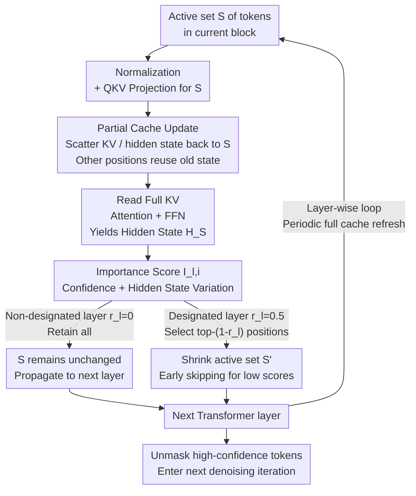

# ES-dLLM: Efficient Inference for Diffusion Large Language Models by Early-Skipping

**Conference**: ICLR2026  
**arXiv**: [2603.10088](https://arxiv.org/abs/2603.10088)  
**Code**: [zhuzj19/ES-dLLM](https://github.com/zhuzj19/ES-dLLM)  
**Area**: Model Compression  
**Keywords**: Diffusion LLM, Inference Acceleration, Token Skipping, KV Cache, training-free

## TL;DR

To address the high token computational redundancy during Diffusion Large Language Model (dLLM) inference, this paper proposes ES-dLLM, a training-free Early-Skipping acceleration framework. By estimating token importance and skipping low-importance positions in early layers, it achieves 5.6×–16.8× acceleration on LLaDA-8B and Dream-7B without sacrificing generation quality.

## Background & Motivation

dLLMs such as LLaDA and Dream generate text through iterative denoising, supporting bidirectional attention and parallel decoding, making them powerful alternatives to Autoregressive Models (ARMs). However, the inference efficiency of open-source dLLMs is significantly lower than that of ARMs of the same scale. The core bottlenecks are:

1.  **Processing full sequences per iteration**: dLLMs require a full forward pass on the entire input sequence for every iteration, incurring massive computational overhead.
2.  **Redundant computation**: Only a few high-confidence tokens are unmasked in each round; the computation results for the vast majority of masked tokens are not utilized.
3.  **Minimal input variance between adjacent iterations**: Adjacent iterations differ only at newly unmasked positions, while intermediate states change minutely.

Experimental analysis reveals that: (a) Confidence changes at most positions approximate an exponential distribution concentrated near zero (over 90% of changes < 0.05); (b) Hidden state variations between consecutive iterations are similarly minimal. This highlights substantial redundant calculations that can be eliminated.

## Core Problem

How to identify and skip the calculation of low-importance tokens during dLLM inference without introducing additional training, thereby significantly reducing the per-iteration computational load?

## Method

### Overall Architecture

ES-dLLM addresses the issue where open-source dLLMs perform a complete forward pass for each denoising round even though only a few high-confidence positions are unmasked. The mechanism assigns an importance score to every token position. At shallow Transformer layers (e.g., $1/8$ or $1/4$ depth), low-scoring positions are removed from the "active set," allowing only top-$k$ important positions to propagate to deeper layers. Once the set is reduced from $|S|$ to $(1-r_l)|S|$ at a specific layer, the matrix multiplication scale in all subsequent layers is reduced accordingly. This process forms a closed loop within Transformer blocks: projecting active positions → partial KV/hidden state cache updates → full-sequence attention → score-based set selection → propagation to the next layer. The caching mechanism ensures that skipped tokens maintain accessible states for attention and subsequent rounds, allowing massive FLOP reduction without training or weight modifications.

### Key Designs

**1. Importance Score Estimation: Identifying valuable tokens via free signals**

dLLMs unmask few high-confidence positions per round, making most masked token calculations useless. ES-dLLM linearly fuses two existing free signals to identify these tokens without extra training. For layer $l$ and position $i$, the importance score is:

$$I_{l,i} = \alpha \cdot c_i^{(t-1)} + (1-\alpha) \cdot \frac{\| H_{l,i}^{(t)} - H_{l,i}^{(t-1)} \|_1}{\sqrt{d} \cdot \| H_{l,i}^{(t-1)} \|_2}$$

The first term $c_i^{(t-1)}$ is the max softmax probability from the previous round; higher confidence predicts a higher likelihood of being unmasked. The second term is the relative L1 variation of the hidden state (or Q/K/V) compared to the previous round's cache, normalized by $\sqrt{d}$ and the L2 norm, capturing semantic dependency. A default $\alpha=0.5$ balances the terms; relying solely on confidence ($\alpha=1$) degrades performance as it misses active positions with low confidence but high state variation. Layers skip positions based on the ratio $r_l$ for the top-$(1-r_l)|S|$.

**2. Partial Cache Update & Early-Skipping: Integrating "skipping" into forward passes**

Skipping must be paired with caching to avoid breaking attention or missing hidden states in subsequent rounds. Inside each Transformer block, ES-dLLM performs normalization and QKV projection only for the active set $S$. It uses in-place scatter to write new KV values into the full KV Cache (reusing old KV for skipped positions) and then reads the entire KV sequence for attention. The FFN-generated hidden state $H_S$ serves as both the layer output and the input for importance scoring to select the next set $S'$. Skipping earlier saves more FLOPs, but deep variations are more reliable. Defaults set $r_l=0.5$ at $1/8$ and $1/4$ depths (e.g., $r_4=r_8=0.5$ for LLaDA), reducing FLOPs by ~60%. A full forward pass initializes caches, and periodic full refreshes prevent error accumulation. Unlike DualCache, which targets block-external KV, ES-dLLM optimizes within the block.

## Key Experimental Results

Main results on NVIDIA H200 GPU:

**LLaDA-8B-Instruct**:

| Benchmark | Original TPS | ES-dLLM TPS | Speedup | Accuracy Change |
| :--- | :--- | :--- | :--- | :--- |
| GSM8K | 8.56 | 143.93 | 16.8× | +0.23 |
| MATH | 14.04 | 103.63 | 7.4× | -0.90 |
| BBH | 11.06 | 159.89 | 14.5× | -2.24 |
| HumanEval | 23.65 | 226.57 | 9.6× | +1.21 |
| MBPP | 8.98 | 145.99 | 16.3× | -1.60 |

**Dream-7B-Instruct**:

| Benchmark | Original TPS | ES-dLLM TPS | Speedup | Accuracy Change |
| :--- | :--- | :--- | :--- | :--- |
| GSM8K | 19.80 | 267.13 | 13.5× | -1.06 |
| MATH | 26.38 | 147.44 | 5.6× | -0.50 |
| HumanEval | 44.34 | 308.51 | 7.0× | -1.83 |
| MBPP | 21.68 | 276.12 | 12.7× | -3.40 |

ES-dLLM provides 1.20×–1.85× additional speedup over DualCache with superior accuracy across multiple benchmarks.

**Ablation Study**:
- $\alpha=0.5$ (equal weighting) is optimal; $\alpha=1$ (confidence only) shows significant degradation.
- Hidden state variation is a slightly better indicator than QKV tensors with negligible memory overhead.
- Total memory overhead is minimal: 528KB per output token for LLaDA-8B and 70KB for Dream-7B.

## Highlights & Insights

1.  **Training-free**: Purely inference-side optimization, plug-and-play, and compatible with existing dLLMs.
2.  **Observation-driven**: Based on systematic analysis of confidence and hidden state variations in dLLM generation.
3.  **Significant acceleration**: Up to 16.8× speedup, with accuracy fluctuations maintained within ±2% for most benchmarks.
4.  **Orthogonal to existing methods**: Can be combined with techniques like sparse attention and parallel decoding.
5.  **Negligible memory overhead**: Extra cache is only several hundred MBs compared to 10GB+ model weights.

## Limitations & Future Work

1.  **Heuristic importance estimation**: The linear combination of confidence and L1 variation may lack precision; lightweight models could be trained to predict importance.
2.  **Partial KV updates deviate from training**: Training assumes full state updates; skipping may introduce distribution shifts.
3.  **Real-world speedup below theoretical gains**: Reducing 60% FLOPs yields only 1.2×–1.85× speedup (vs DualCache) as inference becomes memory-bound, and memory access for weights/KVs remains high.
4.  **Manual skip ratio**: Different tasks may require specific ratios; automated adaptation mechanisms are currently missing.

## Related Work & Insights

| Method | Type | Training Required | Source of Gain | Limitations |
| :--- | :--- | :--- | :--- | :--- |
| Semi-AR (LLaDA) | Generation Strategy | No | Block-wise sequential generation | Constraints on order |
| BD3-LM | Model Design | Yes | Unidirectional attention + KV Cache | Loss of bidirectional modeling |
| dKV-Cache | KV Cache | No | Delayed KV updates for unmasked tokens | No Semi-AR utilization |
| DualCache | KV Cache | No | Block-external KV reuse | Still computes entire blocks |
| Sparse-dLLM | Sparse Attention | No | Sparsifying historical tokens | Optimizes attention range only |
| **ES-dLLM** | **Token Skipping** | **No** | **Skipping low-importance positions** | **Memory-bound bottleneck** |

## Related Work & Insights

- **Complementarity of skipping and caching**: ES-dLLM (intra-block) and DualCache (extra-block) are stackable; this logic can extend to other iterative generative models.
- **Generality of importance scores**: The dual-factor evaluation (confidence + variation) is transferable to token pruning in diffusion-based image generation.
- **Rapid progress in dLLM inference**: Integration of KV caching, sparse attention, token skipping, and parallel decoding represents the future of systematic optimization.

## Rating
- Novelty: 7/10
- Experimental Thoroughness: 8/10
- Writing Quality: 8/10
- Value: 7/10

<!-- RELATED:START -->

## Related Papers

- [\[ICLR 2026\] Quant-dLLM: Post-Training Extreme Low-Bit Quantization for Diffusion Large Language Models](quant-dllm_post-training_extreme_low-bit_quantization_for_diffusion_large_langua.md)
- [\[ICLR 2026\] DTP: Delta-Guided Two Stage Pruning for Mamba-based Multimodal Large Language Models](dtp_delta-guided_two_stage_pruning_for_mamba-based_multimodal_large_language_mod.md)
- [\[ICLR 2026\] WINA: Weight Informed Neuron Activation for Accelerating Large Language Model Inference](wina_weight_informed_neuron_activation_for_accelerating_large_language_model_inf.md)
- [\[ICLR 2026\] Entropy-Based Block Pruning for Efficient Large Language Models](entropy-based_block_pruning_for_efficient_large_language_models.md)
- [\[AAAI 2026\] SkipCat: Rank-Maximized Low-Rank Compression of Large Language Models via Shared Projection and Block Skipping](../../AAAI2026/model_compression/skipcat_rank-maximized_low-rank_compression_of_large_language_models_via_shared_.md)

<!-- RELATED:END -->
