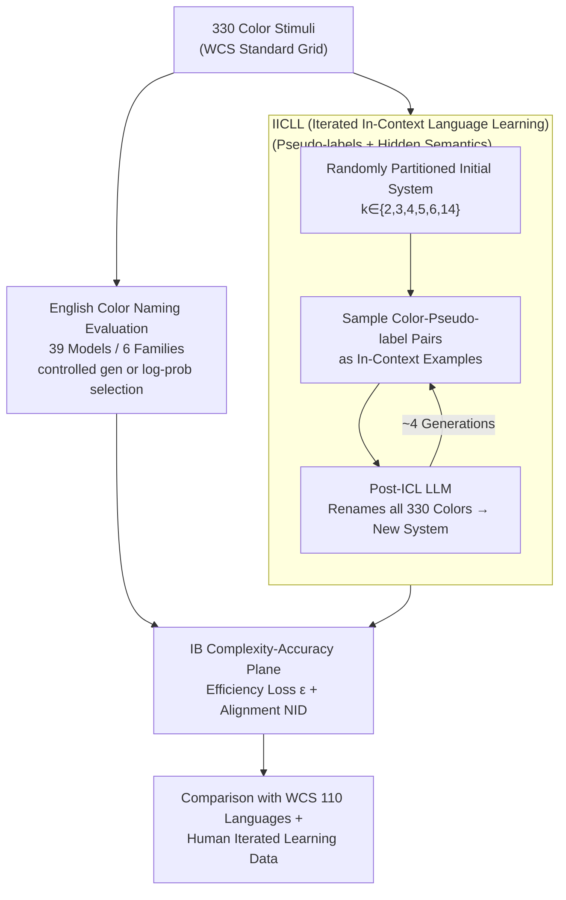

# Evolution and compression in LLMs: On the emergence of human-aligned categorization

**Conference**: ICLR 2026  
**arXiv**: [2509.08093](https://arxiv.org/abs/2509.08093)  
**Code**: [infocoglab/evolution-compression-llms](https://infocoglab.github.io/evolution-compression-llms)  
**Area**: Model Compression  
**Keywords**: information bottleneck, color naming, iterated learning, semantic categories, LLM alignment

## TL;DR

Through the Information Bottleneck (IB) framework and the Iterated In-Context Language Learning (IICLL) paradigm, this work demonstrates that LLMs, even without being trained on IB objectives, can spontaneously emerge category structures that are highly aligned with human semantic systems and exhibit near-optimal compression efficiency.

## Background & Motivation

**Background**: Substantial evidence suggests that human semantic categorization systems (such as color naming) adhere to the Information Bottleneck (IB) principle—achieving a near-optimal trade-off between the informational complexity of vocabulary and communicative accuracy. This theoretical framework, proposed by Zaslavsky et al. (2018), has been extensively validated across 110 languages in the World Color Survey (WCS).

**Key Challenge**: The training objective for LLMs is language modeling (next-token prediction) rather than the IB objective function. This raises a core question: are LLMs merely mimicking categorization patterns found in training data, or do they possess an inherent, human-like inductive bias that spontaneously drives efficient semantic compression?

**Design Motivation**: Color naming is a classic domain for studying categorization in cognitive science. It provides unique cross-linguistic human data (WCS dataset) and cultural evolution experimental data (Xu et al., 2013), making it an ideal testbed for evaluating LLM alignment with human cognition.

**Goal**: This paper aims to answer three questions: (1) How do LLM English color-naming systems perform regarding IB efficiency and human alignment? (2) Do LLMs possess a genuine inductive bias for IB efficiency beyond mere imitation? (3) Does this bias persist in semantic domains outside of color?

## Method

### Overall Architecture

Rather than training models, this work adapts cognitive science tools to probe LLMs. The compression efficiency of a categorization system is quantified using the Information Bottleneck (IB) framework. LLMs are probed via two paths: static evaluation of existing English color naming and dynamic observation of naming systems emerging through Iterated In-Context Language Learning (IICLL). IICLL utilizes pseudo-labels and hidden semantics to decouple the model from direct training data retrieval. Both paths are mapped onto an IB complexity-accuracy plane for direct comparison with human data from the World Color Survey (WCS).

### Key Designs

**1. Quantifying Semantic Compression Efficiency via IB: Translating "Good Categorization" into an Optimizable Objective**

To determine if LLM color-word systems are "efficient," an information-theoretic metric is required. This paper follows the Zaslavsky et al. (2018) IB objective function:

$$\mathcal{F}_\beta[q] = I_q(M;W) - \beta \cdot I_q(W;U)$$

where $I_q(M;W)$ represents complexity (mutual information between speaker meanings $M$ and words $W$), and $I_q(W;U)$ represents accuracy (information retained by words $W$ about world states $U$). The parameter $\beta \geq 0$ regulates the trade-off. Theoretically optimal systems lie on the IB frontier. Efficiency loss is defined as $\varepsilon = \min_\beta \frac{1}{\beta}(\mathcal{F}_\beta[q] - \mathcal{F}_\beta^*)$; closer proximity to the frontier indicates near-optimal compression. Normalized Information Distance (NID) measures alignment with human English naming systems.

**2. Large-scale English Color Naming Evaluation**

The first objective is to assess whether LLMs are already as efficient as humans when naming colors. 330 color chips from the WCS grid are used as stimuli across 39 models (Gemini, Gemma 3, Llama 3, Qwen 2.5, Olmo 2, GPT-2). Inputs include text (sRGB coordinates) and images (for multimodal models). Word selection is handled via controlled generation or log-probability scoring of candidates.

**3. IICLL Paradigm: Generational Evolution of LLMs**

Static evaluation cannot distinguish between imitation and true inductive bias. This paper introduces Iterated In-Context Language Learning (IICLL): a pseudo-color naming system is initialized with random partitions ($k \in \{2, 3, 4, 5, 6, 14\}$). In each generation, a few "color-pseudo-label" pairs from the previous generation $L_{t-1}$ are used as in-context examples $d_{t-1}$. The LLM then renames all 330 colors to produce $L_t$. This simulates human cultural transmission to see if systems spontaneously drift toward the IB frontier.

**4. Pseudo-labels + Hidden Semantics: Severing Access to Training Data**

To ensure IICLL reflects internal bias rather than data mimicry, labels are non-English pseudo-words, and prompts never specify the stimuli are "colors," referring to them only as having certain "features." Any emergent IB-efficient structure is thus attributable to intrinsic compression bias.

## Key Experimental Results

### English Color Naming Results

- Significant variance exists among LLMs regarding complexity and English alignment.
- **Model scale and instruction tuning** are critical: larger, instruction-tuned models achieve better alignment and IB efficiency.
- Gemini 2.0 and Gemma 3 27B (inst.) are most similar to human naming systems.
- Surprisingly, some SOTA models (e.g., Llama 3.3 70B inst.) fail to reproduce standard English color naming.
- Certain models (Olmo 2 32B inst., Qwen 2.5 VL 7B inst.) produce systems more akin to low-resource WCS languages than English.

### IICLL Cultural Evolution Results

- **Gemini 2.0**: The only model covering the full range of complexity observed in human languages; IICLL chains converge to near-optimal IB solutions similar to WCS data.
- **Gemma 3 27B, Qwen 2.5 32B, Llama 3.3 70B**: These also converge to IB-efficient solutions, albeit restricted to lower complexity regions.
- All models converge near the IB frontier within ~4 generations, mirroring human dynamic patterns.
- Rotation analysis confirms that efficiency and alignment are non-trivial.

### Shepard Circular Domain Expansion

- Gemini was tested on a 2D Shepard circular space (64 stimuli).
- Through IICLL transmission, categories became spatially compact and differentiated based on two dimensions.
- This provides preliminary evidence that the IB bias in LLMs may be domain-general.

## Highlights & Insights

1.  **Theory-Experiment Integration**: Successfully migrates the cognitive science IB framework and iterated learning paradigm to LLM research.
2.  **IICLL Innovation**: The use of pseudo-labels effectively eliminates the confounding factor of training data mimicry.
3.  **Large-Scale Comparison**: Revealing the clear relationship between model scale, instruction tuning, and IB efficiency across 39 models.
4.  **Human-AI Alignment Perspective**: Suggests that IB efficiency is an emergent property of intelligent behavior, appearing in both humans and LLMs without explicit optimization for that objective.

## Limitations & Future Work

1.  **Scale Requirements**: Only Gemini 2.0 reached the full complexity range, suggesting IICLL requires high in-context learning capabilities.
2.  **Source of Bias**: Whether the IB efficiency bias stems from training data distribution, instruction tuning, or architecture remains uncoupled.
3.  **Domain Specificity**: LLMs might have a natural advantage in the color domain due to numerical representations (hex, RGB) in training data.
4.  **Lack of Communicative Pressure**: IICLL simulates cultural transmission but lacks functional communicative pressure found in real language evolution.

## Related Work & Insights

| Work | Focus | Distinction |
| :--- | :--- | :--- |
| Marjieh et al. (2024) | Color naming in few models (GPT-3/4) | 39 models + IB analysis + IICLL |
| Abdou et al. (2021) | Internal color representations in LLMs | Focused on naming behavior via prompt interaction |
| Zhu & Griffiths (2024) | In-context priors in LLMs | Extended to IICLL to replicate human experiments |
| Carlsson et al. (2024) | IB efficiency in trained agents | Uses frozen LLMs rather than scratch-trained agents |

- **Insights on Alignment**: IB efficiency serves as a quantifiable dimension of human-AI alignment, capturing semantic organization more deeply than traditional benchmarks.
- **Value for Model Compression**: While categorized under model compression, this work discusses "semantic compression" rather than parameter pruning. The IB perspective is valuable for understanding how models encode semantics within limited representations.

## Rating
- Novelty: ⭐⭐⭐⭐⭐ 
- Experimental Thoroughness: ⭐⭐⭐⭐ 
- Writing Quality: ⭐⭐⭐⭐⭐ 
- Value: ⭐⭐⭐⭐ 

<!-- RELATED:START -->

## Related Papers

- [\[ICLR 2026\] Paper Copilot: Tracking the Evolution of Peer Review in AI Conferences](paper_copilot_tracking_the_evolution_of_peer_review_in_ai_conferences.md)
- [\[ICLR 2026\] LLM DNA: Tracing Model Evolution via Functional Representations](llm_dna_tracing_model_evolution_via_functional_representations.md)
- [\[ICLR 2026\] Gradient-Aligned Calibration for Post-Training Quantization of Diffusion Models](gradient-aligned_calibration_for_post-training_quantization_of_diffusion_models.md)
- [\[CVPR 2026\] Towards Unified Human Perception and Machine Understanding: Token Flow Guided Compression Framework](../../CVPR2026/model_compression/towards_unified_human_perception_and_machine_understanding_token_flow_guided_com.md)
- [\[ICML 2026\] xKV: Cross-Layer KV-Cache Compression via Aligned Singular Vector Extraction](../../ICML2026/model_compression/xkv_cross-layer_kv-cache_compression_via_aligned_singular_vector_extraction.md)

<!-- RELATED:END -->
