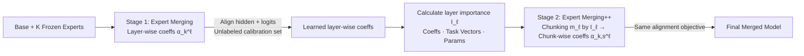

# Expert Merging: Model Merging with Unsupervised Expert Alignment and Importance-Guided Layer Chunking

**Conference**: ICLR 2026  
**OpenReview**: [https://openreview.net/forum?id=Awf3ebMpKw](https://openreview.net/forum?id=Awf3ebMpKw)  
**Code**: [github.com/Littleor/ExpertMerging](https://github.com/Littleor/ExpertMerging)  
**Area**: Model Merging / Model Compression  
**Keywords**: Model Merging, Task Arithmetic, Representation Alignment, Logit Distillation, Layer Importance, MLLM  

## TL;DR
Using 5–10 **unlabeled** calibration samples, this work learns a set of **layer-wise coefficients** to align the hidden states and logits of the merged model with domain-specific experts. It further introduces **importance-guided chunking** (Expert Merging++), outperforming both training-free and training-based merging baselines on LLMs/MLLMs, and even surpassing supervised mixture training.

## Background & Motivation
- **Background**: Merging multiple domain experts (e.g., code, math, or VQA models after SFT) into a versatile model is a practical path to avoid joint training and multi-model deployment overhead. Mainstream approaches fall into two categories: training-free methods (Task Arithmetic, TIES, DARE) which use preset coefficients for task vector weighting, and training-based methods (WUDI, AdaMerging) which learn coefficients via gradients.
- **Limitations of Prior Work**: Training-free methods rely on manual tuning or grid search and only perform alignment in the **parameter space**. In training-based methods, WUDI only minimizes interference in selected linear layers $J_{k,\ell}=\mathbb{E}\|\theta^\ell_{\text{merged}}x-\theta^\ell_k x\|_2^2$, failing to match full hidden trajectories and prediction distributions. AdaMerging relies on entropy minimization $\sum_k\sum_x H(p(y|x))$, which only encourages model "confidence" without a signal for "whom to be confident in"—leading to confident but incorrect answers under distribution shifts.
- **Key Challenge**: The goal should be **downstream task behavior alignment**, yet existing objectives are restricted to parameter alignment or implicit distribution matching. Furthermore, they generally **treat layers uniformly**, neglecting **inter-layer heterogeneity** such as differences in Attention/MLP parameter counts, the greater impact of deeper layers, and the uneven influence of tasks across different layers.
- **Goal**: To explicitly align the downstream behavior of each expert without relying on labels, while allocating learnable capacity based on layer importance.
- **Core Idea**: **(1) Dual-level Alignment of Representations and Predictions**: Use unlabeled data to make the merged model's hidden states and logits simultaneously fit the corresponding experts. **(2) Importance-Guided Chunking**: Infer layer importance from learned coefficients, assigning more chunks and coefficients to important layers while keeping lightweight layers minimal.

## Method

### Overall Architecture
The base and expert models are frozen, and the **only trainable parameters are the merging coefficients**. First, **Expert Merging** is executed: one coefficient $\alpha^\ell_k$ per layer is used to align hidden states and logits on unlabeled inputs from each expert domain. Subsequently, **Expert Merging++** is performed: layer importance $I_\ell$ is calculated from the coefficients learned in the first stage. Based on this, the number of chunks $m_\ell$ is assigned to each layer; parameter tensors of high-importance layers are partitioned into multiple chunks, each with an independent coefficient, and optimized using the same alignment objective.

### Key Designs
**1. Dual-level Alignment: Shifting from "Parameter Proximity" to "Behavioral Proximity".** This is the core thesis of the paper. For an unlabeled input $x\in D_k$ of task $k$, two losses are minimized: hidden states are matched using L2 distance at each transformer layer output $L^{(k)}_{\text{hid}}=\sum_{\ell\in S}\mathbb{E}\|h_\ell(x;\theta_{\text{merged}})-h^{(k)}_\ell(x)\|_2^2$, and logits are aligned via KL distillation with temperature to match the expert distribution $L^{(k)}_{\text{logit}}=T^2\,\mathbb{E}\,\text{KL}(\text{softmax}(z^{(k)}/T)\,\|\,\text{softmax}(z/T))$. Crucially, when the expert is accurate, the KL term is equivalent to an unlabeled approximation of supervised loss, providing a direction for "whom to be confident in" that entropy minimization lacks. Meanwhile, hidden state matching extends the interference constraint from WUDI (which only covers linear layers) to the entire trajectory and non-linear layers, making the two complementary.

**2. Controllable Trade-off + Coefficient Regularization: Stabilizing Few-shot Optimization.** Unlike previous implicit task balancing, each expert is assigned a non-negative weight $\beta_k$. The total alignment loss $L_{\text{align}}=\sum_k\beta_k(L^{(k)}_{\text{hid}}+L^{(k)}_{\text{logit}})$ allows transparent control over which domain to preserve more by adjusting $\beta_k$. Since the model is prone to overfitting on only 5–10 calibration samples, a regularization term $R(\alpha)=\frac{1}{KL}\sum_{k,\ell}|\alpha^\ell_k-\bar\alpha_k|$ is added around the initial values $\bar\alpha_k$. The total objective is $\min L_{\text{align}}+\gamma R(\alpha)$. Initial values are taken from Task Arithmetic coefficients, anchoring the solution to a training-free point and only allowing shifts when the alignment loss provides consistent evidence, thus avoiding degenerate solutions.

**3. Layer Importance Measurement: Data-driven Resource Allocation.** After training Expert Merging, layer importance is synthesized from three factors: the magnitude of learned coefficients, the task vector weight $s^\ell_k=\text{mean}(|\tau^\ell_k|)$, and the parameter count $n_\ell$, yielding $I_\ell=\text{Norm}(\sum_k|\alpha^\ell_k|\,s^\ell_k\,n_\ell)$ (normalized via $\ell_1$ across layers to $[0,1]$). This serves as a proxy for "how much the experts and coefficients rely on this layer," explaining why certain layers deserve more capacity.

**4. Importance-Guided Chunking: Enhancing Expressivity with Minimal Parameter Increase.** Given a total coefficient budget $B$ per task, the number of chunks for layer $\ell$ is assigned as $m_\ell=\lfloor B\,I^\kappa_\ell/\sum_j I^\kappa_j\rfloor$ (where $\kappa$ controls steepness: $\kappa{=}0$ is nearly uniform, $\kappa{>}1$ concentrates on high-importance layers). The tensor for that layer is flattened and sliced into $m_\ell$ contiguous chunks, each with an independent coefficient $\alpha^\ell_{k,s}$. The merging is expressed as $\theta^\ell_{\text{merged}}=\theta^\ell_{\text{base}}+\sum_k\sum_{s=1}^{m_\ell}\alpha^\ell_{k,s}\tau^\ell_{k,s}$. Low-importance layers use a fixed scalar ($m_\ell{=}0$). Because $B$ is typically set to only 0.9–1.2 in practice, the total number of chunk-level coefficients is nearly identical to layer-wise ones—maintaining sparsity while extracting extra performance.

## Key Experimental Results
Setup: LLCs use Mistral-7B (Chat/Math/Code experts), MLLMs use InternVL2.5-1B and Qwen2-VL-7B (VQA/Geometry/Chart/OCR/Grounding experts); only 5–10 unlabeled samples per task were sampled, averaged over 5 runs, on 8×32G GPUs.

### Main Results (InternVL2.5, Average of 10 Tasks)

| Method | Type | Avg. |
|---|---|---|
| Task Arithmetic | Training-free | 56.17 |
| TIES w/ DARE | Training-free | 56.76 |
| WUDI Merging | Training-based | 56.86 |
| WUDI v2 | Training-based | 56.96 |
| AdaMerging | Training-based | 56.85 |
| Mixture Training | Supervised | 57.66 |
| **Expert Merging** | **Ours** | **58.11** |
| **Expert Merging++** | **Ours** | **58.45** |

Grounding showed the most significant improvement: Expert Merging/++ achieved 80.05/80.53 on RefCOCO, 73.85/74.37 on RefCOCO+, and 79.04/79.31 on RefCOCOg, significantly outperforming all baselines.

### Qwen2-VL (Average of 10 Tasks)

| Method | Avg. |
|---|---|
| WUDI v2 (Strongest baseline) | 62.63 |
| Mixture Training | 62.23 |
| **Expert Merging++** | **63.63** (+1.00 / +1.40)|

MATH-Vision (44.74), TextVQA (81.65), and RefCOCOg (~79.00) all reached or neared state-of-the-art levels.

### Key Findings
- Using only 5–10 unlabeled samples, **Ours exceeded supervised Mixture Training using full labels** (+0.79 on InternVL, +1.40 on Qwen2-VL).
- Expert Merging++ consistently improved over Expert Merging (e.g., InternVL 58.11→58.45), validating the effectiveness of layer-wise capacity allocation.
- While some baselines occasionally peaked on single tasks (e.g., TA+DARE on ChartQA), it usually came at the expense of other domains; **Ours** maintains balance across all domains, winning on overall trade-off.

## Highlights & Insights
- **Level Shift of Objectives**: Elevating merging from "parameter space alignment" to "hidden state + prediction distribution alignment" addresses the weakness of entropy minimization by defining "whom to be confident in."
- **Utility of Unlabeled KL Distillation**: When experts are accurate, the KL term approximates supervised loss without labels, which is the root cause for surpassing Mixture Training.
- **Self-consistent Importance Metric**: Reusing the coefficients learned in the first stage as an importance metric creates a closed loop of "coarse alignment → refinement as needed" with nearly zero extra parameters.

## Limitations & Future Work
- Metric and chunking depend on the coefficient quality from the first stage; the two-stage process is more cumbersome than single-stage methods.
- The number of calibration samples is extremely small (5–10); although regularization helps, sensitivity to sample selection and distributional representation is not fully analyzed.
- Some OCR-related metrics (e.g., OCRVQA) are still dominated by Mixture Training, suggesting room for improvement in preserving fine-grained knowledge from strong domain experts.
- Validation is limited to 7B scale and aligned experts; scalability to larger models and heterogeneous architectures remains to be tested.

## Related Work & Insights
- **Training-free Merging**: Task Arithmetic / TIES / DARE / TSV / Iso-C—Ours uses their coefficients as initial values and regularization anchors, effectively "standing on the shoulders" of training-free methods.
- **Training-based Merging**: WUDI / WUDI v2 (minimizing layer interference), AdaMerging (entropy minimization)—Ours identifies their flaws in only aligning parameters or only forcing confidence, replacing them with dual-level alignment.
- **Inspiration**: Knowledge distillation-style logit/hidden alignment combined with importance-driven capacity allocation provides a general paradigm for model fusion with minimal unlabeled data, transferable to LoRA merging and cross-modal expert fusion.

## Rating
- **Novelty**: ⭐⭐⭐⭐ Upgrading merging objectives to behavioral alignment + importance-guided chunking is clear and addresses specific pain points.
- **Experimental Thoroughness**: ⭐⭐⭐⭐ Covers LLM/MLLM across three backbones, 10 tasks, nearly 10 strong baselines, and compares against supervised upper bounds.
- **Writing Quality**: ⭐⭐⭐⭐ Rigorous motivation; the failure analysis of AdaMerging/WUDI is persuasive.
- **Value**: ⭐⭐⭐⭐ Surpassing supervised methods with only 5–10 unlabeled samples makes it deployment-friendly and highly valuable for practical application.

<!-- RELATED:START -->

## Related Papers

- [\[ICLR 2026\] MergOPT: A Merge-Aware Optimizer for Robust Model Merging](mergopt_a_merge-aware_optimizer_for_robust_model_merging.md)
- [\[ICLR 2026\] AdaRank: Adaptive Rank Pruning for Enhanced Model Merging](adarank_adaptive_rank_pruning_for_enhanced_model_merging.md)
- [\[ICLR 2026\] Navigating the Accuracy-Size Trade-Off with Flexible Model Merging](navigating_the_accuracy-size_trade-off_with_flexible_model_merging.md)
- [\[ICLR 2026\] DisTaC: Conditioning Task Vectors via Distillation for Robust Model Merging](distac_conditioning_task_vectors_via_distillation_for_robust_model_merging.md)
- [\[ICML 2026\] Saliency-Aware Model Merging](../../ICML2026/model_compression/saliency-aware_model_merging.md)

<!-- RELATED:END -->
