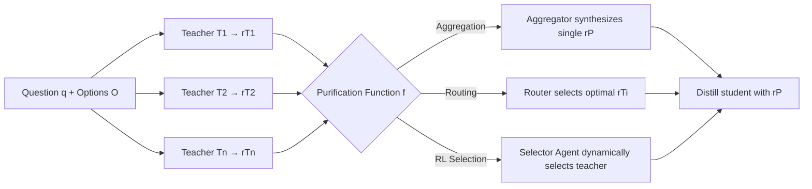

# Exploring Knowledge Purification in Multi-Teacher Knowledge Distillation for LLMs

**Conference**: ICLR 2026  
**OpenReview**: [https://openreview.net/forum?id=7pvJoB4aKO](https://openreview.net/forum?id=7pvJoB4aKO)  
**Code**: To be confirmed  
**Area**: Model Compression / Knowledge Distillation  
**Keywords**: Multi-Teacher Knowledge Distillation, Knowledge Purification, LLM Routing, RL Teacher Selection, Knowledge Conflict  

## TL;DR
Addressing the knowledge conflict problem in multi-teacher distillation where "more teachers lead to worse performance," this paper proposes the concept of "Knowledge Purification"—merging rationales from multiple teacher LLMs into a single unified rationale before distillation. By systematically comparing five purification methods across three categories (aggregation, routing, and RL selection), the authors find that routing-based methods are the most stable across both in-domain and out-of-domain scenarios.

## Background & Motivation
**Background**: Knowledge distillation is a primary method for transferring capabilities from powerful LLMs to smaller models. Multi-teacher distillation (e.g., TinyLLM, TwT) is widely believed to further enhance the generalization and expertise of student models by aggregating rationales from multiple teachers to increase knowledge diversity.

**Limitations of Prior Work**: The authors conducted a counter-intuitive experiment using TinyLLM—gradually increasing the number of teachers from 1 to 4 (FLAN-T5 xlarge → +Llama 2-chat → +BioMistral-7B → +Llama-3.1-8B-Instruct). The results showed that student accuracy decreased as more teachers were added. This reveals two core flaws: **(1) Knowledge Conflict**—teachers provide contradictory rationales due to hallucinations, inconsistent reasoning paths, or different domain expertise, with conflicts worsening as the number of teachers increases; **(2) High Resource Overhead**—fusing multiple teachers requires complex sampling and tedious training procedures, significantly raising computational and tuning costs.

**Key Challenge**: Multi-teacher approaches should ideally "draw on the strengths of many," but simply feeding all rationales to the student introduces noise and contradiction. The benefits of knowledge diversity are offset by the costs of conflict.

**Goal**: Design a new framework that preserves the breadth of multi-teacher knowledge while resolving conflicts and reducing overhead.

**Core Idea**: **Knowledge Purification**—instead of having the student learn $n$ rationales simultaneously, the set $R=\{r_{T_1},\dots,r_{T_n}\}$ is first purified into a single unified rationale $r_P=f(R)$, which is then used for distillation. This resolves teacher contradictions and compresses multiple distillation losses into one, significantly improving efficiency.

## Method

### Overall Architecture
Knowledge purification reformulates the multi-teacher distillation objective from "calculating and weighting a distillation loss for each teacher rationale" ($L_{\text{MTKD}}=L_{PR}+\sum_j \lambda_j L_{DL_j}$) to "calculating a distillation loss for only one purified rationale": $L_{\text{MTKD-KP}}=L_{PR}+\lambda L_{DL\text{-}KP}$, where $L_{DL\text{-}KP}=-\frac{1}{|D|}\sum \sum_i \log p(r_{P_i}\mid r_{<i},q,O,p_r)$. The key problem lies in the implementation of the purification function $f(\cdot)$. The authors propose five methods from three perspectives: aggregation, routing, and RL selection.

### Key Designs
**1. Knowledge Aggregation: Synthesizing a unified rationale using a strong LLM as a "judge"**. The most direct approach is to use a global strong model (GPT-4 in the implementation) that takes all teacher rationales as input. Following an instruction-tuning paradigm with in-context examples, it generates a fused $r_P$. The advantage is that it requires no extra training and is transferable; however, the cost includes a high parameter count (>10B) and dependency on external models. Experiments show its gains are unstable—despite the strong aggregator, it remains uncertain whether the synthesized rationale truly helps the student.

**2. LLM Routing: Selecting instead of synthesizing, reducing purification to a routing problem**. Unlike aggregation, which "creates something new," routing picks the most suitable rationale from the $n$ original ones: $r_P=\arg\max_{r_{T_i}} P_\theta(r_{T_i}\mid q)$. A key benefit is that the router only needs the question $q$ as input without pre-sampling all teacher rationales; thus, a trained router can guide sampling (the basis for saving overhead in out-of-domain distillation). Three implementations are provided: **(a) Plackett-Luce (PL) Ranking**—ranking teachers using a softmax form $P_\theta(r_{T_i}\mid q)=\frac{e^{\xi_i}}{\sum_j e^{\xi_j}}$ and weighting the learning coefficient $\xi$ using question similarity $\omega'=\gamma^{1+\frac{\epsilon\cdot\epsilon'}{\|\epsilon\|\|\epsilon'\|}}$ borrowed from RouterLLM; **(b) PLM Classifier**—using a pretrained language model (mDeBERTaV3-base) to encode the question into a CLS semantic vector $h_{CLS}$, followed by a two-layer MLP to predict routing probabilities, treating purification as a standard text classification; **(c) Similarity-based Router**—following RouterDC, learning a trainable embedding $k_i$ for each teacher and using the cosine similarity between question encoding and $k_i$ for soft routing $P_\theta(r_{T_i}\mid q)=\frac{e^{\text{sim}\langle E(q),k_i\rangle}}{\sum_j e^{\text{sim}\langle E(q),k_j\rangle}}$. This is trained with a dual contrastive loss and is the most robust of the three.

**3. RL-based Teacher Selection: Modeling teacher selection as policy learning with distillation feedback as reward**. While the first two categories rely on synthesis or static scoring, this design uses a Reinforcement Learning agent for dynamic decision-making. The state $s_i=[E(q),\,E(r_{T_i})\cdot\mathbb{I}(T_i(q,O,p_o)=o^*)]$ encodes both question semantics and the signal of whether the teacher answered correctly. The policy $\pi_\theta(s_i,a_i)=a_i\sigma(W_is_i+b_i)+(1-a_i)(1-\sigma(W_is_i+b_i))$ uses sigmoid scoring to decide whether to select teacher $T_i$, and the rationale from the highest-scoring teacher is used. Parameters $\theta$ are optimized via policy gradient, with the reward $r=-L_{PR}-L_{DL}$ tied to student performance. Distillation and RL training alternate. Its advantage is the tight coupling between selection and distillation goals, leading to the best in-domain performance, but at the cost of being dataset-specific, less transferable, and having minute-level latency per instance.

## Key Experimental Results
Setup: 4 teachers (FLAN-T5 xlarge 2.85B, Llama 2-chat 7B, BioMistral-7B, Llama-3.1-8B-Instruct); students are FLAN-T5 small/base/large (77M/248M/783M); datasets include commonsense reasoning (OBQA, ARC, Riddle) and biomedicine (PQA).

### Main Results (Average Accuracy, %)

| Method | 77M | 248M | 783M |
|---|---|---|---|
| Fine-tuning | 43.52 | 53.12 | 63.18 |
| Distilling-Step-by-Step | 41.47 | 54.23 | 62.76 |
| TinyLLM | 42.38 | 52.76 | 62.53 |
| Knowledge Aggregation | 42.01 | 53.42 | 63.32 |
| Plackett-Luce Ranking | 42.49 | 55.51 | 64.50 |
| PLM Classifier | 44.45 | 56.04 | 66.40 |
| Similarity-based Router | **45.66** | 56.56 | 67.20 |
| Teacher Selection | 44.63 | **56.68** | **67.55** |

The similarity-based router is optimal for 77M (outperforming the best baseline by $\ge$ 4.9%). RL teacher selection is optimal for 248M/783M (outperforming the best baseline by 4.5% and 6.9%, respectively). The 783M student's average accuracy exceeds that of three teachers, second only to Llama-3.1-8B-Instruct.

### Ablation Study (Conflict Mitigation Value CMV, higher is better)

| Method | CMV 77M | CMV 248M | CMV 783M |
|---|---|---|---|
| Knowledge Aggregation | −0.003 | −0.007 | −0.004 |
| Plackett-Luce Ranking | +0.001 | +0.012 | +0.010 |
| PLM Classifier | +0.018 | +0.014 | +0.021 |
| Similarity-based Router | **+0.025** | **+0.020** | **+0.032** |
| Teacher Selection | +0.020 | +0.019 | +0.029 |

CMV measures the average improvement over TinyLLM as the number of teachers increases. Aggregation shows negative CMV across all students, indicating it fails to mitigate conflict. All routing and RL selection methods show positive CMV, with the similarity-based router scoring highest.

### Key Findings
- **Aggregation fails, selection/routing succeeds**: Even with GPT-4 as an aggregator, synthesized rationales provide almost no gain and yield negative CMV. "Picking from existing rationales" is more reliable than "creating a new one."
- **Larger students benefit more**: Purification yields much larger gains on 783M than on 77M, as larger models have a stronger capacity to learn from rationales, while smaller models tend to fit only the final labels.
- **Routers generalize well**: On out-of-domain datasets (PIQA, BioASQ), routing methods consistently outperform TinyLLM. For example, the similarity router achieves 69.53 on PIQA and 91.87 on BioASQ (783M), as it only requires question input to guide out-of-domain sampling. RL selection was excluded from OOD experiments due to poor transferability.
- **Practical Trade-offs**: The PLM classifier and similarity-based router require only ~278M extra parameters, have millisecond latency, and are transferable. Aggregation requires >10B parameters, and RL selection has minute-level latency and is not transferable.

## Highlights & Insights
- Leverages a clean, counter-intuitive experiment (Figure 1: more teachers lead to worse performance) to bring the implicit issue of "knowledge conflict" to the forefront with solid motivation.
- "Knowledge Purification" is a concise and generalizable abstraction: it compresses multiple distillation losses into one while unifying aggregation, routing, and RL into a single $f(R)$ framework.
- Beyond performance, it systematically compares methods across five practical dimensions (priors, parameter count, training requirement, transferability, latency) and introduces CMV to quantify the ability to "mitigate conflict."
- Practical conclusions: Routers only need the question to function, allowing them to guide sampling and save the cost of full sampling from multiple teachers, while providing the best out-of-domain generalization.

## Limitations & Future Work
- Tasks are limited to Multiple Choice QA (MCQA); whether rationale purification holds for open-ended generation or long-chain reasoning is unverified.
- Student and teacher models are relatively small (students $\le$ 783M, teachers $\le$ 8B); scalability to larger students or more powerful teachers has not been tested.
- "Purification" is currently an empirical comparison of five methods; a theoretical characterization of why "selection outperforms aggregation" is lacking.
- RL teacher selection requires retraining per dataset and has high latency; aggregation depends on external GPT-4 APIs.
- Purifying into a single rationale might lose truly complementary diversity among teachers; when to "select" vs. "fuse" remains an open question.

## Related Work & Insights
- **Multi-Teacher Distillation**: TinyLLM and TwT (Xu et al. 2025, using rejection sampling to balance cost and performance) are direct predecessors; this paper points out their limitations due to inter-teacher conflict.
- **LLM Routing**: Inherits from MoE; HybridLLM, RouterLLM (dynamic routing between strong and weak models), RouterDC (dual contrastive learning, the basis for this paper's similarity router), and RL routing are all sources for the routing methods used here.
- **Rationale Distillation**: Distilling-Step-by-Step (Hsieh et al. 2023) treats teacher rationales as extra supervision, providing the foundation for single-rationale distillation.
- **Insight**: Reframing "multi-source knowledge fusion" as "routing selection" rather than "forced aggregation" offers lessons for other scenarios with source conflict, such as multi-document RAG, multi-agent debates, and ensemble learning—picking one clean source is often more stable than fusing multiple noisy ones.

## Rating
- Novelty: ⭐⭐⭐⭐ —— The concept of "Knowledge Purification" is clear and unifies three categories of methods; while individual sub-methods draw from existing routers, the problem definition and abstraction are novel.
- Experimental Thoroughness: ⭐⭐⭐⭐ —— 3 students × 4 datasets + OOD + CMV + 5-dimensional utility analysis is very solid; lack of larger scales and restriction to MCQA are minor drawbacks.
- Writing Quality: ⭐⭐⭐⭐ —— The motivational experiments are persuasive, formulas and tables are clear, and method categorization is logical.
- Value: ⭐⭐⭐⭐ —— Reveals the conflict trap in multi-teacher distillation and provides low-cost, transferable routing solutions, offering direct guidance for deploying lightweight models.

<!-- RELATED:START -->

## Related Papers

- [\[ICLR 2026\] In Good GRACES: Principled Teacher Selection for Knowledge Distillation](in_good_graces_principled_teacher_selection_for_knowledge_distillation.md)
- [\[CVPR 2026\] Distilling Balanced Knowledge from a Biased Teacher](../../CVPR2026/model_compression/distilling_balanced_knowledge_from_a_biased_teacher.md)
- [\[ICLR 2026\] SGD-Based Knowledge Distillation with Bayesian Teachers: Theory and Guidelines](sgd-based_knowledge_distillation_with_bayesian_teachers_theory_and_guidelines.md)
- [\[ICCV 2025\] A Good Teacher Adapts Their Knowledge for Distillation](../../ICCV2025/model_compression/a_good_teacher_adapts_their_knowledge_for_distillation.md)
- [\[ICLR 2026\] Pedagogically-Inspired Data Synthesis for Language Model Knowledge Distillation](pedagogically-inspired_data_synthesis_for_language_model_knowledge_distillation.md)

<!-- RELATED:END -->
