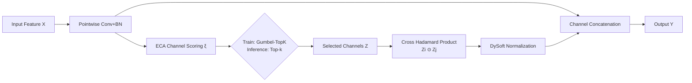

# Expressive yet Efficient Feature Expansion with Adaptive Cross-Hadamard Products

**Conference**: ICLR 2026  
**OpenReview**: [https://openreview.net/forum?id=eQmoST3UMN](https://openreview.net/forum?id=eQmoST3UMN)  
**Code**: [https://github.com/acelych/hadaptivenet](https://github.com/acelych/hadaptivenet)  
**Area**: Efficient Model Design / Lightweight Vision Networks  
**Keywords**: Hadamard product, feature reuse, differentiable discrete sampling, channel expansion, neural architecture search, lightweight networks  

## TL;DR
This paper transforms the "element-wise multiplication (Hadamard product)" into a learnable and efficient feature expansion operator called ACH. By utilizing differentiable discrete sampling to automatically select channels for cross-multiplication and stabilization via dynamic softsign normalization, the method expands channel dimensions with nearly zero convolutional parameters. Integrated into Hadaptive-Net via NAS, it achieves superior accuracy-speed trade-offs on ImageNet/CIFAR-100.

## Background & Motivation
**Background**: Lightweight networks commonly adopt the inverted bottleneck structure—expanding channels to high dimensions for non-linear transformations before compressing them back for residuals. The MobileNet series and ConvNext rely on this paradigm to achieve a balance between accuracy and computational cost on mobile devices.

**Limitations of Prior Work**: The "channel expansion" phase of inverted bottlenecks requires extensive pointwise convolutions to project features into high-dimensional space. GhostNet previously revealed that high-dimensional expansion channels contain significant linear correlations, implying that many new channels are redundant and the convolutions spent on them are wasteful. Methods like GhostNet (using cheap linear transformations) and FasterNet (using partial convolutions) focus on reducing these expansion costs.

**Key Challenge**: Existing feature reuse methods either "generate" or "filter" features, but the **channel combination rules are fixed (either cross-channel or intra-channel) and the operations are pre-defined**, limiting optimization flexibility and lacking interpretability. Furthermore, while cascaded Hadamard products are theoretically proven to induce non-linear representations and implicit high-dimensional mappings (Ma et al. 2024), this theory has rarely been effectively applied in resource-constrained vision models.

**Goal**: Upgrade the Hadamard product from a passive "fixed operator" to a **learnable, dedicated deep learning operator** that performs channel expansion with almost no increase in convolutional parameters while ensuring gradient stability during training.

**Key Insight**: **Replace expensive expansion convolutions with pairwise cross-multiplication of channels**. This involves retaining original features and concatenating them with new features derived from "selected channel pairs via Hadamard product." Each derived feature map requires only $f^2$ FLOPs, making expansion nearly free. The core difficulties lie in making the discrete selection of channels end-to-end learnable and stabilizing the dynamically generated feature distributions—solved via **Gumbel-TopK differentiable sampling** and **DySoft dynamic normalization**, respectively.

## Method

### Overall Architecture
The data flow of the ACH module is as follows: Input features $X$ undergo pointwise convolution + BatchNorm for basic channel information exchange, followed by an ECA module to score each channel. During training, Gumbel-TopK is used to differentiably sample $C_{(s)}$ active channels; during inference, the top-k scores are taken directly. Selected channels $Z$ undergo pairwise cross-Hadamard products, are normalized via DySoft dynamic softsign, and are concatenated with the original features for output. The entire module is optimally integrated into Hadaptive-Net's high-dimensional posterior layers via gradient-based NAS.

### Key Designs

**1. Hadamard Channel Expansion: Replacing "expansion convolution" with "pairwise multiplication," targeting the redundant nature of high-dimensional features.** The authors observe that the Hadamard product naturally fits the network evolution trend of "channel up-dimensioning and spatial down-sampling." They perform pairwise combinations and multiplications of input channels while preserving the original maps: $Y = X \oplus \{X_i \odot X_j \mid (i,j)\in\{1,\dots,C\}, i\neq j\}$, where the output dimension grows from $C$ to $\frac{C(C+1)}{2}$. This offers an interpretability perspective where the concatenated feature vector is viewed as a high-dimensional vector with the original feature space as its basis. Compared to expansion convolution $O(mn\cdot f^2)$, ACH confines pointwise convolution to low dimensions $O(m^2\cdot f^2)$ and leaves expansion to the Hadamard product $O((n-m)\cdot f^2)$, reducing complexity to approximately $\frac{1}{m}$ of inverted bottlenecks.

**2. Differentiable Discrete Sampling: Utilizing Gumbel-TopK + STE to make "channel selection" trainable.** Pairwise combinations explode quadratically with the number of channels, necessitating the selection of a subset $C_{(s)}$. Since selection is inherently discrete, the authors use ECA to generate channel scores $\xi = \text{ECA}(X)$, then inject Gumbel noise to obtain a probability distribution via tempered softmax: $M_c = \frac{\exp((\xi_c+o_c)/\tau)}{\sum_{c'}\exp((\xi_{c'}+o_{c'})/\tau)}$, where $o_i = -\log(-\log(u)),\, u\sim \text{Unif}[0,1]$. The forward pass uses a Straight-Through Estimator (STE) for discrete top-k selection $M^H$, while the backward pass allows gradients to flow through $\text{softmax}(\xi/\tau)$. Gumbel perturbations allow unscreened channels to receive periodic gradient feedback. Crucially, the temperature $\tau$ is **adaptive based on historical gradient norms** rather than a global scheduler: $\tau \leftarrow \text{CLAMP}(\tau\cdot(1+\alpha\cdot\text{sign}(\|grad\|_2 - \tau_{hist})), 0.01, 4.0)$, encouraging exploration when gradients are large and accelerating convergence when small.

**3. DySoft Dynamic Normalization: Replacing statistical normalization with bounded softsign to prevent gradient explosion.** Cross-Hadamard products produce input-adaptive channel combinations with unstable distributions, making statistics-dependent normalization like BatchNorm ineffective and prone to gradient explosion. Inspired by activation-based normalization in Transformers, the authors propose $y = \frac{\alpha x}{1+|\alpha x|}\cdot w + b$, where $\alpha, w, b$ are learnable affine factors. The inherent boundedness of softsign clamps the output while remaining hardware-friendly. Experiments show softsign (73.57%) outperforms sigmoid (73.14%) and algebraic sigmoid (72.80%).

**4. Hadaptive-Net + NAS: Using differentiable architecture search to decide ACH placement rather than manual heuristics.** Preliminary analysis found that ACH **depends on depth and performs best in posterior high-dimensional layers** (e.g., replacing IB9,10 in MobileNetV3-S improved accuracy from 70.01 to 71.58). A search space containing ACH and GhostNet-style modules was constructed for gradient-based NAS. Selection confidence (Table 3) confirmed that ACH is preferred in high-dimensional layers (e.g., 128-dim), while Ghost blocks are preferred in low-dimensional anterior layers. To ensure actual speed, the authors designed Direct-Indexing and Parity-Balanced CUDA scheduling strategies to handle the irregular computation of $C_n^2$ combinations, reducing Hadaptive-Net-L latency from 12.40ms to 7.13ms.

## Key Experimental Results

### Main Results (Comparison of Efficient Models, CIFAR-100 / ImageNet-1k)

| Model | Params(M) | FLOPs(M) | GPU Latency(ms) | CIFAR-100(%) | ImageNet-1k(%) |
|-------|-----------|----------|-----------------|--------------|----------------|
| MobileNetV3-S | 1.62 | 56 | 4.98 | 70.01 | 67.42 |
| **Hadaptive-Net-S** | 2.10 | 131 | 3.41 | **73.57** | **73.96** |
| MobileNetV4-S | 2.62 | 185 | 4.46 | 73.15 | 73.80 |
| StarNet-S1 | 2.68 | 422 | 6.00 | 71.84 | 73.50 |
| **Hadaptive-Net-M** | 3.09 | 339 | 5.26 | **74.10** | **78.07** |
| GhostNetV3-1.0 | 8.13 | 404 | 13.91 | 73.20 | 73.92 |
| **Hadaptive-Net-L** | 6.11 | 669 | 7.13 | **74.73** | **80.79** |

Hadaptive-Net achieves higher accuracy with lower computational cost/latency in the small-to-medium parameter groups. Only the significantly larger MobileNetV4-L (31.44M) achieves higher accuracy.

### Ablation Study (Component-level Ablation of ACH)

| P.W.Conv | ECA | Learnable | DySoft | Top-1(%) |
|:---:|:---:|:---:|:---:|:---:|
| ✗ | ✓ | ✓ | ✓ | 69.27 |
| ✓ | ✗ | ✓ | ✓ | 69.12 |
| ✓ | ✓ | ✗ (Fixed) | ✓ | 71.96 |
| ✓ | ✓ | ✓ | ✗ (w/ BN) | 64.39 |
| ✓ | ✓ | ✓ | ✓ | **73.57** |

Removing learnable selection drops accuracy to 71.96, while replacing DySoft with BatchNorm leads to a crash to 64.39—confirming that differentiable sampling and dynamic normalization are the two pillars of the module.

### Key Findings
- **Plug-and-play**: Replacing the last two layers of four SOTA networks with ACH improved MobileNetV3-S (70.01→71.58), ShuffleNetV2 (65.89→71.68), and StarNet-S1 (71.84→72.07) while reducing FLOPs.
- **Transferability to Detection**: As an SSD backbone, Hadaptive-Net-L achieved 23.2 mAP@0.5:0.95 / 73.4 mIOU on COCO, outperforming MobileNetV3-S and GhostNetV3-1.0.
- **Operator Optimization**: Native CUDA implementation timed at 12.40ms, while Direct-Indexing (7.21ms) and Parity-Balanced (7.13ms) strategies proved essential—low FLOPs do not equate to low latency without specialized scheduling.

## Highlights & Insights
- **Hadamard Product as a First-class Operator**: Traditionally used for gating or pooling, the Hadamard product is here empowered with learnable channel selection and stable normalization, becoming a primary operator for feature expansion.
- **Handling Discrete Selection**: The combination of Gumbel-TopK, STE, and adaptive temperature based on gradient norm transforms "channel selection" from a heuristic into a training process.
- **Bridging Theory and Hardware**: The authors did not stop at theoretical FLOPs but addressed GPU scheduling for triangular combinations, nearly halving latency with custom CUDA kernels.
- **NAS as Methodology**: NAS was used to objectively validate the hypothesis that "ACH is suited for posterior layers," turning engineering experience into reproducible design principles.

## Limitations & Future Work
- **Failure on MobileNetV4**: Plug-and-play replacement on MobileNetV4-S resulted in an accuracy drop (73.15→72.19), suggesting ACH may not be fully compatible with certain highly optimized universal inverted bottlenecks.
- **Task Scope**: Experiments are concentrated on ImageNet/CIFAR classification; performance on large-scale detection or segmentation remains to be fully verified.
- **Hardware Dependency**: The theoretical efficiency requires custom CUDA operators. Portability to NPU or other backends remains an open problem.
- **Qualitative Interpretability**: While the basis expansion view is elegant, quantitative analysis of specific semantic features captured by channel combinations is still lacking.

## Related Work & Insights
- **Hadamard Product Taxonomy**: Chrysos et al. (2025) categorize Hadamard uses into high-order interaction, multimodal fusion, adaptive modulation, and efficient operators. This work falls into the fourth category but introduces learnable expansion.
- **Feature Reuse Lineage**: Following GhostNet (linear transformation) and FasterNet (partial convolution), ACH provides an orthogonal approach by using multiplication rather than generation or filtering.
- **Differentiable Sampling**: The transition from Gumbel-Softmax to "channel pair selection" with adaptive temperature provides a reference for learning other discrete structures like sparse routing or pruning.

## Rating
- **Novelty**: ⭐⭐⭐⭐ Elevates the Hadamard product into a learnable expansion operator with differentiable sampling.
- **Experimental Thoroughness**: ⭐⭐⭐ Covers classification, detection, and CUDA acceleration, but the task variety is relatively narrow.
- **Writing Quality**: ⭐⭐⭐⭐ Clear progression from mathematical foundations to deployment; excellent complexity analysis.
- **Value**: ⭐⭐⭐⭐ Provides a practical path for near-zero parameter channel expansion, applicable to edge deployment.

<!-- RELATED:START -->

## Related Papers

- [\[ICLR 2026\] ABBA-Adapters: Efficient and Expressive Fine-Tuning of Foundation Models](abba-adapters_efficient_and_expressive_fine-tuning_of_foundation_models.md)
- [\[AAAI 2026\] Distilling Cross-Modal Knowledge via Feature Disentanglement](../../AAAI2026/model_compression/distilling_cross-modal_knowledge_via_feature_disentanglement.md)
- [\[ICLR 2026\] QWHA: Quantization-Aware Walsh-Hadamard Adaptation for Parameter-Efficient Fine-Tuning on Large Language Models](qwha_quantization-aware_walsh-hadamard_adaptation_for_parameter-efficient_fine-t.md)
- [\[ICLR 2026\] InfoScan: Information-Efficient Visual Scanning via Resource-Adaptive Walks](infoscan_information-efficient_visual_scanning_via_resource-adaptive_walks.md)
- [\[ICLR 2026\] Stable-LoRA: Stabilizing Feature Learning of Low-Rank Adaptation](stable-lora_stabilizing_feature_learning_of_low-rank_adaptation.md)

<!-- RELATED:END -->
