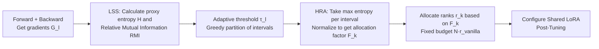

# E²LoRA: Efficient and Effective Low-Rank Adaptation with Entropy-Guided Adaptive Sharing

**Conference**: ICLR 2026  
**OpenReview**: [https://openreview.net/forum?id=IQttyo0460](https://openreview.net/forum?id=IQttyo0460)  
**Code**: To be confirmed  
**Area**: Parameter-Efficient Fine-Tuning / LoRA Parameter Sharing  
**Keywords**: LoRA, PEFT, Parameter Sharing, Rank Allocation, Proxy Entropy, Mutual Information  

## TL;DR
The authors utilize gradient-based "proxy entropy" to detect inter-layer similarity and layer-wise information heterogeneity in pre-trained models. Based on this, they **adaptively partition adjacent similar layers into the same sharing interval and allocate LoRA ranks to each interval according to its information content**. This approach halves trainable parameters while matching or exceeding the performance of LoRA and ShareLoRA.

## Background & Motivation
- **Background**: LoRA has become a cornerstone of PEFT. Subsequent variants fall into two categories: those pursuing performance (AdaLoRA for dynamic ranking, DoRA for weight decomposition, LoRA+ for asymmetrical learning rates) but not saving parameters, and those pursuing efficiency (LoRA-FA by freezing A, VeRA by sharing frozen matrices and only learning vectors, ShareLoRA by cross-layer A-sharing) by freezing or sharing parameters.
- **Limitations of Prior Work**: Most existing sharing methods adopt a "one-size-fits-all" approach—sharing the same LoRA parameters indiscriminately across all layers or using fixed block sharing. This sacrifices representation diversity and weakens feature discriminability, often leading to significant performance degradation.
- **Key Challenge**: The goal is to **significantly improve the parameter efficiency of LoRA while maintaining or even surpassing original performance**. Heuristic sharing ranges (all-layer sharing, fixed blocks) and uniform rank allocation ignore the structural heterogeneity within the model.
- **Goal**: Find a principled answer to "who to share with" and "how much capacity to allocate within shared intervals," making sharing both parameter-efficient and performance-preserving.
- **Key Insight (Dual Adaptive Sharing)**: The authors use gradient-based proxy entropy analysis of pre-trained models to reveal two overlooked properties: **Local Similarity** (high similarity of gradient information in adjacent layers, with the size/position of high-similarity blocks varying by model and task) and **Layer-wise Information Heterogeneity** (significant differences in absolute information volume across layers). Based on this, they propose **E²LoRA**: adaptively partitioning sharing intervals based on inter-layer similarity (addressing the former) and adaptively allocating ranks based on layer-wise absolute proxy entropy (addressing the latter).

## Method

### Overall Architecture
E²LoRA is a plug-and-play "dual adaptive" framework that first performs a forward+backward pass to obtain gradients for each layer, then configures LoRA in two steps: **(1) Local Similarity-based Sharing (LSS)** uses gradient mutual information to partition adjacent similar layers into non-overlapping sharing intervals, where each interval shares a set of LoRA parameters; **(2) Heterogeneity-based Rank Allocation (HRA)** uses the proxy entropy of each layer to measure information volume, allocating higher ranks to intervals with more information. Finally, post-tuning is performed with this adaptively configured LoRA. The entire configuration is calculated once before training and does not introduce dynamic deformation during training.

### Key Designs

**1. Proxy Entropy: A low-cost measure of layer information using gradient standard deviation.** The foundation is an "information volume" scalar. For the gradient tensor $G_l$ of layer $l$ obtained on a small batch of training data, the authors flatten it and define the proxy entropy using its element-wise standard deviation $\sigma_{G_l}$: $H(G_l)=\log(\sigma_{G_l})+\frac{1}{2}\log(2\pi)+\frac{1}{2}$ (an approximation of Gaussian entropy). The intuition is that gradient dispersion reflects the amount of information carried/updated by that layer for the downstream task. The appendix provides theoretical grounding by linking it to the Frobenius norm and Fisher information. This metric requires only one backward pass, incurring almost zero extra overhead, and serves as raw material for both grouping and rank allocation.

**2. LSS—Partitioning adjacent similar layers into sharing intervals using RMI.** To decide "who shares with whom," an inter-layer similarity metric is needed. The authors define the mutual information between two layer gradients as $I(G_i;G_j)=H(G_i)+H(G_j)-H(G_i,G_j)$ (where the joint entropy is approximated by concatenating the two layer gradients), and then normalize it by the smaller entropy to obtain the **Relative Mutual Information**: $\mathrm{RMI}(G_i;G_j)=\frac{I(G_i;G_j)}{\min(H(G_i),H(G_j))}\in[0,1]$. A **greedy sequential** strategy with adaptive thresholds is used for partitioning: the threshold for each layer $m$ is the mean of its RMI with all other layers $\tau_m=\frac{1}{N-1}\sum_{k\neq m}\mathrm{RMI}(G_m,G_k)$. A new interval starts from the current layer and merges subsequent layers if their RMI with the starting layer meets the threshold. This respects "local similarity" while making interval lengths adaptive to the model/task.

**3. HRA—Allocating finite rank budget based on interval information volume.** Once intervals are defined, the "expressive capacity (rank) of each interval" must be determined. To prevent high-information layers from being hindered by low-information layers in the same interval, the representative entropy of interval $k$ is taken as the **maximum** proxy entropy within the interval: $H_{\text{interval}_k}=\max_{l\in[s_k,e_k]}H(G_l)$. Normalization yields an allocation factor $F_k=\frac{H_{\text{interval}_k}}{\sum_i H_{\text{interval}_i}}$. For a fair comparison, the total rank budget is fixed at $N\times r_{\text{vanilla}}$ and redistributed: $r_k=\mathrm{round}(F_k\times(N\times r_{\text{vanilla}}))$. Consequently, information-rich intervals receive higher ranks for expressivity, while secondary intervals use lower ranks to save parameters.

**4. Orthogonal Integration into Existing LoRA Variants.** E²LoRA is a configuration layer rather than a new structure, allowing it to be applied to both non-sharing and sharing methods. In non-sharing setups (e.g., vanilla LoRA), per-layer adapters are replaced with interval-level shared adapters with entropy-based ranks. In sharing setups (e.g., ShareLoRA), the global sharing component is initialized to the maximum rank, and **dimensional slicing** is used during computation according to the dynamic rank of each layer. The paper validates plug-and-play gains for DoRA, VeRA, and LoRI as "E²X".

## Key Experimental Results

### Main Results

RoBERTa-Base / GLUE (Average of 5 subtasks):

| Method | #Params | Average |
|------|---------|---------|
| FFT | 125.00M | 86.14 |
| LoRA | 0.30M | 85.87 |
| **E²LoRA** | 0.16M | 85.57 |
| ShareLoRA | 0.16M | 84.99 |
| **E²ShareLoRA** | **0.08M** | **85.40** |

Llama-3.1-8B-Base / NLG:

| Method | GSM8K #Params | Acc | HumanEval #Params | Pass@1 |
|------|---------------|-----|-------------------|--------|
| LoRA | 6.82M | 70.21 | 6.82M | 42.68 |
| **E²LoRA** | 3.61M | 70.51 | 3.66M | 44.31 |
| ShareLoRA | 2.75M | 70.51 | 2.75M | 43.69 |
| **E²ShareLoRA** | **1.59M** | 70.26 | **1.59M** | **44.71** |

CLIP-ViT-B/16 / 7 Image Classification Datasets (Average):

| Method | #Params | Average |
|------|---------|---------|
| LoRA | 1.31M | 89.08 |
| **E²LoRA** | 0.66M | **89.81** |
| ShareLoRA | 0.72M | 88.75 |
| **E²ShareLoRA** | **0.39M** | 89.73 |

### Ablation Study

Component Ablation (Llama3.1-8B / GSM8K):

| LSS | HRA | #Params | Acc |
|-----|-----|---------|-----|
| ✓ | × | 3.51M | 69.45 |
| × | ✓ | 6.82M | 71.19 |
| cosine | ✓ | 3.75M | 66.67 |
| KL | ✓ | 3.43M | 67.57 |
| **✓（RMI）** | **✓** | 3.61M | **70.51** |

Comparison with LoRA under same parameter budget (Llama3.1-8B / GSM8K):

| Method | Rank | #Params | Acc |
|------|------|---------|-----|
| LoRA | 4 | 3.41M | 67.58 |
| **E²LoRA** | 8 | 3.61M | **70.51** |
| LoRA | 8 | 6.82M | 70.21 |
| **E²LoRA** | 16 | 7.22M | **71.19** |

### Key Findings
- **Performance parity/superiority with half the parameters**: Across NLU, NLG, and CV tasks, E²LoRA matches or exceeds LoRA using approximately half the trainable parameters. E²ShareLoRA further compresses ShareLoRA parameters to about 60% or half while actually improving performance (HumanEval 43.69→44.71).
- **LSS saves parameters, HRA improves performance**: LSS alone reduces parameters from 6.82M to 3.51M but with an Acc of only 69.45; HRA alone raises Acc to 71.19. Combining both yields 70.51 at 3.61M parameters, demonstrating complementarity.
- **RMI outperforms other similarity metrics**: Replacing RMI with cosine, L1, L2, or KL similarity results in significant performance drops, verifying that proxy entropy-based mutual information is better suited for sharing decisions.
- **Stronger under identical parameter budgets**: Given a fixed parameter budget, E²LoRA-rank8 outperforms LoRA-rank4 (+0.3), and E²LoRA-rank16 outperforms LoRA-rank8 (+0.98), indicating gains come from better capacity allocation rather than parameter count.

## Highlights & Insights
- **Information-theoretic perspective on LoRA sharing**: Unlike previous work relying on manually specified topologies, this paper is the first to directly derive sharing intervals from gradient-based proxy entropy and similarity statistics of downstream tasks, eliminating heuristics and hyperparameter tuning.
- **One metric for two tasks**: The same proxy entropy supports both "grouping" (via RMI) and "rank allocation" (via max+normalization), making the method elegant and self-consistent.
- **One-time pre-training configuration & distributed friendly**: Intervals and ranks are determined before training, avoiding dynamic shape changes during training, which benefits distributed strategies like ZeRO.
- **Orthogonality**: As a configuration layer, it can be applied to LoRA, ShareLoRA, DoRA, VeRA, and LoRI, offering low migration costs and high reuse value.

## Limitations & Future Work
- **Requirement of one backprop**: Proxy entropy depends on gradients from a small data batch; though the overhead is small, it introduces a pre-computation step and may be sensitive to the representativeness of the batch.
- **Suboptimality of greedy partitioning**: Interval partitioning uses a greedy approach with a mean threshold. While it approximates global optimality, its robustness in complex inter-layer structures and the optimality of the mean threshold are subject to further discussion.
- **Gaussian approximation limits**: Proxy entropy approximates gradients as Gaussian and only uses standard deviation, which may not capture heavy-tailed or highly structured gradient distributions.
- **Task/Scale extrapolation**: Experiments mostly focus on 8B models and medium-scale tasks; sharing interval stability in larger models or multi-task/continual learning settings requires further verification.

## Related Work & Insights
- **Sharing-based LoRA**: ShareLoRA, VeRA, Rasa, RandLoRA, HydraLoRA, and BSLoRA all use manually specified sharing topologies; E²LoRA uses gradient entropy statistics to automatically derive the sharing structure, representing a "de-heuristic" approach.
- **Rank Allocation LoRA**: AdaLoRA (pruning after over-parameterization), IncreLoRA (growth from rank-1), and GoRA / LoRA-GA / RaLoRA (rank assignment via gradient information) all adjust ranks within layers. E²LoRA differentiates itself by combining cross-layer sharing with entropy-guided rank allocation.
- **Entropy in Deep Learning**: Previous works use inter-layer entropy to guide pruning or entropy similarity for distillation and model comparison. This paper is the first to introduce these entropy metrics into the sharing and rank allocation of LoRA, serving as a model for cross-domain transfer.

## Rating
- **Novelty**: ⭐⭐⭐⭐ First use of gradient-based proxy entropy and RMI to simultaneously drive LoRA sharing partitioning and rank allocation.
- **Experimental Thoroughness**: ⭐⭐⭐⭐ Covers NLU/NLG/CV across multiple models with extensive ablations; however, testing on 70B+ models or multi-task scenarios remains a future direction.
- **Writing Quality**: ⭐⭐⭐⭐ Logic from motivation to insight to method is clear; visualizations are intuitive.
- **Value**: ⭐⭐⭐⭐ Plug-and-play, parameter efficiency without degradation, and distributed-friendly, offering practical value for PEFT deployment.

<!-- RELATED:START -->

## Related Papers

- [\[ICLR 2026\] FlexLoRA: Entropy-Guided Flexible Low-Rank Adaptation](flexlora_entropy-guided_flexible_low-rank_adaptation.md)
- [\[ICLR 2026\] Stable-LoRA: Stabilizing Feature Learning of Low-Rank Adaptation](stable-lora_stabilizing_feature_learning_of_low-rank_adaptation.md)
- [\[ICLR 2026\] IGU-LoRA: Adaptive Rank Allocation via Integrated Gradients and Uncertainty-Aware Scoring](igu-lora_adaptive_rank_allocation_via_integrated_gradients_and_uncertainty-aware.md)
- [\[ICLR 2026\] LoFT: Low-Rank Adaptation That Behaves Like Full Fine-Tuning](loft_low-rank_adaptation_that_behaves_like_full_fine-tuning.md)
- [\[ICLR 2026\] Gradient Intrinsic Dimensionality Alignment：Narrowing The Gap Between Low-Rank Adaptation and Full Fine-Tuning](gradient_intrinsic_dimensionalityalignmentnarrowing_the_gap_between_low-rank_ad.md)

<!-- RELATED:END -->
