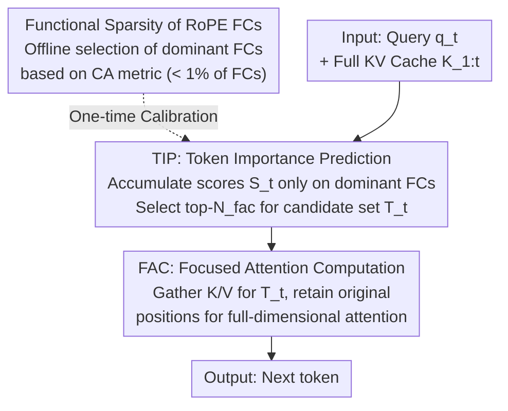

# FASA: Frequency-Aware Sparse Attention

**Conference**: ICLR 2026  
**arXiv**: [2602.03152](https://arxiv.org/abs/2602.03152)  
**Code**: [GitHub](https://github.com/AMAP-ML/FASA-ICLR2026)  
**Area**: Signal Communication  
**Keywords**: KV cache compression, sparse attention, RoPE frequency analysis, token pruning, long-context inference

## TL;DR
This paper discovers functional sparsity at the Frequency Chunk (FC) level in RoPE—where a small number of "dominant FCs" can effectively predict token importance. Based on this, it proposes the FASA framework, which achieves training-free KV cache compression through a two-stage process: predicting token importance via dominant FCs and focusing attention computation. On LongBench, it achieves nearly 100% full-KV performance while retaining only 256 tokens; on AIME24, it achieves a 2.56× speedup using only 18.9% of the cache.

## Background & Motivation

1. **Background**: LLM long-context processing faces memory bottlenecks due to the linear growth of the KV cache. Mainstream compression directions include token pruning (StreamingLLM, SnapKV), low-rank compression, quantization, KV merging, and budget allocation.
2. **Limitations of Prior Work**: (1) Static strategies (StreamingLLM) permanently retain head and tail tokens, leading to irreversible information loss; (2) Adaptive strategies (SnapKV, H2O) use heuristic rankings that fail to fully capture the query-dependency of token importance; (3) Learning strategies require training token predictors, which exhibit poor generalization across different datasets.
3. **Key Challenge**: Token importance is inherently query-dependent, but existing methods either use query-independent static rules or evaluate importance in a manner as expensive as computing full attention. Is there a cheaper way to achieve query-aware importance prediction?
4. **Goal**: How to achieve query-aware token importance prediction with minimal computational cost without requiring training?
5. **Key Insight**: RoPE decomposes attention computation into independent contributions from $d/2$ 2D Frequency Chunks (FCs). Different FCs exhibit distinct functions due to varying rotation frequencies: high-frequency FCs handle positional patterns, while low-frequency FCs carry semantic information. Only a few "dominant FCs" are needed to approximately reconstruct the attention patterns of the full head.
6. **Core Idea**: Leverage the inherent FC-level functional sparsity of RoPE to predict token importance using low-overhead calculations from a few dominant FCs instead of full-dimensional attention.

## Method

### Overall Architecture
FASA decomposes attention into a "coarse screening then fine computation" two-step process: first, it uses a set of offline-calibrated dominant frequency chunks (FCs) to calculate token importance scores (Token Importance Prediction, TIP) at a minimal cost; then, it executes full-dimensional attention only on the selected subset of critical tokens (Focused Attention Computation, FAC). The identification of dominant FCs is a one-time offline calibration, incurring no additional training costs during inference—this is the key to how FASA achieves training-free, query-aware prediction.

### Key Designs

**1. Functional Sparsity of RoPE Frequency Chunks: Proving a few FCs are enough**

The method is grounded in the observation that RoPE splits $d$-dimensional vectors into $d/2$ pairs of 2D frequency chunks. The rotation frequency of the $i$-th FC, $\theta_i = B^{-2(i-1)/d}$, varies, leading to functional differentiation: high-frequency FCs encode positional patterns (recency bias), while low-frequency FCs carry semantic information. To quantify "how well a single FC represents the selection behavior of the entire head," the paper defines the Contextual Agreement (CA) metric $\text{CA}_\mathcal{K}^{l,h,i} = |\text{TopK-I}(\alpha_{l,h}, \mathcal{K}) \cap \text{TopK-I}(\alpha_{l,h}^{(i)}, \mathcal{K})| / \mathcal{K}$, representing the overlap ratio between the single FC's top-$\mathcal{K}$ tokens and those of the full head.

Empirical results yield three strong conclusions: dominant FCs are extremely sparse (less than 1% of FCs contribute >90% of CA), universal across tasks (over 70% overlap in dominant FCs across calibration datasets), and consistent across models. This implies FC-level sparsity is an inherent structural property of RoPE rather than task-specific. Since high-frequency FCs primarily manage position, they can be safely ignored, justifying the use of very few FCs for prediction.

**2. TIP: Token Importance Prediction using dominant FCs**

In the offline phase, $N_{tip}$ FCs that maximize the sum of expected CA are selected as the dominant set $\mathcal{I}_{dom}^{l,h} = \text{TopK-I}(\{\overline{\text{CA}}_\mathcal{K}^{l,h,i}\}, N_{tip})$. Online, full-dimensional attention is no longer computed. Instead, scores are accumulated only over these dominant FCs: $S_t^{l,h} = \sum_{i \in \mathcal{I}_{dom}} \alpha^{l,h,i}(q_t, K_{1:t})$, and the top-$N_{fac}$ tokens are selected to form the candidate set $\mathcal{T}_t = \text{TopK-I}(S_t^{l,h}, N_{fac})$. Since dominant FCs only account for 1/8 to 1/4 of the total dimensions, the TIP complexity is $O(2tN_{tip})$, which is significantly lower than the $O(td)$ of full attention.

**3. FAC: Focused Attention Computation on critical tokens**

Once $\mathcal{T}_t$ is obtained, the corresponding Keys and Values are retrieved from the full KV cache using Gather: $K_{\mathcal{T}_t} = \text{Gather}(K_{1:t}, \mathcal{T}_t)$, $V_{\mathcal{T}_t} = \text{Gather}(V_{1:t}, \mathcal{T}_t)$. Full-fidelity attention is then performed on this reduced set with a complexity of $O(N_{fac}d)$. A crucial detail is maintaining the original absolute position of each token to preserve the integrity of RoPE, preventing degradation caused by positional distortion. Two variants are implemented: FASA-M offloads the KV cache to the CPU to save VRAM (memory optimization), while FASA-C keeps the full cache on the GPU but performs sparse access only on Keys (computation optimization).

### Loss & Training
FASA is entirely training-free. The identification of dominant FCs requires only a one-time offline process with a few calibration samples. It is orthogonal to and can be combined with layer-wise budget allocation (e.g., PyramidKV). When $N_{fac} \ll t$, the theoretical speedup is $\text{Speedup} = d / N_{tip}$.

## Key Experimental Results

### Main Results

| Task/Method | Stream | SnapKV | Quest | FASA | Full KV | Oracle |
|--------|------|------|-------|------|---------|--------|
| LongBench (K=256) | ~80% | ~92% | ~90% | **~99%** | 100% | 100% |
| AIME24 Speedup | — | — | — | **2.56×** | 1× | — |
| KV Cache Usage | — | — | — | **18.9%** | 100% | — |

Cross-model validation: Consistently effective across Llama-3.1-8B, Mistral-7B, Qwen2-7B, etc.

### Ablation Study

| No. of FCs (F) / KV Budget (K) | K=64 | K=256 | K=512 | K=1024 |
|------|------|------|------|------|
| Random FC | 2.0 | 3.6 | 6.4 | 25.5 |
| Stream | 34.4 | 26.8 | 24.4 | 30.7 |
| SnapKV | 37.9 | 40.9 | 41.9 | 49.5 |
| F=8 (1/8) | **43.0** | **49.4** | **54.3** | **62.6** |
| F=16 (1/4) | 55.3 | 59.7 | 62.8 | 70.1 |

### Key Findings
- Using only 1/8 of FCs outperforms SnapKV by 10.3% in composite CA scores across all budget levels.
- Functional sparsity of FCs is an inherent property of the model: highly consistent across architectures, scales, and tasks.
- FASA-C achieves a 2.56× speedup on the AIME24 long-CoT reasoning task with a performance loss of <0.7%.
- Dominant FCs account for less than 1% of total FCs but contribute the vast majority of contextual information.
- On LongBench, retaining only 256 tokens achieves nearly 100% of the full-KV performance.

## Highlights & Insights
- **New theoretical perspective on RoPE**: Functional sparsity at the frequency chunk level—an elegant division of labor between high-frequency FCs (positional encoding) and low-frequency FCs (semantic carrier).
- **Training-free and one-time calibration**: The task-independence of dominant FCs makes calibration extremely efficient.
- **Orthogonal to existing methods**: Can be seamlessly combined with quantization, layer-wise budget allocation, and other techniques.
- **Granular innovation**: Moving from token-level to frequency-chunk-level granularity; finer than page-level (Quest) or token-level (SnapKV) methods.

## Limitations & Future Work
- Whether the 1/4 selection ratio for dominant FCs remains optimal for extremely long contexts (100K+) remains to be verified.
- The current implementation focuses on decoder-only architectures; adaptation for encoder-decoder and non-RoPE models is required.
- The CPU-GPU data transfer latency in FASA-M might become a bottleneck in high-throughput scenarios.
- The potential synergy with speculative decoding has not yet been explored.

## Related Work & Insights
- **vs StreamingLLM**: Uses a static retention strategy; discarding intermediate tokens may lose critical information.
- **vs SnapKV**: Performs a one-time filter during the pre-filling stage, failing to adapt to changes in token importance during generation.
- **vs Quest**: Page-level granularity is too coarse, retrieving an entire page even if only a few tokens are needed.
- **vs SparQ/LoKi**: Low-rank methods require auxiliary memory to store projection matrices.

## Rating
- Novelty: ⭐⭐⭐⭐⭐ FC-level functional sparsity is a significant new theoretical discovery for RoPE.
- Experimental Thoroughness: ⭐⭐⭐⭐⭐ Comprehensive coverage across long-context benchmarks, sequence modeling, and long-CoT reasoning.
- Writing Quality: ⭐⭐⭐⭐ Complete logical chain from observation and hypothesis to validation and methodology.
- Value: ⭐⭐⭐⭐⭐ A training-free, efficient, and universal KV cache compression solution with high practical utility.

<!-- RELATED:START -->

## Related Papers

- [\[ICLR 2026\] SLA: Beyond Sparsity in Diffusion Transformers via Fine-Tunable Sparse–Linear Attention](sla_beyond_sparsity_in_diffusion_transformers_via_fine-tunable_sparselinear_atte.md)
- [\[ICLR 2026\] FreqKV: Key-Value Compression in Frequency Domain for Context Window Extension](freqkv_key-value_compression_in_frequency_domain_for_context_window_extension.md)
- [\[NeurIPS 2025\] SpecAttn: Speculating Sparse Attention](../../NeurIPS2025/model_compression/specattn_speculating_sparse_attention.md)
- [\[ICLR 2026\] Ensembling Pruned Attention Heads for Uncertainty-Aware Efficient Transformers](ensembling_pruned_attention_heads_for_uncertainty-aware_efficient_transformers.md)
- [\[ICLR 2026\] TurboBoA: Faster and Exact Attention-aware Quantization without Backpropagation](turboboa_faster_and_exact_attention-aware_quantization_without_backpropagation.md)

<!-- RELATED:END -->
