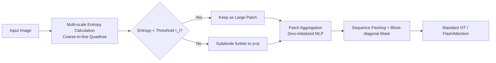

# Faster Vision Transformers with Adaptive Patches

**Conference**: ICLR 2026  
**OpenReview**: [https://openreview.net/forum?id=SzoowJtd14](https://openreview.net/forum?id=SzoowJtd14)  
**Code**: Project page available (noted in the abstract; specific repository not provided)  
**Area**: Model Compression / ViT Acceleration / Token Reduction  
**Keywords**: Vision Transformer, Adaptive Patch, Entropy, Token Reduction, Sequence Packing, Zero-initialized MLP  

## TL;DR
APT (Adaptive Patch Transformer) employs multiple patch sizes within a single image—using large patches for flat regions and small patches for complex regions—to reduce the number of tokens at the source. This provides 30–50% speedup for any pretrained ViT with almost no performance drop, requiring only 1 epoch of fine-tuning to converge.

## Background & Motivation
- **Background**: ViTs split images into fixed-size patches, leading to a sequence length that grows quadratically with resolution. Since self-attention has quadratic complexity, high-resolution images are exceptionally expensive, despite containing significant redundancy.
- **Limitations of Prior Work**: Mainstream token reduction methods face two major issues: ① Token merging (e.g., ToMe) reduces a fixed ratio of tokens for every image: merging half is insufficient for plain images but harms performance on busy street scenes. ② Token pruning (e.g., DynamicViT) requires training a scoring network to identify useless tokens; however, the resulting padding and irregular shapes during the forward pass often negate real-world speedups, prevent batch > 1 inference, and do not accelerate the training process itself.
- **Key Challenge**: Fixed reduction ratios **mismatch the complexity of image content**, while content-adaptive pruning **breaks regular tensor shapes and is incompatible with efficient attention kernels**. Achieving both content-awareness and practical wall-clock speedup is difficult.
- **Goal**: Achieve real wall-clock acceleration for both training and inference while maintaining downstream performance, ensuring compatibility with existing pretrained ViTs with extremely fast convergence.
- **Key Insight**: **[Adopting adaptive tokenization from language models]** NLP uses BPE/SentencePiece to assign variable-length tokens based on subword frequency, which reduces sequence length while improving performance. APT translates this idea to vision—**using entropy to measure patch compressibility across multiple scales, assigning large patches to low-entropy (redundant) regions and small patches to high-entropy (detailed) regions**. By reducing tokens **before** they enter the network, APT avoids the engineering hurdles associated with "in-forward pruning."

## Method

### Overall Architecture
APT follows three steps: first, it uses multi-scale entropy to decide the patch size for each region (quadtree structure); second, it projects patches of different sizes into the same token embedding space (using a Zero-initialized MLP to ensure no performance drop out-of-the-box); finally, it utilizes sequence packing and block-diagonal attention masks to handle variable-length sequences, ensuring that the acceleration is fully realized by kernels like FlashAttention. This workflow does not modify the transformer backbone and can be directly applied to any pretrained ViT for fine-tuning.

### Key Designs

**1. Multi-scale Entropy-driven Quadtree Patch Assignment: Granularity decided by compressibility.** Define $S$ patch scales, where the $i$-th level patch size is $2^i p \times 2^i p$ (e.g., $16/32/64$ for $S=3, p=16$), constrained by a regular grid quadtree. The information content of each patch is measured by entropy $H(P)=-\sum_{i=0}^{L-1} p_i \log_2 p_i$ (where $p_i$ is the probability from the pixel intensity histogram). Lower entropy indicates higher redundancy and the suitability for larger patches. Allocation proceeds coarse-to-fine: entropy is calculated at the coarsest scale $2^S p$; blocks with entropy below threshold $\tau_i$ are kept as large patches, while others are recursively subdivided until the finest scale $p\times p$. Thus, the **reduction ratio adapts to image complexity**—simple cartoons have few tokens while busy street scenes have many, addressing the mismatch of fixed ratios. Entropy calculation is parallelized on the CPU dataloader to overlap with GPU computation, resulting in nearly zero overhead.

**2. Zero-initialized MLP for Patch Aggregation: Zero drop out-of-the-box, 1-epoch convergence.** Different patch sizes must be mapped to the same $d_{embed}$ space. Simply resizing large patches to $p\times p$ before using the original embedding layer $E$ avoids training but loses information; training independent embedding layers for each size incurs overhead. APT combines both: for a large patch $P_i$, it is both resized to pass through $E$ and decomposed into $p\times p$ sub-patches $\{P_j\}$, which are embedded, aggregated via stride-level convolutions, and merged using a **Zero-initialized MLP**:
$$E(P_i)=\text{ZeroMLP}\big(\text{Conv2d}^{(i)}(\{E(P_j)\mid P_j\subset P_i\})\big)+E(\text{Resize}_p(P_i))$$
ZeroMLP leverages the zero-initialization concept from ControlNet: initially, the high-resolution detail branch outputs zero, making the behavior identical to pure resizing (working immediately with minimal loss). During training, it **gradually** integrates detail information. Consequently, APT requires **only 1 epoch** to "heal" the degradation caused by varying patch schemes, whereas methods like DynamicViT/MS-ViT requiring scoring networks often need 50+ epochs.

**3. Sequence Packing + Positional Encoding Interpolation: Hardware acceleration for variable-length inputs.** Content adaptation causes token counts to vary significantly per image. APT fixes the sequence length **before** running the model (much like language models). Token sequences for a batch are concatenated into a long sequence $\sum_i N_i$, paired with a **block-diagonal mask** to ensure each image only attends to its own tokens—supported natively in FlashAttention/xFormers with zero overhead. Positional encodings follow NaViT's interpolation: large patches (size $sp$) are sampled from the base $\frac{H}{p}\times\frac{W}{p}$ encoding map onto a $\frac{H}{sp}\times\frac{W}{sp}$ grid, maintaining spatial consistency across scales.

**4. Compatibility with Dense Prediction and Window Attention: Extending acceleration beyond classification.** Detection/segmentation requires regular feature maps, but APT outputs variable token counts. The solution assumes large patches encode simpler features and **repeats them $2^{2i}$ times** to reconstruct a differentiable feature map suitable for transposed convolution upsampling. For high-resolution tasks relying on window attention (e.g., EVA-02 detection), the image is divided into windows that are multiples of the maximum patch size. Adaptive patch assignment and local attention are performed within each window via sequence packing, incurring minimal overhead—allowing APT to reduce 30% of tokens in 1536×1536 detection and ADE20K segmentation.

## Key Experimental Results

### Main Results

ImageNet fine-tuning (MAE recipe); speedup is more significant as resolution and model size increase, with negligible accuracy loss:

| Model | Resolution/Patch | Acc | Wall-clock Time | Gain |
|---|---|---|---|---|
| ViT-L (MAE) | 336/14 | 86.1 | 15.9h | - |
| APT-L | 336/14 | 86.1 | 9.9h | **+61%** |
| ViT-L (MAE) | 448/14 | 86.4 | 31.4h | - |
| APT-L | 448/14 | 86.3 | 16.9h | **+86%** |

1-epoch fine-tuning (starting from fine-tuned checkpoints, comparing against random/resizing only):

| Model | Resolution | Acc | Throughput Gain |
|---|---|---|---|
| ViT-H | 336/14 | 88.5 | - |
| Random | 336/14 | 87.0 | +55% |
| Resizing | 336/14 | 88.0 | +50% |
| **APT-H** | 336/14 | **88.4** | **+50%** |

Downstream tasks (fine-tuning for only 5% of iterations) are nearly equal to or slightly exceed baselines:

| Task | Backbone | Gain | Key Metric |
|---|---|---|---|
| VQA | LLaVA-1.5-13B | +23% | VQAv2 79.4 vs 80.0; POPE/MMBench **surpass** baseline |
| Object Detection (COCO@1536) | EVA-02-L | +30% | mAP 62.07 vs 62.28 |
| Semantic Segmentation (ADE20K@640) | EVA-02-L | +11% | mIoU 60.01 vs 60.05 |

### Ablation Study

| Ablation | Setting | Conclusion |
|---|---|---|
| Zero-initialized Connection | Residual / NonZero / **Zero** | Zero is optimal both without training (87.98) and after training (88.13), closest to the baseline 88.15 |
| APT Overhead (at no reduction) | $\tau=-1$ | ~10% slower (re-arrangement + masking), but real-world reduction brings 20%+ gain, yielding a net profit |
| Entropy Threshold $\tau$ | $\tau_{32}=5.75,\tau_{64}=4.0$ generic; 2 for detection | Higher thresholds are faster but accuracy drops; detection requires low thresholds for precise edges |

### Key Findings
- **Input-level Reduction > Layer-wise Merging**: On the Accuracy-Throughput curve for ViT-L/H, APT consistently outperforms layer-wise methods like ToMe/EViT/PPT/DTEM (including "Advanced" versions retrofitted with FlashAttention). Most layer-wise methods are incompatible with FlashAttention, making them slower than the original ViT with FlashAttention enabled.
- **Acceleration Scales with Resolution/Model Size**: Attention dominates training time in large models and high resolutions; thus, token reduction benefits are amplified (ViT-L speedup doubles to 86% at 448 resolution).
- **Sequence Length Distribution**: Actual sequence lengths concentrate near the maximum with a slow tail, reaching as low as ~30% of the maximum.

## Highlights & Insights
- **Clean translation of "Adaptive Tokenization" from NLP to Vision**: Using entropy as a cheap, training-free signal to determine patch granularity avoids the expensive "scoring network" path that often fails to accelerate.
- **True Wall-clock Speedup, not just Paper FLOPs**: By embracing "Pre-model reduction + Sequence Packing + Block-diagonal Masking," APT utilizes FlashAttention and avoids the padding/irregular shape issues that plague pruning methods, while supporting batch > 1.
- **Zero-initialization as a masterstroke**: Allows the method to be applied to any pretrained ViT with 1-epoch convergence, reducing the cost of changing patch schemes to almost zero, making it very engineering-friendly.
- **Strong Versatility**: Covers classification, VQA, detection, segmentation, and window attention. It even slightly exceeds the original model in VQA and some benchmarks—suggesting it primarily prunes redundancy rather than information.

## Limitations & Future Work
- **Reliance on Hand-crafted Heuristics**: Patch sizes are determined by entropy and thresholds, which is a manual heuristic and may not align with regions the user cares about (e.g., in a "what color is the background" query, APT might still coarsen the background).
- **Threshold Hyperparameter Tuning**: $\tau$ is a task-specific hyperparameter (lowered to 2 for detection), adding friction to adoption. Automatic or learnable thresholds could be considered.
- **No Support for Image Generation**: Generative tasks involve extremely high resolutions and massive models, making them ideal for the application, but APT does not yet cover them. This remains a future direction.

## Related Work & Insights
- **vs Token Merging (ToMe)**: Merging reduces a fixed number of tokens per image, causing content mismatch; APT is adaptive and reduces at the input level.
- **vs Token Pruning (DynamicViT)**: Pruning requires learning a scoring network, does not accelerate training, and lacks batch inference; APT use training-free entropy and accelerates training immediately.
- **vs Same-scale Adaptive Patching (CF-ViT/Quadformer/MG-ViT/MS-ViT)**: Quadformer uses fixed token counts; MG-ViT relies on attention scores (incompatible with efficient kernels and requires training from scratch); MS-ViT requires heavy fine-tuning and doesn't accelerate training. APT uses zero-initialization for convergence and sequence packing for kernel compatibility, showing stronger scaling for high-resolution/large models.
- **Insight**: When inputs have naturally non-uniform redundancy, "adaptive variable-length tokenization before the backbone" may be more engineering-efficient than "intra-layer dynamic pruning." Reducing where kernels can benefit is more important than pruning aggressively.

## Rating
- Novelty: ⭐⭐⭐⭐ Cleanly implements NLP adaptive tokenization via entropy + quadtree + zero-initialization for ViTs; input-level adaptive patching is a clear incremental innovation.
- Experimental Thoroughness: ⭐⭐⭐⭐⭐ Covers classification/VQA/detection/segmentation, multiple model scales/resolutions, with fair FlashAttention-enabled baselines and thorough ablations.
- Writing Quality: ⭐⭐⭐⭐ Smooth logic from motivation to method to experiments; clear illustrations for patch embedding, sequence distribution, and runtime breakdown.
- Value: ⭐⭐⭐⭐⭐ Plug-and-play, 1-epoch convergence, 30–86% wall-clock speedup with almost no drop; highly practical for reducing ViT training/inference costs.

<!-- RELATED:START -->

## Related Papers

- [\[ICLR 2026\] Thicker and Quicker: A Jumbo Token for Fast Plain Vision Transformers](thicker_and_quicker_the_jumbo_token_for_fast_plain_vision_transformers.md)
- [\[NeurIPS 2025\] REOrdering Patches Improves Vision Models](../../NeurIPS2025/model_compression/reordering_patches_improves_vision_models.md)
- [\[CVPR 2026\] BinaryAttention: One-Bit QK-Attention for Vision and Diffusion Transformers](../../CVPR2026/model_compression/binaryattention_one-bit_qk-attention_for_vision_and_diffusion_transformers.md)
- [\[AAAI 2026\] Distillation Dynamics: Towards Understanding Feature-Based Distillation in Vision Transformers](../../AAAI2026/model_compression/distillation_dynamics_towards_understanding_feature-based_di.md)
- [\[ICLR 2026\] TurboBoA: Faster and Exact Attention-aware Quantization without Backpropagation](turboboa_faster_and_exact_attention-aware_quantization_without_backpropagation.md)

<!-- RELATED:END -->
