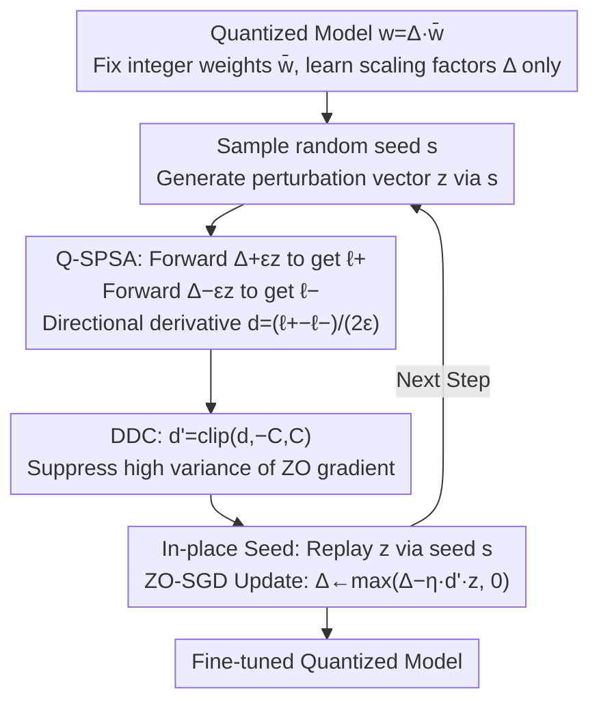

# Fine-tuning Quantized Neural Networks with Zeroth-order Optimization

**Conference**: ICLR 2026  
**arXiv**: [2505.13430](https://arxiv.org/abs/2505.13430)  
**Code**: [GitHub](https://github.com/maifoundations/QZO)  
**Area**: Model Compression/Efficient Fine-tuning  
**Keywords**: Zeroth-order optimization, fine-tuning quantized models, memory-efficient training, quantization scaling factors, gradient variance

## TL;DR
The paper proposes QZO, a method that estimates gradients by applying zeroth-order perturbations to quantization scaling factors (rather than discrete weights). Combined with Directional Derivative Clipping (DDC) to stabilize training, it achieves extreme memory-efficient fine-tuning for 4-bit/2-bit LLMs, reducing total memory by over 18x.

## Background & Motivation

**Background**: LLM fine-tuning require storing weights, gradients, optimizer states, and activations; a typical 7B model needs 56GB. Existing methods compress different components: LoRA reduces parameters, GaLore compresses optimizer states, and MeZO eliminates gradient storage using zeroth-order optimization.

**Limitations of Prior Work**: These methods only address part of the memory problem. Weights themselves still occupy significant memory (14GB for a 7B model in bfloat16); even if MeZO eliminates gradients, 14GB is still needed for weights. The most direct solution is weight quantization (e.g., int4 only needs 3.5GB), but quantized weights are discrete and cannot be directly perturbed via zeroth-order optimization.

**Key Challenge**: Zeroth-order optimization requires weight perturbation in continuous space, yet quantized weights are discrete. Furthermore, estimated gradients are continuous, making them unable to directly update discrete weights without an expensive dequantization-requantization cycle.

**Goal**: How to apply zeroth-order optimization to quantized models while maximizing memory compression (full compression of weights + gradients + optimizer states)?

**Key Insight**: It is observed that the essence of quantization is $w = \Delta \cdot \bar{w}$, where $\Delta$ is a continuous scaling factor and $\bar{w}$ represents discrete integers. One can perturb the continuous $\Delta$ while keeping $\bar{w}$ fixed.

**Core Idea**: Perturb continuous quantization scaling factors for zeroth-order gradient estimation and employ directional derivative clipping to control gradient variance.

## Method

### Overall Architecture
QZO performs fine-tuning on quantized LLMs without incurring the memory costs of gradients and optimizer states. The challenge is that quantization represents weights as $w = \Delta \cdot \bar{w}$, where $\bar{w}$ are discrete integers and $\Delta$ are continuous scaling factors. Since zeroth-order optimization requires perturbing parameters in continuous space, discrete $\bar{w}$ cannot be directly perturbed. QZO addresses this by fixing the quantized integer weights $\bar{\theta}$ throughout training and treating only the scaling factors $\Delta$ as learnable parameters.

Training is an iterative cycle that avoids backpropagation. In each step: a perturbation vector $z$ is generated based on a random seed; forward passes are performed using $\Delta + \epsilon z$ and $\Delta - \epsilon z$ respectively; the derivative along direction $z$ is estimated using the difference between the two losses (Q-SPSA); this scalar is then clipped to suppress variance (DDC); finally, $z$ is replayed using the same seed to update $\Delta$ (the memory seed technique ensures $z$ does not need to be stored). These three components jointly compress memory across gradients, optimizer states, and weights.

### Key Designs

**1. Q-SPSA: Shifting Zeroth-Order Perturbation from Discrete Weights to Continuous Scaling Factors**

Zeroth-order optimization is typically hindered by the inability to perturb discrete weights. Q-SPSA applies perturbations only to the continuous scaling factor $\Delta$, estimating the gradient using the loss difference from two forward passes:

$$\hat{\nabla}_{\Delta}\mathcal{L} = \frac{\mathcal{L}((\Delta+\epsilon z)\odot\bar{\theta}) - \mathcal{L}((\Delta-\epsilon z)\odot\bar{\theta})}{2\epsilon}z, \quad z \sim \mathcal{N}(0, I_d)$$

Only $\Delta$ is perturbed by $\epsilon z$, while integer weights $\bar{\theta}$ remain unchanged. Since dequantization $w = \Delta \cdot \bar{w}$ is a standard part of the quantized model's forward pass, the perturbed forward pass is identical to standard inference, requiring no changes to inference code. This decomposition naturally fits major quantization types: scalar-based (e.g., GPTQ) and codebook-based (e.g., AQLM).

**2. DDC (Directional Derivative Clipping): Suppressing Zeroth-Order Gradient Variance**

Zeroth-order estimation suffers from high variance, leading to spikes in training loss. DDC clips the directional derivative scalar $d$:

$$d' = \text{clip}(d, -C, C), \quad \hat{\nabla} = d' \cdot z$$

Crucially, clipping does not destroy estimation correctness: Theorem 1 in the paper proves that the clipped gradient remains an unbiased estimator with non-increasing variance, because $d'^2 \leq d^2$, thus $\text{Var}[\hat{\nabla}'] \leq \text{Var}[\hat{\nabla}]$. DDC achieves a more stable training curve without incurring bias.

**3. In-place Seed Technique: Replaying Perturbation Vectors via Random Seeds**

The perturbation vector $z$ has the same dimensionality as the model; storing it would negate the memory savings from eliminating gradients. QZO follows MeZO's approach: it stores only the random seed used to generate $z$ and resamples it whenever the same $z$ is needed for updates. This makes the memory overhead of $z$ negligible.

### Loss & Training
The update uses ZO-SGD: $\Delta_{t+1} = \max(\Delta_t - \eta \cdot d' \cdot z, 0)$, where $\max(\cdot, 0)$ ensures scaling factors remain non-negative. Default hyperparameters are learning rate $\eta = 10^{-7}$, perturbation scale $\epsilon = 10^{-3}$, and clipping threshold $C = 100$. If the model contains unquantized parts, standard SPSA is used to jointly update those parameters.

## Key Experimental Results

### Main Results
4-bit GPTQ quantized models (SST-2/RTE/CB/BoolQ/SQuAD):

| Method | Accuracy | Memory | SST-2 | RTE | SQuAD |
|------|------|------|-------|-----|-------|
| Zero-Shot | 16bit | 14GB | Baseline | Baseline | Baseline |
| Fine-tuning+AdamW | 16bit | 56GB | Upper Bound | Upper Bound | Upper Bound |
| MeZO | 16bit | 14GB | Good | Good | Good |
| QZO (4bit) | 4bit | **<3GB** | Near MeZO | Near MeZO | Near MeZO |

### Extreme Quantization Experiments (2-bit AQLM, Llama-2-13B)

| Configuration | Memory | Performance | Description |
|------|------|------|------|
| Zero-Shot-Q(2bit) | ~5GB | Baseline | Post-quantization zero-shot |
| QZO(2bit) | ~5GB | **Significantly exceeds Zero-Shot** | Effective under extreme quantization |
| MeZO(16bit) | 26GB | Reference | Requires 5x memory |

### Key Findings
- QZO achieves fine-tuning performance close to MeZO (14GB) with <3GB memory, an 18x memory compression.
- It significantly outperforms the zero-shot baseline even under 2-bit extreme quantization.
- DDC clipping is vital for stable training; without DDC, the loss frequently exhibits abnormal jumps.
- The clipping threshold $C$ is stable across a wide range (50-200).

## Highlights & Insights
- **Unified Framework for Extreme Compression**: Simultaneously eliminates gradients and optimizer states while compressing weights, achieving "extreme" memory savings across all three dimensions. 18x compression enables fine-tuning 13B models on a 24GB GPU.
- **Perturbing Scaling Factors instead of Weights**: Avoids the complex dequantization $\rightarrow$ perturbation $\rightarrow$ requantization workflow. The key insight is decomposing quantization into $w = \Delta \cdot \bar{w}$ and only perturbing the continuous part.
- **Theoretical Guarantee for DDC**: Proving that clipping remains unbiased while reducing variance is a clean theoretical result.

## Limitations & Future Work
- Zeroth-order optimization converges slowly, requiring more optimization steps (20k steps vs. hundreds for first-order methods).
- Validation is limited to NLU tasks (classification + QA); performance on generative tasks (e.g., instruction following) is unknown.
- Only the scaling factors can be fine-tuned (limited granularity), unlike LoRA which learns new low-rank parameters.
- Lack of direct comparison with LoRA + Quantization (e.g., QLoRA).

## Related Work & Insights
- **vs MeZO**: MeZO performs ZO on unquantized models; QZO performs ZO on quantized models, achieving similar results with 1/5 of the memory.
- **vs QLoRA**: QLoRA uses quantization + LoRA but still requires gradient storage. QZO completely eliminates gradient storage, offering lower memory usage but potentially lower performance.
- **vs ZO-signSGD**: Prior quantized ZO work required quantizing perturbation noise and using sign SGD on discrete weights; QZO is more efficient and flexible.

## Rating
- Novelty: ⭐⭐⭐⭐ The idea of perturbing quantization scaling factors is intuitive and effective.
- Experimental Thoroughness: ⭐⭐⭐ Dataset diversity is somewhat limited; lacks comparison with QLoRA.
- Writing Quality: ⭐⭐⭐⭐ Clear methodological description and complete theoretical proofs.
- Value: ⭐⭐⭐⭐ Directly valuable for extreme resource-constrained scenarios.

<!-- RELATED:START -->

## Related Papers

- [\[CVPR 2026\] FOZO: Forward-Only Zeroth-Order Prompt Optimization for Test-Time Adaptation](../../CVPR2026/model_compression/fozo_forward-only_zeroth-order_prompt_optimization_for_test-time_adaptation.md)
- [\[ICLR 2026\] Adaptive Width Neural Networks](adaptive_width_neural_networks.md)
- [\[ICML 2026\] Turning Stale Gradients into Stable Gradients: Coherent Coordinate Descent with Implicit Landscape Smoothing for Lightweight Zeroth-Order Optimization](../../ICML2026/model_compression/turning_stale_gradients_into_stable_gradients_coherent_coordinate_descent_with_i.md)
- [\[ICLR 2026\] A Recovery Guarantee for Sparse Neural Networks](a_recovery_guarantee_for_sparse_neural_networks.md)
- [\[ICLR 2026\] BEP: A Binary Error Propagation Algorithm for Binary Neural Networks Training](bep_a_binary_error_propagation_algorithm_for_binary_neural_networks_training.md)

<!-- RELATED:END -->
