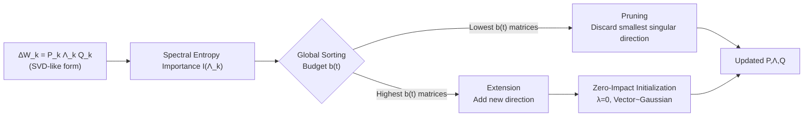

# FlexLoRA: Entropy-Guided Flexible Low-Rank Adaptation

**Conference**: ICLR 2026  
**OpenReview**: [https://openreview.net/forum?id=tqnkbdYWWm](https://openreview.net/forum?id=tqnkbdYWWm)  
**Code**: To be confirmed  
**Area**: Parameter-Efficient Fine-Tuning / Model Compression  
**Keywords**: LoRA, Dynamic Rank Allocation, Spectral Entropy, PEFT, Rank Pruning and Extension  

## TL;DR
FlexLoRA utilizes "spectral energy entropy" to measure the importance of each LoRA low-rank update at the **matrix level**. Under a global rank budget, it can both **prune redundant ranks** and **extend new ranks** for critical layers. Furthermore, a "Zero-Impact Initialization" strategy is employed to ensure training stability during capacity expansion, allowing for more efficient utilization of the parameter budget compared to fixed-rank LoRA and unidirectional pruning methods like AdaLoRA.

## Background & Motivation
**Background**: LoRA approximates downstream task weight updates using two trainable low-rank matrices, $\Delta W = BA$, and has become a mainstream approach for Parameter-Efficient Fine-Tuning (PEFT). However, it assigns the **same fixed rank $r$** to all layers, failing to flexibly configure capacity according to the actual needs of each layer. Consequently, dynamic rank allocation methods like AdaLoRA, SaLoRA, and AutoLoRA have emerged, which alleviate this issue by scoring the importance of each rank direction and pruning the least important ones after global sorting.

**Limitations of Prior Work**: The authors identify three structural deficiencies in these methods. First, importance measures are largely **heuristic**—relying on parameter sensitivity approximations (gradient $\times$ weight) rather than principled criteria—making them sensitive to gradient noise and unstable across iterations. Second, rank directions from all matrices are **globally sorted and pruned together**, ignoring matrix-level differences and potentially deleting structurally important directions within specific matrices. Third, the allocation is **unidirectional**—it only prunes to remove redundancy, lacking any mechanism to **supplement** ranks for layers that truly require more expressive power.

**Key Challenge**: The inability to simultaneously satisfy granularity (parameter-level vs. matrix-level), flexibility (reduction-only vs. bidirectional adjustment), and stability (how to avoid disrupting existing outputs during expansion) makes it difficult for current methods to achieve truly "principled and adaptive" capacity allocation.

**Goal**: Propose a unified framework that can both prune and extend ranks under a global budget, utilizes an information-theoretic importance measure, and remains stable during expansion.

**Core Idea**: **Use spectral entropy to measure importance at the matrix level, transform rank allocation into a bidirectional "pruning + expansion" operation, and use Zero-Impact Initialization to seamlessly integrate new ranks.**

## Method

### Overall Architecture
FlexLoRA formulates each weight update in an SVD-like form $\Delta W = P\Lambda Q$ (where $\Lambda$ is a diagonal matrix of singular values) and applies orthogonal regularization to maintain SVD properties. During training, it periodically: ① Calculates a spectral entropy importance score for each $\Delta W$; ② Under a global rank budget $b(t)$, prunes the smallest singular direction from a set of matrices with the lowest scores and adds a new direction to matrices with the highest scores; ③ Injects new directions using Zero-Impact Initialization. These three components (matrix-level entropy measurement, bidirectional rank adjustment, and Zero-Impact Initialization) address the pain points of granularity, flexibility, and stability, respectively.

### Key Designs

**1. Matrix-level Spectral Entropy Importance Measure: Determining layer "saturation" via singular value energy distribution.** Existing methods calculate sensitivity for individual parameters or singular directions, failing to observe the overall matrix structure. FlexLoRA instead calculates the entropy of the singular value spectrum for each matrix: first, squared singular values are normalized into an energy distribution $s_i = \lambda_i^2 / \sum_j \lambda_j^2$, and then the normalized spectral entropy is calculated as $I(\Lambda) = -\frac{1}{\log r}\sum_{i=1}^{r} s_i \log(s_i+\epsilon)$, where dividing by $\log r$ bounds the entropy within $[0,1]$ to make matrices with different ranks comparable. Intuitively, **low entropy** indicates energy concentration in a few singular values, suggesting redundancy and suitability for pruning; **high entropy** suggests a uniform energy distribution and rich structural information, warranting expansion. Compared to gradient sensitivity, entropy characterizes the intrinsic geometry of the matrix throughout training and is less affected by gradient noise.

**2. Bidirectional Rank Pruning and Extension under Global Budget: Enabling both reduction and addition.** Unlike previous works that only perform reduction, FlexLoRA defines a rank budget $b(t)$ per step, limiting the maximum number of singular directions added or removed. For pruning, matrices are sorted by importance, and the $b(t)$ least important matrices with a rank greater than 1 each discard their smallest singular direction—as the direction with the minimum singular value contributes the least to expressiveness and has been proven by the authors to contribute the least to entropy $I(\lambda_{\min})$ (monotonicity proof in Appendix C). For expansion, a new singular direction is added to each of the $b(t)$ most important matrices. The budget itself is controlled by a cubic decay scheduler $b(t)=\mathrm{round}\big(b_0\cdot(1-\frac{t-t_{warmup}}{T-t_{final}})^3\big)$, encouraging aggressive capacity exploration early on and stabilizing convergence toward the end.

**3. Zero-Impact Initialization: Expanding capacity without disturbing current output.** Randomly initializing new directions would immediately alter the forward output and disrupt training stability. FlexLoRA **initializes the new singular value to 0** and **samples the corresponding singular vectors from a Gaussian distribution**. A zero singular value means $\Delta W$ remains unchanged at the moment of injection, ensuring no perturbation to the current output, while the non-zero trainable vectors allow gradients to gradually "activate" this new direction. Ablation studies show that Zero-Impact Initialization achieves a better balance between stability and learnability compared to setting both values and vectors to zero (which "freezes" the direction until gradient accumulation) or using Gram–Schmidt orthogonal initialization.

## Key Experimental Results

### Main Results
FlexLoRA was evaluated against LoRA and AdaLoRA with equal parameter budgets on GLUE (DeBERTaV3-base), Commonsense Reasoning (LLaMA3-8B), and Vision VTAB (ViT-B/16) tasks.

| Task | Method | Parameters | Avg. Score |
|------|------|--------|--------|
| GLUE | LoRA (r=8) | 1.3M | 81.7 |
| GLUE | AdaLoRA | 1.9M | 88.1 |
| GLUE | **FlexLoRA** | 1.9M | **89.1** |
| Commonsense (LLaMA3) | LoRA (r=32) | 56.6M | 85.4 |
| Commonsense (LLaMA3) | AdaLoRA (r=32) | 56.6M | 84.5 |
| Commonsense (LLaMA3) | **FlexLoRA (r=32)** | 56.6M | **85.5** |
| VTAB | LoRA (r=14) | 1.29M | 66.7 |
| VTAB | AdaLoRA | 1.26M | 64.7 |
| VTAB | **FlexLoRA** | 1.18M | **67.8** |

On GLUE, improvements are most significant in linguistically challenging tasks like CoLA (71.8 vs. AdaLoRA 70.0) and RTE (88.8 vs. 88.1). On VTAB, CIFAR100 scores 8.9 points higher than LoRA.

### Ablation Study
Conducted on GLUE (DeBERTaV3-base).

| Ablation Dimension | Variant | Avg. Score |
|----------|------|--------|
| Importance Measure | Nuclear Norm | 87.7 |
| Importance Measure | Frobenius Norm | 87.1 |
| Importance Measure | AdaLoRA Sensitivity | 88.1 |
| Importance Measure | **Spectral Entropy (Ours)** | **89.1** |
| Rank Adjustment Direction | Prune-only | 87.5 |
| Rank Adjustment Direction | Expand-only | 87.6 |
| Rank Adjustment Direction | **Prune + Expand (Ours)** | **89.1** |
| New Direction Init | Three other strategies | < 85.8 |
| New Direction Init | **Zero-Impact (Ours)** | **85.8 (Highest)** |

### Key Findings
- Spectral entropy as an importance criterion offers better discriminative power and robustness than norm-based or sensitivity-based measures.
- Bidirectional adjustment is indispensable—pruning-only leads to excessive capacity loss, while expansion-only retains redundancy and wastes parameters.
- Zero-Impact Initialization outperforms small-value, all-zero, and orthogonal initializations across four GLUE sub-tasks.

## Highlights & Insights
- **Scaling "Importance" from Parameter to Matrix Level**: Using spectral entropy to view the entire singular value distribution rather than individual gradients avoids gradient noise and provides an information-theoretic basis for whether to prune or expand.
- **Bidirectional Allocation Completes the Dynamic LoRA Puzzle**: Previous methods could only reduce capacity; FlexLoRA reallocates capacity from "less-needed layers" to "truly-needed layers" under the same global budget, representing resource redistribution rather than mere compression.
- **Zero-Impact Initialization is a Clean Trick**: Setting the singular value to zero ensures the output remains unchanged at injection, while random vectors ensure subsequent learnability—theoretically non-disruptive and practically stable.

## Limitations & Future Work
- Comparisons are primarily focused on LoRA and AdaLoRA; a comprehensive benchmark against more dynamic rank methods like SoRA, DyLoRA, and DoRA is somewhat limited (some only appear in isolated tables).
- Hyperparameters such as the budget schedule $b(t)$ and adjustment period $T$ are manually set via cubic decay; the authors note that "adaptive scheduling strategies" warrant further exploration.
- Spectral entropy requires maintaining an SVD-like structure and adding orthogonal regularization, which introduces additional decomposition and regularization overhead compared to vanilla LoRA. The paper does not provide a detailed quantification of training time costs.
- The impact of dynamic rank changes (expansion/pruning) on peak VRAM and engineering implementation is not sufficiently discussed.

## Related Work & Insights
- **LoRA / AdaLoRA / SaLoRA / AutoLoRA**: The evolution from fixed-rank to dynamic rank allocation. FlexLoRA advances this via "bidirectional adjustment + matrix-level measurement."
- **SoRA / DoRA / DyLoRA / MLAE**: These regulate effective capacity through singular component merging, stochastic rank changes, or rank-1 expert masks, complementing the spectral entropy perspective.
- **Entropy-Guided Pruning and Compression**: Using information entropy as a criterion for "representation richness" rather than "statistical uncertainty." This paper applies this logic to rank allocation, suggesting that many "optimal capacity" problems might be unified through the entropy of spectral distributions.

## Rating
- **Novelty**: ⭐⭐⭐⭐ The combination of spectral entropy for matrix-level importance, bidirectional rank allocation, and Zero-Impact Initialization is novel, evolving dynamic LoRA from "pruning-only" to "bidirectional."
- **Experimental Thoroughness**: ⭐⭐⭐⭐ Covers NLU, commonsense reasoning, and vision tasks. Ablations validate the three core components effectively. However, cross-evaluation with more dynamic rank baselines and efficiency overhead analysis could be stronger.
- **Writing Quality**: ⭐⭐⭐⭐ Clear mapping between the three pain points and the three components. Formulas and algorithmic flows are complete.
- **Value**: ⭐⭐⭐⭐ Stably outperforms LoRA/AdaLoRA under the same parameter budget. The method is plug-and-play and has direct reference value for PEFT practices.

<!-- RELATED:START -->

## Related Papers

- [\[ICLR 2026\] E²LoRA: Efficient and Effective Low-Rank Adaptation with Entropy-Guided Adaptive Sharing](e²lora_efficient_and_effective_low-rank_adaptation_with_entropy-guided_adaptive_.md)
- [\[ICLR 2026\] Stable-LoRA: Stabilizing Feature Learning of Low-Rank Adaptation](stable-lora_stabilizing_feature_learning_of_low-rank_adaptation.md)
- [\[ICLR 2026\] LoFT: Low-Rank Adaptation That Behaves Like Full Fine-Tuning](loft_low-rank_adaptation_that_behaves_like_full_fine-tuning.md)
- [\[ICLR 2026\] Gradient Intrinsic Dimensionality Alignment：Narrowing The Gap Between Low-Rank Adaptation and Full Fine-Tuning](gradient_intrinsic_dimensionalityalignmentnarrowing_the_gap_between_low-rank_ad.md)
- [\[ICML 2026\] Energy-Structured Low-Rank Adaptation for Continual Learning](../../ICML2026/model_compression/energy-structured_low-rank_adaptation_for_continual_learning.md)

<!-- RELATED:END -->
