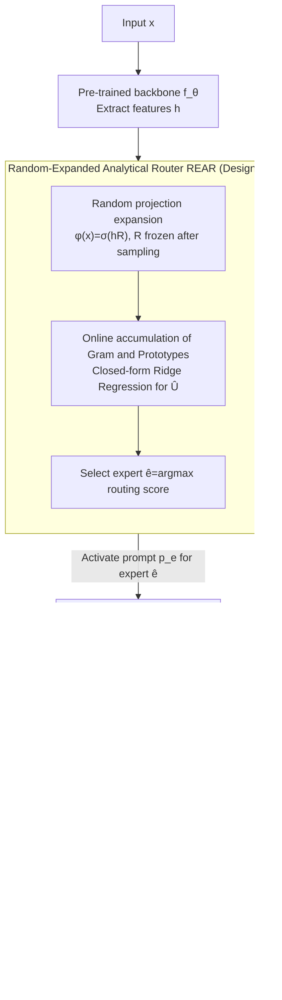

# FlyPrompt: Brain-Inspired Random-Expanded Routing with Temporal-Ensemble Experts for General Continual Learning

**Conference**: ICLR 2026  
**arXiv**: [2602.01976](https://arxiv.org/abs/2602.01976)  
**Code**: None  
**Area**: Model Compression  
**Keywords**: continual learning, prompt tuning, brain-inspired, expert routing, temporal ensemble  

## TL;DR

Inspired by the neurobiological sparse expansion and modular integration of the Drosophila mushroom body, the FlyPrompt framework is proposed for General Continual Learning (GCL). It achieves non-iterative expert selection via a Random-Expanded Analytical Router (REAR) and enhances expert capabilities through Temporal-Ensemble Task-Experts (TE²) utilizing multi-time-scale EMA output heads. It achieves gains of up to 11.23%, 12.43%, and 7.62% on CIFAR-100, ImageNet-R, and CUB-200, respectively.

## Background & Motivation

1.  **GCL is significantly more difficult than traditional CL**: GCL requires learning over non-stationary data streams with a single pass, no explicit task boundaries, and potentially overlapping label spaces. The clear task partitions and multi-epoch training assumed in traditional CL no longer hold.
2.  **Existing PET methods suffer from unstable router training**: Methods like L2P, DualPrompt, MVP, and MISA train the router and experts synchronously. Under GCL's blurred boundaries and single-pass constraints, routers are prone to overfitting early data or being affected by distribution shifts; empirical evidence shows routing accuracy is far from ideal.
3.  **Expert capability degrades under single-pass training**: Even given an oracle router, the final accuracy of existing methods remains low (Fig. 2c). This indicates a gradual mismatch between expert representation quality and the decision boundaries of output heads in non-stationary streams, representing a second bottleneck independent of routing.
4.  **Class imbalance exacerbates interference**: Class distributions in GCL streams are long-tailed and overlap across tasks. A single shared output head is continuously overwritten by subsequent tasks, leading to shifts in the decision boundaries of early experts.
5.  **Drosophila mushroom body provides a biological paradigm**: Drosophila possess robust lifelong learning capabilities with fewer than 100,000 neurons. The 40x sparse random expansion from projection neurons to Kenyon cells enables efficient pattern separation, while multi-time-scale plasticity in the $\gamma/\alpha'\beta'/\alpha\beta$ lobes supports the parallel consolidation of short/medium/long-term memories.
6.  **Lack of joint design for routing and expert capability in CL**: Existing works either focus only on anti-forgetting (regularization/replay) or only on routing (prompt selection), without explicitly decomposing GCL into two sub-problems—"expert routing + expert capability enhancement"—and solving them jointly.

## Method

### Overall Architecture

FlyPrompt decomposes GCL into two independent bottlenecks: first, **expert routing**—selecting the correct prompt expert for each input; second, **expert capability**—ensuring the selected expert learns robust representations and stable decision boundaries under single-pass, limited supervision. Empirical analysis (Fig. 2b-c) confirms these as separate ceilings: inaccurate routing lowers the upper bound, while weak experts raise the lower bound. Correspondingly, REAR (Random-Expanded Analytical Router) handles the former via a gradient-free, closed-form routing completed in a single forward pass. TE² (Temporal-Ensemble Task-Expert) handles the latter by consolidating knowledge in parallel across different time windows using multiple EMA output heads with varying decay rates. The pipeline is: input passes through the pre-trained backbone to obtain features; REAR selects the responsible expert; the corresponding prompt is used to extract features; finally, TE² integrates multiple time-scale output heads for prediction.

### Key Designs

**1. Random-Expanded Analytical Router (REAR): Avoiding router forgetting via fixed random projection and closed-form solutions**

Existing PET methods train the router and experts together via gradients. In GCL, the router easily overfits early data. REAR makes the router entirely gradient-free, mimicking the ~40x sparse random expansion of Drosophila projection neurons to Kenyon cells. Given pre-trained features $\mathbf{h} = f_\theta(\mathbf{x}) \in \mathbb{R}^d$, it uses a random matrix $\mathbf{R} \sim \mathcal{N}(0,1)^{d \times M}$ (frozen after initial sampling) to project into a high-dimensional sparse space $\varphi(\mathbf{x}) = \sigma(\mathbf{h}\mathbf{R}) \in \mathbb{R}^M$, where $M=10^4 \gg d$. High-dimensional sparse representations are inherently more linearly separable, and a fixed $\mathbf{R}$ ensures routing features do not shift. In the expanded space, routing becomes a ridge regression: it accumulates the Gram matrix $\mathbf{G} \leftarrow \mathbf{G} + \Phi_i^\top\Phi_i$ and prototype matrix $\mathbf{Q} \leftarrow \mathbf{Q} + \Phi_i^\top\mathbf{C}_t$ online. Decisions are made via a closed-form solution $\hat{\mathbf{U}}^\top = (\mathbf{G} + \lambda\mathbf{I})^{-1}\mathbf{Q}$, selecting $\hat{E}(\mathbf{x}) = \arg\max_t [\varphi(\mathbf{x})\hat{\mathbf{U}}^\top]_t$. This design has no trainable routing parameters, eliminating router forgetting. Theorem 1 provides a population excess risk $\lesssim \sqrt{\log N/M} + (N\lambda)^{-1/2} + \lambda$, showing routing error can be suppressed by increasing $M$ and samples $N$.

**2. Temporal-Ensemble Task-Expert (TE²): Compensating for expert degradation via multi-time-scale EMA heads**

Even with perfect routing, the decision boundaries of output heads shift due to class imbalance (Fig. 2c). TE² draws from the multi-time-scale memory consolidation of the Drosophila MB $\gamma/\alpha'\beta'/\alpha\beta$ lobes. Each expert $E_t$ maintains an online head and $n$ shadow heads with different EMA decay rates. Short windows ($\alpha=0.9$) track recent patterns, while long windows ($\alpha=0.99$) preserve stable knowledge. During training, only the online head $\psi$ and current prompt $\mathbf{p}_t$ are updated using cross-entropy with logit masking (only current classes), and new prompts are warm-started using the mean of existing ones. After each gradient step, shadow heads follow via $\mathbf{W}_t^{(j)} \leftarrow \alpha_j \mathbf{W}_t^{(j)} + (1-\alpha_j)\mathbf{W}$. Inference aggregates the max of softmax outputs from all heads. Theorem 2 decomposes the EMA error into a variance term $\mathcal{O}(\zeta^2/L)$ and a drift bias term $\mathcal{O}((LP_t)^2)$, justifying the ensemble: the optimal bias-variance trade-off shifts with drift speed, and the EMA bank ensures a head is always near-optimal.

## Key Experimental Results

### Main Results: GCL Performance (Table 1, Sup-21K Backbone)

| Method | CIFAR-100 $A_{\text{auc}}$ | CIFAR-100 $A_{\text{last}}$ | ImageNet-R $A_{\text{auc}}$ | ImageNet-R $A_{\text{last}}$ | CUB-200 $A_{\text{auc}}$ | CUB-200 $A_{\text{last}}$ |
|------|:-:|:-:|:-:|:-:|:-:|:-:|
| L2P | 76.23 | 79.11 | 44.40 | 42.03 | 64.30 | 61.42 |
| DualPrompt | 76.04 | 76.62 | 46.13 | 40.80 | 65.03 | 62.43 |
| CODA-P | 79.13 | 80.91 | 51.87 | 48.09 | 66.01 | 62.90 |
| MISA | 80.35 | 80.75 | 51.52 | 45.08 | 65.40 | 60.20 |
| **Ours (FlyPrompt)** | **83.24** | **86.76** | **56.58** | **55.27** | **70.64** | **73.40** |

**Key Findings**: FlyPrompt significantly leads across all datasets, with $A_{\text{auc}}$ gains of +2.89/+4.71/+4.63 and even more striking $A_{\text{last}}$ gains (+5.85/+7.18/+10.50), highlighting superior anti-forgetting in later stages. The advantage is consistent across 6 different backbones.

### Main Results: Comparison with Offline CL (Table 2, Sup-21K)

| Method | CIFAR-100 $A_{\text{auc}}$/$A_{\text{last}}$ | ImageNet-R $A_{\text{auc}}$/$A_{\text{last}}$ | CUB-200 $A_{\text{auc}}$/$A_{\text{last}}$ |
|------|:-:|:-:|:-:|
| S-Prompt++ | 80.21/83.48 | 52.14/49.13 | 66.61/64.73 |
| HiDe-LoRA | 80.07/82.00 | 55.09/51.29 | 67.26/67.28 |
| SD-LoRA | 79.26/78.91 | 55.51/51.97 | 64.12/60.57 |
| **Ours (FlyPrompt)** | **83.24/86.76** | **56.58/55.27** | **70.64/73.40** |

**Key Findings**: As an online single-pass method, FlyPrompt outperforms offline methods that use multi-epoch training (e.g., S-Prompt++, HiDe), proving the efficiency-performance superiority of brain-inspired designs.

### Ablation Study (Table 3)

| Component Configuration | CIFAR-100 $A_{\text{auc}}$ | $A_{\text{last}}$ | ImageNet-R $A_{\text{auc}}$ | $A_{\text{last}}$ |
|----------|:-:|:-:|:-:|:-:|
| w/o REAR w/o EMA | 71.33 | 73.22 | 41.73 | 37.33 |
| +Prompt Expert | 80.75 | 83.65 | 54.91 | 52.58 |
| +REAR | 81.90 | 84.23 | 55.76 | 52.76 |
| +EMA | 82.17 | 83.75 | 55.90 | 53.65 |
| **REAR+Expert+EMA** | **83.24** | **86.76** | **56.58** | **55.27** |

**Key Findings**: Prompt Expert is the largest contributor (+9.42 $A_{\text{auc}}$). REAR and TE² each contribute approximately 1-2%. Their combination shows synergistic effects, proving that routing and capacity enhancement are complementary dimensions.

## Highlights & Insights

- **Interdisciplinary Innovation**: Successfully translates Drosophila mushroom body principles (sparse expansion and multi-time-scale consolidation) into algorithmic components; a paradigm of NeuroAI and CL intersection.
- **Forward-Only Routing**: REAR requires no backpropagation, uses a closed-form solution with theoretical bounds, and is ideal for online and edge deployment.
- **Plug-and-Play Design**: REAR and TE² can be independently integrated into existing methods (e.g., DualPrompt, MISA), yielding stable performance gains (Table 4).
- **Minimal Overhead**: Adds only 0.83% parameters (87.08M vs 86.37M for MISA), with negligible increase in training time.

## Limitations & Future Work

- EMA decay rates ($\{0.9, 0.99\}$) are manually fixed and do not adapt to current data drift speeds; dynamic adjustment may be needed for extreme drift.
- The random projection dimension $M = 10^4$ in REAR introduces storage overhead for the $\mathbb{R}^{d \times M}$ matrix (~30MB), and Gram matrix inversion may become a bottleneck for very long sequences.
- Experiments primarily use Si-Blurry settings; while flexible, these are controlled scenarios. Real-world data streams may be more irregular.
- Not yet validated on large-scale datasets (e.g., full ImageNet-1K GCL) or multimodal scenarios.

## Related Work & Insights

| Dimension | Ours (FlyPrompt) | MISA (ICLR 2025) | CODA-P (CVPR 2023) |
|------|------------------|-------------------|---------------------|
| Routing Mechanism | Random expansion + Closed-form (No Grad) | Contrastive + Mutual Info (Needs Grad) | Attention-weighted prompt ensemble |
| Expert Capacity | Multi-time-scale EMA heads | Prompt init + Adaptation | Single head + Ensemble prompt |
| GCL Support | Native, single-pass online | Native, single-pass online | Multi-epoch, degrades in GCL |
| CIFAR-100 $A_{\text{auc}}$ | **83.24%** | 80.35% | 79.13% |
| Theoretical Guarantee | Routing risk bound + EMA decomp | None | None |

## Rating

- ⭐⭐⭐⭐ Novelty: Mapping biological principles to algorithms is natural and effective.
- ⭐⭐⭐⭐⭐ Experimental Thoroughness: Extensive analysis across backbones, datasets, and baselines; includes plug-and-play and cost analysis.
- ⭐⭐⭐⭐ Writing Quality: Clear biological analogies and logical decomposition of sub-problems.
- ⭐⭐⭐⭐ Value: Plug-and-play potential with low overhead and forward-only routing is promising for practical deployment.

<!-- RELATED:START -->

## Related Papers

- [\[ICLR 2026\] LD-MoLE: Learnable Dynamic Routing for Mixture of LoRA Experts](ld-mole_learnable_dynamic_routing_for_mixture_of_lora_experts.md)
- [\[ICML 2026\] Continual Model Routing in Evolving Model Hubs](../../ICML2026/model_compression/continual_model_routing_in_evolving_model_hubs.md)
- [\[ICLR 2026\] LoRA-Mixer: Coordinate Modular LoRA Experts Through Serial Attention Routing](lora-mixer_coordinate_modular_lora_experts_through_serial_attention_routing.md)
- [\[ICLR 2026\] Rethinking Continual Learning with Progressive Neural Collapse](rethinking_continual_learning_with_progressive_neural_collapse.md)
- [\[ICLR 2026\] Quantized Gradient Projection for Memory-Efficient Continual Learning](quantized_gradient_projection_for_memory-efficient_continual_learning.md)

<!-- RELATED:END -->
