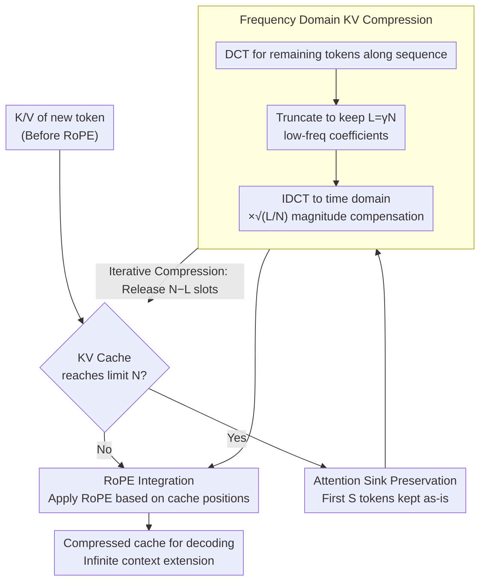

# FreqKV: Key-Value Compression in Frequency Domain for Context Window Extension

**Conference**: ICLR 2026  
**arXiv**: [2505.00570](https://arxiv.org/abs/2505.00570)  
**Code**: [GitHub](https://github.com/LUMIA-Group/FreqKV)  
**Area**: Model Compression / LLM Efficiency  
**Keywords**: KV Cache Compression, Frequency Domain Transformation, Context Window Extension, DCT, Long-context Inference

## TL;DR

FreqKV is proposed as a parameter-free, architecture-agnostic KV cache compression method. By iteratively compressing KV states in the frequency domain (preserving low frequencies and discarding high frequencies), it extends the context window of LLaMA-2-7B to 256K with only 8K length fine-tuning while maintaining stable perplexity.

## Background & Motivation

The inference capability of LLMs is limited by the context window size set during pre-training, with performance dropping sharply beyond this window. Existing solutions have their limitations:

**Position Encoding Methods** (ALiBi, PI, LongRoPE): Rely on full self-attention, incurring excessive quadratic computational costs.

**KV Cache Eviction Methods** (SnapKV, PyramidKV, FastKV): Discard unimportant tokens based on attention scores; however, information from discarded tokens is permanently lost, leading to performance degradation in subsequent decoding and an inability to extrapolate beyond the context window.

**Token Merging Methods** (CaM, KVMerger, D2O): Retain more information but perform poorly without fine-tuning.

**Extra Module Methods** (LoCoCo, Activation Beacon): Introduce additional parameters to compress KV states, increasing memory overhead.

**Key Insight**: The authors observe that KV states in LLMs exhibit strong energy concentration in the frequency domain—energy is primarily concentrated in low-frequency components. While initial embeddings in the first layer lack a clear low-frequency bias, subsequent layers gradually shift energy to low frequencies as decoding progresses. This implies that high-frequency components are largely redundant and can be discarded with minimal loss.

Further perturbation experiments confirm: low-frequency components encode global semantic information and long-range dependencies, showing robustness to input perturbations; high-frequency components capture local details and are sensitive to perturbations. In summarization tasks, preserving low-frequency components significantly outperforms preserving high-frequency ones (e.g., GovReport: 25.51 vs. 14.21).

## Method

### Overall Architecture

FreqKV transforms the KV cache into the frequency domain using the Discrete Cosine Transform (DCT) along the sequence dimension, retaining only the energy-concentrated low-frequency components and discarding redundant high-frequency ones. It then returns to the time domain via Inverse DCT (IDCT) to obtain a shorter cache. The pipeline operates around a cache limit $N$: tokens within the window undergo standard attention; once the cache is filled, a few initial attention sink tokens are preserved as-is, while the remaining tokens undergo frequency domain compression to free up space for new tokens. This iterative process allows the context window to be infinitely extended. Notably, compression occurs before applying RoPE to the Keys, ensuring the process introduces no parameters, requires no structural changes, and needs no positional extrapolation.

### Key Designs

**1. Frequency Domain KV Compression: Removing high-frequency redundancy instead of entire tokens**

Eviction methods discard tokens with low attention, causing permanent information loss. FreqKV takes a different perspective: since KV state energy is concentrated in low frequencies, one can compress the representation precision without losing tokens. Specifically, DCT is applied to Keys and Values along the sequence dimension to obtain spectra $Z_K = \mathrm{DCT}(K)$ and $Z_V = \mathrm{DCT}(V)$. Given a retention ratio $\gamma$, the cache length is truncated from $N$ to $L = \gamma N$, retaining only the first $L$ low-frequency coefficients. After truncation, IDCT is applied to return to the time domain, multiplied by a scaling factor $\sqrt{L/N}$ to restore original magnitude—since DCT and IDCT normalization differ by factors of $\sqrt{N}$ and $\sqrt{L}$, this factor prevents signal amplification across multiple iterations:

$$K_{\text{comp}} = \sqrt{L/N}\,\mathrm{IDCT}(Z_K[0{:}L]),\quad V_{\text{comp}} = \sqrt{L/N}\,\mathrm{IDCT}(Z_V[0{:}L])$$

The compressed results replace the original cache for subsequent attention. Global semantics of all tokens are preserved via low-frequency components, albeit with reduced representation precision.

**2. Iterative Compression: Natural degradation for distant tokens and high precision for proximal tokens**

To support infinite context, compression must be applied repeatedly. FreqKV sets a cache upper limit $N$: standard attention is used within the window until the cache is full, triggering one round of frequency compression to release $N-L$ slots. Consequently, earlier tokens undergo more compression cycles and have lower precision, while tokens closer to the current position are compressed less. This aligns with the "recency bias" of auto-regressive LLMs. As compression only triggers every $N-L$ tokens with a cost of $O(N\log N)$, the overhead per step is negligible, and total attention cost grows linearly with input length. This iterative strategy allows models trained at 8K to extrapolate to 256K.

**3. Attention Sink Preservation: Anchoring the initial tokens**

LLMs exhibit the attention sink phenomenon, where unusually high attention is allocated to initial tokens serving as global anchors. Compressing these disrupts the attention distribution. Thus, FreqKV keeps the first $S$ tokens ( $S=4$ in experiments) in the cache without compression. Frequency compression only acts on content following the sink tokens.

**4. RoPE Integration: Navigating extrapolation challenges**

RoPE embeds absolute positions into Keys. If compression occurs after encoding, position indices become corrupted, necessitating extrapolation or interpolation. FreqKV compresses and caches Keys before applying RoPE. RoPE is only applied during attention calculation using the current position indices within the cache. Thus, compressed Keys always use valid internal positions, naturally extending context without interpolation.

### Loss & Training

FreqKV is parameter-free but requires minimal fine-tuning to adapt the model to the frequency-compressed cache distribution. For LLaMA-2, the model is fine-tuned on RedPajama at 8K length for language modeling and on LongAlpaca instruction data for the chat version. LLaMA-3 is similar, fine-tuned at 16K. The training process employs the same chunk-wise pipeline as inference, alternating between attention calculation and frequency compression.

## Key Experimental Results

### Main Results

**Table 1: PG-19 Perplexity Evaluation (LLaMA-2-7B)**

| Training Length | Method | Inference Cache | 2K | 4K | 8K | 16K | 32K |
|:---:|------|:---:|:---:|:---:|:---:|:---:|:---:|
| 8K | Full FT | Full | 7.55 | 7.21 | 6.98 | - | - |
| 8K | LoCoCo | Comp. | 8.15 | 8.08 | 7.27 | - | - |
| 8K | LongLoRA | Full | 7.70 | 7.35 | 7.14 | - | - |
| 8K | **FreqKV** | Comp. | **7.45** | **7.12** | **7.04** | **7.02** | **7.02** |
| 32K | LongLoRA | Full | 8.29 | 7.83 | 7.54 | 7.35 | 7.22 |
| 32K | **FreqKV** | Comp. | **7.47** | **7.14** | **7.04** | **7.00** | **6.98** |

FreqKV extends the context to 32K with only 8K training (PPL 7.02), outperforming LongLoRA trained at 32K (7.22). FreqKV also suffers no performance loss in short contexts (2K/4K), even exceeding Full FT.

**Table 2: LongBench Long-context Understanding (LLaMA-2-chat-7B, 50% retention)**

| Method | Single-doc QA | Multi-doc QA | Summarization | Few-shot | Code | Average |
|------|:---:|:---:|:---:|:---:|:---:|:---:|
| Full Cache | 24.9 | 22.5 | 24.6 | 60.0 | 48.1 | 35.17 |
| SnapKV | 25.4 | 22.3 | 24.0 | 59.1 | 48.0 | 36.81 |
| FastKV | 25.5 | 22.9 | 23.7 | 57.6 | 54.5 | 36.33 |
| PyramidKV | 25.3 | 21.3 | 23.9 | 59.8 | 48.0 | 36.84 |
| **FreqKV** | **24.2** | **27.9** | **24.7** | 56.0 | **58.8** | **37.85** |

FreqKV outperforms all KV eviction and merging methods at a 50% compression rate, with significant gains in multi-doc QA (+5.4 vs. SnapKV) and code tasks (+10.8 vs. Full Cache).

### Ablation Study

- **Frequency Component Selection**: Preserving low frequencies is significantly superior to preserving high frequencies.
- **Retention Ratio $\gamma$**: $\gamma=0.5$ provides a good trade-off.
- **Sink Token Count $S$**: $S=4$ is sufficient; gains diminish beyond this.
- **Model Scale**: Effectively reduces PPL on LLaMA-2-13B from 6.95 (Full FT @ 8K) to 6.41 (FreqKV @ 32K).

### Key Findings

1. **No Permanent Information Loss**: Unlike eviction, FreqKV retains information from all tokens via low-frequency components.
2. **Minimal Training for Large Extension**: Stable PPL at 256K achieved with only 8K training.
3. **Short Context Resilience**: Performance does not degrade (and sometimes improves) within the original window.
4. **Universality**: Modularly effective for both MHA (LLaMA-2) and GQA (LLaMA-3).
5. **Natural Alignment**: Iterative compression inherently prioritizes recent tokens over distant ones.

## Highlights & Insights

- Examining KV cache compression from a frequency domain perspective is a novel and elegant approach, rooted in the mathematical energy concentration property of DCT.
- Completely parameter-free and architecture-agnostic; truly plug-and-play.
- The iterative strategy naturally achieves "high precision for recent tokens, low precision for distant tokens."
- Compressing Keys before RoPE and re-encoding positions avoids the difficult position extrapolation problem.

## Limitations & Future Work

1. The assumption of symmetric signal extension in DCT might not hold for extreme KV distributions.
2. Fixed retention ratio $\gamma$ may not be optimal for all layers/heads; adaptive ratios could yield further gains.
3. Compressed "tokens" no longer correspond to physical token positions, potentially affecting tasks requiring precise location information.
4. Not yet validated on 70B+ scale models.
5. Orthogonal to token eviction methods; the synergy between the two remains unexplored.

## Related Work & Insights

FreqKV is the first to introduce frequency domain learning into KV cache compression for decoder-only LLMs. Previous frequency domain methods were primarily used in CNNs or Transformer encoders (e.g., FNet). This method could complement token eviction or inspire the use of other signal processing techniques like Wavelet Transforms in LLM optimization.

## Rating

- Novelty: ⭐⭐⭐⭐⭐
- Technical Depth: ⭐⭐⭐⭐
- Experimental Thoroughness: ⭐⭐⭐⭐⭐
- Utility: ⭐⭐⭐⭐⭐
- Writing Quality: ⭐⭐⭐⭐

<!-- RELATED:START -->

## Related Papers

- [\[ACL 2025\] SCOPE: Optimizing Key-Value Cache Compression in Long-context Generation](../../ACL2025/model_compression/scope_optimizing_key-value_cache_compression_in_long-context_generation.md)
- [\[ICLR 2026\] FASA: Frequency-Aware Sparse Attention](fasa_frequency-aware_sparse_attention.md)
- [\[ICLR 2026\] GmNet: Revisiting Gating Mechanisms From A Frequency View](gmnet_revisiting_gating_mechanisms_from_a_frequency_view.md)
- [\[NeurIPS 2025\] QSVD: Efficient Low-Rank Approximation for Unified Query-Key-Value Weight Compression](../../NeurIPS2025/model_compression/qsvd_efficient_low-rank_approximation_for_unified_query-key-value_weight_compres.md)
- [\[CVPR 2026\] FreqSIC: Frequency-aware Stereo Image Compression with Bi-directional Checkerboard Context Model](../../CVPR2026/model_compression/freqsic_frequency-aware_stereo_image_compression_with_bi-directional_checkerboar.md)

<!-- RELATED:END -->
