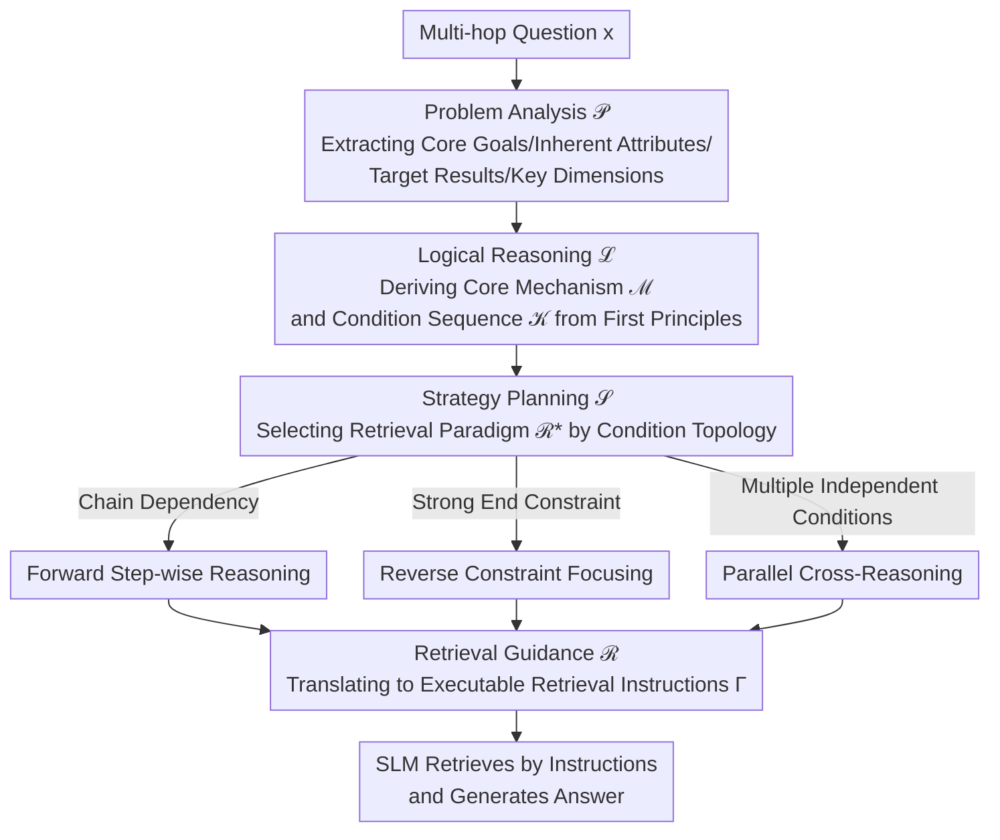

# FutureMind: Equipping Small Language Models with Strategic Thinking-Pattern Priors via Adaptive Knowledge Distillation

**Conference**: ICLR 2026  
**arXiv**: [2602.01222](https://arxiv.org/abs/2602.01222)  
**Code**: None  
**Area**: Knowledge Distillation/RAG  
**Keywords**: Small Language Models, Thinking Pattern Distillation, Retrieval Strategy, Multi-hop QA, Modular Reasoning

## TL;DR
Proposes FutureMind, a training-free framework that distills structured reasoning and retrieval strategies from LLMs into reusable thinking-pattern priors. Through a four-stage pipeline (problem analysis → logical reasoning → strategy planning → retrieval guidance) and three retrieval paradigms, it enables SLMs to achieve SOTA performance on multi-hop QA.

## Background & Motivation

**Background**: LLMs exhibit excellent performance on complex reasoning tasks but suffer from high inference latency and costs; SLMs are efficient and low-cost but lack sufficient capability in knowledge-intensive multi-hop reasoning. RAG helps SLMs access external knowledge, but single-step retrieval struggles to handle complex multi-hop questions.

**Limitations of Prior Work**: Existing "deep search" methods (e.g., Search-o1) embed retrieval into the reasoning chain, which places excessive demands on the memory capacity and context retention of SLMs. CoT distillation transfers reasoning traces but lacks adaptability; Prompt distillation encodes static templates and does not support dynamic planning.

**Key Challenge**: SLMs require "explicit retrieval logic" to decide when, what, and how to search, but executing this logic requires powerful reasoning capabilities—the very thing SLMs lack.

**Goal**: How to equip SLMs with structured reasoning and strategic retrieval planning capabilities without requiring gradient updates?

**Key Insight**: Instead of distilling specific knowledge (which becomes obsolete), distill thinking patterns. First, allow an LLM to generate a complete reasoning-retrieval strategy, and then inject this strategy template into the SLM in the form of a prompt.

**Core Idea**: Use LLMs to generate structured retrieval strategies as thinking priors for SLMs, with a four-stage pipeline ensuring systematic reasoning.

## Method

### Overall Architecture
FutureMind addresses the problem of enabling small language models (SLMs) to perform complex question answering that requires structured reasoning and multi-hop retrieval without incurring training costs. The approach involves outsourcing the "thinking and searching" methodology to an LLM teacher—the teacher develops a reasoning-retrieval strategy within a single turn, and the SLM is responsible for executing it accordingly. The entire pipeline is coordinated by a Thinking Module $\mathcal{M}$, connecting four stages: $F = \mathcal{M}\langle\mathcal{P}, \mathcal{L}, \mathcal{S}, \mathcal{R}\rangle$—Problem Analysis $\mathcal{P}$ decomposes the question, Logical Reasoning $\mathcal{L}$ derives conditions, Strategy Planning $\mathcal{S}$ selects the most appropriate from three retrieval paradigms, and Retrieval Guidance $\mathcal{R}$ translates the strategy into executable retrieval instructions. Finally, the SLM performs retrieval and generates answers according to the instructions. The entire process is training-free.

### Key Designs

**1. Problem Analysis Module $\mathcal{P}$**: Decomposing complex queries into structural components.

SLMs often fail to grasp key points when directly facing a multi-hop question. This module decomposes the input query into four elements: Core Goal $\mathcal{O}$, Inherent Attribute $\mathcal{A}$, Target Result $\mathcal{T}$, and Key Dimension $\mathcal{C}$. After decomposition, a chaotic question is transformed into a set of labeled sub-goals, establishing a structural foundation for subsequent logical reasoning and retrieval planning, preventing the SLM from being overwhelmed by complex semantics.

**2. Logical Reasoning Module $\mathcal{L}$**: Deriving conditions from causal structures using first principles rather than memory.

The prior knowledge of SLMs is often incomplete; if they rely on memory to fill in answers, errors occur easily. This module adopts a first-principles approach, deriving the Core Mechanism $\mathcal{M}$ and a sequence of Key Conditions $\mathcal{K}$ from the causal structure of the question. Explicitly deriving "which conditions must be met and in what order" effectively maps out the subsequent retrieval path, reducing the dependency of the SLM on its own incomplete priors.

**3. Strategy Planning Module $\mathcal{S}$**: Dynamically selecting the most appropriate retrieval paradigm based on condition topology.

The structure of different problems varies significantly, making a one-size-fits-all retrieval approach inefficient. This module dynamically selects the optimal retrieval strategy $\mathcal{R}^*$ based on the condition topology obtained in the previous step. The candidates consist of three universal paradigms: (A) Forward Step-wise Reasoning, narrowing the candidate set from general to specific, $X_j = \{x \in X_{j-1} \mid \phi(K_j, x)=1\}$, suitable for questions with chain dependencies; (B) Reverse Constraint Focusing, expanding backward from the tightest constraint, suitable for questions with strong terminal constraints; (C) Parallel Cross-Reasoning, performing parallel searches for independent conditions and then taking the intersection, suitable for problems with many independent conditions. Matching the paradigm to the problem structure compresses the search space more effectively than a fixed retrieval method.

**4. Retrieval Guidance Module $\mathcal{R}$**: Translating abstract strategies into retrieval instructions executable by SLMs.

The outputs of the previous three steps remain at the cognitive strategy level, which SLMs cannot execute directly. This module is responsible for bridging the gap between strategy and actual execution by grounding the reasoning strategy into actionable retrieval instructions—specifying which keywords to use, which resources to check, the order of queries, and how to filter results. Consequently, the SLM only needs to follow the instructions, leaving the heavy lifting of "figuring out how to search" to the teacher strategy.

### Loss & Training
- Entirely training-free, utilizing pure prompt engineering.
- Employs Google Web Search API to retrieve top-10 results.
- Incorporates a ToolCall (TC) framework to achieve parallel search.

## Key Experimental Results

### Main Results
Four multi-hop QA benchmarks (on 3B SLM):

| Method | 2WikiMQA | MuSiQue | Bamboogle | FRAMES | Average |
|------|----------|---------|-----------|--------|------|
| Naive (No retrieval) | Low | Low | Low | Low | Low |
| Standard RAG | Medium | Medium | Medium | Medium | Medium |
| Search-o1 | High | High | High | High | High |
| FutureMind (3B) | **Highest** | **Highest** | **Highest** | **Highest** | **SOTA** |

### Cross-model Validation

| Model Scale | Qwen-2.5 3B | Qwen-2.5 7B | Qwen-2.5 72B | Llama-3.1 8B |
|----------|------------|------------|-------------|-------------|
| FutureMind Gain | **Largest** | Large | Medium | Large |

### Key Findings
- FutureMind shows the largest gain on SLM (3B), indicating that thinking-pattern distillation is more helpful for models with weaker capabilities.
- Improvements are also observed on 72B LLMs, suggesting that explicit retrieval strategies are valuable even for large models.
- Discovery of the "Cognitive Bias Bottleneck": When teacher strategies exceed the student's cognitive capacity, distillation becomes lossy—reasoning chains break and amplify noise.
- Among the three retrieval paradigms, Parallel Cross-Reasoning shows a clear advantage in problems with many independent conditions.

## Highlights & Insights
- **Thinking-Pattern Distillation vs. Knowledge Distillation**: Instead of distilling specific answers or reasoning steps, this method distills the strategic patterns of "how to think and plan retrieval." This strategy does not rely on specific knowledge and can generalize to unseen problems.
- **Discovery of Cognitive Bias Bottleneck**: A teacher that is too powerful may generate strategies the student cannot understand; teacher-student compatibility is more important than teacher size. This provides guidance for distillation research.
- **Three Retrieval Paradigms**: Abstracting multi-hop retrieval into three universal patterns (Forward/Backward/Parallel) makes it transferable to other tasks requiring structured retrieval.

## Limitations & Future Work
- Dependent on the LLM teacher to generate strategies; teacher quality directly limits the upper bound.
- Being entirely training-free means the model cannot learn from or correct its own errors.
- The quality of the Google search API affects final performance.
- Strategy selection (A/B/C) is determined by the LLM teacher, as the SLM cannot autonomously choose one itself.

## Related Work & Insights
- **vs. Search-o1**: While Search-o1 embeds retrieval within reasoning, it places high demands on the SLM. FutureMind pre-generates retrieval strategies to reduce executive difficulty for the SLM.
- **vs. ReAct**: ReAct is a general reasoning-acting paradigm; FutureMind is more targeted, designing three specific paradigms for retrieval strategies.
- **vs. CoT Distillation**: CoT distillation transfers reasoning steps, whereas FutureMind transfers retrieval strategies, operating at a higher hierarchical level.

## Rating
- Novelty: ⭐⭐⭐⭐ The concept of thinking-pattern distillation is novel, and the three retrieval paradigms are well-designed.
- Experimental Thoroughness: ⭐⭐⭐⭐ Validated across multiple models, datasets, and scales.
- Writing Quality: ⭐⭐⭐⭐ The framework description is clear, and formal definitions are complete.
- Value: ⭐⭐⭐⭐ Of practical value for SLM deployment and RAG optimization.

<!-- RELATED:START -->

## Related Papers

- [\[ICLR 2026\] Diffusion Models as Dataset Distillation Priors](diffusion_models_as_dataset_distillation_priors.md)
- [\[ICLR 2026\] Knowledge Distillation for Large Language Models through Residual Learning](knowledge_distillation_for_large_language_models_through_residual_learning.md)
- [\[ICLR 2026\] Knowledge Fusion of Large Language Models Via Modular Skillpacks](knowledge_fusion_of_large_language_models_via_modular_skillpacks.md)
- [\[ICLR 2026\] Pedagogically-Inspired Data Synthesis for Language Model Knowledge Distillation](pedagogically-inspired_data_synthesis_for_language_model_knowledge_distillation.md)
- [\[ICLR 2026\] Efficient Reasoning with Balanced Thinking](efficient_reasoning_with_balanced_thinking.md)

<!-- RELATED:END -->
