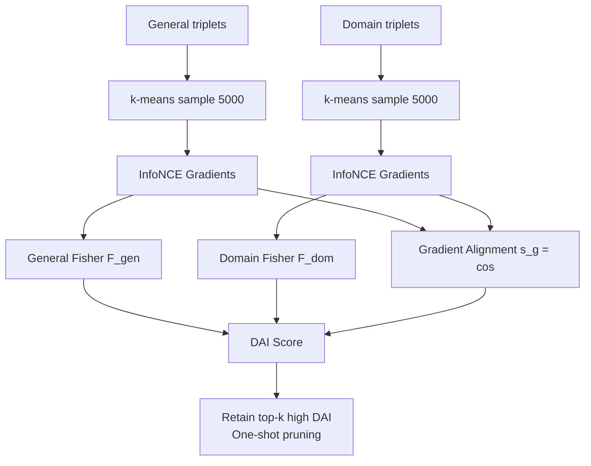

# GAPrune: Gradient-Alignment Pruning for Domain-Aware Embeddings

**Conference**: ICLR 2026  
**OpenReview**: [https://openreview.net/forum?id=GLELajHnCo](https://openreview.net/forum?id=GLELajHnCo)  
**Code**: [https://github.com/yixuantt/GAPrune](https://github.com/yixuantt/GAPrune)  
**Area**: Model Compression / Domain-Adaptive Embedding Model Pruning  
**Keywords**: Model Pruning, Embedding Models, Domain Adaptation, Fisher Information, Gradient Alignment, Information Bottleneck  

## TL;DR
GAPrune measures parameter domain importance via Fisher Information and cross-domain alignment via the cosine similarity between general and domain gradients. These are fused into a Domain-Alignment Importance (DAI) score for one-shot pruning, ensuring compressed embedding models retain general language capabilities while strengthening domain expertise on finance and chemistry benchmarks.

## Background & Motivation
**Background**: Domain-specific embedding models (finance retrieval, code agents, biomedicine) significantly outperform general-purpose models on specialized semantic tasks. However, SOTA embedding models are mostly based on LLMs with billions of parameters, leading to high deployment costs. The authors highlight a telling phenomenon: the 0.6B version of Qwen3-Embedding has nearly 9 times the downloads of the more powerful 8B version—**efficiency often outweighs performance in real-world selection**.

**Limitations of Prior Work**: Pruning is a natural compression method, but existing approaches (magnitude pruning, SparseGPT, Wanda, etc.) evaluate parameter importance from a "unified perspective," treating all parameters equally and failing to distinguish between those carrying "general semantics" and "domain knowledge."

**Key Challenge**: This leads to two opposing failure modes: (1) focusing only on the general perspective causes parameters encoding critical domain knowledge to be deleted as "generally unimportant"; (2) focusing only on domain samples loses general language capabilities, causing overall performance to drop. Pruned models either lose specialization or foundational ability.

**Goal**: Compress embedding models while **simultaneously** preserving domain expertise and the general language foundation, providing efficient domain-specific models for direct deployment.

**Key Insight**: **[Dual-Dimension Parameter Characterization]** Instead of a single criterion, each parameter is characterized along two dimensions: domain importance (Fisher Information) + alignment between general and domain objectives (gradient cosine similarity). The DAI score unifies these signals to prune parameters that are either "unimportant for the domain" or "create conflict between general and domain objectives."

## Method

### Overall Architecture
GAPrune formalizes domain pruning as a constrained optimization problem: minimize domain loss degradation $\mathcal{L}_{dom}(\theta\odot m)-\mathcal{L}_{dom}(\theta)$ under the sparsity constraint $\|m\|_0 \le k$. The workflow consists of three serial stages: sampling 5,000 representative contrastive triplets each from general and domain datasets for efficient gradient computation; calculating Fisher Information (importance) and cross-domain gradient cosine similarity (alignment) for each parameter; and fusing these signals into a DAI score guided by Information Bottleneck principles. Pruning is completed in one shot by retaining top-k parameters with the highest DAI.

### Key Designs

**1. Representative Data Sampling: Controlling gradient calculation costs via clustering.** Since Fisher Information and gradients require backpropagation across data, the authors use Qwen3-Embedding-0.6B to generate embeddings for the query $q$ of each triplet. K-means clustering ($k=5000$, 20 iterations) is performed in the embedding space, and the sample nearest to each centroid is selected to ensure 5,000 calibration samples uniformly cover the semantic space. All data are formatted as contrastive triplets $(q, p, n)$, and gradients are calculated with InfoNCE loss.

**2. Fisher Information for Parameter Importance (Domain vs. General).** Fisher Information measures the curvature of the loss surface at a parameter, i.e., "how much perturbing this parameter changes the model output." For parameter $\theta_j$, a diagonal Fisher approximation $\hat F_{jj}=\frac{1}{N}\sum_{i=1}^{N}\left(\frac{\partial L_i}{\partial \theta_j}\right)^2$ is used. Crucially, this is calculated **separately** on general and domain data to obtain $F^{gen}_{jj}$ and $F^{dom}_{jj}$, facilitating the calculation of "net domain value."

**3. Cross-Domain Gradient Alignment: Revealing shared, specific, or conflicting parameters.** Fisher Information indicates importance but not interaction. The authors average general gradients $g^{gen}_j$ and domain gradients $g^{dom}_j$ across batches to reduce noise, then calculate cosine similarity $s^j_g=\frac{\langle g^{gen}_j, g^{dom}_j\rangle}{\|g^{gen}_j\|\|g^{dom}_j\|+\varepsilon}$. This $s^j_g\in[-1,1]$ maps to three categories: $s^j_g>0$ (consistent across domains, core shared semantics); $s^j_g\approx 0$ (context-specific, acting differently in different domains); $s^j_g<0$ (conflicting contributions between general and domain goals, prioritized for pruning).

**4. DAI Score: Implementing the IB trade-off.** From an Information Bottleneck perspective, an optimal sub-network should maximize fidelity to the domain task while discarding information that causes general-domain conflict. This is implemented via the Domain-Alignment Importance score:
$$\text{DAI}_j=\Big[(F^{dom}_{jj}-\beta\cdot F^{gen}_{jj})\cdot|\theta_j|+\gamma\cdot\sqrt{|\theta_j|}\Big]\cdot(1+\alpha\cdot s^j_g)$$
The first term $(F^{dom}_{jj}-\beta F^{gen}_{jj})\cdot|\theta_j|$ rewards parameters with high domain Fisher and penalizes those important only for general tasks, weighted by magnitude $|\theta_j|$. $\beta$ controls the intensity of general capability preservation. The second term $\gamma\sqrt{|\theta_j|}$ encourages retaining expressive capacity via large weights. The third term $(1+\alpha s^j_g)$ is an alignment modulator, rewarding consistent parameters and penalizing conflicting ones. Experiments use $\beta=1.0, \alpha=0.2, \gamma=0.5$.

## Key Experimental Results

### Main Results (One-shot Pruning, Qwen3-Embedding-4B, ∆% rel. to dense)

| Method | Sparsity | FinMTEB Avg / ∆% | ChemTEB Avg / ∆% |
|------|--------|------------------|------------------|
| Dense | – | 0.5353 / – | 0.7639 / – |
| Random | 50% | 0.2165 / **-59.55%** | 0.2445 / -68.00% |
| Magnitude | 50% | 0.5171 / -3.40% | 0.7299 / -4.44% |
| General Fisher | 50% | 0.3623 / -32.32% | 0.6461 / -15.42% |
| Domain Fisher | 50% | 0.4887 / -8.70% | 0.7060 / -7.57% |
| **GAPrune** | 50% | **0.5224 / -2.41%** | **0.7462 / -2.31%** |

At 30% sparsity, GAPrune outperforms all baselines on both benchmarks (FinMTEB +1.35%, ChemTEB +0.04%).

### Ablation Study (Prune-and-Retrain, 50% Sparsity, 100 steps)

| Model | Change after Retraining |
|------|-----------|
| Qwen3-Embedding-4B (FinMTEB) | **+4.51%** |
| Qwen3-Embedding-4B (ChemTEB) | **+1.73%** |

After retraining, GAPrune not only recovers but **surpasses** the dense model.

### Key Findings
- At 50% sparsity, General Fisher performance drops over 30% on FinMTEB, while GAPrune drops only 2.41%, indicating that **gradient alignment provides critical signals that Fisher Information alone misses**.
- Random pruning drops 40–60%, highlighting that "who to prune" is more important than "how much to prune" in domain-specific contexts.
- GAPrune remains robust at 60–65% sparsity, where baselines experience catastrophic collapse.

## Highlights & Insights
- **Explicit two-dimensional parameter decomposition**: Domain importance × cross-domain alignment is more suited for domain adaptation than treating all parameters equally.
- **Semantic interpretation of gradient cosine similarity**: The positive/zero/negative states provide an interpretable basis for pruning decisions.
- **Pruning as enhancement**: Exceeding dense performance after retraining suggests that pruning conflicting parameters mitigates optimization interference, acting as a form of denoising or regularization.

## Limitations & Future Work
- Focuses on unstructured pruning in MLP layers; does not address attention heads or structured sparsity for hardware acceleration.
- Validated only on two domains (finance, chemistry) and two models; broader applicability across architectures needs verification.
- The DAI formula introduces hyperparameters $\alpha, \beta, \gamma$, creating potential deployment friction if re-tuning is required for new domains.
- Requires construction of domain contrastive triplets and GPT-4o-mini query generation, posing a barrier for scenarios without domain data.

## Related Work & Insights
- **LLM Pruning**: SparseGPT and Wanda are designed for generative LLMs based on perplexity. GAPrune notes that embedding models are evaluated on nDCG@10/accuracy and are more sensitive to specific deletions.
- **Domain-Aware Pruning**: Previous works (Zhang et al. 2024) proved domain pruning preserves knowledge in LLMs, but GAPrune fills the gap for LLM-based embedding models.
- **Insight**: Quantizing cross-task conflict via gradient alignment is a transferable strategy for parameter allocation in multi-task or continual learning.

## Rating
- **Novelty**: ⭐⭐⭐⭐ Fusing Fisher importance with cross-domain alignment in DAI for embedding models is clear and theoretically supported by IB.
- **Experimental Thoroughness**: ⭐⭐⭐⭐ Solid comparison across models, domains, and protocols (one-shot and retraining), though more domains could be covered.
- **Writing Quality**: ⭐⭐⭐⭐ High readability with intuitive explanations of gradient states and DAI components.
- **Value**: ⭐⭐⭐⭐ Directly addresses deployment pain points; the finding of "pruning as enhancement" is significant.

<!-- RELATED:START -->

## Related Papers

- [\[ICLR 2026\] Token Distillation: Attention-Aware Input Embeddings for New Tokens](token_distillation_attention-aware_input_embeddings_for_new_tokens.md)
- [\[ICLR 2026\] Gradient Intrinsic Dimensionality Alignment：Narrowing The Gap Between Low-Rank Adaptation and Full Fine-Tuning](gradient_intrinsic_dimensionalityalignmentnarrowing_the_gap_between_low-rank_ad.md)
- [\[ICLR 2026\] Constraint-guided Hardware-aware NAS through Gradient Modification](constraint-guided_hardware-aware_nas_through_gradient_modification.md)
- [\[AAAI 2026\] Prototype-Based Semantic Consistency Alignment for Domain Adaptive Retrieval](../../AAAI2026/model_compression/prototype-based_semantic_consistency_alignment_for_domain_adaptive_retrieval.md)
- [\[ICLR 2026\] GradPruner: Gradient-guided Layer Pruning Enabling Efficient Fine-Tuning and Inference for LLMs](gradpruner_gradient-guided_layer_pruning_enabling_efficient_fine-tuning_and_infe.md)

<!-- RELATED:END -->
