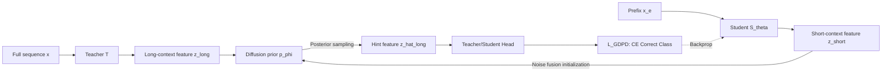

# Generative Diffusion Prior Distillation for Long-Context Knowledge Transfer

**Conference**: ICLR 2026  
**OpenReview**: [https://openreview.net/forum?id=e5tepxQfE1](https://openreview.net/forum?id=e5tepxQfE1)  
**Code**: To be confirmed  
**Area**: Knowledge Distillation / Model Compression / Time Series Classification  
**Keywords**: Knowledge Distillation, Diffusion Prior, Posterior Sampling, Early Time Series Classification, full-to-partial distillation  

## TL;DR
This work reformulates the "full-sequence teacher $\rightarrow$ partial-sequence student" distillation as an **inverse problem**. It treats the student's short-context features as "degraded observations" of the target long-context features. By using a diffusion model as a generative prior for the teacher's features to perform posterior sampling, the method provides each student feature with a set of "dynamic, diverse, and aggregatable" teacher signals. This enables a classifier seeing only sequence prefixes to achieve generalization capabilities approximating those of a full-sequence model.

## Background & Motivation
- **Background**: Many time-series classification tasks (e.g., ECG arrhythmia detection, industrial monitoring) are constrained by latency, cost, or sensor drops during deployment, meaning only a **partial prefix** of the sequence is available at inference time, rather than the complete sequence assumed during training. Knowledge Distillation (KD) is a natural way to transfer the generalization ability of a full-sequence teacher to a partial-sequence student.
- **Limitations of Prior Work**: Classical KD methods (e.g., logit matching by Hinton, feature matching like FitNets/RKD/Attention) are designed for **parameter capacity gaps** where the teacher and student observe the same data. In this scenario, there is a natural representation chasm due to **different input spaces** (full sequence vs. prefix), which persists even if model capacities are identical.
- **Key Challenge**: The teacher's full-context features act as an "overwhelming" hard target for a student that has only encoded partial context. This paper identifies three KD pathologies amplified by the full-to-partial setting: (1) direct alignment with full-context features **drowns** the student, preventing knowledge transfer; (2) a single teacher perspective is **insufficiently diverse**, leading students to overfit to a specific interpretation of missing information; (3) training data mismatch makes it difficult for students to **faithfully reproduce** (low fidelity) the teacher's prediction distribution.
- **Goal**: To enable students trained and deployed on prefix inputs to achieve the generalization and fidelity of full-sequence models using a single teacher without retraining multiple models.
- **Core Idea**: Instead of treating the teacher signal as a fixed point target $k^\star=z_t$, "knowledge" is modeled as a **distribution** conditioned on the student's current state $k\sim p(K\mid Z_s=z_s)$, with these signals obtained via posterior sampling using a diffusion prior on the teacher's feature manifold.

## Method

### Overall Architecture
GDPD treats the student feature $z_{\text{short}}=S^{\text{feat}}_\theta(x_e)$ as a degraded measurement of an ideal full-context feature $z^*_{\text{long-ideal}}$. A diffusion model is first trained on teacher features $z_{\text{long}}$ as a generative prior $p_\phi(z_{\text{long}})$. Then, "hint features" $\hat z_{\text{long}}$ are obtained through posterior sampling conditioned on $z_{\text{short}}$. The student is constrained such that if its posterior reconstruction can be correctly classified by the teacher's classification head, the student feature is pushed toward $z^*_{\text{long-ideal}}$. Training consists of two stages: a warm-up phase for the diffusion prior, followed by prior-guided extraction of long-context knowledge by the student.

### Key Designs

**1. Distillation as an Inverse Diffusion Problem: Student features as "degraded observations"**. The paper adopts an inverse diffusion perspective: given a degraded measurement $y=D(z_0)$, the goal is to recover $z_0$ from the posterior $p(z_0\mid y)\propto p(y\mid z_0)\,p_\phi(z_0)$. Here, $z_{\text{short}}$ acts as the degraded measurement, $z^*_{\text{long-ideal}}$ is the clean signal to be recovered, and the diffusion model provides the learned prior $p_\phi(z_{\text{long}})$. This step essentially changes "feature alignment" from rigid $\ell_2$ distance to "finding the complete version on the teacher manifold that best explains the current student feature," naturally avoiding the drowning problem.

**2. Conditional Posterior Sampling via Unconditional Priors: Noise Fusion Initialization**. Since the diffusion prior is trained **unconditionally** on teacher features, the challenge is how to sample conditioned on $z_{\text{short}}$. Unlike standard guided sampling (e.g., DPS) which uses likelihood gradients at each reverse step (requiring a fixed measurement), GDPD's conditional signal $z_{\text{short}}$ is itself being optimized. The authors use a direct initialization strategy: the student feature is fused with Gaussian noise to serve as the starting point of the reverse process:
$$z_{\text{long},T}=\alpha\, z_{\text{short}}+(1-\alpha)\,\epsilon,\quad \epsilon\sim\mathcal N(0,I)$$
where $\alpha$ is **learned per-feature** during distillation, allowing different features to enter the starting step at appropriate noise levels. Sampling from this point is pulled by $z_{\text{short}}$ while exploring the teacher manifold, converging to a credible clean feature $\hat z_{\text{long}}$.

**3. Defining Hint Features via Classification Success, Not Direct Alignment**. The hint feature $z_{\text{long-hint}}$ is defined **functionally** as a teacher feature containing the long-range information necessary for correct classification. Supervision does not force $\hat z_{\text{long}}$ to approach a specific $z_t$, but constrains its posterior reconstruction to output the correct label through the classifier:
$$\mathcal L_{\text{GDPD}}(\theta)=\mathbb E_{(x,y)}\Big[\ell_{\text{CE}}\big(S^{\text{head}}_\theta(\hat z_{\text{long}}),\,y\big)\Big],\quad \hat z_{\text{long}}\sim\tilde p_{\text{diff}}\big(z_{\text{long}}\mid z_{\text{short}}=S^{\text{feat}}_\theta(x_e)\big)$$
This implies that if the student feature retains sufficient long-context information (minimal degradation relative to the hint), it should be able to recover a valid $z_{\text{long-hint}}$ as a credible completion.

**4. Knowledge as Distribution: Stochastic Trajectories for "Diversity + Progression + Aggregation"**. Traditional KD uses a single point $k^\star=z_t$ (equivalent to $P_{K\mid Z_s}=\delta_{k^\star}$). GDPD uses expected loss:
$$\mathbb E_{k\sim p(\cdot\mid z_s)}[\ell(z_s;\theta,k)]\approx\frac1J\sum_{j=1}^J \ell\big(z_s;\theta,k^{(j)}\big)$$
Since each forward pass follows a different noise trajectory, the student naturally covers multiple samples over training; in practice, $J=1$ is sufficient. These three properties address the three pathologies: signals are drawn **dynamically/progressively** based on current student capability $z_s;\theta_t$ (preventing drowning); diffusion sampling ensures diversity is **constrained** to the teacher manifold (avoiding manual noise outliers); and signals from multiple trajectories **collectively aggregate** into more complete long-range knowledge (improving fidelity).

## Key Experimental Results

Datasets: UCR Univariate, UEA Multivariate, and PhysioNet mortality data. Net1→Net2 denotes teacher→student distillation. Results are averaged over 5 runs.

### Main Results (UCR datasets across different earliness, LSTM3-100→LSTM3-100)

| Earliness | Metric | Base | Base-KD | Fits | **GDPD** |
|---|---|---|---|---|---|
| 0.2L | Avg.AUC-PRC | 63.64 | 69.23 | 67.47 | **73.83** |
| 0.2L | Avg.Rank↓ / Top-1 Count | 3.50 / 0 | 2.42 / 2 | 2.92 / 0 | **1.17 / 10** |
| 0.4L | Avg.AUC-PRC | 70.44 | 78.03 | 75.36 | **81.70** |
| 0.6L | Avg.AUC-PRC | 76.79 | 83.70 | 81.15 | **86.00** |
| 0.8L | Avg.AUC-PRC | 77.79 | 84.78 | 82.74 | **89.02** |
| 0.8L | Avg.Rank↓ / Top-1 Count | 3.67 / 0 | 2.42 / 0 | 2.83 / 1 | **1.08 / 11** |

GDPD achieves the best AUC-PRC and lowest average rank across all earliness levels, winning on over 80% of the datasets.

### Comparison with KD Variants (e=0.5L, 12 UCR)
Against RKD, Attention, DKD, DT2W, VID, PKT, TeKAP, TTM, Base-KD, and Fits, GDPD ranks top-3 on 80% of datasets with an average rank of 2.25, while no other method approaches 4.

### Key Findings
- **Generalization**: All distilled students outperform the non-distilled Base, proving that full-context knowledge helps partial classification; GDPD provides the largest gain.
- **Fidelity**: Measured by teacher-student top-1 agreement, GDPD consistently outperforms Base-KD / Fits across all earliness levels, suggesting that "collective signals" reproduce the teacher's predictive structure (class separability, feature geometry) better than point signals.
- **Ablation of J**: Since different noise trajectories are taken each forward pass, diversity is covered over the time dimension, making $J=1$ sufficient.

## Highlights & Insights
- **Paradigm Shift**: This is the first work to model teacher knowledge as a "generative distribution" rather than a point target, formalizing the teacher-student feature relationship as an **ill-posed inverse problem**. This perspective is clean, transferable, and applicable beyond time series to any distillation where teacher and student see different input spaces.
- **Clever Conditional Sampling**: Using learnable noise fusion weights $\alpha$ for initialization bypasses the difficulty of using fixed likelihood gradients when the conditional signal itself is being optimized.
- **Functional Definition of Hints**: By only requiring reconstructions to be correctly classified rather than approximating a specific feature, the method avoids rigid alignment, directly addressing the "drowning" of students by full-context features.
- The three KD pathologies (effectiveness, diversity, fidelity) are solved simultaneously by a single mechanism (distributional signals).

## Limitations & Future Work
- Evaluation primarily uses UCR/UEA + PhysioNet time series with small-to-medium models (like LSTM), mostly in **homogenous teacher-student** settings (LSTM3-100→LSTM3-100). Scalability to cross-architecture or large-scale models remains to be verified.
- The introduction of a diffusion prior, posterior sampling, and two-stage training makes **training costs and hyperparameters (warm-up, $\alpha$, $\lambda$)** higher than direct feature KD, though inference remains unchanged.
- Designed specifically for "prefix/partial observations," its generalizability to other input distribution mismatches (domain shift, missing modalities) is an open question.
- The conclusion that $J=1$ is sufficient relies on training steps naturally covering diversity; whether this holds for very few training steps or small batches warrants investigation.

## Related Work & Insights
- **Classic KD**: Includes logit matching (Hinton 2015), intermediate feature matching (FitNets, Attention, RKD), and methods for capacity gaps like teacher-assistant (Mirzadeh 2020) and student-friendly teachers. GDPD notes these assume identical input spaces.
- **Diverse Teachers**: Methods like teacher ensembles, Deep Mutual Learning (DML), and single-model multi-perspective generation (TeKAP, 2025). GDPD instead uses diffusion sampling to constrain "diversity" within the teacher manifold.
- **Distillation Fidelity**: Stanton 2021 noted that mismatch between the distillation set and the teacher's training set reduces fidelity, which corresponds to the full-to-partial scenario.
- **Inverse Diffusion**: Borrowing inverse problem solving from DDRM (2022) and DPS (2023) into "feature space distillation" provides the foundational methodology.
- **Insight**: For any supervision scenario where target signals are ambiguous or multi-vocal (weak labels, missing observations, early decision-making), shifting from point targets to generative distributions with posterior sampling may serve as a universal robustification paradigm.

## Rating
- **Novelty**: ⭐⭐⭐⭐⭐ First to model teacher knowledge as a generative distribution and the teacher-student relationship as inverse diffusion; consistent and opens the full-to-partial distillation direction.
- **Experimental Thoroughness**: ⭐⭐⭐⭐ Covers various earliness, multiple datasets, and 10+ KD variants; includes fidelity and J ablation. However, lacks cross-architecture/large model validation.
- **Writing Quality**: ⭐⭐⭐⭐ Clear logical loop from pathologies to mechanism to verification; formulas and diagrams are well-placed.
- **Value**: ⭐⭐⭐⭐ Addresses the real-world need for early/partial time series classification; the paradigm is transferable to broader input-mismatch distillation tasks.

<!-- RELATED:START -->

## Related Papers

- [\[ICLR 2026\] TiTok: Transfer Token-level Knowledge via Contrastive Excess to Transplant LoRA](titok_transfer_token-level_knowledge_via_contrastive_excess_to_transplant_lora.md)
- [\[ICLR 2026\] In Good GRACES: Principled Teacher Selection for Knowledge Distillation](in_good_graces_principled_teacher_selection_for_knowledge_distillation.md)
- [\[ICLR 2026\] SGD-Based Knowledge Distillation with Bayesian Teachers: Theory and Guidelines](sgd-based_knowledge_distillation_with_bayesian_teachers_theory_and_guidelines.md)
- [\[ICLR 2026\] Pedagogically-Inspired Data Synthesis for Language Model Knowledge Distillation](pedagogically-inspired_data_synthesis_for_language_model_knowledge_distillation.md)
- [\[ICLR 2026\] Channel-Aware Mixed-Precision Quantization for Efficient Long-Context Inference](channel-aware_mixed-precision_quantization_for_efficient_long-context_inference.md)

<!-- RELATED:END -->
