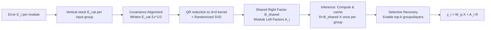

# GlowQ: Group-Shared Low-Rank Approximation for Quantized LLMs

**Conference**: ICLR 2026  
**OpenReview**: [https://openreview.net/forum?id=kVojSLUcvS](https://openreview.net/forum?id=kVojSLUcvS)  
**Code**: [https://github.com/ahnselim/GlowQ](https://github.com/ahnselim/GlowQ)  
**Area**: Model Compression / Quantization Error Compensation  
**Keywords**: Low-rank compensation, Post-training quantization, Shared right factor, Covariance alignment, Selective recovery  

## TL;DR
GlowQ transforms the paradigm of "independent low-rank error correction for every layer" into "sharing a right factor $B$ per input group, caching the projection $BX$ once for reuse across modules," while selectively recovering specific groups/layers based on benefit. This significantly reduces first-token latency and increases throughput for quantized LLMs with negligible accuracy loss.

## Background & Motivation
**Background**: 4-bit post-training quantization (GPTQ/AWQ/BitsAndBytes) is the standard for LLM deployment, but low-bitwidths suffer from accuracy degradation. "Low-rank error compensation" methods (LQER, QERA, ASER, etc.) address this by approximating the quantization error $W-W_q\approx AB$ with high-precision low-rank terms, restoring quality by adding $A(BX)$ during inference.

**Limitations of Prior Work**: Existing methods almost exclusively attach independent $(A_\ell,B_\ell)$ modules to **every layer and every projection**, leading to **repeated computation of high-precision projections $B_\ell X$** across the network. This results in triple waste: (i) modules sharing the same input tensor (e.g., Q/K/V sharing the attention input) repeat the same expensive projection; (ii) materializing multiple copies of $BX$ increases memory bandwidth traffic; (iii) subspace selection objectives often ignore the strong anisotropy of real activations, allocating limited rank to directions that are rarely used. Consequently, the accuracy-efficiency tradeoff under strict latency budgets is worse than theoretically achievable.

**Key Challenge**: While low-rank compensation recovers accuracy, the "layer-wise independent + layer-wise recomputation" deployment model imposes unnecessary costs in latency and memory—the algorithmic gains of the compensation modules are offset by engineering overhead.

**Goal**: Retain the expressiveness of layer-wise correction while eliminating redundant computation and memory usage, making low-rank compensation truly cost-effective under real deployment budgets.

**Core Idea**: **[Group-Sharing + Single Projection Caching]** Modules sharing the same input are treated as a group, learning a single shared right factor $B_{shared}$ while maintaining individual left factors $A_i$. During inference, $R=B_{shared}X$ is computed and cached once per group, followed by lightweight $A_i R$ operations. This is augmented by **[Covariance Alignment]** to align the limited rank with high-frequency data directions and **[Selective Recovery]** to enable correction only for the most beneficial groups/layers.

## Method

### Overall Architecture
GlowQ consists of three components: first, error matrices of modules with the same input are vertically stacked for joint low-rank fitting (theoretically equivalent to truncated SVD of the stacked matrix); second, a covariance alignment objective directs the right subspace toward high-frequency data directions, solved efficiently via QR-reduction and randomized SVD without materializing large matrices; finally, during inference, $R=B_{shared}X$ is cached and reused once per group, with only the top-k units selectively recovered based on importance scores.

### Key Designs

**1. Group-Shared Right Factor: One B for the whole group, proven optimal**  For $m$ modules sharing the same input dimension $d$, their error matrices are vertically concatenated into $E_{cat}=[E_1^T\cdots E_m^T]^T$ to solve $\min_{A,B}\|E_{cat}-AB\|_F^2$. The paper presents Proposition 1: joint fitting with a single right factor $B$ is equivalent to a low-rank fit on the stacked matrix $E_{cat}$. By the Eckart-Young-Mirsky theorem, the optimal $B$ spans the top $r$ right singular subspaces of $E_{cat}$. Allowing each module an independent $B_i$ does not increase expressiveness (differences can be absorbed into an invertible reparameterization of $A_i$). This mathematically proves that "layer-wise independent $B_\ell$" is redundant—a shared $B$ is both sufficient and optimal, legally collapsing multiple large $BX$ matrix multiplications into one projection plus several inexpensive $A_iR$ products.

**2. Covariance Alignment: Aligning limited rank with data directions**  Pure stacked SVD only considers the geometry of the error matrix, whereas real activations are highly anisotropic. Empirical measurements show input covariance spectra follow a power-law decay $\lambda_r\propto r^{-\alpha}$ (MLP $\alpha\approx0.77$, QKV $\alpha\approx1.19$), meaning representation space usage is highly concentrated. Without weighting, the selected subspace may mismatch data preferences, wasting rank. Ours uses a "usage-weighted" objective: expected loss $\mathbb{E}\|Mx\|_2^2=\|M\Sigma_x^{1/2}\|_F^2$, equivalent to low-rank fitting after right-multiplying a whitening matrix: $\min_{A,B}\|(E_{cat}-AB)\Sigma_x^{1/2}\|_F^2$. Propositions 2/3 prove that minimizing usage-weighted risk is exactly equal to minimizing right-weighted reconstruction error, with the global optimum given by the rank-$r$ SVD of the whitened error $\tilde E=E_{cat}\Sigma_x^{1/2}$. In practice, the whitened version captures cumulative energy significantly faster under the same rank.

**3. QR-Reduction Randomized SVD: Scalable solver without high-dimensional materialization**  Directly performing SVD on the large whitened matrix is computationally expensive and numerically unstable. Ours uses a three-step approach: first, a thin QR decomposition on $E_{cat}$ reduces the "tall $m$" problem into a $d\times d$ kernel $M=R_e\Sigma_x^{1/2}$ (leveraging left-orthogonal invariance of the Frobenius norm); second, randomized SVD (with $p$ oversampling columns and $q$ power iterations) is performed on the kernel to extract the dominant right subspace, reducing complexity from $O(d^3)$ to $O(d^2(r+p)+qd^2(r+p))$; third, balanced recovery $\hat A^\star=U_r\Sigma_r^{1/2}$, $\hat B^\star=\Sigma_r^{1/2}V_r^T$ improves stability before lifting factors back to original variables. This solving process occurs once offline.

**4. Caching + Selective Recovery: Converting algorithmic savings into latency/throughput gains**  The shared structure allows each group to materialize $R_\ell=XB_{\ell,shared}^T$ once. Module $i$ simply performs a small correction $y_i=W_i^{(q)}X+A_{\ell,i}R_\ell$. An anchor strategy ensures $R_\ell$ is computed exactly once and consumed a fixed number of times (e.g., Q as the anchor for K/V in attention; gate as the anchor for up in MLP). Solo modules (o_proj, down_proj) are computed on-the-fly. Under a latency budget, components are activated based on a top-k ranking using two metrics: the GSVD energy capture score $g_{ec}(u)=\sum_{j=1}^r\sigma_j(M_u)^2/\|M_u\|_F^2$ and the normalized error ratio $g_{ner}(u)=\|E_u\|_F^2/\|W_u\|_F^2$. This yields two versions: full GlowQ and lightweight GlowQ-S.

## Key Experimental Results
Evaluations cover 11+ variants including LLaMA 2/3, Qwen 2.5/3, OPT, Mistral, and Qwen1.5-MoE. Setup: W4A16 (int4 weights g128, fp16 activations), rank fixed at 64, 64 calibration sequences of length 2048, no fine-tuning. Baselines include PTQ (BnB/AWQ/GPTQ) and error correction methods (L2QER/ZeroQuant-V2/QERA).

### Main Results (WikiText-2 PPL, Lower is Better, Selected)

| Method | LLaMA3.2-3B | LLaMA3.1-8B | Qwen2.5-7B | Qwen3-8B | Mistral-7B |
|---|---|---|---|---|---|
| FP16 | 7.81 | 6.24 | 6.86 | 9.73 | 5.32 |
| AWQ | 8.24 | 6.64 | 7.11 | 10.19 | 5.51 |
| QERA | 8.22 | 6.64 | 8.09 | 10.07 | 5.48 |
| L2QER | 8.30 | 6.75 | 8.14 | 10.07 | 5.46 |
| **GlowQ** | **8.16** | **6.59** | **7.07** | **9.90** | **5.42** |
| GlowQ-S | 8.22 | 6.62 | 7.09 | 9.97 | 5.45 |

GlowQ achieved the best or tied-best results in 9 out of 11 variants.

### Downstream Accuracy + C4 (Table 2, Selected)

| Method | LLaMA3.2-3B Acc↑ | LLaMA3.1-8B Acc↑ | Qwen3-8B Acc↑ | Qwen3-14B Acc↑ |
|---|---|---|---|---|
| FP16 | 67.14 | 73.29 | 71.48 | 74.10 |
| QERA | 65.48 | 72.86 | 69.86 | 73.14 |
| L2QER | 66.19 | 72.43 | 69.52 | 73.24 |
| **GlowQ** | **66.90** | **73.33** | **70.71** | **73.84** |

### Efficiency & Selective Recovery
- Compared to strong baselines, GlowQ reduces **TTFB by 5.6% and increases throughput by 9.6%** on average, while decreasing WikiText-2 PPL by 0.17% and increasing downstream accuracy by 0.42 percentage points.
- The selective version **GlowQ-S reduces TTFB by 23.4% and increases throughput by 37.4%**, with an average accuracy loss of less than 0.2 percentage points (typically recovering ~50% of units).

## Key Findings
- **Layer-wise independent B is redundant**: Shared right factors do not compromise expressiveness and save massive amounts of repeated projections and compensation parameters.
- **Covariance alignment significantly accelerates energy capture**: Under heavy-tailed anisotropic activations, whitening allows the recovery of more error energy for the same rank.
- **Selective recovery sweet spot is around 50%**: Recovering approximately 50% of groups/layers captures most of the accuracy while yielding the largest latency/throughput gains.

## Highlights & Insights
- Attributes the "slowness of low-rank compensation" to the engineering perspective of **repeated projections caused by shared inputs**, then eliminates it via a clean algebraic proposition (optimality of shared B). Theoretical and system gains are perfectly aligned.
- Covariance alignment is not an arbitrary weighting but derived from the equivalence of "usage-weighted risk = right-weighted reconstruction error," supported by power-law spectra.
- The anchor/consumer cache scheduling maps "single projection reuse" onto concrete attention/MLP structures, making it directly reproducible in engineering.

## Limitations & Future Work
- Primarily targets **W4A16 weight quantization error**, with gains narrowing at W4A4; activation quantization remains a more difficult challenge.
- Importance scoring rules for GlowQ-S **vary by model family** (requiring family-specific selection of GSVD/NER/Layer order), lacking a unified cross-family adaptive strategy.
- Absolute precision gains (PPL -0.17%, Acc +0.42pt) are modest; the primary value lies in **latency/throughput at equivalent accuracy** rather than accuracy alone.
- Covariance/SVD steps require offline computation on high-end GPUs, and end-to-end costs for resource-constrained scenarios were not fully discussed.

## Related Work & Insights
- **Low-Rank Error Compensation**: LQER/ZeroQuant-V2(LoRC)/QERA/ASER established the $W\approx W_q+AB$ compensation paradigm. GlowQ builds upon this to solve deployment inefficiencies of "layer-wise independence + recomputation."
- **Joint/Collective Matrix Factorization**: The idea of shared right subspaces originates from collective matrix factorization (Singh & Gordon 2008) and shared singular subspace recovery (Ma & Ma 2024), which Ours systematically migrates to LLM input-sharing modules.
- **Pruning-style Saliency Selection**: Selective recovery borrows saliency/importance scoring from pruning (Molchanov, Nagel, Banner, etc.), framing "whether to compensate a layer" as a top-k selection under budget constraints.
- **Inspiration**: When an enhancement module is "attached to every layer," check if inputs are shared and if computation can be collapsed. This "group-sharing + single calculation caching + selective activation" approach could extend to LoRA, adapters, and KV cache correction.

## Rating
- Novelty: ⭐⭐⭐⭐ — Reframes low-rank compensation from "layer-wise independent" to "group-shared right factors + cached projection," with algebraic proofs of optimality.
- Experimental Thoroughness: ⭐⭐⭐⭐ — Covers 11+ model variants, multiple baselines, PPL/accuracy/latency/throughput, and ablation of selective recovery.
- Writing Quality: ⭐⭐⭐⭐ — Coherent chain of motivation-theory-implementation-deployment.
- Value: ⭐⭐⭐⭐ — Real-world latency reduction and throughput increases at equivalent accuracy, though small absolute accuracy gains limit the ceiling.

<!-- RELATED:START -->

## Related Papers

- [\[ICLR 2026\] WSVD: Weighted Low-Rank Approximation for Fast and Efficient Execution of Low-Precision Vision-Learning Models](wsvd_weighted_low-rank_approximation_for_fast_and_efficient_execution_of_low-pre.md)
- [\[ICLR 2026\] Taming Momentum: Rethinking Optimizer States Through Low-Rank Approximation](taming_momentum_rethinking_optimizer_states_through_low-rank_approximation.md)
- [\[ICLR 2026\] UniQL: Unified Quantization and Low-Rank Compression for Adaptive Edge LLMs](uniql_unified_quantization_and_low-rank_compression_for_adaptive_edge_llms.md)
- [\[ACL 2025\] GSQ-Tuning: Group-Shared Exponents Integer in Fully Quantized Training for LLMs On-Device Fine-tuning](../../ACL2025/model_compression/gsq-tuning_group-shared_exponents_integer_in_fully_quantized_training_for_llms_o.md)
- [\[ICLR 2026\] SERQ: Saliency-Aware Low-Rank Error Reconstruction for LLM Quantization](serq_saliency-aware_low-rank_error_reconstruction_for_llm_quantization.md)

<!-- RELATED:END -->
