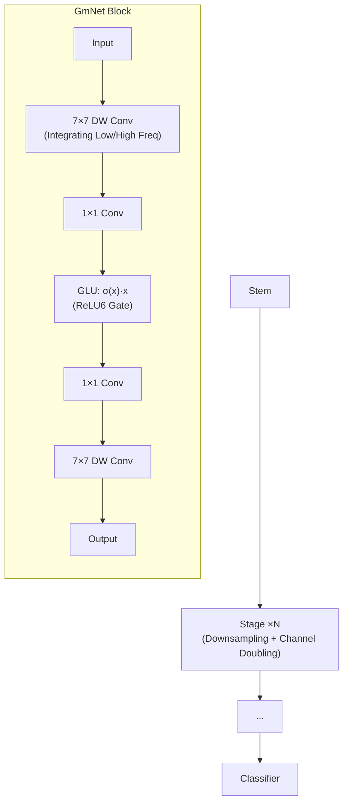

# GmNet: Revisiting Gating Mechanisms From A Frequency View

**Conference**: ICLR 2026  
**OpenReview**: [https://openreview.net/forum?id=dkfEwHobXq](https://openreview.net/forum?id=dkfEwHobXq)  
**Code**: [https://github.com/YFWang1999/GmNet](https://github.com/YFWang1999/GmNet)  
**Area**: Lightweight Networks / Efficient Model Design  
**Keywords**: Gated Linear Unit (GLU), Frequency Analysis, Spectral Bias, Lightweight Networks, Convolution Theorem  

## TL;DR
This paper provides the first systematic frequency-domain explanation for the effectiveness of Gated Linear Units (GLUs): element-wise multiplication corresponds to frequency-domain convolution that widens the spectrum, and non-smooth activations preserve high-frequency energy. Based on this, the authors design GmNet, a minimalist architecture using a simple $\sigma(x)\cdot x$ gate to correct the spectral bias in lightweight models, achieving new SOTA results for efficient models on ImageNet.

## Background & Motivation
**Background**: Lightweight networks are essential for edge deployment. Mainstream designs follow two paradigms: pure convolution (e.g., MobileOne, RepViT) and hybrid convolution-attention (e.g., EfficientFormerV2). While these works reduce parameters and FLOPs, their optimization goals focus almost exclusively on execution speed.

**Limitations of Prior Work**: Neural networks exhibit a widely verified **spectral bias**, where networks naturally favor learning simple, low-frequency global patterns over high-frequency details like textures and edges. In lightweight models, where capacity and depth are restricted, this spectral bias is further amplified, leading to the loss of fine-grained information critical for complex recognition tasks.

**Key Challenge**: Gating mechanisms such as GLUs have repeatedly proven effective in models like Mamba, Llama3, and gMLP. However, the academic understanding of GLUs remains limited to functional descriptions like "adaptive information gating." **No existing work has explained from a frequency perspective what GLUs actually change in a network, and the link between GLUs and the long-standing problem of spectral bias remains unexplored.**

**Goal**: Systematically analyze the frequency-domain behavior of GLUs, establish a clear link between their core operations and spectral modulation capabilities, and design a lightweight architecture capable of actively countering spectral bias.

**Core Idea**: The superposition of two properties—**Element-wise Multiplcation = Frequency-domain Convolution (Convolution Theorem) + Non-smooth Activation preserving high frequencies**—endows GLUs with an innate ability to "selectively amplify high frequencies." Embedding this principle into a standard lightweight backbone yields SOTA performance without complex training tricks.

## Method

### Overall Architecture
The paper proceeds in two steps: first, it decomposes why GLUs improve high-frequency learning using frequency-domain theory and controlled experiments (from the perspectives of element-wise multiplication and activation functions); second, it implements these findings in GmNet—a network that equips a standard lightweight backbone with a minimalist GLU ($\sigma(x)\cdot x$). GmNet adopts a classic hybrid architecture: each stage uses convolutional downsampling to double the channel count. Inside each block, $7\times7$ depthwise convolutions at the beginning and end handle the fusion of low/high-frequency information, sandwiching two $1\times1$ convolutions and a minimalist gating unit. ReLU6 is used consistently as the activation function.

### Key Designs

**1. Spectrum Widening via Element-wise Multiplication: Explaining GLU's High-Frequency Capability via Convolution Theorem** Starting from frequency-domain first principles, the paper notes that the element-wise multiplication at the core of a GLU is not merely simple information scaling. The Convolution Theorem states that element-wise multiplication in the spatial domain is equivalent to convolution in the frequency domain: $(u\cdot v)(x)=\mathcal{F}^{-1}(U*V)$, where $\cdot$ denotes element-wise multiplication and $*$ denotes convolution. In the most intuitive case of self-convolution, if the support of $F(\omega)$ is $[-\Omega,\Omega]$, the support of $F*F(\omega)$ expands to $[-2\Omega,2\Omega]$. In other words, element-wise multiplication **actively widens the spectral range of features**, providing the network with more opportunities to capture and learn both high and low-frequency components. This is the frequency-domain root of GLU's ability to correct spectral bias.

**2. High-Frequency Preservation via Non-smooth Activations: Linking Smoothness to Spectral Decay** Since gating involves an activation function, the paper further analyzes how activation smoothness affects frequency characteristics. Fourier analysis yields a classic conclusion: the smoother a function (the higher the order of its derivatives), the faster its Fourier transform magnitude decays. According to the differentiation property $\mathcal{F}[f^{(n)}(t)]=(j\omega)^n F(\omega)$, the high-frequency components of smooth functions decay rapidly at a rate of $1/|\omega|^n$. Conversely, non-smooth activations like ReLU, which feature "sharp corners" and discontinuous derivatives, decay slowly at a rate of only $1/|\omega|$, **naturally containing rich high-frequency energy**. Controlled experiments on ResNet18 verify this: non-smooth ReLU6 consistently outperforms smooth GELU in learning high-frequency components across various thresholds, while GELU is relatively stronger in low frequencies. This explains the choice of ReLU6 for GmNet—it strengthens high frequencies while suppressing high-frequency overfitting better than pure ReLU (performing better in low frequencies).

**3. Minimalist $\sigma(x)\cdot x$ Gate: Self-Reinforcing Alignment over Independent Projection** The GLU in GmNet adopts the minimalist form $\sigma(x)\cdot x$, where the gating signal and the modulated signal originate from the same representation, creating a "self-reinforcing" alignment. This contrasts with approaches in StarNet or EfficientMod that use independent projections (dual-channel FC, DW, LN, Pool) to generate gates. Independent projections essentially act as general filters that may be less sensitive to fine high-frequency changes critical for classification. Shared representations ensure that significant changes (especially high-frequency components) are consistently reinforced rather than suppressed. This design achieves two goals: making the model extremely lightweight (no extra convolutions/FCs in the GLU) and ensuring that the gating behavior is theoretically consistent and interpretable. Ablations show that $\sigma(x)\cdot x$ significantly leads high-frequency classification compared to more complex variants, validating that "minimalist is optimal."

## Key Experimental Results

### Main Results: ImageNet-1K Classification
Models were trained for 300 epochs from scratch using AdamW without re-parameterization, distillation, or neural architecture search. Latency was measured on A100 GPU and iPhone 14 (CoreML).

| Model | Top-1 (%) | Params (M) | FLOPs (G) | GPU (ms) | Mobile (ms) |
|---|---|---|---|---|---|
| MobileV2-1.0 | 72.0 | 3.4 | 0.3 | 1.7 | 0.9 |
| **GmNet-S1** | **75.5** | 3.7 | 0.6 | 1.6 | 1.0 |
| EfficientFormerV2-S1 | 77.9 | 4.5 | 0.7 | 3.4 | 1.1 |
| **GmNet-S2** | **78.3** | 6.2 | 0.9 | 1.9 | 1.1 |
| RepViT-M1.0 / StarNet-S4 | 78.6 / 78.4 | 6.8 / 7.5 | 1.2 / 1.1 | 3.6 / 3.3 | 1.1 |
| **GmNet-S3** | **79.3** | 7.8 | 1.2 | 2.1 | 1.3 |
| RepViT-M1.5 | 81.2 | 14.0 | 2.3 | 6.4 | 1.7 |
| LeViT-256 | 81.5 | 18.9 | 1.1 | 6.7 | 31.4 |
| **GmNet-S4** | **81.5** | 17.0 | 2.7 | 2.9 | 1.9 |

GmNet-S3 outperforms RepViT-M1.0/StarNet-S4 by 1.9%/0.9% and is over 30% faster on GPU. GmNet-S4 achieves parity with LeViT-256 in accuracy but is 2× faster on GPU and 16× faster on iPhone.

### Ablation Study

**Frequency behavior of activation functions (GmNet-S3, split by frequency bands)**:

| Activation | Raw | r=12 High | r=24 High | r=36 High |
|---|---|---|---|---|
| Identity | 70.5 | 12.6 | 1.7 | 0.7 |
| ReLU | 78.3 | 45.9 | 13.5 | 4.9 |
| GELU | 78.4 | 41.5 | 9.4 | 3.9 |
| **ReLU6** | **79.3** | **51.7** | 12.1 | 4.7 |

The transition from Identity to ReLU results in an 11% Gain on raw accuracy, but an average increase of over 3× in high frequencies. ReLU6 significantly outperforms GELU at smaller high-frequency radii while maintaining better low-frequency performance than ReLU (better resistance to high-frequency overfitting).

**Comparison of GLU Designs (GmNet-S3)**:

| GLU Design | Top-1 (%) | Params (M) | GPU (ms) | r=12 High |
|---|---|---|---|---|
| σ(x)·LN(x) | 78.9 | 7.8 | 2.9 | 47.6 |
| σ(x)·DW(x) | 79.0 | 8.0 | 2.4 | 49.0 |
| σ(x)·FC(x) | 79.2 | 20.2 | 3.6 | 51.4 |
| **σ(x)·x** | **79.3** | **7.8** | **2.1** | **51.7** |

The minimalist $\sigma(x)\cdot x$ is simultaneously optimal in accuracy, parameters, latency, and high-frequency classification. While the FC design is close in high-frequency performance, its parameters explode to 20.2M with the highest latency.

### Key Findings
- **High-frequency comparison at equal latency**: At $r=12$, GmNet-S3 achieves 51.7% high-frequency accuracy, significantly leading EfficientMod-xs (45.4%), StarNet-S4 (43.3%), and MobileOne-S2 (35.0%), while all methods have similar low-frequency accuracy. This proves that GmNet's gains primarily stem from high-frequency modeling.
- Replacing activations in MobileNetV2 MLP blocks with GLUs directly improves total accuracy by enhancing high-frequency classification, verifying that "high-frequency modeling is more critical for lightweight models."
- There is no rule that "sacrificing low frequency for high frequency always results in a better overall model." To achieve optimal raw accuracy, a model must possess balanced learning capabilities across all frequency bands.

## Highlights & Insights
- **Powerful Theoretical Explanation**: By utilizing two classic Fourier conclusions—the Convolution Theorem (element-wise multiplication $\rightarrow$ spectrum widening) and derivative properties (activation smoothness $\rightarrow$ high-frequency decay)—the authors transform the "black-box" GLU into an interpretable spectral modulator. This is the first work to systematically analyze GLUs from a frequency perspective.
- **Counter-intuitive yet Consistent "Minimalism is Optimal"**: $\sigma(x)\cdot x$ without any projection or normalization outperforms other variants in both efficacy and efficiency. This is because the shared representation between the gate and modulated signal forms a self-reinforcing alignment, closing the loop between theoretical analysis and architectural design.
- **Substantial Engineering Value**: SOTA performance is achieved with standard end-to-end training without re-parameterization, distillation, or NAS. Its GPU latency advantage is particularly prominent (S4 is 2-16× faster than LeViT-256 at the same accuracy).

## Limitations & Future Work
- The analysis primarily focuses on image classification; whether the frequency-domain advantages of GLUs hold for dense prediction tasks like detection and segmentation remains unverified.
- The frequency-domain explanation is based on simplified scenarios such as self-convolution and single activations. A quantitative characterization of how the spectrum evolves cascading through deep layers is lacking.
- Key hyperparameters, such as the truncation radius $r$ and the upper bound of ReLU6, currently rely on empirical conclusions rather than an adaptive selection mechanism.
- The potential for further improvements by combining GmNet with orthogonal techniques like re-parameterization or distillation hasn't been explored.

## Related Work & Insights
- **GLU Lineage**: From GLU (Dauphin 2017) and SwiGLU (Shazeer 2020) to Mamba and gMLP, gating has been treated as "adaptive information control." This work provides the missing frequency-domain explanation.
- **Spectral Bias**: Rahaman 2019, Tancik 2020, and Yin 2019 revealed the phenomenon of networks learning low frequencies first, but these remained largely diagnostic. This paper is a rare effort to "actively counter spectral bias using efficient architectural mechanisms."
- **Lightweight Networks**: Models like MobileOne, RepViT, and EfficientFormerV2 optimize compute metrics but overlook the spectral fidelity of representations. GmNet identifies this as a blind spot in efficient design and proposes a new "frequency-domain correction" principle.
- **Inspiration**: Treating activation "smoothness" as a tunable spectral knob and considering whether gating and modulated signals share representations are perspectives that can be transferred to the design of token mixers, attention gating, and other modules.

## Rating
- **Novelty**: ⭐⭐⭐⭐⭐ First systematic explanation of GLU from a frequency perspective, connecting the Convolution Theorem and spectral bias—two seemingly unrelated topics—with coherent reasoning.
- **Experimental Thoroughness**: ⭐⭐⭐⭐ Main ImageNet experiments cover 4 scales and multi-platform latency. Detailed ablations on activations, GLU designs, and cross-method frequency bands are provided, though limited to classification.
- **Writing Quality**: ⭐⭐⭐⭐ Clear theoretical progression from intuitive illustrations to mathematical derivations and architectural implementation.
- **Value**: ⭐⭐⭐⭐ Provides an interpretable, SOTA efficient model without "bells and whistles." The frequency-domain design principles offer practical inspiration to the lightweight network community.

<!-- RELATED:START -->

## Related Papers

- [\[ICLR 2026\] FASA: Frequency-Aware Sparse Attention](fasa_frequency-aware_sparse_attention.md)
- [\[ICLR 2026\] Revisiting Weight Regularization for Low-Rank Continual Learning](revisiting_weight_regularization_for_low-rank_continual_learning.md)
- [\[ICLR 2026\] Multi-View Encoders for Performance Prediction in LLM-Based Agentic Workflows](multi-view_encoders_for_performance_prediction_in_llm-based_agentic_workflows.md)
- [\[ICLR 2026\] Knowledge Distillation as Decontamination? Revisiting the "Data Laundering" Concern in Classification Tasks](knowledge_distillation_as_decontamination_revisiting_the_data_laundering_concern.md)
- [\[CVPR 2026\] Cross-View Distillation and Adaptive Masking for Incomplete Multi-View Multi-Label Classification](../../CVPR2026/model_compression/cross-view_distillation_and_adaptive_masking_for_incomplete_multi-view_multi-lab.md)

<!-- RELATED:END -->
