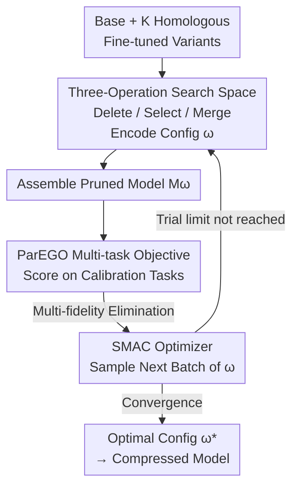

# GPTailor: Large Language Model Pruning Through Layer Cutting and Stitching

**Conference**: ICLR 2026  
**OpenReview**: [https://openreview.net/forum?id=yCTpYe3UOL](https://openreview.net/forum?id=yCTpYe3UOL)  
**Code**: https://github.com/Guinan-Su/auto-merge-llm (Available)  
**Area**: Model Compression  
**Keywords**: Structured Pruning, Layer Cutting, Model Merging, Zeroth-order Optimization, Multi-fidelity Search

## TL;DR
GPTailor reformulates LLM structured pruning as a zeroth-order optimization problem of "layer-wise cutting and stitching over a family of fine-tuned variants from the same base." It supports three operations: layer deletion, cross-model layer selection, and layer merging. By employing a ParEGO multi-task objective and SMAC multi-fidelity search to automatically find configurations, it allows Llama2-13B to retain 97.3% of its original performance after removing approximately 25% of layers without any post-training repair, significantly exceeding previous SOTA.

## Background & Motivation

**Background**: The mainstream routes for compressing large models and reducing deployment costs include quantization, knowledge distillation, and structured pruning. Quantization requires specialized hardware support, and distillation involves expensive retraining of small models. In contrast, structured pruning directly removes redundant structures (such as entire layers), making it hardware-agnostic and flexible, and thus widely studied.

**Limitations of Prior Work**: Existing structured pruning methods (LLMPruner, SliceGPT, LaCo, ShortGPT, etc.) almost all manually design importance metrics on a "single model"—using gradient information or Block Influence derived from hidden state changes to judge which layers to delete. These methods have two major flaws: first, deletion almost inevitably leads to performance degradation; second, to recover performance, a round of full-parameter post-training is often required, which is costly.

**Key Challenge**: Information in single-model pruning is "one-off"—the capabilities carried within a deleted layer are permanently lost and can only be "re-grown" through post-training. The root of the problem is that by **focusing only on one model, there is nowhere else to recover the lost capabilities**.

**Key Insight**: The authors observe that the same base model (e.g., Llama2-13B) generates numerous task-specific fine-tuned variants—those specialized in code, mathematics, or language understanding. These variants are "close enough" (distantly related fine-tuning with small weight differences) such that they can exchange layers or even stitch matching layers from multiple variants together using model merging. Thus, capability losses caused by layer deletion can be compensated for using the "corresponding layers of other variants."

**Goal**: Instead of pruning an isolated model, the object of pruning is shifted to a "family of fine-tuned variants." By selecting, deleting, and merging layers among them, a smaller but fully capable model is assembled.

**Core Idea**: Pruning is reconstructed as a zeroth-order optimization problem—searching for configurations of "retaining/deleting each layer, which variant to choose from, and whether/how to merge" across a candidate model family. Data-driven multi-fidelity search replaces expert manual metrics, yielding high-quality compressed models without the need for post-training.

## Method

### Overall Architecture

The input to GPTailor is a base model $M_{base}$ and $K$ homologous fine-tuned variants $\mathcal{M}=\{M_1,\dots,M_K\}$, and the output is a pruned model meeting the target sparsity rate $s$ (percentage of deleted layers). Unlike traditional compression, which follows the "calculate metrics → delete layers → post-training" pipeline, the entire pipeline is expressed as a constrained optimization problem:

$$\omega^* = \arg\min_{\omega\in\Omega} f(M_\omega) \quad \text{s.t.} \quad S(M_\omega)\le s$$

Each configuration $\omega$ specifies how to pick, delete, and merge layers from candidate models to assemble $M_\omega$. $f(\cdot)$ measures performance on calibration data, and $S(\cdot)$ calculates the proportion of deleted parameters. The process involves searching for the optimal $\omega^*$ within a vast configuration space $\Omega$.

Specifically, there are four steps: first, **reformulate pruning as zeroth-order optimization on candidate model families** (identifying the optimization object and constraints); second, design a **search space** supporting "layer deletion / cross-model selection / layer merging" (encoding each configuration with binary vectors and merging hyperparameters); third, use the **ParEGO multi-objective function** to evaluate each configuration over multiple calibration tasks; finally, use the **SMAC multi-fidelity optimizer** to efficiently sample from the configuration space and eliminate candidates using increasing calibration samples.

### Key Designs

**1. Reformulating Pruning as Zeroth-order Optimization over Model Families: Changing the "Single Model Pruning" Paradigm**

This is the foundation of the paper, addressing the pain point that "losses from single-model pruning cannot be recovered without post-training." The authors no longer view pruning as "deleting structures from $M_{base}$," but as "layer-wise reorganization across $M_{base}$ and its $K$ specific variants." Key insight: Because these variants are homologous and close to each other, capability gaps caused by deleting a layer can be filled by the corresponding layer (or a merged layer) from other variants—e.g., code capability is drawn from the Code variant, and math capability from the Math variant. Since $f$ is **non-differentiable with respect to $\omega$ and only black-box evaluable**, this is naturally a zeroth-order optimization problem.

**2. Three-Operation Search Space: Encoding configurations with binary vectors and merging hyperparameters**

Given a base model with $l$ layers and $K$ variants, the authors use a three-level encoding: ① Layer deletion uses a binary vector $r=[r_1,\dots,r_l]$, where $r_i=1$ indicates deletion, with $\sum_i r_i=\lceil l\cdot s\rceil$ enforcing the sparsity constraint; ② For each retained layer index $i$, a selection vector $c_i=[c_{i,1},\dots,c_{i,K}]$ specifies which variants to pull the layer from (using the base if $\sum_j c_{i,j}=0$); ③ When multiple variants contribute to a layer ($\sum_j c_{i,j}>1$), a merging method $m_i$ and its hyperparameter $h_i$ (e.g., task-arithmetic coefficients) are specified. The search space cardinality $|\Omega|$ is:

$$|\Omega| = \binom{l}{\lceil l\cdot s\rceil}\times\prod_{i:r_i=0}2^K\times\prod 1Z\times\prod 1|h_i|$$

The essence is to **orthogonally** pack deletion, selection, and merging into a unified representation.

**3. ParEGO Multi-task Objective: Scalarizing multi-capability evaluation**

For $m$ tasks $\{T_1,\dots,T_m\}$, Pareto Efficient Global Optimization (ParEGO) is used to scalarize the multi-objective problem:

$$f_{multi}(M_\omega,\lambda)=\max_{i=1,\dots,m}\{\lambda_i\cdot f_i(M_\omega)\}+\alpha\sum_{i=1}^m \lambda_i\cdot f_i(M_\omega)$$

The first term is the Chebyshev norm, ensuring **non-dominated solutions on non-convex Pareto frontiers can be identified**. The second weighted sum improves numerical stability. The optimizer outputs a Pareto frontier from which the best configuration is chosen.

**4. SMAC Multi-fidelity Optimizer: Eliminating poor configurations via increasing calibration samples**

The authors use SMAC and treat the **calibration data volume as the fidelity**. Budget $b$ scales from $b_{min}$ (low fidelity) to $b_{max}$ (high fidelity). The process follows successive halving: evaluate $n$ configurations with low budget, rank them, and move only the top $\lfloor n_i/\eta\rfloor$ to a higher budget. To accelerate convergence, **models with randomly deleted intermediate layers are used as search starting points**, as intermediate layers are highly redundant and robust to perturbations.

## Key Experimental Results

### Main Results

Evaluated across 14 benchmarks at OpenCompass against four SOTA structured pruning methods (LLM-Pruner, SliceGPT, LaCo, ShortGPT). **Ours requires no post-training.**

| Model | Method | Pruning Ratio | Avg Score | Retention |
|------|------|---------|--------|--------|
| Llama2-7B | Dense (Base) | 0% | 52.63 | 100% |
| Llama2-7B | ShortGPT (Best Baseline) | 27.1% | 42.24 | 80.3% |
| Llama2-7B | **Ours** | 27.1% | **48.55** | **92.2%** |
| Llama2-13B | Dense (Code Variant) | 0% | 55.86 | 100% |
| Llama2-13B | ShortGPT (Best Baseline) | 24.6% | 50.49 | 90.4% |
| Llama2-13B | **Ours** | 24.6% | **54.33** | **97.3%** |

On 13B, removing ~25% of layers preserves 97.3% of performance, even matching or exceeding the dense model on several individual tasks. The authors attribute this to the mitigation of "overthinking" effects and the compensation of information loss via merging. Analysis shows a tendency to delete **middle-to-late layers** (starting from layer 25 for 13B).

### Ablation Study

Deconstructing the contribution of three operations on 7B (Avg Score):

| Config | Avg Score | Description |
|------|--------|------|
| Ours (Delete+Select+Merge) | 48.55 | Full method |
| LR-only (Delete only, single model) | 44.83 | Degenerates to traditional pruning |
| LS+LR (Select+Delete, no merge) | 43.20 | Cross-model selection without merging |
| FL-merge (Folding Layers merge) | 46.26 | Alternative merging implementation |

### Key Findings
- **Merging is vital, but selection must accompany it**: LR-only (44.83) already beats ShortGPT (42.24), showing zeroth-order search is powerful. However, cross-model selection without merging (LS+LR) drops to 43.20—worse than single-model pruning—proving that "hard stitching" layers without integration is ineffective.
- **Larger candidate pools are better and stable**: Including Language Models (LM) consistently brings gains. Adding weaker models does not harm performance, showing robustness.
- **Pruning "elbow point"**: Performance drops monotonically with pruning ratio. GPTailor is optimal at all ratios, especially between 0%–37.5%. Beyond 50%, all models collapse, indicating post-training becomes mandatory past this point.
- **Generality to new models**: On Llama-3 8B, deleting 9 layers retains 84.55% (53.17/63.61), far exceeding ShortGPT's 62.79%. However, this is lower than Llama-2’s retention, suggesting Llama-3 is semantically denser and harder to compress.

## Highlights & Insights
- **"Pruning = Reorganization on Model Families"**: Treating other variants as a "capability component library" bypasses the need for post-training—a significant paradigm shift.
- **Near-dense performance without post-training**: 97.3% retention with zero repair costs makes compression "cost-controlled and plug-and-play."
- **Efficiency through Multi-fidelity search**: Using calibration data volume as fidelity and warm-starting with random middle-layer deletions makes black-box optimization feasible for large LLMs.
- **Orthogonal search space encoding**: The layered representation of delete/select/merge is a clean and reusable design template.

## Limitations & Future Work
- **Dependency on variants**: Requires a family of homologous task-specific models. Without an existing ecosystem, the overhead of fine-tuning these variants returns.
- **Pruning ceiling**: Performance collapses beyond ~50% deletion. Denser models like Llama-3 show diminishing returns.
- **Layer-level granularity**: The search is limited to whole layers. Finer granularity (attention heads, FFN channels) might preserve more capability at high ratios but would cause search space explosion.
- **Calibration data sensitivity**: While cross-task generalization was validated, the sampling of $\lambda$ and sensitivity to specific calibration tasks remains open for tuning.

## Related Work & Insights
- **Comparison with ShortGPT / LaCo**: Unlike manual metrics for single-model deletion, GPTailor uses data-driven search across multiple variants. While LaCo merges similar layers within one model, this work emphasizes **cross-model** merging.
- **Comparison with NAS-based Weight-Sharing Pruning**: Unlike NAS which requires expensive training, this method searches over pre-fine-tuned variants.
- **Comparison with Model Merging**: Merging (task-arithmetic) is utilized as a **means to compensate for pruning losses** rather than an end to simply enhance capabilities.

## Rating
- Novelty: ⭐⭐⭐⭐⭐ Reformulating structured pruning as "zeroth-order optimization on model families" is a true paradigm shift.
- Experimental Thoroughness: ⭐⭐⭐⭐⭐ Comprehensive benchmarks, multiple fair baselines, and thorough ablation.
- Writing Quality: ⭐⭐⭐⭐ Clear problem formulation and logical flow.
- Value: ⭐⭐⭐⭐⭐ 97.3% retention without post-training is highly valuable for deployment.

<!-- RELATED:START -->

## Related Papers

- [\[ICLR 2026\] LSA: Layer-wise Sparsity Allocation for Large Language Model Pruning Based on Minimal Linear Reconstruction Error](lsa_layer-wise_sparsity_allocation_for_large_language_model_pruning_based_on_min.md)
- [\[ICLR 2026\] RCPU: Rotation-Constrained Error Compensation for Structured Pruning of Large Language Models](rcpu_rotation-constrained_error_compensation_for_structured_pruning_of_large_lan.md)
- [\[ICLR 2026\] Knowledge Distillation for Large Language Models through Residual Learning](knowledge_distillation_for_large_language_models_through_residual_learning.md)
- [\[ICLR 2026\] Entropy-Based Block Pruning for Efficient Large Language Models](entropy-based_block_pruning_for_efficient_large_language_models.md)
- [\[ICLR 2026\] GradPruner: Gradient-guided Layer Pruning Enabling Efficient Fine-Tuning and Inference for LLMs](gradpruner_gradient-guided_layer_pruning_enabling_efficient_fine-tuning_and_infe.md)

<!-- RELATED:END -->
