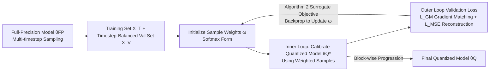

# Gradient-Aligned Calibration for Post-Training Quantization of Diffusion Models

**Conference**: ICLR 2026  
**OpenReview**: [https://openreview.net/forum?id=CtFSOlrjth](https://openreview.net/forum?id=CtFSOlrjth)  
**Code**: TBD  
**Area**: Model Compression / Diffusion Model Quantization  
**Keywords**: Post-Training Quantization, Diffusion Models, Gradient Conflict, Sample Reweighting, Meta-Learning, Bi-level Optimization  

## TL;DR
This paper improves Post-Training Quantization (PTQ) for diffusion models by learning a set of importance weights for calibration samples across different timesteps via meta-learning. This aligns gradient directions and mitigates gradient conflicts across timesteps in the quantized model.

## Background & Motivation
- **Background**: While diffusion models achieve stunning generation quality, their deployment is costly due to the multi-step denoising process and heavy noise-estimation networks. PTQ has become a mainstream solution as it requires no retraining and does not rely on original datasets. Calibration data is crucial in PTQ and is typically collected from different stages of the denoising trajectory—Q-Diffusion samples at fixed intervals, while PTQ4DM samples timesteps from a Gaussian distribution.
- **Limitations of Prior Work**: Almost all existing methods (Q-Diffusion, PTQ4DM, TFMQ-DM) **assume all calibration samples are equally important**, assigning a uniform weight to each. However, recent research indicates that samples from different timesteps contribute differently: late timesteps characterize high-level semantic structures, while early timesteps focus on removing low-level noise details. A one-size-fits-all approach dilutes the influence of critical samples.
- **Key Challenge**: Significant differences in activation distributions and gradient directions across timesteps can be viewed as **distinct sub-tasks with conflicting gradients**. The key observation of this paper (Figure 1a) is that the cosine distance between quantization loss gradients at different timesteps shows **consistent gradients in early timesteps but severe divergence in late timesteps**. Furthermore, quantized models are constrained by a discrete parameter space (e.g., parameters only taking values like 0/1), preventing them from resolving conflicting gradients through fine-tuning as full-precision models do. Consequently, improvement at one timestep often comes at the cost of degradation at another, leading to performance fluctuations.
- **Goal**: To find a weighting scheme for calibration samples that allows the quantized model to perform well on validation sets while maintaining consistent gradient directions across timesteps, without increasing inference overhead.
- **Core Idea**: **[Gradient-Aligned Sample Reweighting]** The authors first identify the "gradient conflict" problem in PTQ and model it as **bi-level optimization** using meta-learning. The inner loop calibrates the quantized model using weighted samples, while the outer loop learns sample weights to align gradients across different timesteps on the validation set.

## Method

### Overall Architecture
The method organizes "sample weight learning" and "quantized model calibration with weighted samples" into a bi-level optimization: the outer (meta) loop learns weights $\omega_i$ for each calibration sample, and the inner loop performs a single-step weighted quantization calibration to obtain $\theta_Q^*(\omega)$. A validation objective comprising "gradient matching loss + reconstruction loss" is then used to evaluate and backpropagate updates to $\omega$. Calibration is performed **block-wise** on the noise-estimation network, with sample weights refreshed for each new block.

### Key Designs

**1. Bi-level Optimization Goal: Calibrate with weights, select weights by validation performance.** The weights $\omega$ are solved as a nested problem: the inner loop is a single-step weighted quantization update, and the outer loop selects weights that yield the best model performance on the validation set. Formally, $\omega = \arg\min_\omega \mathcal{L}_{VAL}(\theta_Q^*(\omega), \theta_{FP}, X^{(V)})$, subject to $\theta_Q^*(\omega) = \theta_Q - \eta \sum_i \omega_i \frac{\partial \mathcal{L}_{MSE}(\theta_Q,\theta_{FP},x_i^{(T)})}{\partial \theta_Q}$. Here $\mathcal{L}_{MSE}$ matches outputs of the full-precision model $f(\theta_{FP},x_i)$ and the quantized model $f(\theta_Q,x_i)$ via $\|f(\theta_{FP},x_i)-f(\theta_Q,x_i)\|^2$. Intuitively, "learning weights" is equivalent to "selecting the calibration sample combination most beneficial to final quantization quality."

**2. Gradient Matching Loss: Explicitly aligning optimization directions.** Since all timesteps share the same quantized weights $\theta_Q$, a cross-timestep gradient alignment term is added to the validation loss. The loss is defined as $\mathcal{L}_{VAL} = \mathcal{L}_{GM} + \mathcal{L}_{MSE}$, where the gradient matching term $\mathcal{L}_{GM}(\theta_Q^*, X^{(V)}) = -\frac{2}{T(T-1)} \sum_{t \neq k} G_{\theta_Q^*,t} \cdot G_{\theta_Q^*,k}$, and $G_{\theta_Q^*,t} = \frac{\partial \mathcal{L}_{MSE}(\theta_Q^*,\theta_{FP},X_t^{(V)})}{\partial \theta_Q^*}$ is the gradient of the $t$-th timestep validation subset. This term takes the negative mean of the inner products of gradients between all timestep pairs—larger inner products signify more consistent directions and lower loss. In practice, timesteps are grouped into tasks to reduce computational complexity.

**3. Surrogate Optimization for Third-order Terms: Replacing intractable objectives with feasible algorithms.** Directly optimizing the objective involves the **third-order derivative** of $\mathcal{L}_{GM}$ with respect to $\omega$. To handle this, a surrogate gradient matching loss $\mathcal{L}_{GM}^{(2)}(\theta_Q^*, X^{(V)}) = -\frac{2}{T(T-1)} \sum_{t \neq k} G_{\omega,t} \cdot G_{\omega,k}$ is optimized, where $G_{\omega,t} = \frac{\partial \mathcal{L}_{MSE}(\theta_Q^*,\theta_{FP},X_t^{(V)})}{\partial \omega}$ is the gradient of the loss with respect to the weights. Theorem 4.1 proves that minimizing this surrogate $\mathcal{L}_{VAL}^{(2)} = \mathcal{L}_{GM}^{(2)} + \mathcal{L}_{MSE}$ is implicitly equivalent to the original objective. Algorithm 2 uses gradient-based meta-optimization (via the `higher` library) to solve for $\omega$, bypassing third-order calculations.

**4. Softmax Weight Initialization and Block-wise Workflow.** Sample weights are parameterized as $\omega_i = \frac{\exp(s_i/\tau)}{\sum_j \exp(s_j/\tau)}$, with initial $s_i = \frac{1}{32}$ and temperature $\tau$ ensuring uniform initial weights. The process (Algorithm 1) proceeds layer-by-layer: for each block, $\omega$ is updated via Algorithm 2, then weighted training samples calibrate the quantization parameters of that block. Weights are quantized using AdaRound + block-wise reconstruction, and activation quantization follows the TFMQ-DM EMA scheme, integrating its temporal feature preservation strategy for fair comparison.

## Key Experimental Results

### Main Results

CIFAR-10 32×32 (DDIM, DDPM):

| Method | W/A | FID↓ | W/A | FID↓ |
|------|-----|------|-----|------|
| PTQ4DM | 4/32 | 5.65 | 4/8 | 5.14 |
| Q-Diffusion | 4/32 | 5.08 | 4/8 | 4.98 |
| TFMQ-DM | 4/32 | 4.73 | 4/8 | 4.78 |
| **Ours** | 4/32 | **4.28** | 4/8 | **4.32** |

LSUN-Bedrooms & ImageNet 256×256 (LDM-4):

| Method | Bits(W/A) | LSUN FID↓ | LSUN sFID↓ | ImageNet FID↓ | ImageNet sFID↓ |
|------|-----------|-----------|------------|---------------|----------------|
| Full Prec. | 32/32 | 2.98 | 7.09 | 10.91 | 7.67 |
| TFMQ-DM | 4/32 | 3.60 | 7.61 | 10.50 | 7.98 |
| **Ours** | 4/32 | **3.14** | **7.22** | **10.17** | **7.40** |
| TFMQ-DM | 4/8 | 3.68 | 7.65 | 10.29 | 7.35 |
| **Ours** | 4/8 | **3.26** | **7.40** | **9.96** | 7.55 |

The method achieves SOTA FID across all configurations: an improvement of 0.45 (W4A32) / 0.46 (W4A8) over TFMQ-DM on CIFAR-10, and a reduction in FID by 0.33 and sFID by 0.58 on ImageNet W4A32.

### Ablation Study

Ablation on CIFAR-10 W4A32:

| Val Set Size | 2% | 5% | 10% | 20% |
|-----------|-----|-----|-----|-----|
| FID↓ | 4.55 | **4.32** | 4.59 | 4.75 |
| sFID↓ | 4.71 | 4.61 | 4.38 | 4.51 |

| Temperature τ | 0.2 | 0.5 | 1 | 2 |
|--------|-----|-----|-----|-----|
| FID↓ | 4.85 | 4.55 | **4.28** | 4.32 |

Few-timestep scenarios (ImageNet 4/32, DDIM):

| Method | Timestep | FID↓ | sFID↓ |
|------|----------|------|-------|
| TFMQ-DM | 20 | 10.50 | 7.98 |
| **Ours** | 20 | **10.17** | **7.40** |
| TFMQ-DM | 10 | 9.01 | 12.75 |
| **Ours** | 10 | **8.73** | **11.26** |
| TFMQ-DM | 5 | 19.10 | 38.69 |
| **Ours** | 5 | **18.22** | **35.05** |

### Key Findings
- **5% Validation Set is Sufficient**: Best FID was achieved using only 5% of training data as a validation set, keeping total image usage comparable to the TFMQ-DM baseline. Larger validation sets did not yield further gains due to increased sample diversity complicating weighting optimization under a fixed calibration budget.
- **Sample Weight Correlates with Gradient Alignment** (Figure 2): Sorting samples by weight into 50 groups reveals a positive correlation between average weight and the alignment of that group's gradient with the validation set, confirming that the method successfully prioritizes samples with consistent gradient directions.
- **Controllable Overhead**: Training takes approximately 3.5 GPU hours for LSUN W4A8, which is more than TFMQ-DM (2.32h) but less than Q-Diffusion (5.29h). The complexity is confined to the training stage; **inference latency and hardware efficiency remain identical to TFMQ-DM**.

## Highlights & Insights
- **Transferring "Gradient Conflict" to PTQ**: While multi-task gradient conflict is often discussed in diffusion training, this work is the first to highlight that discrete parameter spaces in quantization make such conflicts harder to resolve.
- **Reweighting vs. Resampling**: By learning weights without changing the total count of calibration samples or the inference pipeline, the method achieves "zero inference cost."
- **Theory-Engineering Balance**: Theorem 4.1 bypasses the computational hurdle of third-order derivatives by using a tractable surrogate objective solvable via the `higher` library.

## Limitations & Future Work
- **Small Improvement Margin**: Gains in FID are mostly in the 0.3-0.5 range. Its effectiveness on extreme low-bit settings (W2/W3) or more aggressive activation quantization is not fully explored.
- **Coarse Timestep Grouping**: Dividing the validation set into 5 groups for task management is somewhat arbitrary, and the optimal grouping strategy remains an open question.
- **Training Overhead**: Bi-level optimization and block-wise reweighting add ~1 GPU hour of cost, which may scale poorly for larger models or more timesteps.
- **Dependency on Existing Components**: The method builds on AdaRound and TFMQ-DM; it is essentially "better calibration data weighting," leaving room to explore synergy with new quantization operators.

## Related Work & Insights
- **Diffusion Model PTQ**: Follows the lineage of Q-Diffusion (fixed intervals + shortcut-aware), PTQ4DM (denoising process sampling), TFMQ-DM (temporal feature consistency), and APQ-DM. This work serves as an "upstream" improvement by optimizing how calibration data is weighted.
- **Sample Importance Variability**: Xie et al. (2024) noted that gradient norms depend on timesteps; Wang et al. (2024b) divided timesteps into acceleration/deceleration/convergence phases.
- **Gradient Conflict / Negative Transfer**: Hang et al. (2023) viewed diffusion training as multi-task; Go et al. (2023) observed negative transfer across timesteps. This paper bridges these full-precision training insights into the quantization domain.
- **Insight**: The paradigm of "learning calibration data weights" via bi-level optimization and gradient alignment can likely be extended to other multi-task PTQ scenarios, such as multi-resolution or multi-prompt generative models.

## Rating
- **Novelty**: ⭐⭐⭐⭐ Identifies and formalizes cross-timestep gradient conflict in diffusion PTQ for the first time, using gradient alignment and meta-learning.
- **Experimental Thoroughness**: ⭐⭐⭐ Covers three datasets and various bit/timestep settings; however, improvement margins are small and extreme low-bit settings are missing.
- **Writing Quality**: ⭐⭐⭐⭐ Strong motivation supported by preliminary analysis (heatmaps), with smooth mathematical derivations.
- **Value**: ⭐⭐⭐⭐ Zero inference cost and "plug-and-play" weighting are attractive for deployment and provide a template for multi-task PTQ.

<!-- RELATED:START -->

## Related Papers

- [\[ICLR 2026\] Beyond Uniformity: Sample and Frequency Meta Weighting for Post-Training Quantization of Diffusion Models](beyond_uniformity_sample_and_frequency_meta_weighting_for_post-training_quantiza.md)
- [\[ICLR 2026\] Quant-dLLM: Post-Training Extreme Low-Bit Quantization for Diffusion Large Language Models](quant-dllm_post-training_extreme_low-bit_quantization_for_diffusion_large_langua.md)
- [\[ICLR 2026\] Inlier-Centric Post-Training Quantization for Object Detection Models](inlier-centric_post-training_quantization_for_object_detection_models.md)
- [\[ICLR 2026\] PTQ4ARVG: Post-Training Quantization for AutoRegressive Visual Generation Models](ptq4arvg_post-training_quantization_for_autoregressive_visual_generation_models.md)
- [\[ICLR 2026\] Post-Training Quantization for Video Matting](post-training_quantization_for_video_matting.md)

<!-- RELATED:END -->
