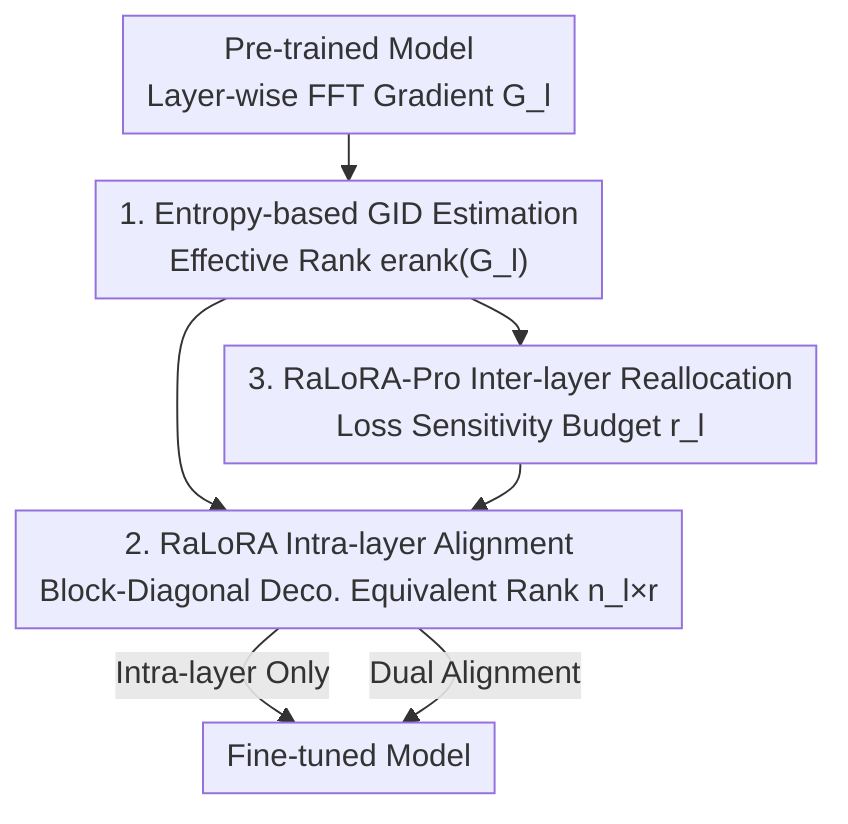

# Gradient Intrinsic Dimensionality Alignment: Closing the Gap between LoRA and Full Fine-Tuning

**Conference**: ICLR 2026  
**OpenReview**: [https://openreview.net/forum?id=kObvnQ6pUx](https://openreview.net/forum?id=kObvnQ6pUx)  
**Code**: None  
**Area**: Model Compression / Parameter-Efficient Fine-Tuning  
**Keywords**: LoRA, PEFT, Gradient Intrinsic Dimensionality, Effective Rank, Rank Alignment

## TL;DR
This paper identifies that the fundamental cause of the performance gap between LoRA and full fine-tuning (FFT) is that the low-rank subspace dimension of LoRA is significantly smaller than the number of truly effective update directions in FFT gradients (Gradient Intrinsic Dimensionality, GID, with up to a 100x difference). It proposes an entropy-based estimator to measure layer-wise GID and utilizes RaLoRA / RaLoRA-Pro to align the equivalent rank of LoRA with GID without increasing the parameter count. This approach consistently approaches or exceeds FFT performance on GLUE, GSM8K, HumanEval, MT-Bench, and image classification.

## Background & Motivation
**Background**: Fine-tuning large models under compute-constrained scenarios has made Parameter-Efficient Fine-Tuning (PEFT) mainstream. Among these, LoRA has become the most widely used method due to its approach of training only low-rank matrices $A$ and $B$, zero inference latency, and simple implementation. It approximates weight updates with $\Delta W = \frac{\alpha}{r}BA$, where $A\in\mathbb{R}^{r\times d_{in}}$, $B\in\mathbb{R}^{d_{out}\times r}$, and $r\ll\min\{d_{in},d_{out}\}$.

**Limitations of Prior Work**: LoRA remains significantly behind full fine-tuning on complex tasks such as mathematical reasoning and code generation. To address this gap, the community has proposed three types of variants: rank enhancement (reallocating rank across layers or stacking multiple LoRAs), training dynamics optimization (stable scaling factors, separate learning rates for $A$ and $B$, decoupling direction and magnitude), and improved initialization (principal singular components, QR orthogonal initialization). However, none of these methods address the root cause of the gap.

**Key Challenge**: The authors interpret the LoRA adapter as an "implicit gradient compressor"—at step $t$, it projects the full gradient $G_t$ onto a low-rank subspace: $\Delta(BA)\approx -\eta\,(B_tB_t^\top G_t + G_t A_t^\top A_t)$. Consequently, the rank of LoRA simultaneously determines its gradient compression rate and expressivity. However, the truly effective update directions for FFT gradients (defined as **Gradient Intrinsic Dimensionality, GID**) typically occupy a much larger subspace (as high as 300, or even 30–1000), which is forcibly compressed by LoRA's fixed low rank (e.g., $r=8$), leading to severe information loss. This "subspace dimension mismatch" is the essence of the performance bottleneck and has been previously overlooked.

**Goal**: To decompose this into two sub-problems: (1) How to accurately estimate the gradient intrinsic dimensionality of each layer (previously under-researched); (2) How to design strategies to "align LoRA rank with GID" within a fixed parameter budget.

**Key Insight**: Borrowing the concept of "effective rank" from signal processing—using the Shannon entropy of the singular value distribution to characterize the intrinsic dimensionality of a matrix continuously and robustly, without relying on manual thresholds. The authors are the first to introduce effective rank into "gradient matrix intrinsic dimensionality estimation" to serve LoRA.

**Core Idea**: First, measure layer-wise GID using an entropy-based estimator. Then, adaptively align the equivalent rank of LoRA with the GID (using multi-blocking for high-dimensional layers and reverting to standard LoRA for low-dimensional layers). Finally, reallocate the budget across layers based on layer importance while keeping the total parameter count constant.

## Method

### Overall Architecture
The method unfolds in three steps: "GID Estimation → Intra-layer Rank Alignment → Inter-layer Budget Reallocation." Given a pre-trained model for fine-tuning, the entropy-based estimator first calculates the GID for each layer using FFT gradients. Based on this, RaLoRA decomposes the LoRA of that layer into several mini-blocks via block-diagonal decomposition, expanding the equivalent rank from $r$ to $n_l\times r$ while maintaining the parameter count at $r(d_{in}+d_{out})$—this is **intra-layer alignment**. RaLoRA-Pro adds **inter-layer reallocation** on top of this: it distributes the fixed total parameter budget proportionally across layers using loss sensitivity (importance scores), assigning higher ranks to important layers. Subsequently, it performs rank alignment within each layer according to RaLoRA, achieving "dual alignment" of intra-layer geometry and inter-layer capacity.

### Key Designs

**1. Entropy-based Gradient Intrinsic Dimensionality (GID) Estimator: Turning Rank Selection from Guesswork to Measurement**

Naive intrinsic dimensionality estimation involves SVD on the gradient $G$ and counting singular values above a threshold $\varepsilon$ ($\mathrm{rank}(G)=\max\{i\mid\sigma_i>\varepsilon\}$), but this is extremely sensitive to $\varepsilon$ and unstable across tasks. The authors use an entropy measure derived from "effective rank": normalize singular values into a distribution $p_i=\sigma_i/\sum_j\sigma_j$, then take the exponential of the distribution entropy:

$$\mathrm{erank}(G_l)=\exp\!\Big(-\sum_{i=1}^{n}p_i\log p_i\Big).$$

Intuitively, when singular value energy is concentrated in a few directions, entropy and effective rank are small; when energy spreads across many directions, they are large. This measures "how many degrees of freedom the gradient truly utilizes" continuously, without thresholds or sensitivity to hyperparameters. This estimator is the foundation: it reveals for the first time that GID for FFT gradients ranges from 30–1000 and correlates with task complexity (WizardLM $\approx 404$ > Code-Feedback $\approx 269$ > MetaMathQA $\approx 178$), transforming LoRA rank selection from empirical guesswork into a derivation based on gradient structure. It is orthogonal to most LoRA variants and can be integrated into other PEFT frameworks.

**2. RaLoRA: Aligning Equivalent Rank to GID via Block-Diagonal Decomposition without Adding Parameters**

The bottleneck is that expressivity is restricted when the fixed rank $r$ is much smaller than the GID. Instead of increasing $r$ (which increases parameters), RaLoRA uses structured parallel decomposition to split $A$ and $B$ into $n_l$ mini-blocks, forming a block-diagonal update matrix $\mathrm{diag}(B_1A_1,\dots,B_{n_l}A_{n_l})$, where $A_i\in\mathbb{R}^{r\times(d_{in}/n_l)}$ and $B_i\in\mathbb{R}^{(d_{out}/n_l)\times r}$. The number of blocks is determined by the layer's GID:

$$e_l=\Big\lfloor\log_2\frac{\mathrm{erank}(G_l)}{r}\Big\rfloor,\qquad n_l=2^{e_l},\quad 1\le n_l\le n_{\max}.$$

Powers of 2 ensure divisibility of input/output dimensions, with $n_{\max}$ as an upper bound for stability. Crucially, this expands the equivalent rank from $r$ to $n_l\times r$ while keeping parameters at $r(d_{in}+d_{out})$ because each block's dimension is reduced. This works because "expressivity depends not only on parameter count but also on architectural structure": low-GID layers have $n_l$ degrade to 1 (equivalent to standard LoRA), while high-GID layers increase $n_l$ to achieve broader expressivity across multiple gradient subspaces. RaLoRA is thus a natural generalization of LoRA.

**3. RaLoRA-Pro: Inter-layer Budget Reallocation via Loss Sensitivity for Dual Alignment**

RaLoRA aligns only within layers, but layer importance varies. RaLoRA-Pro calculates an importance score for each layer using loss sensitivity $I(W_l)=\mathrm{avg}(|W_l\odot G_l|)$ (the mean of the element-wise product of weights and gradients), normalized to $\alpha_l=I_l/\sum_k I_k$. Under the constraint of keeping total trainable parameters $P_{total}=\sum_l(\sqrt{d_{in}^l+d_{out}^l})\,r_{ref}$ constant (using dimension smoothing to eliminate bias from different module dimensions), the budget is distributed as:

$$r_l=\Big\lfloor\frac{P_{total}\cdot\alpha_l}{\sqrt{d_{in}^l+d_{out}^l}}\Big\rfloor,\qquad r_{\min}\le r_l\le r_{\max}.$$

Once $r_l$ is obtained, GID rank alignment is performed within each layer. This achieves both inter-layer alignment (capacity by importance) and intra-layer alignment (geometry by GID). Unlike prior methods that only allocate rank by sensitivity, RaLoRA-Pro is the first framework to unify "inter-layer reallocation" and "intra-layer geometric adaptation."

### Loss & Training
The method does not change the training loss, only the structure and rank allocation of LoRA. The GID estimation, block count $n_l$, and layer-wise rank $r_l$ are fixed after the initialization phase. Experiments used T5-Base for NLU (GLUE), LLaMA-3.1-8B-Base for NLG (math/code/chat), and CLIP-ViT-B/16 for image classification across 3 random seeds. The LoRA rank and reference rank $r_{ref}$ were set to 8 by default.

## Key Experimental Results

### Main Results
On GLUE (T5-Base) and NLG (LLaMA-3.1-8B-Base), RaLoRA / RaLoRA-Pro outperformed various LoRA variants with comparable parameters, even exceeding FFT in some metrics.

| Task | Metric | LoRA | Strongest Baseline | RaLoRA | RaLoRA-Pro | FFT |
|------|------|------|------|------|------|------|
| GLUE | Avg | 82.08 | 86.35 (MoRA) | 87.24 | 87.23 | 87.91 |
| MT-Bench | Score | 6.15 | 6.38 (MoRA) | 6.38 | **6.72** | 5.88 |
| GSM8K | Acc | 67.78 | 71.29 (LoRA+) | 72.25 | **73.01** | 73.69 |
| HumanEval | Pass | 43.09 | 45.78 (RSLoRA) | **48.78** | 48.37 | 51.63 |
| Image Cls | 7-Avg | 89.08 | 90.13 (MoRA) | 90.53 | **90.66** | — |

- Compared to LoRA: GLUE +5%, MT-Bench +0.57, GSM8K +5.23, HumanEval +5.69, Image Classification +1.58.
- On GSM8K, RaLoRA-Pro narrowed the gap with FFT by 88.5%; on HumanEval, RaLoRA narrowed the gap by 66.6%; on MT-Bench, RaLoRA-Pro outperformed FFT by +0.84.
- On tasks like QNLI and MRPC, the proposed method exceeded FFT with significantly fewer parameters.

### Ablation Study: Isolating Contributions at Different Ranks
The authors isolated the effects of intra-layer alignment and inter-layer reallocation using "LS-LoRA" (inter-layer sensitivity only) on LLaMA-3.1-8B-Base.

| Rank | Method | GSM8K | HumanEval |
|------|------|------|------|
| 8 | LoRA | 67.78 | 43.09 |
| 8 | LS-LoRA (Inter-only) | 70.15 | 39.83 |
| 8 | RaLoRA (Intra-only) | 71.42 | 47.76 |
| 8 | RaLoRA-Pro (Dual) | 72.23 | 46.95 |
| 64 | LoRA | 67.17 | 43.29 |
| 64 | RaLoRA | 74.55 | 51.22 |
| 64 | RaLoRA-Pro | **75.23** | **52.24** |

### Key Findings
- **Intra-layer GID Alignment (RaLoRA) is the primary driver**: It consistently outperformed standard LoRA across all ranks and tasks, with largest gains in GSM8K and HumanEval, confirming that "aligning rank to GID" restores expressivity.
- **Inter-layer Reallocation (RaLoRA-Pro vs. LS-LoRA) is complementary**: Dual alignment is more advantageous at higher ranks. LS-LoRA alone performed poorly on HumanEval (rank 8), suggesting that rank allocation by sensitivity without geometric alignment can be harmful.
- **GID correlates with task complexity and evolves during training**: Estimated GID ranges from 30–1000. Tasks with higher instruction diversity have higher GID (WizardLM > Code-Feedback > MetaMathQA). GID rises quickly and stabilizes during training, consistently exceeding typical LoRA ranks.
- **Significant layer-wise heterogeneity**: GID varies greatly across layers, validating that layer-wise adaptive rank is more rational than a global uniform rank.

## Highlights & Insights
- **Viewing LoRA as a "gradient compressor" is the foundational perspective**: This naturally leads to "Rank = Compression Rate = Expressivity Upper Bound," which motivates matching the compression rate to the true degrees of freedom (GID).
- **Entropy/Effective Rank for robust GID estimation**: Using the entropy of singular value distributions is a reusable tool that can guide rank allocation in other PEFT methods without requiring manual thresholds.
- **Expanding equivalent rank without adding parameters**: Block-diagonal decomposition allows the equivalent rank to scale by $n_l$ while keeping parameters constant. This "structure for expressivity" approach is valuable for any parameter-constrained scenario.
- **Dual alignment for layer-wise allocation**: Allocating budget by importance (inter-layer) and geometry by GID (intra-layer) provides a clean framework for spending capacity efficiently within a fixed budget.

## Limitations & Future Work
- GID estimation requires layer-wise FFT gradients, involving a one-time overhead for SVD. Scalability costs for ultra-large models were not fully discussed.
- The block count $n_l=2^{e_l}$ is a discrete power-of-2 approximation, which may not perfectly fit the true GID in some layers; $n_{\max}$ and $r_{\min}/r_{\max}$ remain hyperparameters.
- Evaluations focused on T5-Base / 8B scales. Whether GID dynamics remain stable and alignment gains persist for larger models or longer training needs further verification.
- Future directions: Making GID estimation online/adaptive during training or combining it with training dynamic variants (DoRA, LoRA+).

## Related Work & Insights
- **vs. Rank Enhancement (AdaLoRA / MELoRA / MoRA)**: These methods reallocate rank by importance or stack LoRAs, but their basis is "importance" rather than true gradient degrees of freedom. This paper measures GID first.
- **vs. Training Dynamics (DoRA / LoRA+ / RSLoRA)**: These methods modify optimization (LR, scaling, decoupling) but do not address subspace dimension mismatch. This work is orthogonal to them.
- **vs. Improved Initialization (PiSSA / OLoRA)**: These focus on convergence speed within a fixed rank. This work expands the equivalent rank to match the GID, addressing the expressivity ceiling.
- **vs. Existing Applications of Effective Rank**: Previously used in signal processing, self-supervised evaluation (RankMe), and diffusion models; this is the first application to "gradient matrix intrinsic dimensionality" to guide LoRA.

## Rating
- Novelty: ⭐⭐⭐⭐⭐ Attributes the LoRA-FFT gap to "GID mismatch" and quantifies/aligns it via effective rank.
- Experimental Thoroughness: ⭐⭐⭐⭐ Covers NLU/NLG/Vision, multiple rank ablations, and GID analysis, though model scale is limited.
- Writing Quality: ⭐⭐⭐⭐⭐ Clear logical chain from the "gradient compressor" perspective to dual alignment.
- Value: ⭐⭐⭐⭐⭐ Both the estimator and block-diagonal alignment are reusable and orthogonal to most variants, offering significant utility to the PEFT community.

<!-- RELATED:START -->

## Related Papers

- [\[ICLR 2026\] GAPrune: Gradient-Alignment Pruning for Domain-Aware Embeddings](gaprune_gradient-alignment_pruning_for_domain-aware_embeddings.md)
- [\[ICLR 2026\] IGU-LoRA: Adaptive Rank Allocation via Integrated Gradients and Uncertainty-Aware Scoring](igu-lora_adaptive_rank_allocation_via_integrated_gradients_and_uncertainty-aware.md)
- [\[ICML 2025\] Make LoRA Great Again: Boosting LoRA with Adaptive Singular Values and Mixture-of-Experts Optimization Alignment](../../ICML2025/model_compression/make_lora_great_again_boosting_lora_with_adaptive_singular_values_and_mixture-of.md)
- [\[ICLR 2026\] CAR-LoRA: Training Compression-Aware and Robust LoRA Adapters for Evolving LLMs](car-lora_training_compression-aware_and_robust_lora_adapters_for_evolving_llms.md)
- [\[ICLR 2026\] E²LoRA: Efficient and Effective Low-Rank Adaptation with Entropy-Guided Adaptive Sharing](e²lora_efficient_and_effective_low-rank_adaptation_with_entropy-guided_adaptive_.md)

<!-- RELATED:END -->
