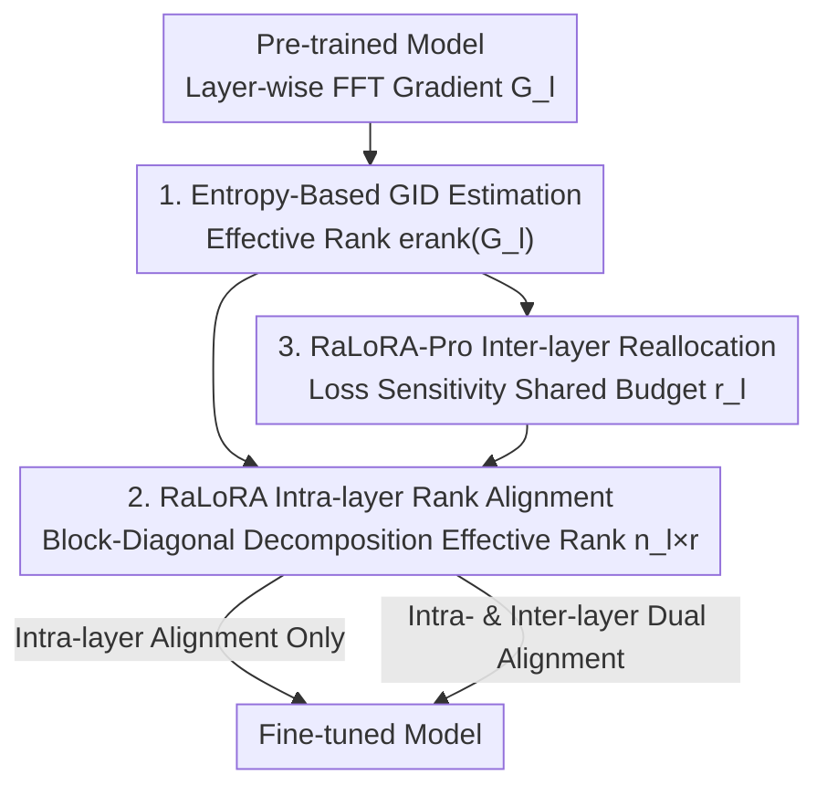

# Gradient Intrinsic Dimensionality Alignment: Bridging the Gap between LoRA and Full Fine-Tuning

**Conference**: ICLR 2026  
**OpenReview**: [https://openreview.net/forum?id=kObvnQ6pUx](https://openreview.net/forum?id=kObvnQ6pUx)  
**Code**: None  
**Area**: Model Compression / Parameter-Efficient Fine-Tuning  
**Keywords**: LoRA, PEFT, Gradient Intrinsic Dimensionality, Effective Rank, Rank Alignment

## TL;DR
This paper identifies that the fundamental cause of the performance gap between LoRA and full fine-tuning (FFT) is that the dimension of LoRA's low-rank subspace is far smaller than the number of active update directions in FFT gradients (Gradient Intrinsic Dimensionality, or GID, differing by up to 100x). It proposes an entropy-based estimator to measure layer-wise GID and introduces RaLoRA / RaLoRA-Pro to align LoRA's effective rank with the GID without increasing parameter counts, consistently matching or even exceeding FFT performance on GLUE, GSM8K, HumanEval, MT-Bench, and image classification.

## Background & Motivation
**Background**: For fine-tuning large models in computationally constrained scenarios, Parameter-Efficient Fine-Tuning (PEFT) has become the mainstream, where LoRA has emerged as the most widely used method due to its advantages of training only low-rank matrices $A$ and $B$, introducing zero inference latency, and being simple to implement. It approximates weight updates with $\Delta W = \frac{\alpha}{r}BA$, where $A\in\mathbb{R}^{r\times d_{in}}$, $B\in\mathbb{R}^{d_{out}\times r}$, and rank $r\ll\min\{d_{in},d_{out}\}$.

**Limitations of Prior Work**: On complex tasks such as mathematical reasoning and code generation, LoRA consistently lags significantly behind full fine-tuning. To address this gap, the community has proposed three categories of variants: rank enhancement (reallocating ranks across layers / stacking multiple LoRAs), training dynamics optimization (stable scaling factors, setting separate learning rates for $A$ and $B$, decoupling direction and magnitude), and improved initialization (using principal singular components or QR orthogonal initialization). However, none of these methods address the root cause of the performance gap.

**Key Challenge**: The authors conceptualize the LoRA adapter as an "implicit gradient compressor." At step $t$, it projects the full gradient $G_t$ onto a low-rank subspace: $\Delta(BA)\approx -\eta\,(B_tB_t^\top G_t + G_t A_t^\top A_t)$. Consequently, the rank of LoRA simultaneously determines both its gradient compression rate and its expressiveness. However, the update directions in FFT that are truly effective (defined in this paper as the **Gradient Intrinsic Dimensionality, GID**) typically span a much larger subspace (up to 300, or even 30–1000). Yet, LoRA violently compresses this space into a small, fixed rank like 8, resulting in severe information loss. This "subspace dimensional mismatch" is the true essence of the performance bottleneck, which has been largely overlooked.

**Goal**: The objective is decomposed into two sub-problems: (1) how to accurately estimate the gradient intrinsic dimensionality of each layer (which has been scarcely studied before); and (2) how to design a strategy to "align the LoRA rank with the GID" within a fixed parameter budget.

**Key Insight**: The authors borrow the concept of "effective rank" from signal processing, using the Shannon entropy of the singular value distribution to continuously and robustly characterize the intrinsic dimensionality of a matrix without relying on manual thresholds. This work is the first to introduce effective rank into "gradient matrix intrinsic dimensionality estimation" to serve LoRA adaptation.

**Core Idea**: First, use an entropy-based estimator to measure the layer-wise GID, then adaptively align the effective rank of LoRA with the GID (splitting high-dimensional layers into many blocks while low-dimensional layers degenerate to standard LoRA). Finally, redistribute the budget across layers based on layer importance while keeping the total parameter budget unchanged.

## Method

### Overall Architecture
The method unfolds around three steps: "estimating GID $\rightarrow$ intra-layer rank alignment $\rightarrow$ inter-layer budget reallocation". Given a pre-trained model to be fine-tuned, the entropy-based estimator first calculates the gradient intrinsic dimensionality GID for the FFT gradient of each layer. Based on this, RaLoRA splits that layer's LoRA into several mini-blocks via block-diagonal decomposition, amplifying the effective rank from $r$ to $n_l\times r$ while keeping the parameter count at $r(d_{in}+d_{out})$ unchanged—this is **intra-layer alignment**. On top of this, RaLoRA-Pro adds an **inter-layer reallocation** step: it proportionally allocates a fixed total parameter budget to each layer based on loss sensitivity (importance scores), assigning higher ranks to more important layers. Finally, within each layer, it aligns ranks using RaLoRA, achieving "dual alignment" of intra-layer geometric alignment and inter-layer capacity allocation.

### Key Designs

**1. Entropy-Based Gradient Intrinsic Dimensionality (GID) Estimator: Making "What Rank to Use" Measurable Instead of Arbitrary**

The most naive intrinsic dimensionality estimation performs SVD on the gradient $G$ and counts how many singular values exceed a threshold $\varepsilon$ ($\mathrm{rank}(G)=\max\{i\mid\sigma_i>\varepsilon\}$). However, this is extremely sensitive to $\varepsilon$ and lacks robustness across different layers and tasks. Instead, the authors adopt an entropy metric rooted in "effective rank": singular values are normalized into a distribution $p_i=\sigma_i/\sum_j\sigma_j$, and the exponent of the Shannon entropy of this distribution is calculated as:

$$\mathrm{erank}(G_l)=\exp\!\Big(-\sum_{i=1}^{n}p_i\log p_i\Big).$$

Intuitively, when the energy of singular values is concentrated in a few directions, the entropy is small, resulting in a small effective rank; when the energy is dispersed across many directions, the entropy is large, yielding a large effective rank. It continuously measures "how many degrees of freedom the gradient actually utilizes" without requiring a threshold, making it insensitive to hyperparameters. This estimator is the foundation of the entire methodology: it reveals for the first time that the intrinsic dimensionality of FFT gradients spans 30–1000 and is positively correlated with task complexity (WizardLM $\approx 404$ > Code-Feedback $\approx 269$ > MetaMathQA $\approx 178$). This transforms the question of "how to select LoRA rank" from empirical guesswork into a quantity derivable from gradient structure. It is also orthogonal to most LoRA variants, allowing it to be integrated into other PEFT frameworks independently.

**2. RaLoRA: Aligning Effective Rank to GID via Block-Diagonal Decomposition without Adding Parameters**

The primary pain point is that expressiveness is bottlenecked when a fixed rank $r$ is much smaller than the GID. Instead of directly increasing $r$ (which would increase parameter count), RaLoRA adopts a structured parallel decomposition. It splits $A$ and $B$ into $n_l$ mini-blocks, forming a block-diagonal update matrix $\mathrm{diag}(B_1A_1,\dots,B_{n_l}A_{n_l})$, where $A_i\in\mathbb{R}^{r\times(d_{in}/n_l)}$ and $B_i\in\mathbb{R}^{(d_{out}/n_l)\times r}$. The number of blocks is determined by the GID of that layer:

$$e_l=\Big\lfloor\log_2\frac{\mathrm{erank}(G_l)}{r}\Big\rfloor,\qquad n_l=2^{e_l},\quad 1\le n_l\le n_{\max}.$$

Taking powers of 2 ensures clean divisibility of input/output dimensions, and $n_{\max}$ serves as an upper bound to maintain stability. Crucially, this expands the effective rank from $r$ to $n_l \times r$, while the parameter count remains unchanged at $r(d_{in} + d_{out})$—because the dimensions of each block are proportionally shrunken. This is effective because "expressiveness depends not only on the number of parameters but also on the architectural structure." For layers with low GID, $n_l$ degenerates to 1 (equivalent to standard LoRA, focusing on primary directions); for layers with high GID, $n_l$ is increased to swap structured granularity for broader expressiveness across multiple gradient subspaces. Consequently, RaLoRA is a natural generalization of LoRA.

**3. RaLoRA-Pro: Inter-Layer Budget Reallocation via Loss Sensitivity for Dual Intra- & Inter-Layer Alignment**

While RaLoRA aligns ranks purely within each layer, layers differ significantly in importance, making a uniform budget allocation sub-optimal. RaLoRA-Pro first computes an importance score for each layer based on loss sensitivity: $I(W_l)=\mathrm{avg}(|W_l\odot G_l|)$ (the mean of the element-wise product of weights and gradients, characterizing the average impact of the layer's parameters on the loss), which is normalized to $\alpha_l=I_l/\sum_k I_k$. Subject to keeping the total number of trainable parameters $P_{total}=\sum_l(\sqrt{d_{in}^l+d_{out}^l})\,r_{ref}$ constant (using dimension smoothing to eliminate bias from differing module feature dimensions), the budget is distributed proportionally to $\alpha_l$, yielding the layer-wise rank:

$$r_l=\Big\lfloor\frac{P_{total}\cdot\alpha_l}{\sqrt{d_{in}^l+d_{out}^l}}\Big\rfloor,\qquad r_{\min}\le r_l\le r_{\max}.$$

After obtaining $r_l$, GID rank alignment is performed within each layer according to Design 2. This simultaneously achieves dual alignment: inter-layer (allocating capacity by importance) and intra-layer (aligning geometry to GID). Unlike prior methods that rely solely on sensitivity for rank allocation, RaLoRA-Pro is the first framework to unify inter-layer parameter reallocation with intra-layer geometric adaptation, ensuring that the allocated capacity structurally aligns with the effective update directions of FFT.

### Loss & Training
The proposed method does not modify the training loss; it strictly adapts the structure and rank distribution of LoRA. GID estimation, block counts $n_l$, and layer-wise ranks $r_l$ are determined during the initialization phase and remain fixed throughout training. For NLU, T5-Base is fine-tuned on GLUE. For NLG, LLaMA-3.1-8B-Base is fine-tuned on math/code/chat datasets. Image classification leverages CLIP-ViT-B/16. All experiments are run across 3 random seeds. The default LoRA rank and reference rank $r_{ref}$ are set to 8, maintaining comparable trainable parameters across all methods.

## Key Experimental Results

### Main Results
On GLUE (T5-Base, average over five subsets) and NLG (LLaMA-3.1-8B-Base), RaLoRA and RaLoRA-Pro consistently outperform various LoRA variants under comparable parameter scales, with some metrics even surpassing FFT.

| Task | Metric | LoRA | Strongest Variant Baseline | RaLoRA | RaLoRA-Pro | FFT |
|------|------|------|------|------|------|------|
| GLUE | Avg | 82.08 | 86.35 (MoRA) | 87.24 | 87.23 | 87.91 |
| MT-Bench | Score | 6.15 | 6.38 (MoRA) | 6.38 | **6.72** | 5.88 |
| GSM8K | Acc | 67.78 | 71.29 (LoRA+) | 72.25 | **73.01** | 73.69 |
| HumanEval | Pass | 43.09 | 45.78 (RSLoRA) | **48.78** | 48.37 | 51.63 |
| Image Classification | 7-Task Avg | 89.08 | 90.13 (MoRA) | 90.53 | **90.66** | — |

- Compared to standard LoRA: GLUE +5%, MT-Bench +0.57, GSM8K +5.23, HumanEval +5.69, image classification +1.58.
- On GSM8K, RaLoRA-Pro narrows the gap with FFT by 88.5%; on HumanEval, RaLoRA narrows the gap by 66.6%; on MT-Bench, RaLoRA-Pro outperforms FFT by +0.84.
- On tasks like QNLI and MRPC, the proposed method surpasses FFT with far fewer parameters.

### Ablation Study: Isolating Contributions of the Two Alignments under Different Ranks
The authors isolate "LS-LoRA" (which performs only inter-layer sensitivity reallocation) for comparison to decouple the effects of intra-layer alignment and inter-layer reallocation across ranks 8/16/32/64 on LLaMA-3.1-8B-Base.

| Rank | Method | GSM8K | HumanEval |
|------|------|------|------|
| 8 | LoRA | 67.78 | 43.09 |
| 8 | LS-LoRA (Inter-layer Only) | 70.15 | 39.83 |
| 8 | RaLoRA (Intra-layer Only) | 71.42 | 47.76 |
| 8 | RaLoRA-Pro (Dual Alignment) | 72.23 | 46.95 |
| 64 | LoRA | 67.17 | 43.29 |
| 64 | RaLoRA | 74.55 | 51.22 |
| 64 | RaLoRA-Pro | **75.23** | **52.24** |

### Key Findings
- **Intra-layer GID alignment (RaLoRA) is the primary driver**: It consistently outperforms standard LoRA across all ranks and tasks, with the most substantial gains observed in GSM8K and HumanEval, verifying that "aligning rank to GID" directly restores expressiveness.
- **Inter-layer reallocation (RaLoRA-Pro vs. LS-LoRA) is the icing on the cake**: The advantages of dual alignment are even more pronounced at higher ranks. Conversely, isolated LS-LoRA drops to 39.83 on HumanEval (at rank 8), indicating that allocating rank based solely on sensitivity without intra-layer geometric alignment can be counterproductive; thus, their combination is essential.
- **GID is highly correlated with task complexity and evolves during training**: The estimated GID ranges from 30 to 1000, with high instruction diversity datasets showing higher values (WizardLM $\approx 404$ > Code-Feedback $\approx 269$ > MetaMathQA $\approx 178$). During training, the GID rises rapidly before stabilizing, consistently remaining far above typical LoRA ranks—explaining the root source of the gap between LoRA and FFT.
- **Layer-wise heterogeneity is significant**: GID varies remarkably across different layers, justifying that "layer-wise adaptive rank allocation" is superior to uniform global rank assignment.

## Highlights & Insights
- **Conceptualizing LoRA as a "gradient compressor" serves as the pivot of the entire paper**: This perspective naturally infers that "rank = compression rate = upper bound of expressiveness." It logically progresses to the necessity of matching the compression rate to the true degrees of freedom (GID) of the gradient. This elegant logic reframes an overlooked dimensional mismatch into a measurable and alignable problem.
- **Using entropy/effective rank for intrinsic dimensionality estimation is threshold-free and robust**: Compared to counting singular values above a threshold via SVD, utilizing the exponent of the singular value distribution entropy to measure degrees of freedom is a reusable, lightweight tool. It can be directly integrated into other PEFT methods to guide rank allocation.
- **Expanding effective rank "without increasing parameters via structural modification"**: Block-diagonal decomposition scales up the effective rank by $n_l$ times while maintaining a constant parameter count. This motif of "trading structure for expressiveness" holds strong value for any adapter scenario constrained by parameter budgets.
- **Dual-alignment hierarchical allocation**: Budgeting across layers by importance and aligning geometry within layers by GID are orthogonal yet complementary dimensions. This provides a clean framework for "how to allocate capacity where it matters most" under a fixed budget.

## Limitations & Future Work
- GID estimation relies on layer-wise FFT gradients, requiring a backward pass to obtain full gradients for SVD. This introduces an estimation overhead compared to pure LoRA, and the paper does not fully discuss its scalability costs on ultra-large models.
- Restricting the block count $n_l=2^{e_l}$ to powers of 2 for clean division is a discrete approximation that might not fully align with the exact GID in some layers; additionally, upper/lower bounds like $n_{\max}$ and $r_{\min}/r_{\max}$ remain hyperparameters requiring manual setup.
- Evaluations are concentrated on T5-Base / 8B scales and standard benchmarks. Further validation is required to see if GID dynamics remain stable and if alignment gains persist for larger models or longer training durations.
- Future directions: Integrating GID estimation as an online adaptive component during training (rather than scaling it once at initialization), or combining it with training dynamics optimization variants (like DoRA or LoRA+) to see if orthogonal gains can stack.

## Related Work & Insights
- **vs Rank-Enhancement Class (AdaLoRA / MELoRA / MoRA)**: These methods rely on importance scores to reallocate ranks across layers or stack multiple LoRAs to boost the effective rank. However, their allocation metric is "importance" rather than the true degrees of freedom of the gradient. In contrast, the proposed method first quantifies the GID and then performs alignment; furthermore, RaLoRA-Pro unifies inter-layer reallocation with intra-layer geometric alignment, targeting a more fundamental objective.
- **vs Training Dynamics Class (DoRA / LoRA+ / RSLoRA)**: These methods alter optimization aspects such as learning rates, scaling, or decoupling direction and magnitude, without touching the subspace dimensional mismatch. This work is orthogonal to them and can theoretically be combined.
- **vs Improved Initialization Class (PiSSA / OLoRA)**: These methods use principal singular components or QR orthogonal bases to accelerate convergence, but they still operate within a fixed rank limit. This work directly expands the effective rank to match the GID, addressing the upper bound of expressiveness rather than the starting point.
- **vs Prior Applications of Effective Rank**: Effective rank has previously been applied in signal processing dimensionality reduction, self-supervised evaluation (RankMe), and diffusion model embedding quality. This work is the first to employ it as an estimator for the "gradient matrix intrinsic dimensionality", opening up a new foundation for LoRA rank allocation.

## Rating
- Novelty: ⭐⭐⭐⭐⭐ Attributes the LoRA-FFT gap to "gradient intrinsic dimensionality mismatch" and quantifies and aligns it using effective rank—providing a fresh and self-consistent perspective.
- Experimental Thoroughness: ⭐⭐⭐⭐ Covers NLU/NLG/vision tasks, multi-rank ablations, and GID characterization analysis, though model sizes and training durations are somewhat limited.
- Writing Quality: ⭐⭐⭐⭐⭐ Derives from the "gradient compressor" pivot all the way to dual alignment, with a clear logical chain and well-structured diagrams.
- Value: ⭐⭐⭐⭐⭐ Both the estimator and the block-diagonal alignment are reusable and orthogonal to most variants, offering high practical value for the PEFT community.

<!-- RELATED:START -->

## Related Papers

- [\[ICLR 2026\] GAPrune: Gradient-Alignment Pruning for Domain-Aware Embeddings](gaprune_gradient-alignment_pruning_for_domain-aware_embeddings.md)
- [\[ICLR 2026\] IGU-LoRA: Adaptive Rank Allocation via Integrated Gradients and Uncertainty-Aware Scoring](igu-lora_adaptive_rank_allocation_via_integrated_gradients_and_uncertainty-aware.md)
- [\[ICML 2025\] Make LoRA Great Again: Boosting LoRA with Adaptive Singular Values and Mixture-of-Experts Optimization Alignment](../../ICML2025/model_compression/make_lora_great_again_boosting_lora_with_adaptive_singular_values_and_mixture-of.md)
- [\[ICLR 2026\] CAR-LoRA: Training Compression-Aware and Robust LoRA Adapters for Evolving LLMs](car-lora_training_compression-aware_and_robust_lora_adapters_for_evolving_llms.md)
- [\[ICLR 2026\] E²LoRA: Efficient and Effective Low-Rank Adaptation with Entropy-Guided Adaptive Sharing](e²lora_efficient_and_effective_low-rank_adaptation_with_entropy-guided_adaptive_.md)

<!-- RELATED:END -->
