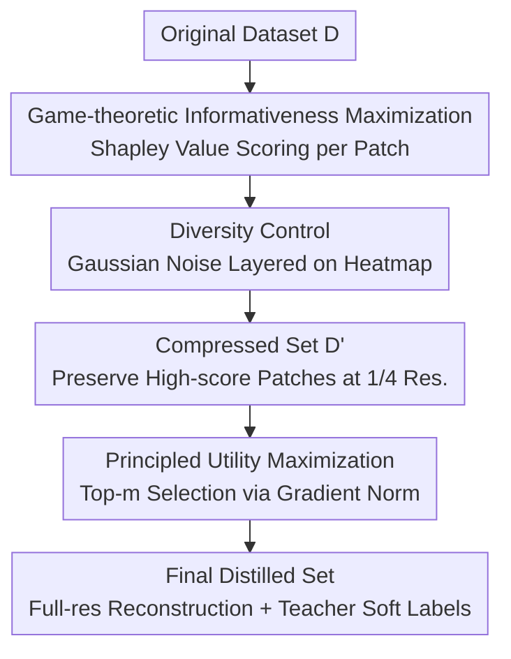

# Grounding and Enhancing Informativeness and Utility in Dataset Distillation

**Conference**: ICLR 2026  
**arXiv**: [2601.21296](https://arxiv.org/abs/2601.21296)  
**Code**: None  
**Area**: Dataset Distillation  
**Keywords**: Dataset Distillation, Shapley Value, Gradient Norm, Informativeness, Utility

## TL;DR
The InfoUtil framework is proposed to maximize sample informativeness (identifying the most critical patches) using game-theoretic Shapley Values and maximize sample utility (selecting the most valuable samples for training) via gradient norms. It achieves a 6.1% improvement over the previous SOTA on ImageNet-1K.

## Background & Motivation

**Background**: Dataset distillation aims to synthesize a small dataset from a large-scale dataset such that model performance trained on it approximates the original data. Mainstream methods are categorized into matching-based (e.g., gradient/trajectory matching) and knowledge distillation-based approaches. Knowledge distillation methods (e.g., RDED) demonstrate better performance but lack theoretical interpretability.

**Limitations of Prior Work**: Matching-based methods struggle to balance efficiency and performance (e.g., trajectory matching requires $4 \times$ A100 GPUs). Knowledge distillation methods like RDED rely on random cropping and heuristic scoring to select patches, lacking principled theoretical guarantees; consequently, randomly selected patches often miss key semantic regions.

**Key Challenge**: How to simultaneously address two problems within a theoretically interpretable framework: (1) Which regions within each sample are most important (Informativeness)? (2) Which samples are most valuable for training (Utility)?

**Goal**: Establish a theoretical foundation for dataset distillation, define optimal distillation, and design algorithms accordingly.

**Key Insight**: The concepts of Informativeness (patch-level, measuring information content) and Utility (sample-level, measuring training value) are proposed to mathematically define optimal distillation. Shapley Values are used for informativeness attribution, and gradient norms are utilized for utility evaluation.

**Core Idea**: Combining game-theoretic selection of the most important patches with gradient norm-based selection of the most valuable samples result in a theoretically grounded optimal distillation.

## Method

### Overall Architecture
InfoUtil decomposes the question of "what constitutes a good distilled dataset" into two quantifiable problems: which regions in an image are most worth preserving (Informativeness, patch-level) and which samples are most worth including in the distilled set (Utility, sample-level). Each is approximated using a theoretically grounded metric. The pipeline consists of two stages: in the first stage, Shapley Values are used to score all patches in an image, Gaussian noise is layered onto the heatmap for diversity control, and the most informative patches are selected and compressed into $\mathcal{D}'$. In the second stage, gradient norms estimate the training utility of each compressed sample in $\mathcal{D}'$, with the top-$m$ selected for the final distilled set $\tilde{\mathcal{D}}$. Finally, preserved patches are reconstructed into full-resolution images with soft labels generated by a teacher model.

### Key Designs

**1. Game-theoretic Informativeness Maximization: Transforming patch importance into a provable attribution problem**

Methods like RDED rely on random cropping and heuristic scoring, which often miss semantic regions and lack theoretical guarantees. InfoUtil treats an image as a cooperative game where each patch is a player and the model's prediction is the payoff. The informativeness of a single patch is measured by its Shapley Value:

$$\phi_f(x^{(i)}) = \frac{1}{d}\sum_{s:s_i=0}\binom{d-1}{\mathbf{1}^\top s}^{-1}\bigl(f(x\circ(s+e_i)) - f(x\circ s)\bigr)$$

Intuitively, it enumerates all "selected patch subsets $s$" and calculates how much the prediction changes after adding the $i$-th patch, weighted by subset size. Shapley Value is selected because it is the unique attribution method satisfying linearity, dummy, symmetry, and efficiency axioms. Preserving patches with the highest Shapley Values is equivalent to preserving regions with the highest discriminative contribution. Since exact computation requires $2^{16}$ inferences, KernelShap is used for fast estimation.

**2. Diversity Control: Adding noise to Shapley heatmaps to prevent homogeneity**

Pure Shapley attribution can cause samples of the same class to concentrate high scores on similar locations (e.g., always wildlife heads), resulting in highly homogeneous patch selection. To mitigate this, Gaussian noise $\phi + \varepsilon,\ \varepsilon \sim \mathcal{N}(0, \sigma^2)$ is added to the Shapley heatmap before selection. This allows different samples to select diverse patches within their respective high-information regions, enhancing the coverage of the distilled set.

**3. Principled Utility Maximization: Replacing expensive "Leave-one-out" experiments with a computable upper bound**

Determining which samples should enter the distilled set ideally involves measuring utility $\mathcal{U}$ based on the difference in training performance with and without a sample. However, this is computationally prohibitive. Theorem 1 provides a computable upper bound, linking utility to the gradient norm of the sample under current parameters:

$$\mathcal{U}(x_i, y_i; f_{\theta^{(t)}}) \leq c\,\|\nabla_{\theta^{(t)}}\ell_t(f_{\theta^{(t)}}(x_i), y_i)\|$$

Larger gradient norms indicate samples that drive stronger parameter updates and have greater training impact. Therefore, sorting by gradient norm and selecting the top-$m$ samples approximates the highest utility set. Gradient norms are calculated using intermediate teacher model checkpoints to avoid dependency on the final converged model.

### Loss & Training
- Shapley Values are estimated via KernelShap to avoid $2^{16}$ exact subset inferences.
- Gradient norms and soft labels are obtained from intermediate checkpoints of the teacher model.
- Patches are compressed to 1/4 resolution, and four compressed patches are stitched into one full-sized image for training.

## Key Experimental Results

### Main Results
ResNet-18, IPC=50 (50 images per class):

| Dataset | Method | Top-1 Acc | Gain |
|--------|------|-----------|------|
| ImageNet-1K | RDED (Prev. SOTA) | Baseline | — |
| ImageNet-1K | **Ours** | Baseline + 6.1% | +6.1% |
| ImageNet-100 | RDED | Baseline | — |
| ImageNet-100 | **Ours** | Baseline + 16% | +16% |
| CIFAR-10 IPC50 | RDED | 62.1 | — |
| CIFAR-10 IPC50 | **Ours** | **71.0** | +8.9% |

### Ablation Study

| Configuration | ImageNet-1K Acc | Description |
|------|----------------|------|
| Full InfoUtil | Optimal | Shapley + Gradient Norm |
| Random Patches (No Shapley) | Significant drop | Informativeness selection is critical |
| Random Sample (No Gradient Norm) | Drop | Utility ranking is valuable |
| No Diversity Noise | Slight drop | Diversity helps |

### Key Findings
- Shapley Values align patches with semantic regions (e.g., animal heads rather than backgrounds), whereas RDED’s random cropping often selects irrelevant backgrounds.
- Gradient norm is a simple and effective utility metric—high-norm samples are indeed more important for training.
- Significant improvements on large-scale datasets (6.1% on ImageNet-1K) demonstrate scalability.
- Cross-architecture generalization: Data distilled using ResNet-18 shows significant gains when evaluated on ResNet-101.

## Highlights & Insights
- **Strong Theoretical Foundation**: Deploys a rigorous definition of optimal distillation (Definition 4) based on Informativeness and Utility, approximated via Shapley and gradient norms.
- **First Use of Shapley Value for Attribution** in dataset distillation, significantly outperforming random cropping. This approach can be extended to other scenarios requiring important region selection.
- **Utility = Gradient Norm Bound**: Theorem 1 provides an intuitive computational proxy—samples with larger gradients have a greater "momentum" impact on training and should be preserved.

## Limitations & Future Work
- Shapley Value computation, even with KernelShap, incurs overhead; efficiency on ultra-large scales (>1M images) requires verification.
- The 1/4 resolution compression is a fixed setting; adaptive compression ratios might be superior.
- Gradient norms are derived from a single checkpoint; ensemble evaluation across multiple checkpoints might be more robust.
- Validated only on classification; dense prediction tasks like detection or segmentation remain unexplored.

## Related Work & Insights
- **vs RDED**: RDED uses random cropping and heuristic scoring; InfoUtil uses Shapley and gradient norms, offering stronger theoretical grounding and 6.1%–16% better performance.
- **vs SRe2L**: SRe2L is another knowledge distillation approach; InfoUtil significantly outperforms it across all IPC settings.
- **vs Matching-based (MTT/DATM)**: Matching methods are competitive on small datasets but less scalable; InfoUtil balances performance across both small and large scales.

## Rating
- Novelty: ⭐⭐⭐⭐ First application of Shapley for distillation patch selection; complete theoretical framework.
- Experimental Thoroughness: ⭐⭐⭐⭐⭐ 7 datasets, 3 architectures, multiple IPC settings, cross-architecture validation.
- Writing Quality: ⭐⭐⭐⭐ Clear theoretical definitions and complete proof for internal theorems.
- Value: ⭐⭐⭐⭐ Provides a new theoretically grounded paradigm for dataset distillation.

<!-- RELATED:START -->

## Related Papers

- [\[ICLR 2026\] Diffusion Models as Dataset Distillation Priors](diffusion_models_as_dataset_distillation_priors.md)
- [\[ICLR 2026\] Understanding Dataset Distillation via Spectral Filtering](understanding_dataset_distillation_via_spectral_filtering.md)
- [\[CVPR 2025\] Enhancing Dataset Distillation via Non-Critical Region Refinement](../../CVPR2025/model_compression/enhancing_dataset_distillation_via_non-critical_region_refinement.md)
- [\[ICLR 2026\] Asymmetric Synthetic Data Update for Domain Incremental Dataset Distillation](asymmetric_synthetic_data_update_for_domain_incremental_dataset_distillation.md)
- [\[ICLR 2026\] Rectified Decoupled Dataset Distillation: A Closer Look for Fair and Comprehensive Evaluation](rectified_decoupled_dataset_distillation_a_closer_look_for_fair_and_comprehensiv.md)

<!-- RELATED:END -->
