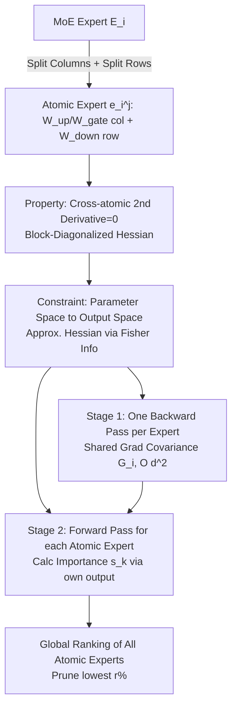

# HEAPr: Hessian-based Efficient Atomic Expert Pruning in Output Space

**Conference**: ICLR 2026  
**OpenReview**: [https://openreview.net/forum?id=JAbMgS7gl6](https://openreview.net/forum?id=JAbMgS7gl6)  
**Code**: [https://github.com/LLIKKE/HEAPr](https://github.com/LLIKKE/HEAPr)  
**Area**: Model Compression / MoE Pruning  
**Keywords**: Mixture-of-Experts, Model Pruning, Optimal Brain Surgeon, Second-order Information, Atomic Experts  

## TL;DR
HEAPr decomposes each MoE expert into irreducible "atomic experts" (one column of $W_{up}/W_{gate}$ + one row of $W_{down}$). It measures the importance of each atomic expert using second-order information from the Optimal Brain Surgeon (OBS). By simplifying from the "parameter space $\rightarrow$ output space," the Hessian storage complexity is reduced from $O(d^4)$ to $O(d^2)$. Global ranking and pruning of atomic experts across the entire model can be achieved on a small calibration set with only two forward passes and one backward pass, maintaining near-lossless performance at 20%~25% pruning ratios.

## Background & Motivation
**Background**: MoE models utilize sparse activation to achieve lower computation costs, but all expert parameters must reside in VRAM—for instance, DeepSeek-V3 activates only 37B parameters during inference but requires storage for the full 671B. MoE layers account for over 97% of the total parameters, creating a storage bottleneck for deployment on resource-constrained devices.

**Limitations of Prior Work**: Pruning has long faced a trade-off: fine-grained pruning (parameter sparsification) maintains accuracy but offers limited hardware acceleration, while coarse-grained pruning provides direct acceleration but significant accuracy drops. Consequently, research shifted toward **expert-level pruning**, which follows two problematic paths: (1) Expert dropping (e.g., NAEE) removes entire experts, losing complementary specialized knowledge; (2) Expert merging (e.g., MC-SMoE / HC-MoE) attempts to fuse similar experts, but clustering similarity is unstable, and weighted averaging introduces destructive parameter conflicts. Subsequent decomposition methods (D2-MoE / Sub-MoE) split experts into shared and specialized components to mitigate conflicts but require expensive decomposition-merging and still suffer from non-negligible accuracy loss.

**Key Challenge**: The expert level is currently the coarsest pruning unit; removing one unit results in a massive block loss, making accuracy drops inevitable. Conversely, using finer units faces astronomical storage overhead for Hessian second-order information, reaching $O((3d_{model} \cdot d_{inter})^2)$ at the expert level. The **flexibility of pruning granularity** and the **computability of second-order information** are in direct conflict.

**Goal**: Identify a pruning unit more flexible than a "whole expert" while making the second-order information for measuring importance computationally and storage-wise feasible, achieving high-performance pruning without retraining.

**Key Insight**: **[Atomic Decomposition + Space Transformation]**—Decompose experts into "atomic experts" (the smallest irreducible units). Leverage the property that second-order derivatives between atomic experts are zero to eliminate cross-atomic Hessian terms. Then, transfer pruning constraints from the parameter space to the output space. Using the Fisher Information Matrix, the importance of each atomic expert is simplified into output-level second-order quantities, which can be computed via standard forward and backward passes.

## Method

### Overall Architecture
HEAPr mathematically represents each MoE expert as a sum of several "atomic experts," proving that parameters of different atomic experts are second-order decoupled. It then rewrites the constraint of "removing an atomic expert" from "zeroing parameters" to "zeroing output," using Fisher Information (gradient covariance) in the output space to approximate the OBS loss increment. The practical computation consists of two stages: a single backward pass per expert to obtain the shared output gradient covariance matrix $\bar{G}_i$, followed by a forward pass to calculate importance scores using the individual outputs of each atomic expert. Finally, **global ranking** is performed across all MoE layers to prune the bottom $r\%$ of atomic experts.

### Key Designs

**1. Atomic Expert Decomposition: Breaking experts into the smallest removable units.** In a gated FFN expert $E_i(x)=W^{down}_i[\text{SiLU}(W^{gate}_i x)\odot(W^{up}_i x)]$, the authors bind the $j$-th row of $W^{up}_i, W^{gate}_i$ and the $j$-th column of $W^{down}_i$ into an atomic expert $e_i^{(j)}(x)=w^{down}_{i,j}[\text{SiLU}(w^{gate}_{i,j}x)\cdot(w^{up}_{i,j}x)]$. Thus, the expert is a linear superposition: $E_i(x)=\sum_{j=1}^{d_{inter}} e_i^{(j)}(x)$. The value of this decomposition lies in its flexibility: pruning an atomic expert is equivalent to removing a slice of the intermediate dimension without interfering with the structure of other atomic experts. This is hardware-friendly (directly reduces matrix dimensions) and avoids the hardware inefficiencies of irregular parameter sparsification.

**2. Block-Diagonalized Hessian: Zero cross-atomic second derivatives.** Directly applying OBS at the expert level yields a Hessian space complexity of $O((3d_{model}\cdot d_{inter})^2)$, which is unmaskable. The authors discovered that atomic expert parameters are decoupled: $\frac{\partial^2 E(x)}{\partial\Theta^{(i)}\partial\Theta^{(j)}}=0,\ \forall i\neq j$. Thus, the second-order Taylor expansion of the loss collapses into a sum of the Hessians of individual atomic experts: $\Delta\ell\approx\frac{1}{2}\sum_{i=1}^{d_{inter}}(\delta\Theta^{(i)})^{T}H^{(i)}\delta\Theta^{(i)}$. This reduces complexity from $O((3d_{model}\cdot d_{inter})^2)$ to $O((3d_{model})^2\cdot d_{inter})$—the first major reduction.

**3. Output Space Rewriting: Converting importance to a forward-computable quantity.** Since storage is still large after block-diagonalization, the authors perform a second simplification: the original OBS constraint (Formula 2) requires "zeroing parameters for all inputs $x$," which is rewritten as "zeroing the **output** of the atomic expert." This shifts importance analysis to the output space, allowing the use of the Fisher Information Matrix (theoretically equivalent to the expected Hessian but more efficient). Combined with a Taylor expansion of the atomic expert functions, the complexity per expert is compressed to $O(d_{model}^2)$. This is the origin of "in Output Space" in the name HEAPr.

**4. Efficient Two-stage Estimation + Global Ranking.**
- **Stage 1 (Gradient Covariance)**: All atomic experts within the same expert share the gradient with respect to the output. One backward pass yields $g_{E_i}=\partial\ell/\partial E_i$, which is used to accumulate the shared covariance $\bar{G}_i=\frac{1}{|T_i|}\sum_{x\in T_i}g_{E_i}(x)g_{E_i}(x)^\top$ over the token subset $T_i$ routed to that expert. Storage is only $O(d_{model}^2)$.
- **Stage 2 (Importance Calculation)**: During the forward pass, even though $\bar{G}_i$ is shared, each atomic expert output $e_k(x)$ differs, so $\bar{s}_k=\frac{1}{|T_i|}\sum_{x\in T_i}\frac{1}{2}e_k(x)^\top\bar{G}_i e_k(x)$ distinguishes their contributions. This measure corresponds directly to the "contribution to total model loss," allowing for **global ranking** across all layers.

## Key Experimental Results

### Main Results (Average accuracy across seven zero-shot tasks, higher is better; Wiki/PTB Perplexity, lower is better)
Experiments cover DeepSeekMoE-16B-Base, Qwen1.5-MoE-A2.7B-Chat, Qwen2-57B-A14B, and Qwen3-30B-A3B:

| Model | Ratio | Method | Wiki↓ | PTB↓ | Avg.↑ |
|------|--------|------|-------|------|-------|
| DeepSeekMoE-16B | 0% | Original | 6.38 | 9.47 | 0.56 |
| | 20% | NAEE | 9.44 | 15.02 | 0.53 |
| | 20% | D2-MoE | 6.84 | 11.10 | 0.54 |
| | 20% | **HEAPr** | **6.54** | **9.88** | **0.56** |
| | 40% | D2-MoE | 7.93 | 14.07 | 0.49 |
| | 40% | **HEAPr** | **6.80** | **10.86** | **0.53** |
| Qwen1.5-MoE | 0% | Original | 8.12 | 12.97 | 0.54 |
| | 25% | Sub-MoE | 9.48 | 14.84 | - |
| | 25% | **HEAPr** | **8.31** | 14.12 | **0.53** |

- DeepSeekMoE-16B at **20% pruning achieves an average accuracy of 0.56, parity with the original model** (near-lossless), with Wiki perplexity nearly unchanged (6.54 vs 6.38).
- At a high 40% ratio, HEAPr maintains 0.53, significantly outperforming D2-MoE (0.49) and NAEE (0.46).
- The latest Qwen3-30B-A3B shows only a **0.03** drop in average accuracy at a 25% ratio; overall, it is near-lossless at 20%~25% while reducing **FLOPs by ~20%**.

### Ablation Study
**Global vs. Layer-wise Ranking** (DeepSeekMoE-16B-Base, average across seven tasks):

| Ratio | Method | Average |
|--------|------|---------|
| 20% | CAMERA-P (Layer) | 59.52 |
| 20% | HEAPr-L (Layer) | 60.03 |
| 20% | **HEAPr-G (Global)** | **60.68** |
| 40% | CAMERA-P (Layer) | 56.87 |
| 40% | HEAPr-L (Layer) | 56.99 |
| 40% | **HEAPr-G (Global)** | **Better** |

- Even when restricted to layer-wise ranking (HEAPr-L), the method outperforms CAMERA-P, indicating that the **atomic expert unit + output space importance measure** is inherently more accurate.
- Global ranking (HEAPr-G) further improves the 20% average score from 60.03 to 60.68.

### Key Findings
- **Granularity equals Gain**: Sub-expert decomposition prevents collateral damage to complementary specializations, which is the root cause of near-lossless performance.
- **Output Space is key to Computability**: The two-step simplification reduces second-order information from $O(d^4)$ to $O(d^2)$, making OBS practical for 16B~57B MoE models.
- **Zero Retraining**: The process requires only a small calibration set and two forward/one backward pass, making deployment costs extremely low.

## Highlights & Insights
- **The specific decomposition perspective is elegant**: Atomic experts are natural slices of gated FFN intermediate dimensions. The linear summation of experts makes "pruning an atomic expert = shrinking a dimension" mathematically clean and hardware-friendly.
- **Interlocking complexity reductions**: First, block-diagonal properties eliminate most Hessian terms; second, the output space transformation + Fisher Information compress the expert Hessian to $O(d^2)$.
- **Engineering cleverness with shared gradients**: All atomic experts in an expert share one output gradient, allowing one backward pass per expert to serve all sub-units.
- **Global ranking superiority**: Anchoring importance to "overall loss contribution" provides a unified metric across layers, which is more logical than traditional uniform layer-wise pruning.

## Limitations & Future Work
- Evaluation is concentrated on zero-shot language understanding and perplexity; degradation on harder tasks like long-chain reasoning, generation quality, or code/math is not fully explored.
- Importance is estimated based on a small calibration set; robustness might be affected if the calibration distribution mismatches downstream tasks (not deeply discussed).
- The method is designed for gated FFN MoE architectures; adaptation to Shared Experts, fine-grained experts, or other routing structures (e.g., DeepSeek-V3) requires verification.
- Since it is pruning only without recovery fine-tuning, performance drops significantly at aggressive ratios (e.g., 50%+). Combining this with lightweight fine-tuning is a natural extension.

## Related Work & Insights
- **OBS Lineage**: HEAPr extends Optimal Brain Surgeon / Optimal Brain Damage by using second-order Taylor expansion to measure loss increments, following the path of K-FAC, layer-wise Hessian (GPTQ/SparseGPT), and Fisher approximations (WoodFisher).
- **MoE Compression Comparison**: Unlike expert dropping (NAEE), merging (MC-SMoE/HC-MoE), or decomposition (D2-MoE/Sub-MoE), HEAPr avoids clustering and parameter merging, relying on finer units and principled importance metrics.
- **Insight**: When a structure (like atomic experts) allows Hessian block-diagonalization, "transforming the space (parameters $\rightarrow$ output) and using Fisher approximations" is a universal recipe for engineering expensive second-order methods.

## Rating
- **Novelty**: ⭐⭐⭐⭐ — The "atomic expert" unit plus output-space Hessian rewriting makes OBS practical for MoE for the first time.
- **Experimental Thoroughness**: ⭐⭐⭐⭐ — Covers multiple models (16B~57B) and ratios; however, lacks generation/reasoning task analysis.
- **Writing Quality**: ⭐⭐⭐⭐ — Clear logic chain of Motivation-Contradiction-Simplification.
- **Value**: ⭐⭐⭐⭐ — Near-lossless performance at 20%~25% ratio with ~20% FLOPs reduction and no retraining requirement.

<!-- RELATED:START -->

## Related Papers

- [\[ICLR 2026\] Expert Merging: Model Merging with Unsupervised Expert Alignment and Importance-Guided Layer Chunking](expert_merging_model_merging_with_unsupervised_expert_alignment_and_importance-g.md)
- [\[ICLR 2026\] SERE: Similarity-based Expert Re-routing for Efficient Batch Decoding in MoE Models](sere_similarity-based_expert_re-routing_for_efficient_batch_decoding_in_moe_mode.md)
- [\[ICLR 2026\] PiCa: Parameter-Efficient Fine-Tuning with Column Space Projection](pica_parameter-efficient_fine-tuning_with_column_space_projection.md)
- [\[ICLR 2026\] SSDi8: Accurate and Efficient 8-bit Quantization for State Space Duality](ssdi8_accurate_and_efficient_8-bit_quantization_for_state_space_duality.md)
- [\[ICLR 2026\] Steering MoE LLMs via Expert (De)Activation](steering_moe_llms_via_expert_deactivation.md)

<!-- RELATED:END -->
