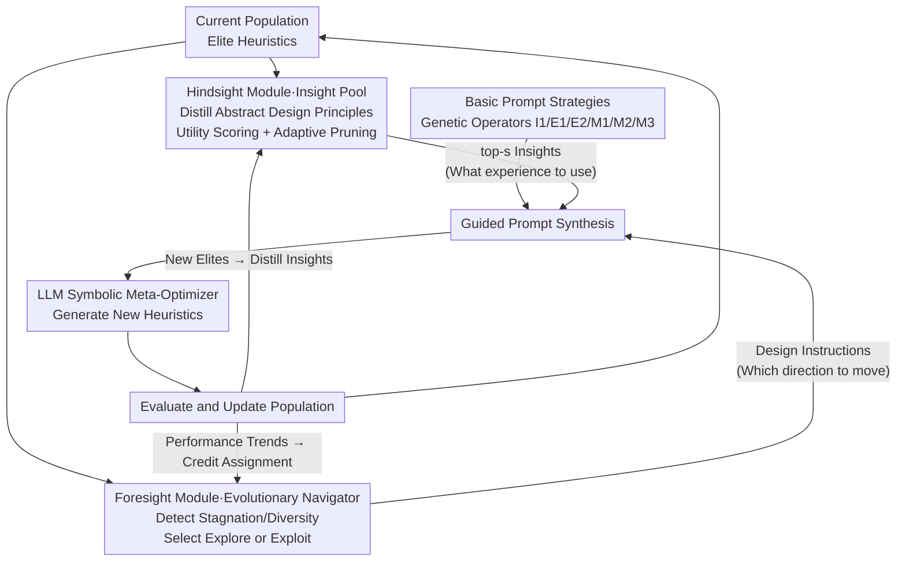

# HiFo-Prompt: Prompting with Hindsight and Foresight for LLM-based Automatic Heuristic Design

**Conference**: ICLR 2026  
**arXiv**: [2508.13333](https://arxiv.org/abs/2508.13333)  
**Code**: [GitHub](https://github.com/Challenger-XJTU/HiFo-Prompt)  
**Area**: Model Compression  
**Keywords**: Automatic Heuristic Design, LLM+Evolutionary Computation, Knowledge Management, Exploration-Exploitation Balance, Combinatorial Optimization

## TL;DR
The HiFo-Prompt framework is proposed, which enhances LLM-driven Automatic Heuristic Design (AHD) through two synergistic modules: Hindsight (retrospective knowledge pool) and Foresight (prospective evolutionary navigator), significantly outperforming existing methods on tasks such as TSP and FSSP.

## Background & Motivation
The paradigm of LLM + Evolutionary Computation (EC) (e.g., FunSearch, EoH) has shown potential for automatically designing heuristic algorithms by using LLMs as high-level semantic mutation operators. However, existing methods face two fundamental challenges:

**Lack of Global Adaptive Guidance**: Most existing methods rely on local or reactive signals—ReEvo reflects only on individual candidates, while MCTS-AHD passively embeds the exploration-exploitation trade-off into the search structure. These local controls fail to proactively intervene in systemic issues such as population stagnation or diversity collapse. Another approach, EvoTune, directly fine-tunes LLM weights, but it is computationally expensive and renders knowledge uninterpretable.

**Knowledge Decay**: Successful design strategies are often entangled with specific code implementations. When a parent individual is eliminated, the underlying logic is lost. The system fails to achieve cumulative learning, repeatedly rediscovering similar concepts.

Core Idea: Elevate the LLM from a "code generator" to a "symbolic meta-optimizer," granting it hierarchical control—Foresight observes population dynamics to guide macro-strategies, while Hindsight distills reusable design principles from elite individuals.

## Method

### Overall Architecture
HiFo-Prompt treats the LLM as a "symbolic meta-optimizer" within the evolutionary loop. Instead of simply having the LLM generate code in each generation, it first performs "Guided Prompt Synthesis," then allows the LLM to produce new heuristics based on it. This Prompt is synthesized from three parts: basic Prompt strategies (acting as genetic operators to decide on initialization, recombination, or mutation), the Hindsight module (injecting design principles distilled from historical elites), and the Foresight module (issuing macro-instructions on "whether to explore or exploit" based on the current population state). The former is responsible for "how to change," while the latter two handle "what experience to use" and "which direction to move," respectively. The entire system is a self-evolving closed loop: new heuristics produced by the LLM update the population after evaluation, new elites are distilled into insights to feed back into Hindsight, and performance trends inform credit assignment in Foresight, making both guidance modules increasingly accurate.

### Key Designs

**1. Hindsight Module: Combating Knowledge Decay with a Self-Evolving Insight Pool**

Successful strategies in existing LLM+EC methods are often entangled in specific code. Once a parent is eliminated, the underlying design logic is lost, and the system can only repeatedly rediscover similar concepts. Hindsight decouples "thought" from "code": abstract design principles (insights) are extracted from elite individuals at the end of each generation and stored in a persistent knowledge pool. The entire pool self-evolves through three stages: *Insight Extraction and Admission* uses a Jaccard similarity threshold $\theta_{\text{novelty}}$ to deduplicate new insights, avoiding redundant storage; *Insight Retrieval and Credit Assignment* selects the top-$s$ highest-utility insights to inject into the Prompt. The utility function balances effectiveness, usage penalties, and recency bonuses:

$$U(k_i, t) = E_i(t) - w_u \log(N_i(t)+1) + B_r(t, t_i^{\text{last}})$$

The *Adaptive Pruning* stage evicts insights with the lowest scores when the pool capacity is exceeded. The key to this mechanism is credit assignment: it maps the relative performance of the population $\tilde{\rho}$ to a credit signal using a piecewise function—$g_{\text{eff}} = 0.8 + 0.2\tilde{\rho}$ when surpassing the current best, $0.2 + 0.6\tilde{\rho}$ when above the mean, and $-0.3 + 0.5\tilde{\rho}$ when below the mean. These signals are then updated via EMA to smooth individual insight utility scores. Consequently, insights driving real progress have their utility continuously raised and are retained long-term, while ineffective insights are gradually penalized and pruned. This effectively translates "credit assignment for sparse rewards" from Reinforcement Learning into knowledge management, allowing transient evolutionary success to settle as reusable assets.

**2. Foresight Module: Providing Interpretable Global Control with an Evolutionary Navigator**

Control signals in methods like EoH and ReEvo are local or reactive—reflecting only on single candidates—making them unable to proactively intervene in systemic issues such as population stagnation or diversity collapse. Foresight explicitly models the global state by maintaining two mutually exclusive counters, $C_{\text{prog}}$ (progress) and $C_{\text{stag}}$ (stagnation), to track performance trends, while calculating phenotypic diversity $\Delta_p(t)$, defined as the proportion of unique algorithm description pairs in the population. Based on these signals, a set of threshold rules switches between three evolutionary regimes: walk $\theta_{\text{explore}}$ (encourage exploration) during stagnation or low diversity, walk $\theta_{\text{exploit}}$ (intensify exploitation) during continuous progress, and walk $\theta_{\text{balance}}$ otherwise. Notably, diversity is measured using exact string matching rather than embedding similarity—because embeddings tend to "flatten" semantics, causing subtle but critical logical differences to be misjudged as duplicates. This module is essentially a symbolic surrogate for "language gradients": instead of fine-tuning weights, it uses a natural language "design instruction" to explicitly tell the LLM which direction to proceed, making the control strategy interpretable.

**3. Basic Prompt Strategies: Genetic Operators for LLM**

This component provides atomic operations for the evolutionary process, translating traditional EC genetic operators into instructions executable by the LLM: initialization strategy I1 is responsible for generating the first generation of candidates; recombination has two types—E1 synthesizes new structures from multiple parents, and E2 abstracts commonalities to produce variants; mutation has three types—M1 performs structural modification, M2 performs parameter tuning, and M3 performs simplification to prevent overfitting. The macro-instructions provided by Foresight are ultimately implemented through the selection and combination of these basic operators.

### Loss & Training
The population size is set to 8. Combinatorial optimization (CO) tasks are run for 8 generations, and Bayesian optimization (BO) tasks for 4 generations. The LLM used is Qwen2.5-Max. Insight Pool capacity is 30, Jaccard threshold is 0.7, top-3 retrieval is used, EMA rate is 0.3, stagnation threshold is 3, progress threshold is 2, and diversity threshold is 0.3.

## Key Experimental Results

### Main Results: TSP Step-by-step Construction

| Method | TSP50 Gap(%) | TSP100 Gap(%) | TSP200 Gap(%) |
|------|-------------|---------------|---------------|
| LKH3 | 0.000 | 0.000 | 0.000 |
| EoH | 12.820 | 15.361 | 16.658 |
| ReEvo | 10.239 | 12.577 | 14.890 |
| MCTS-AHD | 10.642 | 12.521 | 13.510 |
| **Ours** | **6.625** | **8.582** | **8.877** |

### Main Results: TSP Guided Local Search

| Method | TSP100 Gap(%) | TSP200 Gap(%) | TSP500 Gap(%) |
|------|-------------|---------------|---------------|
| EoH | 0.026 | 0.453 | 2.037 |
| ReEvo | 0.049 | 0.424 | 2.090 |
| HSEvo | 0.087 | 0.886 | 2.507 |
| **Ours** | **0.015** | **0.382** | **1.520** |

### Key Findings
- On TSP step-by-step, Ours reduces the Gap from ~13% to ~8%, a relative improvement of approximately 40%.
- The credit assignment mechanism of the Insight Pool effectively guides knowledge evolution, preventing inefficient insights from continuously occupying resources.
- Foresight's adaptive strategy switching is crucial for avoiding premature convergence.
- Demonstrates competitive performance and reliability on Bayesian Optimization tasks.

## Highlights & Insights
- The concept of "decoupling code from thought" is novel—evaluating and updating insights independently rather than directly evolving code significantly reduces evaluation costs.
- The lifecycle management of the Insight Pool (extraction → retrieval → credit assignment → pruning) is sophisticated and analogous to handling sparse rewards in reinforcement learning.
- Explicit control of exploration-exploitation is achieved through natural language "design instructions," providing a symbolic alternative to parameter tuning.

## Limitations & Future Work
- The determination of population dynamics relies on several manual thresholds (stagnation=3, progress=2, diversity=0.3) and lacks adaptive adjustment.
- The base model for experiments was limited to Qwen2.5-Max; the response of different LLMs to prompt strategies may vary significantly.
- Semantic similarity in the Insight Pool is measured only by Jaccard, which may miss redundant insights that are semantically similar but use different vocabulary.

## Related Work & Insights
- **vs EoH**: EoH lacks knowledge persistence and global control. Ours compensates for these deficiencies through the Insight Pool and Navigator.
- **vs ReEvo**: ReEvo reflects only on individual candidates, whereas Ours performs macro-monitoring of the entire population.

## Rating
- Novelty: ⭐⭐⭐⭐⭐ The ideas of code-thought decoupling and symbolic meta-optimization are highly novel.
- Experimental Thoroughness: ⭐⭐⭐⭐ Covers multiple tasks (TSP/BPP/FSSP/BO), but lacks larger-scale instances.
- Writing Quality: ⭐⭐⭐⭐ Detailed and clear method descriptions with abundant formulas.
- Value: ⭐⭐⭐⭐ Provides a systematic framework for LLM-driven automatic algorithm design.

<!-- RELATED:START -->

## Related Papers

- [\[ICLR 2026\] MOSS: Efficient and Accurate FP8 LLM Training with Microscaling and Automatic Scaling](moss_efficient_and_accurate_fp8_llm_training_with_microscaling_and_automatic_sca.md)
- [\[ACL 2026\] LLM Prompt Duel Optimizer: Efficient Label-Free Prompt Optimization](../../ACL2026/model_compression/llm_prompt_duel_optimizer_efficient_label-free_prompt_optimization.md)
- [\[ICLR 2026\] Dr.LLM: Dynamic Layer Routing in LLMs](drllm_dynamic_layer_routing_in_llms.md)
- [\[ICLR 2026\] Rethinking Residual Errors in Compensation-based LLM Quantization](rethinking_residual_errors_in_compensation-based_llm_quantization.md)
- [\[ICLR 2026\] ODESteer: A Unified ODE-Based Steering Framework for LLM Alignment](odesteer_a_unified_ode-based_steering_framework_for_llm_alignment.md)

<!-- RELATED:END -->
