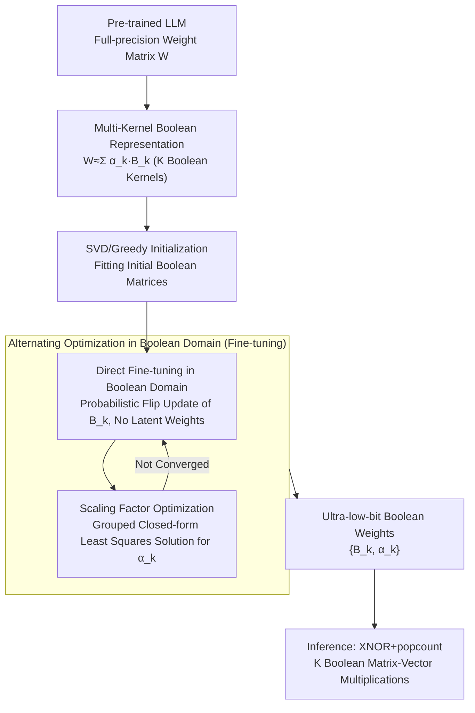

# Highly Efficient and Effective LLMs with Multi-Boolean Architectures

**Conference**: ICLR 2026  
**arXiv**: [2505.22811](https://arxiv.org/abs/2505.22811)  
**Code**: None  
**Area**: Model Compression  
**Keywords**: Weight Binarization, Boolean Parameters, Ultra-low-bit Quantization, Large Language Models, Direct Fine-tuning

## TL;DR

Ours proposes a new framework representing LLM weights using multi-kernel Boolean parameters. It achieves direct fine-tuning of LLMs in the Boolean domain for the first time without full-precision latent weights, outperforming existing ultra-low-bit quantization and binarization methods in both representation capability and computational efficiency.

## Background & Motivation

Weight binarization is a powerful strategy to reduce the complexity of Large Language Models, compressing weights from 32-bit floating-point to 1-bit. This theoretically achieves a 32x compression ratio and significant inference acceleration (converting multiplications into additions and subtractions).

**Fundamental Dilemma of Prior Work**:

**Post-training binarization**:
   - Simple approach: directly binarize pre-trained weights.
   - **Severe performance loss**: The information loss from 1-bit quantization is too extreme, leading to a sharp decline in model quality.
   - For LLMs, this performance degradation is often unacceptable.

**Training-aware binarization**:
   - Performs binarization during training/fine-tuning, adjusting binary weights via gradient signals.
   - Requires maintaining **full-precision latent weights** to accumulate gradients.
   - Uses binary weights for the forward pass and full-precision weights for updates in the backward pass.
   - Problem: Latent weights introduce extra complexity and memory overhead, severely limiting efficiency advantages.
   - Expressive power of binary weights is limited (each weight has only two states: $+1$ or $-1$).

**Key Challenge**: Post-training methods are too crude, and training-aware methods are too heavy. Is it possible to fine-tune directly in the Boolean domain **without using full-precision latent weights**?

## Method

### Overall Architecture

Ours addresses the conflict between "needing expressivity at ultra-low bits" and "avoiding full-precision latent weights." The approach represents each weight matrix of the LLM as a weighted combination of multiple Boolean matrices (Multi-Kernel Boolean Architecture). Each weight element is no longer compressed into a single $\{-1, +1\}$ but is instead a linear superposition of several Boolean kernels, restoring representation capability to a level near multi-bit quantization while maintaining Boolean operation friendliness. The pipeline starts from pre-trained weights—first fitting initial multi-kernel Boolean matrices using SVD or greedy search, then performing alternating optimization in the Boolean domain. Boolean matrices $B_k$ are updated directly via probabilistic flipping (without any full-precision copies), while scaling factors $\alpha_k$ are refreshed using a closed-form solution by groups. These two steps iterate until convergence, resulting in ultra-low-bit weights that can be directly used for XNOR+popcount inference.

### Key Designs

**1. Multi-kernel Boolean Parameter Representation: Breaking the Expressivity Bottleneck with $2^K$ Levels**

Single-kernel binarization writes weights as $W \approx \alpha \cdot B$, where $B \in \{-1, +1\}^{m \times n}$ and $\alpha$ is a single scaling factor. Each weight element has only two states, compressing information capacity to the extreme, which is the root cause of severe performance drops in post-training binarization. Ours adopts a multi-kernel form $W \approx \sum_{k=1}^{K} \alpha_k \cdot B_k$, using $K$ independent Boolean matrices $B_k$ weighted by their respective scaling factors $\alpha_k$. Thus, a combination of $K$ kernels can represent $2^K$ different weight levels. $K=2$ is roughly equivalent to 2-bit quantization and $K=3$ to 3-bit, with expressivity increasing exponentially rather than linearly with the number of kernels. Importantly, this does not sacrifice hardware advantages; the matrix multiplication $Wx$ is decomposed into $K$ Boolean matrix-vector multiplications, each efficiently implemented using XNOR+popcount.

**2. Direct Fine-tuning in Boolean Domain: Modeling Discrete Flips as Probabilistic Events to Eliminate Latent Weights**

This is the core contribution, addressing the burden of training-aware binarization needing "full-precision shadow weights" for gradient descent. Since Boolean variables $\{-1, +1\}$ are discrete and cannot be optimized via continuous gradients, traditional methods maintain full-precision latent weights $W_{\text{latent}} \in \mathbb{R}$, taking $\text{sign}(W_{\text{latent}})$ for the forward pass and using a straight-through estimator (STE) to flow gradients back to $W_{\text{latent}}$. This shadow weight causes memory overhead and efficiency degradation. Ours avoids latent weights entirely by modeling the "flip" of each Boolean element as a probabilistic event, decided by the expected improvement to the loss function. Since the optimization target is always the Boolean matrix itself, it avoids STE gradient bias and saves full-precision memory, unifying training and inference in ultra-low precision.

**3. Grouped Closed-form Optimization of Scaling Factors: Updating $\alpha_k$ Almost for Free**

Once the Boolean matrices $B_k$ are fixed, the corresponding scaling factors $\alpha_k$ reduce to a least squares problem, which can be solved directly with a closed-form solution without iterative search. Thus, training uses alternating optimization: update $B$ while fixing $\alpha$ (using design 2), then refresh $\alpha$ while fixing $B$ using the closed-form solution. Since the $\alpha$ step is analytical, the process converges quickly without adding significant computational burden. To maximize the effectiveness of $\alpha$, granularity is controlled: instead of one set per layer, the weight matrix is partitioned into groups (by column or block), each with its own $\alpha_k$. The additional parameters consist only of these scaling factors, which are negligible in scale but significantly improve quantization accuracy. Group size acts as a knob—smaller groups provide higher precision at a slight cost to compression (128 is a common trade-off).

### Loss & Training

Fine-tuning follows the standard language model cross-entropy loss, with the optimization objective being the set of Boolean parameters $\{B_k, \alpha_k\}$:

$$\mathcal{L} = -\sum_{t} \log P(x_t | x_{<t}; \{B_k, \alpha_k\})$$

Starting from pre-trained weights, the initial multi-kernel Boolean matrices are fitted using SVD or greedy search, followed by alternating optimization of Boolean matrices and scaling factors on a small-scale dataset. Because no full-precision latent weights are needed, memory usage during fine-tuning is significantly lower than traditional training-aware methods, and convergence typically requires only a few thousand samples.

## Key Experimental Results

### Main Results

Evaluations across multiple LLM architectures (including LLaMA series) measuring perplexity (PPL) and downstream task performance:

| Method | Bit-width | LLaMA-7B PPL ↓ | LLaMA-13B PPL ↓ | Compression |
|------|---------|----------------|-----------------|--------|
| Full Precision | 16 bit | Baseline | Baseline | 1× |
| GPTQ | 3 bit | Medium | Medium | ~5× |
| RTN | 2 bit | Higher | Higher | ~8× |
| BiLLM | 1 bit | Very High | Very High | ~16× |
| OneBit | 1 bit | High | High | ~16× |
| **Multi-Kernel (K=2)** | **~1.5 bit** | **Lower** | **Lower** | **~10×** |
| **Multi-Kernel (K=3)** | **~2 bit** | **Lowest** | **Lowest** | **~8×** |

In the ultra-low-bit range (1-2 bit), the multi-kernel Boolean method significantly outperforms existing binarization and quantization techniques.

### Ablation Study

| Configuration | Effect Description |
|------|---------|
| K=1 (Standard Binarization) | Worst performance, maximum compression |
| K=2 | Significant performance boost, close to 2-bit quantization |
| K=3 | Further performance boost, competitive with 3-bit GPTQ |
| With Latent Weights vs. Without | Direct Boolean fine-tuning performance is **not lower** than latent weight methods |
| Group size 128 vs. 256 vs. Layer-wise | Smaller groups are more accurate; 128 is a standard choice |
| Different Initialization Strategies | SVD initialization outperforms random initialization |

### Key Findings

1. **Multi-kernel representation significantly enhances expressivity**: The drop in perplexity from $K=1$ to $K=2$ is much larger than the improvement from 2-bit to 3-bit quantization.
2. **Eliminating latent weights is feasible**: Direct fine-tuning in the Boolean domain does not sacrifice performance, while simplifying the training pipeline and memory usage.
3. **Most effective at ultra-low bits**: In the 1-2 bit range, the advantage over traditional quantization is most pronounced.
4. **Cross-architecture generalization**: The method performs consistently across different model scales (LLaMA-7B, 13B).
5. **Significant training efficiency**: Without full-precision latent weights, memory usage during fine-tuning is reduced by approximately 50%.

## Highlights & Insights

1. **Breaking the expressivity bottleneck of binarization**: Expanding Boolean parameters from 2 discrete values to $2^K$ levels via multi-kernel combinations is simple yet effective.
2. **First direct Boolean domain fine-tuning**: Eliminating dependence on full-precision latent weights is a significant theoretical and practical breakthrough—allowing the entire training and inference pipeline to operate at ultra-low precision.
3. **Hardware friendly**: Multi-kernel Boolean multiplication is essentially $K$ XNOR+popcount operations, enabling high throughput on specialized hardware.
4. **Theoretical elegance**: Multi-kernel binarization can be viewed as a structured low-bit quantization where each level is determined by Boolean combinations.
5. **High practicality**: Low fine-tuning data requirements, low memory footprint, and simple deployment.

## Limitations & Future Work

1. **Inference speed depends on specialized hardware**: While XNOR+popcount is theoretically fast, current GPU support for Boolean operations is limited; actual speedup may be lower than theoretical expectations.
2. **Diminishing returns as K increases**: Improvements beyond K=4 may be marginal while increasing parallelism requirements.
3. **Validated only on LLMs**: Whether this applies to vision or multi-modal models requires further experimentation.
4. **Impact of fine-tuning data selection**: The paper does not analyze the impact of different datasets on final performance.
5. **Combination with Knowledge Distillation**: Using a full-precision teacher model to guide the Boolean student model could further improve performance.
6. **Boolean activations?**: Currently only weights are binarized; activations remain full-precision. Complete binarization (Weight + Activation) is a more aggressive direction.

## Related Work & Insights

- **BiLLM / OneBit**: Existing LLM binarization methods using single-kernel representation; suffer from severe performance loss.
- **GPTQ / AWQ**: Post-training quantization supporting 3-4 bit; poor support for binarization.
- **BinaryBERT / BiBERT**: Early work on binarizing BERT; much smaller scale than LLMs.
- **QLoRA**: Quantization with low-rank adaptation; precision is usually at least 4-bit.

**Key Insight**: Treat quantization as a **representation problem in Boolean space** rather than simple precision truncation. Multi-kernel Boolean parameters are a structured way to maximize expressivity under an ultra-low-bit budget.

## Rating
- Novelty: ⭐⭐⭐⭐⭐
- Experimental Thoroughness: ⭐⭐⭐⭐
- Writing Quality: ⭐⭐⭐⭐
- Value: ⭐⭐⭐⭐

<!-- RELATED:START -->

## Related Papers

- [\[ICLR 2026\] AnyBCQ: Hardware Efficient Flexible Binary-Coded Quantization for Multi-Precision LLMs](anybcq_hardware_efficient_flexible_binary-coded_quantization_for_multi-precision.md)
- [\[ICLR 2026\] E²LoRA: Efficient and Effective Low-Rank Adaptation with Entropy-Guided Adaptive Sharing](e²lora_efficient_and_effective_low-rank_adaptation_with_entropy-guided_adaptive_.md)
- [\[ICLR 2026\] Exploring Knowledge Purification in Multi-Teacher Knowledge Distillation for LLMs](exploring_knowledge_purification_in_multi-teacher_knowledge_distillation_for_llm.md)
- [\[AAAI 2026\] Don't Start Over: A Cost-Effective Framework for Migrating Personalized Prompts Between LLMs](../../AAAI2026/model_compression/dont_start_over_a_cost-effective_framework_for_migrating_personalized_prompts_be.md)
- [\[CVPR 2026\] TaskIT: Memory-Efficient Fine-Tuning of Multi-LoRA LLMs via Cross-Task Importance Transfer](../../CVPR2026/model_compression/taskit_memory-efficient_fine-tuning_of_multi-lora_llms_via_cross-task_importance.md)

<!-- RELATED:END -->
