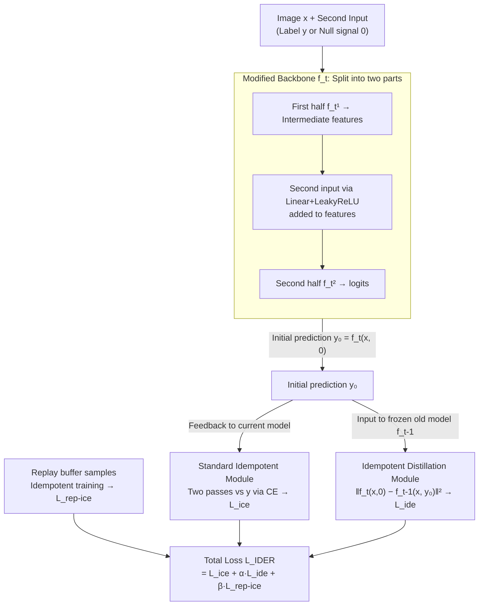

# IDER: IDempotent Experience Replay for Reliable Continual Learning

**Conference**: ICLR 2026  
**arXiv**: [2603.00624](https://arxiv.org/abs/2603.00624)  
**Code**: [GitHub](https://github.com/YutingLi0606/Idempotent-Continual-Learning)  
**Area**: Model Compression  
**Keywords**: Continual Learning, Idempotence, Experience Replay, Calibration Error, Catastrophic Forgetting

## TL;DR
This paper introduces idempotence into continual learning through two components: a standard idempotent module and an idempotent distillation module. By forcing the model to maintain output self-consistency when learning new tasks, it enhances prediction reliability (reducing calibration error) while significantly mitigating catastrophic forgetting.

## Background & Motivation
Continual learning (CL) faces the core challenge of catastrophic forgetting, where models rapidly lose knowledge of old tasks while learning new ones. Replay-based methods (e.g., ER, DER++) alleviate this via buffers, but often result in overconfident and poorly calibrated models (high ECE), particularly showing bias toward recent tasks. In safety-critical fields like healthcare and transportation, models must be accurate and "know what they don't know."

Existing uncertainty-aware CL methods (e.g., NPCL) use neural processes but suffer from: (1) non-negligible parameter growth; (2) incompatibility with logit-based replay methods due to the randomness of Monte Carlo sampling. Therefore, a **lightweight and compatible** principle is needed to build reliable CL systems.

**Key Insight**: Idempotence—a property where applying a function repeatedly yields the same result ($f(f(x)) = f(x)$). If a model maintains idempotence on old data, it indicates the output lies on a learned stable manifold, signifying self-consistent and reliable predictions.

## Method

### Overall Architecture
IDER aims to address the issues where replay-based CL models suffer from both forgetting and overconfidence. It incorporates algebraic idempotence ($f(f(x))=f(x)$) as a "prediction self-consistency" constraint during training. The pipeline modifies the classification backbone to accept its own predictions by splitting it into two sections. Images generate an initial prediction $y_0$, which is then fed back: one path goes back to the current model to form the **Standard Idempotent Module** (both forward passes must align with ground truth), and another path goes to a frozen previous-stage checkpoint to form the **Idempotent Distillation Module** (aligning initial predictions with the old model's stable output). Old samples from the replay buffer undergo the same idempotent training. The framework requires only two forward passes, adds almost no parameters, and is plug-and-play with ER, BFP, and CLS-ER.

### Key Designs

**1. Modifying the network to accept its own predictions: Paving the way for the idempotent loop**
Idempotence requires feeding outputs back into the model, but standard classification networks only accept images. IDER modifies the backbone by splitting ResNet into two parts: $f_t^1$ and $f_t^2$. A second input—either the ground truth label $y$ or a "null" signal $\mathbf{0}$—is injected between them. This input passes through a linear layer and LeakyReLU to match the dimensions of $f_t^1$ features before being added. This allows softmax logits to be reused as the second input. During inference, since ground truth is unavailable, the model uses $\mathbf{0}$ for an initial prediction and feeds it back to verify stability.

**2. Standard Idempotent Module: Training for self-consistent results**
With the recurrent structure, the first step is ensuring idempotence on the current task. The module minimizes the sum of cross-entropy for two forward passes:
$$\mathcal{L}_{ice} = \sum_{(x,y)\in\mathcal{T}_t} [\mathcal{L}_{ce}(f_t(x,y^*),y) + \mathcal{L}_{ce}(f_t(x,f_t(x,y^*)),y)]$$
The second input $y^*$ is the ground truth label with probability $1-P$ or the null signal $\mathbf{0}$ with probability $P$. After convergence, $f_t(x,\mathbf{0}) \approx y$, and feeding it back yields $f_t(x, f_t(x, \mathbf{0})) \approx y$. This ensures predictions lie on a stable manifold, signaling that the model "knows" its answer is reliable.

**3. Idempotent Distillation Module: Using frozen old models as referees to avoid error reinforcement**
Solely minimizing $\|f_t(x,\mathbf{0}) - f_t(x,f_t(x,\mathbf{0}))\|^2$ on the current model might cause it to become "confidently wrong" by reinforcing its own biased predictions on new data. IDER delegates the second forward pass to the frozen previous-stage checkpoint $f_{t-1}$:
$$\mathcal{L}_{ide} = \sum_{(x,y)\in\mathcal{T}_t,M} \|f_t(x,\mathbf{0}) - f_{t-1}(x,f_t(x,\mathbf{0}))\|_2^2$$
As $f_{t-1}$ is frozen and retains old knowledge, it acts as a stable referee. Optimization forces the initial prediction $y_0$ of $f_t$ to converge toward a direction validated by the old model, preventing distributional drift and distilling previous knowledge to counter catastrophic forgetting.

### Loss & Training
The total loss is a weighted sum: $\mathcal{L}_{IDER} = \mathcal{L}_{ice} + \alpha\mathcal{L}_{ide} + \beta\mathcal{L}_{rep\text{-}ice}$, where $\mathcal{L}_{rep\text{-}ice}$ applies the idempotent training loss to buffer data. IDER can be integrated into ER, BFP, and CLS-ER.

## Key Experimental Results

### Main Results (Final Average Accuracy)

| Method | CIFAR-10 Buf200 | CIFAR-10 Buf500 | CIFAR-100 Buf500 | CIFAR-100 Buf2000 |
|------|----------------|----------------|-----------------|------------------|
| ER | 44.46 | 58.84 | 23.41 | 40.47 |
| DER++ | 62.19 | 70.10 | 37.69 | 51.82 |
| XDER | 64.10 | 67.42 | 48.14 | 57.57 |
| BFP | 68.64 | 73.51 | 46.70 | 57.39 |
| **ER+ID (Ours)** | **71.02** | **74.74** | 44.82 | 56.59 |
| **BFP+ID (Ours)** | **71.99** | **76.65** | **48.53** | **57.74** |

### Ablation Study (GCIL-CIFAR-100 Uniform)

| Method | Buf200 | Gain | Buf500 | Gain |
|------|--------|------|--------|------|
| ER | 16.34 | — | 28.76 | — |
| ER+ID | 26.66 | +10.32 | 40.54 | +11.78 |
| CLS-ER | 22.37 | — | 36.80 | — |
| CLS-ER+ID | 31.17 | +8.80 | 37.57 | +0.77 |

### Key Findings
- ER+ID achieves up to a 26% improvement on CIFAR-10 Buf200 (44.46→71.02), the largest gain among all methods.
- Idempotent distillation effectively mitigates recency bias, resulting in more uniform prediction probabilities across tasks.
- Expected Calibration Error (ECE) decreases consistently across all baselines, indicating more "honest" predictions.
- Improvements are more pronounced in challenging GCIL settings (e.g., CLS-ER+ID improves by 8.4% in Longtail).

## Highlights & Insights
- Mapping algebraic idempotence to "prediction self-consistency" in CL provides a clear and elegant mathematical intuition.
- Extremely lightweight—requires only one additional forward pass and an old checkpoint with almost no parameter growth.
- Plug-and-play capability makes it a versatile tool for enhancing the reliability of existing CL methods.

## Limitations & Future Work
- Requires storing the old checkpoint $f_{t-1}$; while memory overhead is small, it increases system complexity.
- Experiments were conducted on ResNet-18; effectiveness on Transformer backbones and larger models is yet to be verified.
- The theoretical foundation of the idempotence assumption could be strengthened—specifically, why idempotence necessarily leads to better generalization.

## Related Work & Insights
- **vs NPCL**: NPCL uses neural processes which increase parameters and are incompatible with logit-based methods; IDER is lightweight and universal.
- **vs DER++**: DER++ simply stores and matches logits; IDER provides stronger regularization through idempotence constraints.

## Rating
- Novelty: ⭐⭐⭐⭐⭐ Application of idempotence in CL is a fresh perspective.
- Experimental Thoroughness: ⭐⭐⭐⭐⭐ Comprehensive validation across CIL, GCIL, ECE, and plug-and-play tests.
- Writing Quality: ⭐⭐⭐⭐ Logical clarity and natural derivation from motivation to method.
- Value: ⭐⭐⭐⭐ Provides a new mathematical principle and practical tool for the CL community.

## Related Papers

- [\[ICLR 2026\] Sculpting Subspaces: Constrained Full Fine-Tuning in LLMs for Continual Learning](sculpting_subspaces_constrained_full_fine-tuning_in_llms_for_continual_learning.md)
- [\[ICLR 2026\] Quantized Gradient Projection for Memory-Efficient Continual Learning](quantized_gradient_projection_for_memory-efficient_continual_learning.md)
- [\[ICLR 2026\] Rethinking Continual Learning with Progressive Neural Collapse](rethinking_continual_learning_with_progressive_neural_collapse.md)
- [\[ICLR 2026\] Revisiting Weight Regularization for Low-Rank Continual Learning](revisiting_weight_regularization_for_low-rank_continual_learning.md)
- [\[ICCV 2025\] PLAN: Proactive Low-Rank Allocation for Continual Learning](../../ICCV2025/model_compression/plan_proactive_low-rank_allocation_for_continual_learning.md)

<!-- RELATED:END -->

<!-- RELATED:START -->

## Related Papers

- [\[ICLR 2026\] Null-Space Filtering for Data-Free Continual Model Merging: Preserving Stability, Promoting Plasticity](null-space_filtering_for_data-free_continual_model_merging_preserving_stability_.md)
- [\[ICLR 2026\] Biologically Plausible Learning via Bidirectional Spike-Based Distillation](biologically_plausible_learning_via_bidirectional_spike-based_distillation.md)
- [\[ICLR 2026\] LeSTD: LLM Compression via Learning-based Sparse Tensor Decomposition](lestd_llm_compression_via_learning-based_sparse_tensor_decomposition.md)
- [\[ICLR 2026\] Topology and Geometry of the Learning Space of ReLU Networks: Connectivity and Size](topology_and_geometry_of_the_learning_space_of_relu_networks_connectivity_and_si.md)
- [\[ICLR 2026\] Learning Semi-Structured Sparsity for LLMs via Shared and Context-Aware Hypernetwork](learning_semi-structured_sparsity_for_llms_via_shared_and_context-aware_hypernet.md)

<!-- RELATED:END -->
