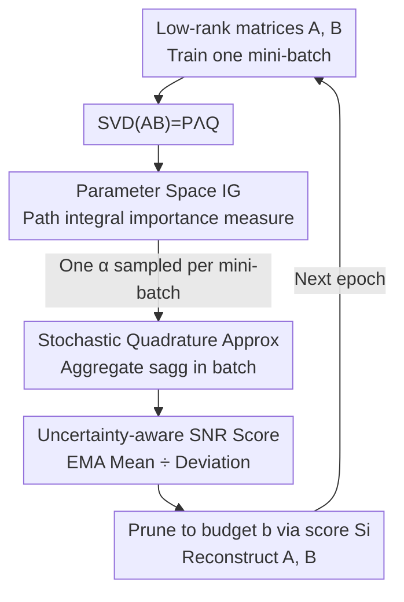

# IGU-LoRA: Adaptive Rank Allocation via Integrated Gradients and Uncertainty-Aware Scoring

**Conference**: ICLR 2026  
**OpenReview**: [https://openreview.net/forum?id=MnToYQx9My](https://openreview.net/forum?id=MnToYQx9My)  
**Code**: https://github.com/withyou12/igulora.git  
**Area**: Model Compression / Parameter-Efficient Fine-Tuning  
**Keywords**: LoRA, Adaptive Rank Allocation, Integrated Gradients, Uncertainty-Aware, PEFT

## TL;DR
To address the instability of rank allocation in AdaLoRA caused by scoring with instantaneous gradients, IGU-LoRA introduces "Integrated Gradients" into the parameter space to measure the importance of each singular value direction. It then calculates a signal-to-noise ratio (SNR) style uncertainty-aware score using EMA smoothing and deviation tracking to guide pruning, consistently exceeding LoRA / AdaLoRA / DoRA under the same parameter budget.

## Background & Motivation
**Background**: As the cost of full parameter fine-tuning for large models is prohibitive, Parameter-Efficient Fine-Tuning (PEFT), which updates a small set of task-related parameters while freezing the backbone, has become mainstream. Among them, LoRA, which expresses weight updates $\Delta W$ as the product of two low-rank matrices $AB$, is the most widely adopted due to its performance preservation and parameter efficiency.

**Limitations of Prior Work**: The original LoRA uses a **uniform fixed rank** $r$ for all layers. However, the "importance" of different layers and weight matrices varies significantly; a one-size-fits-all approach wastes budget and limits expressiveness. Adaptive rank methods like AdaLoRA perform SVD on $AB$ and dynamically prune redundant singular value directions based on "importance scores," but their scoring relies on **instantaneous gradient sensitivity** $|w_{ij}\nabla_{w_{ij}}\mathcal{L}|$.

**Key Challenge**: Instantaneous gradients reflect only the **local sensitivity** of parameters at the current point, leading to three major flaws: (1) element-wise evaluation ignores the structured joint contribution of parameters within the LoRA subspace; (2) it only considers the impact on loss at the "current moment," failing to capture cumulative contributions throughout the training process; (3) in saturation regions of activations like ReLU, gradients vanish, causing the importance of these parameters to be misjudged as zero. Consequently, scores are both unstable and biased, leading to suboptimal rank allocation.

**Goal**: Design an importance measure that captures **intra-layer non-local, path-cumulative contributions** and suppresses scoring variance caused by random sampling, thereby making rank allocation more stable and accurate.

**Key Insight**: The authors draw inspiration from Integrated Gradients (IG) in explainability. IG integrates gradients along the path from "baseline → real input," naturally bypassing saturation regions and satisfying the completeness axiom. The authors migrate this logic **from input space to parameter space**: integrating loss gradients along the path from "zero weights → post-training weights" yields a cumulative parameter importance measure.

**Core Idea**: Replace "instantaneous gradients" with "Parameter Space Integrated Gradients" to score singular value directions, and layer an uncertainty-aware SNR score to calibrate pruning.

## Method

### Overall Architecture
IGU-LoRA is built on the SVD-pruning framework of AdaLoRA: SVD is applied to the low-rank product $AB$ of each layer to get $W = W_0 + P\Lambda Q$, where $\Lambda=\mathrm{diag}\{\lambda_1,\dots,\lambda_r\}$. The initial rank $r$ is set to a large upper bound (over-parameterization), and redundant singular value triplets $(\lambda_i, P_{:,i}, Q_{i,:})$ are gradually pruned during training according to importance scores $S_i$ until a budget $b$ is reached. The innovation lies entirely in the calculation of $S_i$: replacing instantaneous gradient sensitivity with parameter space IG and uncertainty-aware SNR scores.

The complete workflow is a loop of "Training → SVD → Mini-batch IG Estimation → Epoch Aggregation → EMA Smoothing + Uncertainty → SNR Scoring → Rank Pruning," repeated every epoch:

### Key Designs

**1. Parameter Space Integrated Gradients: Using Path Integrals instead of Instantaneous Gradients**

To address the issues of locality and gradient vanishing in saturation regions, the authors migrate IG from input space to parameter space. Given a weight term $w_{ij}$, using zero weights $\Delta W^{(0)}=0$ as a baseline, the loss gradient is integrated along $\alpha\in[0,1]$ as it interpolates from the baseline to the actual weights $\Delta W$:

$$s_e(w_{ij}) = w_{ij}\int_{0}^{1}\frac{\partial \mathcal{L}(\alpha\Delta W)}{\partial w_{ij}}\,d\alpha.$$

This effectively sums the "cumulative impact of this parameter from zero to its current value" along the entire path rather than just looking at the slope at the final point. Because it integrates over the path, even if parts fall into gradient saturation regions (instantaneous gradient $\approx 0$), other segments still provide signals, preventing the score from being misjudged as zero. Meanwhile, it aggregates columns of $P$ and rows of $Q$ in the SVD subspace (see $S_i$ below), capturing structured joint contributions rather than isolated element-wise scores.

**2. Stochastic Quadrature Approximation: Compressing $O(N)$ Passes into Batch-Linear Overhead**

The integral above has no closed-form solution in large models. The standard approach is to discretize $[0,1]$ into $N$ segments using the composite trapezoidal rule, but this requires forward/backward passes at $N+1$ points for each weight, which is computationally prohibitive. The authors propose **stochastic quadrature**: for each mini-batch, only one $\alpha_k$ is **uniformly sampled** from $\{1/N,\dots,(N-1)/N\}$. Thus, the estimate for the $p$-th mini-batch is:

$$\hat{s}_e^{p}(w_{ij}) \approx \frac{|w_{ij}|}{2N}\Big(\frac{\partial\mathcal{L}(0)}{\partial w_{ij}} + 2\frac{\partial\mathcal{L}(\alpha_k\Delta W)}{\partial w_{ij}} + \frac{\partial\mathcal{L}(\Delta W)}{\partial w_{ij}}\Big),$$

These are averaged over $M$ mini-batches in an epoch to obtain $s_{agg}(w_{ij})=\frac{1}{M}\sum_{p}\hat{s}_e^{p}(w_{ij})$. The overhead of integration grows linearly with the number of batches rather than with the discretization steps $N$. The authors provide Theorem 1: under the path-wise Hessian-Lipschitz assumption, the error between this estimate and the exact IG is bounded by $O(N^{-2})$ (discretization) $+\,O(M^{-1/2})$ (sampling).

**3. Uncertainty-Aware SNR Scoring: Using Signal-to-Noise Ratio to Suppress Noise**

Random sampling and complex training dynamics can result in high variance for $s_{agg}$, making it unreliable for rank pruning. The authors apply two EMA layers: one to smooth sensitivity $\bar{s}_e^{(t)} = \beta_1\bar{s}_e^{(t-1)} + (1-\beta_1)s_{agg}^{(t)}$, representing the **persistent impact**; another to track deviation $\bar{U}^{(t)} = \beta_2\bar{U}^{(t-1)} + (1-\beta_2)\,|s_{agg}^{(t)}-\bar{s}_e^{(t)}|$, measuring **epistemic uncertainty** across mini-batches. The final score is the ratio of the two, resembling an SNR:

$$s_{snr}^{(t)}(w_{ij}) = \mathrm{SNR}_t = \frac{\bar{s}_e^{(t)}(w_{ij})}{\bar{U}^{(t)}(w_{ij}) + \epsilon}.$$

The intuition is straightforward: a large numerator indicates a parameter consistently influencing the loss, while a small denominator indicates low volatility and high reliability. Only directions with a high ratio are preserved. This differs from AdaLoRA's strategy of **multiplying** sensitivity and uncertainty. The final score for each singular value direction follows AdaLoRA's aggregation: $S_i = s_\lambda(\lambda_i) + \frac{1}{d_1}\sum_k s_{snr}(P_{ki}) + \frac{1}{d_2}\sum_k s_{snr}(Q_{ik})$, where $s_\lambda(\lambda_i)=|\lambda_i|$.

### Loss & Training
The training objective remains unchanged; only the pruning schedule is modified. For instruction fine-tuning, the initial rank is $r^{(0)}=32$, pruned to an average rank of $r^{(1)}=16$ (approx. 50% reduction). For GLUE, the AdaLoRA setting of $r^{(0)}=2 \to r^{(1)}=1$ is used. $\alpha$ is sampled from $N=20$ uniform points. Rank pruning occurs between the 2nd and 5th epochs every 1/5 epoch. Early stopping (patience=10 steps) is used post-pruning to recover performance.

## Key Experimental Results

### Main Results
GLUE (RoBERTa-large, approx. 0.33M trainable parameters, median over 5 seeds):

| Method | CoLA(mcc) | SST-2 | MRPC | QQP | STS-B | MNLI | QNLI | RTE | Avg. |
|------|-----------|-------|------|-----|-------|------|------|-----|------|
| Full FT (355M) | 69.19 | 95.63 | 89.46 | 91.10 | 91.60 | 90.01 | 94.03 | 86.94 | 88.50 |
| LoRA | 68.71 | 94.84 | 89.71 | 90.26 | 91.63 | 90.34 | 93.87 | 85.56 | 88.12 |
| AdaLoRA | 70.04 | 95.62 | 90.34 | 90.37 | 91.57 | 90.18 | 94.29 | 87.06 | 88.68 |
| DoRA | 70.26 | 95.80 | 90.12 | 90.16 | 91.68 | 90.43 | 94.17 | 87.38 | 88.75 |
| AutoLoRA | 70.47 | 95.53 | 90.26 | 90.31 | 91.52 | 90.26 | 94.08 | 87.64 | 88.76 |
| **Ours** | **71.93** | **96.17** | **90.69** | **90.68** | **91.95** | **90.76** | **94.72** | **88.46** | **89.42** |

Mathematical / Commonsense Reasoning (Qwen-2.5-0.5B, 8.8M parameters):

| Method | BoolQ | ARC-e | ARC-c | GSM8K | AQuA | Avg. |
|------|-------|-------|-------|-------|------|------|
| Full FT (494M) | 81.74 | 74.82 | 54.98 | 34.64 | 48.72 | 58.98 |
| LoRA | 78.94 | 72.78 | 54.38 | 31.42 | 45.33 | 56.57 |
| AdaLoRA | 80.32 | 73.90 | 54.23 | 33.27 | 46.58 | 57.67 |
| GoRA | 79.24 | 71.20 | 51.91 | 32.07 | 45.81 | 56.04 |
| **Ours** | **82.45** | 74.62 | **55.67** | 34.16 | **48.93** | **59.17** |

Ours achieves SOTA on BoolQ / ARC-c / AQuA, with an average of 59.17 slightly exceeding 494M full parameter fine-tuning (58.98).

### Ablation Study
On Qwen-2.5-0.5B (BoolQ / GSM8K):

| Configuration | BoolQ | GSM8K | Avg. | Note |
|------|-------|-------|------|------|
| **Ours (Full)** | **82.45** | **34.16** | **58.31** | $N=20$ + SNR ratio scoring |
| IGU-LoRA-1 (w/o $\alpha$) | 81.87 | 33.76 | 57.82 | Remove IG $\alpha$ coefficient |
| IGU-LoRA-4 ($s_e=\bar{s}_e\cdot\bar{U}$) | 82.28 | 33.69 | 57.99 | Use AdaLoRA multiplicative scoring |

Removing the IG $\alpha$ coefficient (reverting to instantaneous gradient style) caused the largest drop (58.31→57.82), proving that IG path integration is the primary source of gain. Changing ratio scoring to AdaLoRA multiplication also led to performance drops.

### Key Findings
- **Integrated Gradients are Core**: The removal of the $\alpha$ coefficient caused the most significant degradation, validating that "Path Integral > Instantaneous Gradient."
- **Hyperparameter Robustness**: Performance is stable across a wide range of $M, N, \beta_1, \beta_2$.
- **Structural Rank Preference**: Query / Key projections in Self-Attention and Up / Down projections in FFN are typically prioritized for higher ranks.
- **Consistent Superiority**: Ours outperforms LoRA / AdaLoRA / DoRA across all initial rank budgets (2 to 64) and across different backbones (Llama-2, Llama-3, DeepSeek).

## Highlights & Insights
- **Reverse Application of Interpretability Tools**: IG, originally an input attribution method, is migrated to parameter space to measure which singular value directions are worth preserving, providing a novel perspective that avoids gradient saturation.
- **Feasibility via Stochastic Quadrature**: Sampling one $\alpha$ point per mini-batch compresses $O(N)$ IG overhead into batch-linear cost, supported by theoretical error bounds.
- **Transferable SNR Scoring**: Using "EMA Mean ÷ Deviation" for uncertainty-aware importance scoring is a generalizable trick applicable to any scenario requiring stable ranking of parameters or channels.

## Limitations & Future Work
- **Additional Training Overhead**: Compared to LoRA, training time doubled; while comparable to AdaLoRA, it remains a burden for ultra-large-scale training.
- **Strong Theoretical Assumptions**: Error bounds rely on Hessian-Lipschitz assumptions which may not hold strictly for real LLM loss surfaces.
- **Gain Magnitude**: Improvements over AdaLoRA / DoRA are often within the 0.2%~1.5% range.
- **Future Directions**: Exploring adaptive selection of $\alpha$ sampling points and applying IG importance to inter-layer budget reallocation.

## Related Work & Insights
- **vs AdaLoRA**: Both use SVD-based dynamic rank pruning. Ours replaces instantaneous gradient sensitivity and multiplicative uncertainty with parameter space IG and SNR-based scoring.
- **vs DoRA**: DoRA decouples magnitude and direction for fixed-rank expression enhancement; Ours focuses on dynamic rank allocation. Both are orthogonal.
- **vs GoRA / AutoLoRA**: These also automate rank decisions. Ours differentiates itself by using "path-cumulative contributions" instead of "instantaneous significance" signals.

## Rating
- Novelty: ⭐⭐⭐⭐ Porting IG to parameter space for rank allocation is novel.
- Experimental Thoroughness: ⭐⭐⭐⭐ Covers various tasks and backbones with extensive ablation; small gain magnitude is a minor drawback.
- Writing Quality: ⭐⭐⭐⭐ Clear motivation-to-experiment chain.
- Value: ⭐⭐⭐⭐ Plug-and-play replacement for AdaLoRA scoring with zero additional inference cost.

<!-- RELATED:START -->

## Related Papers

- [\[ICLR 2026\] E²LoRA: Efficient and Effective Low-Rank Adaptation with Entropy-Guided Adaptive Sharing](e²lora_efficient_and_effective_low-rank_adaptation_with_entropy-guided_adaptive_.md)
- [\[ICLR 2026\] CAR-LoRA: Training Compression-Aware and Robust LoRA Adapters for Evolving LLMs](car-lora_training_compression-aware_and_robust_lora_adapters_for_evolving_llms.md)
- [\[ICLR 2026\] Stable-LoRA: Stabilizing Feature Learning of Low-Rank Adaptation](stable-lora_stabilizing_feature_learning_of_low-rank_adaptation.md)
- [\[ICLR 2026\] Ensembling Pruned Attention Heads for Uncertainty-Aware Efficient Transformers](ensembling_pruned_attention_heads_for_uncertainty-aware_efficient_transformers.md)
- [\[ACL 2026\] TLoRA: Task-aware Low Rank Adaptation of Large Language Models](../../ACL2026/model_compression/tlora_task-aware_low_rank_adaptation_of_large_language_models.md)

<!-- RELATED:END -->
