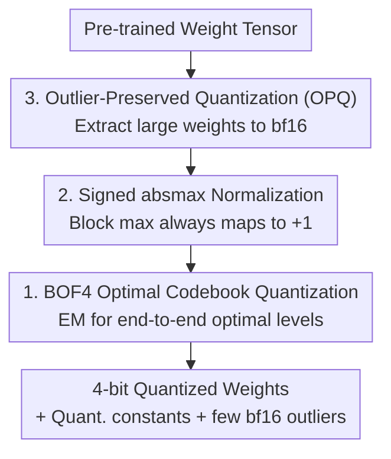

# Improving Block-Wise LLM Quantization by 4-bit Block-Wise Optimal Float (BOF4): Analysis and Variations

**Conference**: ICLR 2026  
**OpenReview**: [https://openreview.net/forum?id=VpZ8YYdBmT](https://openreview.net/forum?id=VpZ8YYdBmT)  
**Code**: None  
**Area**: Model Compression  
**Keywords**: Block-wise quantization, 4-bit quantization, QLoRA, Optimal codebook, Outlier preservation

## TL;DR
This paper revisits the block-wise absmax quantization (NF4 / AF4) commonly used in QLoRA. It uses a Lloyd-style EM algorithm to directly solve for a 4-bit codebook (BOF4) that is **optimal for end-to-end weight error**. Combined with two simple modifications—"Signed Normalization" (BOF4-S) and "Outlier-Preserved Quantization" (OPQ)—it pushes quantization error and perplexity to the best levels among 4-bit block-wise quantization methods across three major LLM families.

## Background & Motivation
**Background**: To enable memory-efficient fine-tuning of LLMs on consumer-grade GPUs, QLoRA compresses pre-trained weights to 4-bit and overlays LoRA. Its core quantization mechanism is **block-wise absmax quantization**: weights are divided into small blocks, each normalized to $[-1,1]$ using the absolute maximum within the block $w^{\max}_b$, and then quantized using a fixed 16-level scalar codebook (NF4 / AF4). NF4 constructs the codebook using quantiles of an assumed Gaussian distribution, while AF4 directly minimizes the MAE of the normalized weights.

**Limitations of Prior Work**: NF4's claim of "information-theoretic optimality" based on equal-probability utilization of the 16 reconstruction levels is flawed. Equal-probability utilization is only rate-distortion optimal for uniform distributions; it is not optimal for non-uniform distributions. Although AF4 corrects part of this, it optimizes the MAE of **normalized weights** $x_{b,i}$, whereas the actual objective is to minimize the error of **original weights** $w_{b,i}$ after dequantization. These two are not equivalent, and the bias becomes more pronounced as block size increases.

**Key Challenge**: There is a mismatch between the optimization objective (error in normalized space) and what we truly want to minimize (end-to-end error in the original weight space). Furthermore, since only one weight in a block typically falls on the $\pm 1$ endpoints, fixing both $-1$ and $+1$ reconstruction levels wastes a valuable degree of freedom. Additionally, block-wise absmax is extremely sensitive to **outlier weights**—a single massive weight can inflate the block's $w^{\max}_b$, causing the remaining weights to be compressed toward the center of the codebook, leading to a sharp drop in resolution.

**Goal**: (1) Provide a rigorous, end-to-end weight error-oriented optimal codebook for block-wise absmax quantization; (2) Eliminate endpoint freedom waste; (3) Mitigate the contamination of block scaling by outliers.

**Key Insight**: Formulate the "search for the optimal codebook" as a weighted Lloyd/EM problem (where weights are the squares of block maximums). Use "signed normalization" to save one fixed level and "separately storing outliers as bf16" to remove outlier weights from block statistics.

## Method

### Overall Architecture
The method introduces three patches addressing weak points in block-wise absmax quantization, which are orthogonal and stackable. The input is a pre-trained weight tensor, and the output consists of 4-bit quantized weights + quantization constants per block (+ optional few bf16 outliers). The process involves: first normalizing each block (using standard absmax or **Signed absmax** proposed in this paper, where the block maximum always maps to $+1$); optionally extracting **outlier weights** and storing them separately as bf16 (OPQ) to prevent them from contaminating block scaling; and finally performing scalar quantization using the **BOF4 optimal codebook** derived offline. Crucially, the codebook is not heuristically constructed but solved once offline using a Lloyd-style EM algorithm targeting the **MSE/MAE of original weights after dequantization**. This requires computation only once per weight distribution and incurs zero extra overhead during inference/fine-tuning.

> The architecture diagram shows data flow from top to bottom (outlier extraction, normalization, then codebook quantization); the "Key Designs" below are sorted by core contribution (BOF4 codebook being most fundamental), corresponding to nodes with the same names.

### Key Designs

**1. BOF4: Directly Solving for End-to-End Optimal Codebook via Weighted Lloyd/EM**

Addressing the issue that "NF4's equal-probability criterion is wrong and AF4 only optimizes normalized space error," this paper returns codebook design to its rate-distortion optimal roots: the Lloyd algorithm. The challenge is that the codebook acts on normalized weights $x_{b,i}=w_{b,i}/w^{\max}_b$, but the goal is to minimize the error of the **original weight** $Q_b(w_{b,i})=w^{\max}_b\cdot\tilde Q(x_{b,i})$ relative to $w_{b,i}$. Standard Lloyd would use the wrong distribution. The authors model the block maximum $M$ as a random variable and re-derive the centroid update formula within each Voronoi region $R_\ell$. Under the MSE criterion, the updated reconstruction level is not a simple mean but a **weighted centroid using the square of block maximums $m^2$ as weights**; its Monte Carlo approximation is intuitive:

$$\hat x^{(\ell)} = \frac{\sum_{k\in K_\ell} w_k^2 \, x_k}{\sum_{k\in K_\ell} w_k^2}$$

Here, $w_k$ is the absolute block maximum of the block where $x_k$ resides. Intuitively, normalized weights in larger blocks (large $w^{\max}$) will have their errors amplified by $w^{\max}$ during dequantization, so they should exert more influence during codebook optimization—hence the $m^2$ weighting, which is the key distinction between BOF4 and AF4. Under the MAE criterion, the solution is the **weighted median** (Equation 8). To fix certain levels at $-1, 0, 1$, one simply skips their recalculation in each iteration. The entire EM is run once offline for a fixed distribution with zero quantization overhead.

**2. BOF4-S: Signed absmax Normalization for Reclaiming Endpoint Freedom**

NF4/AF4 fix both $\hat x^{(1)}=-1$ and $\hat x^{(16)}=1$ to ensure that the weight with the largest absolute value in a block is represented without error. However, the authors observe that for weights at general positions, **only one of the $-1$ or $+1$ endpoints will appear** in a block's normalized weights (depending on whether the block maximum is positive or negative); the other endpoint is wasted. They propose using the **signed absolute block maximum** as the quantization constant:

$$w^{\max}_b = w_{b,j^*}, \quad j^*=\arg\max_{i\in I}|w_{b,i}|$$.

Thus, the maximum value in the block is **always mapped to $+1$** (instead of randomly falling on $\pm 1$). Consequently, only $\hat x^{(16)}=1$ and the zero point need to be fixed, allowing the originally fixed $\hat x^{(1)}=-1$ to be released as an **optimizable free level**. This extra degree of freedom allows the non-uniform codebook to better fit the distribution, further reducing quantization error. The change only occurs during the selection of the quantization constant; decoding logic remains identical, with zero additional inference/fine-tuning overhead.

**3. OPQ: Outlier-Preserved Quantization for Isolating Large Weights**

The weakness of block-wise absmax is that outlier weights inflate the $w^{\max}_b$ of the entire block, forcing practices to use smaller blocks to limit the number of affected parameters—which increases memory usage due to more quantization constants. OPQ does the opposite: it stores outlier weights separately in bf16, alongside a 64-bit integer recording their position in the flattened weight tensor. The outlier criterion is adaptively determined per block—after normalizing a block to unit standard deviation, weights exceeding its $q$-quantile in absolute value are considered outliers:

$$|w_{b,i}| > \sigma_b \cdot F^{-1}_M(q)$$

Where $\sigma_b$ is the corrected sample standard deviation of the block, and $F^{-1}_M$ is the quantile function of the absolute block maximum ($q=0.95$ in experiments). Outliers are zeroed out before quantization and do not participate in the (signed) block maximum search, returning the block scaling to a normal distribution. With outliers removed, **larger blocks** can be safely used to save storage on quantization constants without being dragged down by extreme values—this is key to OPQ reducing error and memory simultaneously. OPQ can be combined with BOF4 or BOF4-S.

## Key Experimental Results

### Main Results
Quantization error (MAE/MSE) and WikiText-2 perplexity (PPL) were compared across three LLMs (Llama-3.1 8B / Qwen-2.5 7B / Mistral 7B) with block size $I=64$:

| Quant. Method | Llama-3.1 8B MAE↓ | Llama MSE↓ | Llama PPL↓ | Qwen PPL↓ | Mistral PPL↓ |
|----------|------|------|------|------|------|
| NF4 | 0.977 | 1.637 | 8.53 | 9.89 | 8.90 |
| AF4 | 1.006 | 1.762 | 8.51 | 9.91 | 8.90 |
| BOF4 (MSE) | 0.994 | 1.566 | 8.51 | 9.94 | 8.89 |
| BOF4-S (MAE) | 0.936 | 1.508 | 8.49 | 9.87 | 8.90 |
| BOF4-S (MSE) | 0.954 | 1.441 | 8.46 | 9.88 | 8.88 |
| **BOF4-S (MSE) + OPQ** | **0.932** | **1.367** | **8.43** | **9.83** | **8.87** |

(MAE unit $1\text{e}{-3}$, MSE unit $1\text{e}{-6}$; best results in bold.) BOF4-S (MSE) + OPQ ranks first or second in nearly all columns, making it the overall best solution.

### Ablation Study
| Config | Key Observation | Description |
|------|---------|------|
| NF4 / AF4 Baselines | PPL 8.51–8.53 | Older fixed codebooks |
| BOF4 (Optimal Codebook only) | MSE 1.637→1.566 | End-to-end optimal codebook alone outperforms baselines |
| + Signed Normalization (BOF4-S) | MSE 1.566→1.441 | Saved endpoint releases one free level |
| + OPQ | MSE 1.441→1.367, PPL→8.43 | Storing outliers separately in bf16 provides another drop |
| MAE vs MSE Opt. | MSE version yields lower PPL | Advantage grows with block size |

### Key Findings
- **Three modifications improve performance cumulatively**: Optimal codebook → Signed normalization → OPQ; adding each layer monotonically decreases MAE/MSE/PPL, indicating they solve different dimensions of the problem.
- **MSE optimization generally outperforms MAE**: Despite different error criteria, the MSE version almost always yields better perplexity (except for Qwen-2.5 7B, where MAE leads by 0.01), and the gap widens with larger block sizes.
- **Caution in interpreting downstream tasks**: On benchmarks like MMLU/ARC/HellaSwag, rankings vary by task. The authors introduced "Normalized Average Accuracy" (NAV ACC) for overall trends—BOF4-S+OPQ on Qwen-2.5 3B slightly exceeded BF16, but the authors admit this likely reflects the variance of accuracy metrics and should not be over-interpreted.
- **Gaussian hypothesis is an effective approximation**: Codebooks are optimized offline assuming Gaussian weights. While real LLM weights are only approximately Gaussian, the advantage holds. The authors suggest re-optimizing codebooks for specific distributions could yield further gains.

## Highlights & Insights
- **Returning Codebook Design to Rate-Distortion Optimality**: The paper debunks the "equal-probability is optimal" misconception of NF4 and points out that AF4 optimizes the wrong space (normalized vs. end-to-end). The $m^2$ weighted centroid update formula is derived theoretically and has a simple Monte Carlo form, making it a reusable core trick.
- **Signed Normalization is a Zero-cost Gain**: By simply switching the normalization constant from $|w^{\max}|$ to a signed $w^{\max}$, the system moves from "fixing one of two endpoints" to "fixing only one and releasing the other as a free level." Since decoding is unchanged and inference overhead is zero, this insight into reclaiming wasted symmetry-based freedom is highly valuable.
- **OPQ Intuitively Uses Larger Blocks to Save Memory**: Contrary to the intuition that outliers force small blocks, OPQ's removal of outliers allows for larger blocks, reducing the storage needed for quantization constants. This "precision treatment" is more efficient than "global bit increases."

## Limitations & Future Work
- **Codebook Dependency on Distribution Assumptions**: BOF4 codebooks are optimized offline for Gaussian weights; real weights are only approximately Gaussian. Re-optimizing for actual distributions could further improve results but was not systematically explored.
- **OPQ Introduces Extra Storage and Overhead**: Each outlier requires extra bf16 storage + a 64-bit index and adds slight runtime overhead during inference (Appendix G.3), and $q$ requires tuning.
- **Unstable Gains in Downstream Accuracy**: Rankings on classification benchmarks are inconsistent; the primary stable gains are seen in quantization error and perplexity.
- **Focus on 4-bit Scalar Block-wise Quantization**: Does not cover lower bits, vector quantization, or joint schemes with activation quantization.

## Related Work & Insights
- **vs. NF4**: NF4 uses Gaussian quantiles and claims equal probability is optimal; this paper proves that criterion incorrect, uses Lloyd/EM for true end-to-end optimality, and identifies a wasted endpoint in NF4.
- **vs. AF4**: AF4 minimizes MAE of normalized weights, ignoring the amplification of $w^{\max}$ during dequantization; BOF4's $m^2$ weighting accounts for this and provides both MSE/MAE criteria.
- **vs. Outlier Handling (e.g., LLM.int8/SmoothQuant)**: Those typically target activation outliers or mixed-precision inference; OPQ specifically targets the contamination of **block-wise weight normalization** by outliers, using bf16 to store weight outliers to restore correct block scaling.

## Rating
- Novelty: ⭐⭐⭐⭐ Rigorously formulates block-wise codebook design as an end-to-end optimal problem with effective orthogonal improvements.
- Experimental Thoroughness: ⭐⭐⭐⭐ Covers three LLM families, multiple block sizes, and multifaceted evaluations including error, perplexity, and downstream tasks.
- Writing Quality: ⭐⭐⭐⭐ Clear derivations and motivation, with insightful analysis of prior misconceptions.
- Value: ⭐⭐⭐⭐ Directly applicable to QLoRA-style memory-efficient fine-tuning with zero inference overhead and plug-and-play capability.

<!-- RELATED:START -->

## Related Papers

- [\[ICML 2025\] BlockDialect: Block-wise Fine-grained Mixed Format Quantization for Energy-Efficient LLM Inference](../../ICML2025/model_compression/blockdialect_block-wise_fine-grained_mixed_format_quantization_for_energy-effici.md)
- [\[ICLR 2026\] Entropy-Based Block Pruning for Efficient Large Language Models](entropy-based_block_pruning_for_efficient_large_language_models.md)
- [\[ACL 2026\] A Layer-wise Analysis of Supervised Fine-Tuning](../../ACL2026/model_compression/a_layer-wise_analysis_of_supervised_fine-tuning.md)
- [\[ICLR 2026\] Compute-Optimal Quantization-Aware Training](compute-optimal_quantization-aware_training.md)
- [\[ICML 2026\] ReSpinQuant: Efficient Layer-Wise LLM Quantization via Subspace Residual Rotation Approximation](../../ICML2026/model_compression/respinquant_efficient_layer-wise_llm_quantization_via_subspace_residual_rotation.md)

<!-- RELATED:END -->
