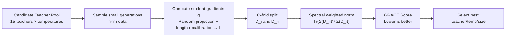

# In Good GRACES: Principled Teacher Selection for Knowledge Distillation

**Conference**: ICLR 2026  
**OpenReview**: [https://openreview.net/forum?id=m276fke38H](https://openreview.net/forum?id=m276fke38H)  
**Code**: [https://github.com/abhishekpanigrahi1996/GRACE](https://github.com/abhishekpanigrahi1996/GRACE)  
**Area**: Knowledge Distillation / Model Compression / Data Selection  
**Keywords**: Knowledge Distillation, Teacher Selection, Gradient Cross-validation, Data Diversity, Conditional Mutual Information  

## TL;DR
The authors propose **GRACE**, a lightweight scoring metric that predicts which teacher is most compatible with a specific student and task before distillation. By analyzing the student's gradient distribution on teacher-generated data—without requiring verifiers, teacher logits, internal states, or test data—it achieves up to 86% Spearman correlation with post-distillation performance on GSM8K/MATH.

## Background & Motivation
- **Background**: Training small "student" LLMs using data generated by large "teacher" LLMs (generative distillation) is an efficient route. Because it uses only generated text and does not depend on logits, it allows for cross-architecture distillation. The field of mathematical reasoning has accumulated many available teachers, making it a natural experimental ground.
- **Limitations of Prior Work**: Selecting the right teacher is extremely expensive. The current approach is "guess-and-check"—collecting teacher generations, training the student, and then evaluating the results. This must be repeated for every candidate teacher and hyperparameter choice (e.g., temperature).
- **Key Challenge**: A counter-intuitive fact is that **strong teachers are not necessarily good teachers**. While LLaMA-70B Instruct has the highest performance, distilling it into LLaMA-1B yields only 44.5% average-at-16, a 7.7% regret compared to the optimal teacher. Teacher performance itself has only a weak ~11% correlation with final student performance.
- **Goal**: Given a pool of candidate teachers, efficiently select the most compatible teacher for a specific student and task **without actually training the student**, while guiding key design choices such as temperature, size constraints, and model families.
- **Core Idea**: **Jointly consider both the teacher and the student** by analyzing the **gradient distribution properties** of the student on a small amount of teacher-generated data. GRACE uses a cross-validation structure to unify "data diversity" (gradient spectrum) and "student-teacher alignment" (gradient norm) into a single score, establishing a theoretical link with Conditional Mutual Information (CMI) generalization bounds.

## Method

### Overall Architecture
GRACE (GRAdient Cross-validation Evaluation) only requires calculating student gradients on a small amount of data from each candidate teacher (n=512 prompts × m=4 generations, 60× smaller than the full training set). These gradients are randomly projected for dimensionality reduction and recalibrated by response length before performing $C$-fold cross-validation: the weighted norm of one fold's gradients is calculated under the spectrum of the second-moment matrix of another fold's gradients. A lower score indicates a more compatible teacher. This scoring process does not touch test data or teacher internal information.

### Key Designs

**1. Two complementary baselines reveal deficiencies: G-Vendi measures diversity, G-Norm measures alignment.** Before introducing GRACE, the paper analyzes two single-dimensional gradient distribution scores. G-Vendi uses the entropy of the eigenvalues of the normalized gradient second-moment matrix $\tilde{\Sigma}(D)$, $\text{Entropy}(\lambda(\tilde{\Sigma}(D)))$, to measure gradient direction coverage (data diversity). However, using it alone to select teachers fails—when a student acts as its own teacher, the untrained model outputs near-random text, resulting in the highest gradient entropy (5.93), yet the 4% accuracy shows G-Vendi's top score is misleading. G-Norm uses the trace of the gradient second-moment matrix $\text{Tr}(\Sigma(D))=\frac{1}{nm}\sum\|h(x,y)\|^2$ to measure student-teacher alignment: a small gradient suggests the student can fit the data with minimal updates. This explains why strong teachers (e.g., Gemma-2 Instruct) can be poor teachers—their generations lead to high G-Norm (weak alignment) for the student. However, G-Norm only looks at gradient magnitude and ignores directional distribution, showing no correlation with performance as temperature varies. Both capture complementary properties and often change in opposite directions (increasing temperature increases both G-Norm and G-Vendi), making them merely baselines.

**2. GRACE Score: Spectral-weighted gradient norm, unifying two desiderata.** The core of GRACE is placing the gradient norm under the "spectrum of the normalized second-moment matrix of another fold" for weighting. After making a $C$-fold split of the dataset, it is defined as:
$$\text{GRACE}(D)=\frac{1}{C}\sum_{i=1}^{C}\text{Tr}\!\left(\hat{\Sigma}(D_{-i})^{-1}\Sigma(D_i)\right)=\frac{1}{nm}\sum_{i=1}^{C}\sum_{(x,y)\in D_i}\|\hat{\Sigma}(D_{-i})^{-1/2}h(x,y)\|^2,$$
where $\hat{\Sigma}(D_{-i})=\tilde{\Sigma}(D_{-i})+\frac{\nu}{d}I$ includes a smoothing term for numerical stability. Expanded, it is equivalent to $\sum_j \frac{1}{\lambda_j+\nu/d}\big(\frac{1}{|D_i|}\sum (h^\top u_j)^2\big)$: **gradient variance along directions of small eigenvalues is penalized more heavily**, as high variance in these directions is more likely to induce training instability and poor generalization. The directional spectrum is taken from normalized gradients (since gradient direction is more critical than norm when using adaptive optimizers and normalization layers). This cross-validation structure is key to merging G-Vendi's diversity (spectrum) and G-Norm's alignment (norm) into one score.

**3. Bias-Variance Decomposition: GRACE-Bias catches pathological teachers, GRACE-Variance performs primary prediction.** GRACE can be decomposed into $\text{GRACE-Variance}(D)$ (variance of centered gradients under the spectrum) and $\text{GRACE-Bias}(D)=\frac{1}{nm}\sum_i\mu(D)^\top\hat{\Sigma}(D_{-i})^{-1}\mu(D)$ (spectral-weighted norm of the mean gradient). The Bias term identifies "pathological teachers"—for instance, when a teacher provides random responses, Bias spikes, indicating the data is unsuitable for distillation. When such teachers are absent, most predictive power comes from the Variance term; lower variance represents a better teacher. In experiments, Variance dominates, and using GRACE or GRACE-Variance alone leads to consistent conclusions.

**4. Theoretical link with leave-one-out Conditional Mutual Information (CMI).** By abstracting the adaptive optimizer as a gradient update with a preconditioner $M$: $\Theta\leftarrow\Theta-\eta(M(D;\Theta)g(D;\Theta)+\epsilon)$, and setting $M(D')=\hat{\Sigma}(D')^{-1/2}$, Lemma 1 provides $\text{CMI}\lesssim\frac{1}{\sigma^2 n^2}\text{GRACE-Variance}(D)\lesssim\frac{1}{\sigma^2 n^2}\text{GRACE}(D)$. CMI measures the sensitivity of the learning result to the removal of a single sample; high sensitivity implies heavy memorization and poor generalization. Intuitively, GRACE measures how uniformly gradients are distributed across samples—the more uniform, the more stable and better the generalization—thus GRACE is effectively a proxy for a student's generalization performance upper bound.

## Key Experimental Results

Setup: Students are LLaMA-1B/OLMo-1B/Gemma-2B (GSM8K) and LLaMA-3B (MATH); 15 teachers covering LLaMA, Qwen, Qwen-Math, Gemma-2, OLMo, and Phi-4 families, with temperatures from 0.3 to 1.0. Scoring uses n=512, m=4, C=10, and projection dimension d=512 (60× smaller than the training set). Evaluation uses the stricter average-at-16 metric.

### Main Results Table (LLaMA-1B on GSM8K)

| Scoring Method | Spearman Correlation ↑ | Teacher Selection Regret ↓ |
|---|---|---|
| Teacher Performance | 11% | 7.7% |
| Student Pre-training Loss | 44% | 5.4% |
| G-Vendi | 44% | 14.5% |
| G-Norm | 53–55% | 4.9% (some report 10.8%) |
| **GRACE** | **86%** | **0.3%** |

### Scenarios Table

| Scenario | GRACE Performance | Baseline Comparison |
|---|---|---|
| GSM8K Teacher Selection | 86% Corr, 0.3% Regret | +7% performance over strongest teacher |
| MATH Teacher Selection | >85% Corr, 3.9% Regret | Naive strongest teacher selection regret ≥5.9% |
| Temperature Selection (Aggregated) | 75% Corr | G-Vendi 59%, G-Norm −53% |
| Size Constraints (3B/10B/30B) | >79% Corr, <0.3% Regret | G-Norm/G-Vendi regret ≥9% |
| Temperature Prediction (Qwen-1.5B/3B) | Pred 0.5/0.9 vs True 0.4/0.8 | G-Norm/G-Vendi monotonic; cannot catch inverted-U |

### Key Findings
- GRACE is the only score that maintains >85% correlation on both GSM8K and MATH while achieving the lowest regret.
- Teachers selected by GRACE improve performance by 7%/2% on GSM8K/MATH compared to simply using the strongest available teacher.
- Student performance follows an inverted U-shape with temperature, whereas G-Norm/G-Vendi are monotonic with temperature and cannot locate the optimal point; GRACE can.
- Whether training data is filtered based on answer correctness does not significantly impact the results.

## Highlights & Insights
- **No "Privileged Information" Required**: No verifiers, no teacher logits, no teacher representations, and no test data. Relying solely on the student's own gradients makes it applicable to cross-architecture and closed-source teacher scenarios.
- **Computational Explanation for the "Strong Teacher ≠ Good Teacher" Paradox**: The fact that teacher generations cause student G-Norm/Bias to rise (poor alignment) confirms this phenomenon at the gradient level.
- **Rare Alignment of Theory and Practice**: The CMI generalization bound is not just decorative; the preconditioner $\hat\Sigma^{-1/2}$ corresponds exactly to adaptive optimizers used in practice, and the score form naturally falls into GRACE.
- **Beyond Simple Teacher Selection**: It can also guide choices for temperature, size budgets, and fine-grained selection within model families, showing high practical utility.

## Limitations & Future Work
- **Narrow Task Scope**: Experiments are concentrated on mathematical reasoning (GSM8K/MATH) using short CoT teachers and small students. Conclusions for long CoT teachers and larger students remain to be verified.
- **Loose Theoretical Bounds**: Lemma 1 is based on single-step gradient updates and a specific preconditioner. Tight bounds under multi-step training and other performance metrics (non-loss) are still open problems.
- **Hyperparameter Sensitivity**: Projection dimension $d$, number of folds $C$, and smoothing parameter $\nu$ need tuning. While ablations are provided, calibration may be needed for new settings.
- **Gemma Teachers as Outliers**: Due to extremely minimalist responses, they require separate discussion, indicating the score still has some coupling with generation length/style (despite log|y| recalibration).

## Related Work & Insights
- **Data Selection**: GRACE reframes "teacher selection" as "data distribution selection," inheriting from first/second-order gradient-based data selection methods (TracIn, LESS, Engstrom, etc.), but shifting from "point selection" to "distribution selection."
- **Capacity Gap in Distillation**: It continues the classic observations by Mirzadeh, Harutyunyan, Panigrahi, etc., regarding the "capacity gap / strong teachers may not be best," providing a computable diagnostic for LLM distillation.
- **G-Vendi Diversity Measure**: It directly uses Jung et al. (2025) as a baseline and identifies its failure modes in cross-teacher selection.
- **Generalization Theory**: It borrows the CMI/leave-one-out stability framework from Steinke & Zakynthinou, Rammal, etc., anchoring an intuitive score to generalization bounds.
- **Inspiration**: The idea of "using the student's own gradient distribution as an unsupervised proxy metric" can be transferred to broader training data governance issues like RLHF data filtering, SFT data mixing ratios, and curriculum learning.

## Rating
- Novelty: ⭐⭐⭐⭐ Transforms teacher selection into a student gradient distribution problem, unifying diversity and alignment via cross-validation and linking it to CMI bounds.
- Experimental Thoroughness: ⭐⭐⭐⭐ 15 teachers × multiple temperatures × multiple students × two datasets, covering three application scenarios with rich ablations; though limited to math and small students.
- Writing Quality: ⭐⭐⭐⭐ Naturally derives GRACE from baseline deficiencies; theory and intuition are clearly interspersed with strong chart support.
- Value: ⭐⭐⭐⭐ Directly addresses the expensive "guess-and-check" pain point in distillation practice with a lightweight, privilege-free metric that guides hyperparameters.

<!-- RELATED:START -->

## Related Papers

- [\[ICCV 2025\] A Good Teacher Adapts Their Knowledge for Distillation](../../ICCV2025/model_compression/a_good_teacher_adapts_their_knowledge_for_distillation.md)
- [\[ICLR 2026\] Exploring Knowledge Purification in Multi-Teacher Knowledge Distillation for LLMs](exploring_knowledge_purification_in_multi-teacher_knowledge_distillation_for_llm.md)
- [\[ICLR 2026\] SGD-Based Knowledge Distillation with Bayesian Teachers: Theory and Guidelines](sgd-based_knowledge_distillation_with_bayesian_teachers_theory_and_guidelines.md)
- [\[ICLR 2026\] Generative Diffusion Prior Distillation for Long-Context Knowledge Transfer](generative_diffusion_prior_distillation_for_long-context_knowledge_transfer.md)
- [\[ICLR 2026\] Pedagogically-Inspired Data Synthesis for Language Model Knowledge Distillation](pedagogically-inspired_data_synthesis_for_language_model_knowledge_distillation.md)

<!-- RELATED:END -->
