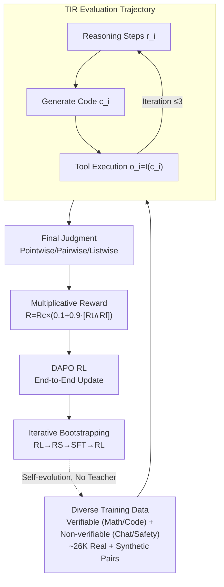

# Incentivizing Agentic Reasoning in LLM Judges via Tool-Integrated Reinforcement Learning

**Conference**: ICLR 2026  
**arXiv**: [2510.23038](https://arxiv.org/abs/2510.23038)  
**Code**: None  
**Area**: Model Compression  
**Keywords**: LLM-as-a-Judge, Tool-Integrated Reasoning, Reinforcement Learning, Code Execution, Evaluation

## TL;DR
Proposes TIR-Judge, an end-to-end RL framework that trains LLM judge models to alternate between reasoning and code execution tools during the evaluation process. It outperforms 32B reasoning reward models with only 8B parameters across 7 public benchmarks, and TIR-Judge-Zero enables self-bootstrapped improvement without distillation.

## Background & Motivation
LLM-as-a-Judge is increasingly critical in the LLM ecosystem—providing preference signals during training, performing best-of-N selection during inference, and replacing humans during evaluation. However, current judge models face two major issues:

**Ceiling of pure text reasoning**: Existing reasoning-enhanced judge models (e.g., JudgeLRM, J1-Judge) rely solely on text-based chains of thought, struggling in scenarios requiring precise calculation or symbolic reasoning (e.g., verifying code output, checking instruction constraints).

**Limitations of tool use**: A few attempts to introduce tools either (i) use tools only during inference rather than optimizing during training, or (ii) are limited to specific tasks/domains.

Core Idea: Use reinforcement learning to train judge models end-to-end to learn when to call the code interpreter and how to iteratively refine reasoning based on execution results, achieving deep integration of reasoning and tool use.

## Method

### Overall Architecture
TIR-Judge aims to ensure judge models no longer rely solely on "hallucinated" text reasoning for scoring, but instead write code while thinking and use execution results to calibrate judgments. The methodology focuses on integrating Tool-Integrated Reasoning (TIR) into evaluation tasks and training it end-to-end via RL.

Specifically, the evaluation is modeled as a multi-turn TIR trajectory $s_k = \{r_1,c_1,o_1,...,r_k,c_k,o_k\}$: in each turn, the model first generates reasoning steps $r_i$, then produces a code snippet $c_i$. The tool returns an execution result $o_i = \mathcal{I}(c_i)$, based on which the model proceeds to the next reasoning turn (up to 3 turns) until a final judgment is reached. The entire trajectory is optimized under the DAPO (an improved version of GRPO) framework, supporting Pointwise (single sample scoring), Pairwise (comparison), and Listwise (ranking) formats. The core contributions lie in the training data, reward signal, and cold-start strategy.

### Key Designs

**1. Diverse Training Data: Learning "Whether to Use Tools"**

To prevent the model from developing a habit of "coding for everything" if trained only on verifiable tasks like math, the authors intentionally mix data from verifiable domains (math, programming) and non-verifiable domains (dialogue, safety, general code). Data sources include: (i) real preference pairs from HelpSteer3, UltraInteract, and CodeRM; (ii) synthetic preference pairs generated by multiple models like Qwen3-8B/14B and automatically verified. The final ~26K pairs cover multiple domains and formats, enabling the model to adaptively switch between tool use and pure reasoning.

**2. Three-dimensional Multiplicative Reward: Binding Correctness, Format, and Tool Quality**

Rewarding only "correctness" is insufficient; models might output non-standard formats or abuse tools. The reward is designed as a multiplicative structure:

$$R = R_c \times (0.1 + 0.9 \cdot \mathbb{I}[R_t = 1 \wedge R_f = 1])$$

The components are: correctness reward $R_c$ (matching ground truth), format reward $R_f$ (structured tags like `<score>`, and discouraging tool use in safety/general contexts), and tool reward $R_t$ (no execution errors and turns $\leq 3$). The multiplicative structure ensures full points are only awarded for getting all three right, suppressing speculative behavior.

**3. Iterative Bootstrapping (TIR-Judge-Zero): Self-evolution without Distillation**

Instead of tying performance to a strong teacher via distillation, TIR-Judge-Zero uses a loop of RL $\rightarrow$ Rejection Sampling (RS) $\rightarrow$ SFT $\rightarrow$ RL:

$$\mathcal{T}_{t+1} \leftarrow \text{RS}(\pi_{\theta_t}), \quad \pi_{\theta_{t+1}} \leftarrow \text{SFT}(\pi_{\theta_0}, \mathcal{T}_{t+1}), \quad \pi_{\theta_{t+1}} \leftarrow \text{RL}(\pi_{\theta_{t+1}})$$

RS selects the shortest correct trajectories with minimal tool calls from the current policy $\pi_{\theta_t}$ to create a new set $\mathcal{T}_{t+1}$. The original model $\pi_{\theta_0}$ is then fine-tuned and trained further via RL, proving that TIR judge models can evolve independently of teacher models.

### Loss & Training
The backbones are Qwen3-8B and Qwen3-4B. For stability, code error messages are truncated to the last line, and tool execution results $o_i$ are masked during loss calculation to prevent the model from overfitting to environment-returned content. The distilled version (for comparison) uses Gemini-2.5-Flash as a teacher to collect ~10K trajectories for cold-starting. Training was conducted on 8 H100 80G GPUs.

## Key Experimental Results

### Main Results (Pointwise + Pairwise)

| Model | PPE Avg | IFBench | CJBench | RWBench | RMBench | JGBench |
|------|---------|---------|---------|---------|---------|---------|
| Qwen3-8B Pointwise | 60.6 | 56.2 | 16.6 | 76.5 | 66.9 | 50.8 |
| Qwen3-8B Pairwise | 65.5 | 61.3 | 60.8 | 87.0 | 77.9 | 67.5 |
| Gemini-2.5-Flash Pairwise | 74.8 | 69.3 | 66.5 | 93.4 | 81.9 | 75.4 |
| **TIR-Judge (Estimated)** | **~70+** | **~66+** | **~63+** | **~90+** | — | — |

### Ablation Study: Zero vs Distill

| Configuration | Scale | Description |
|------|------|------|
| TIR-Judge-Zero (4B) | 4B | Pure RL bootstrap, 1.2% higher than Distill |
| TIR-Judge-Distill (4B) | 4B | Cold-start via Distillation then RL |
| TIR-Judge-Zero (8B) | 8B | Surpasses 32B reasoning reward models |

### Key Findings
- TIR-Judge improves Pointwise performance by up to 6.4% and Pairwise by up to 7.7%, exceeding pure reasoning baselines.
- The 8B TIR-Judge outperforms 32B reasoning reward models on PPE.
- TIR-Judge-Zero (4B) outperforms the distilled version by 1.2%, validating pure RL bootstrapping as a superior strategy.
- Achieves 96% of Claude-Opus-4 performance in Listwise settings.

## Highlights & Insights
- Migrating RL + tool use from mathematical reasoning to evaluation tasks is a natural and effective extension.
- The multiplicative reward structure (Correctness $\times$ Format $\times$ Tool Quality) elegantly avoids the difficulties of manual weight tuning.
- TIR-Judge-Zero's pure bootstrapping challenges the common assumption that strong teacher cold-starting is necessary.

## Limitations & Future Work
- Forcing "no tool use" in safety/general domains might be too simplistic; some safety evaluations could benefit from tools.
- The 3-turn limit for tool calls might restrict capabilities in complex evaluation tasks.
- Performance is best on reasoning-related benchmarks; advantages in open-ended dialogue evaluation require further verification.

## Related Work & Insights
- **vs JudgeLRM/J1-Judge**: These methods only enhance text reasoning; TIR-Judge introduces code execution for precise verification.
- **vs AgentRM**: AgentRM uses tools at inference but lacks joint training; TIR-Judge utilizes end-to-end joint training.

## Rating
- Novelty: ⭐⭐⭐⭐ First systematic application of TIR in judging tasks.
- Experimental Thoroughness: ⭐⭐⭐⭐⭐ 7 benchmarks, 3 evaluation formats, Zero/Distill ablations.
- Writing Quality: ⭐⭐⭐⭐ Clear framework with sufficient detail.
- Value: ⭐⭐⭐⭐⭐ 8B model surpassing 32B model, high practical value.

<!-- RELATED:START -->

## Related Papers

- [\[ICLR 2026\] Multi-View Encoders for Performance Prediction in LLM-Based Agentic Workflows](multi-view_encoders_for_performance_prediction_in_llm-based_agentic_workflows.md)
- [\[ICLR 2026\] ParoQuant: Pairwise Rotation Quantization for Efficient Reasoning LLM Inference](paroquant_pairwise_rotation_quantization_for_efficient_reasoning_llm_inference.md)
- [\[ICLR 2026\] LeSTD: LLM Compression via Learning-based Sparse Tensor Decomposition](lestd_llm_compression_via_learning-based_sparse_tensor_decomposition.md)
- [\[ACL 2026\] ProActor: Timing-Aware Reinforcement Learning for Proactive Task Scheduling Agents](../../ACL2026/model_compression/proactor_timing-aware_reinforcement_learning_for_proactive_task_scheduling_agent.md)
- [\[ICLR 2026\] A Fano-Style Accuracy Upper Bound for LLM Single-Pass Reasoning in Multi-Hop QA](a_fano-style_accuracy_upper_bound_for_llm_single-pass_reasoning_in_multi-hop_qa.md)

<!-- RELATED:END -->
