# Inconsistency Biases in Dynamic Data Pruning

**Conference**: ICLR 2026  
**OpenReview**: [https://openreview.net/forum?id=Zw1Uw7u6Su](https://openreview.net/forum?id=Zw1Uw7u6Su)  
**Code**: [https://github.com/mrazhou/RePB](https://github.com/mrazhou/RePB)  
**Area**: Efficient Training / Dynamic Data Pruning  
**Keywords**: Dynamic Data Pruning, Score Context Drift, Temporal Gradient Bias, Local Window Pruning, Cumulative Temporal Reweighting  

## TL;DR
This paper identifies that dynamic data pruning is hindered by two types of "inconsistency biases": **Score Context Drift**, caused by comparing importance scores across different model states, and **Temporal Gradient Bias**, resulting from non-uniform sampling across epochs. The proposed RePB framework (Local Window Pruning + Uniform Resampling + Cumulative Temporal Reweighting) structurally eliminates these biases, achieving or exceeding full training accuracy with an approximately 30% pruning rate across 16 datasets, 17 models, and 13 tasks.

## Background & Motivation
**Background**: Dynamic data pruning (e.g., InfoBatch) accelerates training by discarding "low-information" samples in real-time. Unlike static pruning selected once before training, dynamic pruning adaptively adjusts the training subset as the model evolves, offering theoretically higher efficiency.

**Limitations of Prior Work**: This work identifies two inherent consistency issues in dynamic pruning: (1) **Score Context Drift**: Importance scores (loss, gradient norms, etc.) are calculated using the "current model state," but model parameters drift continuously. Comparing scores calculated under asynchronous states and different parameters lacks statistical comparability, leading to unreliable pruning decisions; (2) **Temporal Gradient Bias**: Repeatedly selecting non-uniform subsets per epoch causes the effective sampling distribution to shift relative to standard uniform sampling, distorting the expected cumulative gradient trajectory and potentially harming convergence or pushing the model toward sub-optimal points.

**Key Challenge**: Dynamic pruning seeks the flexibility of "evolving with the model," but this flexibility creates the fundamental obstacles of "incomparable scores" and "biased gradients"—the more dynamic the process, the greater the bias.

**Goal**: To fundamentally resolve score comparison validity and long-term gradient bias at the mechanism level without sacrificing the stability and reliability of standard training.

**Core Idea**: **Structural Constraints + Historical Frequency Correction**. Restricting score comparisons to local windows where the "model remains nearly unchanged" ensures comparability, while reweighting gradients by the inverse of the historical selection frequency pulls the expected gradient direction back to that of full training.

## Method

### Overall Architecture
The motto of RePB (Resolving Pruning Biases) is "In-batch Pruning, Cross-epoch Reweighting." Within an epoch, the model performs normal forward passes per batch, using loss as the importance score to determine which samples enter the next epoch’s training set within a local window. At the end of the epoch, dropped samples are partially reintroduced with uniform probability to maintain diversity. During the next epoch, each sample's gradient is weighted by the inverse of its historical selection frequency. The three components address three aspects of consistency: window pruning for "score comparability," resampling for "preventing pool collapse," and reweighting for "unbiased gradients."

```mermaid
flowchart LR
    A[Epoch E Training<br/>Calculate loss=score per batch] --> B[Local Window Pruning LWP<br/>Compare scores in window<br/>Drop below mean by prob]
    B --> C[Candidate Set D'_E+1]
    C --> D[Uniform Resampling<br/>Put back dropped samples by 1-ρ]
    D --> E[Next Epoch Dataset D_E+1]
    E --> F[CTR Reweighted Training<br/>Gradient × E/N_i&#40;E&#41;]
    F --> A
```

### Key Designs
**1. Local Window Pruning (LWP): Comparing scores within windows where the "model has barely changed" to eliminate context drift.** Traditional methods collect scores across epochs for global comparison, but parameters drift significantly within one epoch. LWP constrains pruning decisions to a window $\mathcal{W}_k$, which can be a single batch ($W=1$) or $W$ consecutive batches. Within the window, the mean $\mu_k = \frac{1}{|\mathcal{W}_k|}\sum_{(x_j,y_j)\in\mathcal{W}_k} s_j$ is calculated. For each sample, $U_i\sim U(0,1)$ is drawn, and the retention rule is $(s_i \ge \mu_k) \lor (s_i < \mu_k \land U_i \ge \rho)$. Its validity stems from a clean Lipschitz bound: if the loss is $L$-Lipschitz w.r.t. parameters, gradient norms are bounded by $G$, and the learning rate is $\eta$, the parameter drift between any two steps in a window is $\|\theta_t-\theta_{t'}\| \le W\eta G$. Thus, the score difference for the same sample under two states within the window $|\ell(x_i,y_i;\theta_t)-\ell(x_i,y_i;\theta_{t'})| \le LW\eta G$ is minimized, preserving score ranking. When $W=1$, scores are calculated before parameter updates, drift is strictly zero, making it the ideal default.

**2. Uniform Probability Resampling: Preventing the sample pool from collapsing to an empty set and ensuring long-term exploration.** Pruning without replenishment causes the training set to shrink and eventually fail. RePB reintroduces samples from the set of unused samples $\mathcal{D}\setminus\mathcal{D}_E$ with a fixed probability $\rho_{\text{resample}}=1-\rho$ at the end of each epoch, yielding $\mathcal{D}_{E+1} = \mathcal{D}'_{E+1} \cup \{(x_j,y_j)\in\mathcal{D}\setminus\mathcal{D}_E \mid \text{random}(0,1) < \rho_{\text{resample}}\}$. This ensures pruned samples can re-enter and allows each sample's selection count $N_i(E)$ to grow steadily, providing a well-behaved foundation for frequency estimation.

**3. Cumulative Temporal Reweighting (CTR): Correcting long-term gradient bias using the inverse of historical selection frequency.** Unlike InfoBatch, which uses "instantaneous sampling probability," CTR focuses on the entire training trajectory. Letting $N_i(E)=\sum_{e=1}^{E}\mathbb{1}[(x_i,y_i)\in\mathcal{D}_e]$ be the cumulative count of sample $i$ being selected from epoch 1 to $E$, the weight is defined as $w_i^{\text{CTR}}(E)=E/N_i(E)$. Under-selected samples ($N_i<E$) have weights $>1$, while over-selected samples are suppressed. Gradients are updated as $g_t=\frac{1}{|\mathcal{B}_t|}\sum_{i\in\mathcal{B}_t} w_i^{\text{CTR}}(E)\nabla\ell(x_i,y_i;\theta_t)$. By the Law of Large Numbers, empirical frequency $f_i(E)=N_i(E)/E\to\bar p_i$ (long-term average probability), making $w_i^{\text{CTR}}$ a computable estimate of $1/\bar p_i$. This implies $\mathbb{E}[g_t]\approx \frac{|\mathcal{D}|}{S_{E+1}} g^*(\theta_t)$, where the expected gradient is proportional to the full gradient $g^*$. A key advantage is that CTR **does not require explicit knowledge or modeling of the sampling distribution**, using only direct historical counts to align trajectories. The slight overestimation from Jensen's inequality serves as a conservative correction that gives under-selected samples more influence, helping mitigate catastrophic forgetting.

## Key Experimental Results

### Main Results (ResNet18, CIFAR)

| Method | C10-30% | C10-50% | C10-70% | C100-30% | C100-50% | C100-70% |
|---|---|---|---|---|---|---|
| Full | 95.6 | — | — | 78.2 | — | — |
| Random | 94.6 | 93.3 | 90.2 | 73.8 | 72.1 | 69.7 |
| InfoBatch‡ | 95.6 | 95.0 | 94.4 | 78.3 | 77.7 | \ |
| **Ours (RePB)** | **95.6** | **95.4** | **94.9** | **78.4** | **78.1** | **77.2** |

RePB matches or slightly exceeds full training accuracy at 30% and 50% pruning rates; its advantage is more pronounced at high pruning rates (CIFAR100-50%: 78.1 vs InfoBatch 77.7).

### Cross-Architecture / Cross-Task (Accuracy / Pruning Rate)

| Scenario | Model | Result |
|---|---|---|
| ImageNet-1K | ViT | 73.3 / 23.3% |
| ImageNet-1K | Swin | 80.0 / 38.3% |
| ImageNet-1K | Vim(Mamba) | 75.6 / 31.3% |
| Large-scale Scene Text Recognition MJ+ST(15M) | ABINet | Maintains accuracy, prunes 44.4% (InfoBatch only 38.1%) |
| Zero-shot Captioning ToCa(3M) | ViECap | NoCaps CIDEr 70.5 exceeds InfoBatch 69.2, prunes 35.8% |
| Image Generation DDPM/CIFAR10 | DDPM | FID 16.22 slightly better than full 16.38, prunes 27.3% |

### Key Findings
- **Amplified Advantages in Large-scale Tasks**: As datasets become larger and more complex, RePB prunes more while maintaining better performance, whereas InfoBatch remains noticeably conservative.
- **True Model-Agnosticism**: Performance is near-lossless across CNN, Transformer, Mamba, VAE, and DDPM, as the method "cures biases" rather than relying on architecture-specific heuristics.
- **Applicability to Generative Tasks**: RePB maintains nearly identical FID while pruning 27–40% in generative modeling, which is highly sensitive to data distribution fidelity.

## Highlights & Insights
- **From Empirical Issues to "Inconsistency Biases"**: The paper formalizes two failure modes of dynamic pruning (incomparable scores and biased gradients) and provides targeted mechanisms, offering more interpretability than stacked heuristics.
- **The "Zero Drift" Insight of LWP**: When $W=1$, scores are calculated before updates and drift is strictly zero, simplifying the problem of "score comparability" into a nearly cost-free engineering default.
- **CTR Decouples from Sampling Probability**: Unlike InfoBatch, which requires modeling selection probabilities, CTR uses directly countable cumulative frequencies to estimate $1/\bar p_i$, making it more broadly applicable and easier to implement.

## Limitations & Future Work
- **Theoretical Asymptotic Approximation**: The unbiasedness of CTR relies on the Law of Large Numbers ($E\to\infty$) and the assumption $p_{i,E+1}\approx\bar p_i$. Approximation errors may be significant in early training or when selection frequency has high variance.
- **Sensitivity of Hyperparameter $\rho$**: The pruning and resampling probabilities are coupled via $\rho$ and $1-\rho$. The paper does not fully discuss the selection and robustness of $\rho$ across various tasks.
- **Pruning Rate as an Idealized Metric**: Using "skipped sample percentage" to represent acceleration does not fully account for the actual wall-clock overhead of score calculation/reweighting or memory costs; real speedup is hardware-dependent.

## Related Work & Insights
- **vs InfoBatch (Qin et al. 2024)**: InfoBatch uses global comparison and instantaneous reweighting, which suffers from score context drift. RePB uses local window comparison and cumulative reweighting to bypass these issues, representing a more systematic upgrade.
- **vs Importance Sampling (IS)**: Classical IS uses instantaneous probabilities to correct single-step variance; CTR uses cross-epoch cumulative frequencies to align the entire trajectory, shifting the goal from "variance reduction" to "long-term bias correction."
- **vs Score Moving Average / Low-frequency Updates**: Previous attempts to mitigate score staleness were mostly indirect smoothing. LWP provides a structural guarantee by restricting comparisons to a stable model context.

## Rating
- **Novelty**: ⭐⭐⭐⭐ — Formalizes dynamic pruning failures as two types of consistency biases and provides specific mechanisms; while individual components (window comparison, IPW reweighting) have precedents, their combination and diagnostic perspective are novel.
- **Experimental Thoroughness**: ⭐⭐⭐⭐⭐ — 16 datasets, 17 models, and 13 tasks covering classification, captioning, text recognition, MVS, geolocation, generation, and semi-supervised multi-modal learning; excellent breadth.
- **Writing Quality**: ⭐⭐⭐⭐ — Clear problem definitions and mechanisms; complete theoretical derivations. Some theory relies on asymptotic approximations, and dense tables are slightly compact.
- **Value**: ⭐⭐⭐⭐ — Plug-and-play, model-agnostic, and near-lossless with ~30% pruning; directly applicable to large-scale training efficiency, with open-source code available.

<!-- RELATED:START -->

## Related Papers

- [\[ICLR 2026\] OrderDP: A Theoretically Guaranteed Lossless Dynamic Data Pruning Framework](orderdp_a_theoretically_guaranteed_lossless_dynamic_data_pruning_framework.md)
- [\[CVPR 2026\] Batch Loss Score for Dynamic Data Pruning](../../CVPR2026/model_compression/batch_loss_score_for_dynamic_data_pruning.md)
- [\[ICLR 2026\] SeeDNorm: Self-Rescaled Dynamic Normalization](seednorm_self-rescaled_dynamic_normalization.md)
- [\[ICLR 2026\] Dr.LLM: Dynamic Layer Routing in LLMs](drllm_dynamic_layer_routing_in_llms.md)
- [\[ICLR 2026\] LD-MoLE: Learnable Dynamic Routing for Mixture of LoRA Experts](ld-mole_learnable_dynamic_routing_for_mixture_of_lora_experts.md)

<!-- RELATED:END -->
