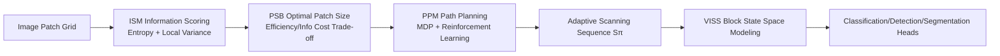

# InfoScan: Information-Efficient Visual Scanning via Resource-Adaptive Walks

**Conference**: ICLR 2026  
**OpenReview**: [https://openreview.net/forum?id=aiGqJwOE2x](https://openreview.net/forum?id=aiGqJwOE2x)  
**Code**: [https://github.com/SIAT-CV-wuyifeng/Infoscan-ICLR2026](https://github.com/SIAT-CV-wuyifeng/Infoscan-ICLR2026)  
**Area**: Efficient Visual Backbones / State Space Models (Mamba)  
**Keywords**: Visual Mamba, Content-Adaptive Scanning, Information Theory, RL Scanning Strategy, High-Resolution Representation Learning  

## TL;DR
InfoScan replaces the fixed raster or Hilbert scanning orders in Mamba-like visual backbones with content-adaptive paths. By quantifying the information of each patch via "entropy + local variance," it utilizes reinforcement learning to learn a scanning sequence that prioritizes information-dense regions, achieving higher accuracy with fewer parameters across classification, detection, and segmentation tasks.

## Background & Motivation
**Background**: High-resolution visual representation learning has long been hindered by the quadratic complexity of ViTs, where the token count explodes with resolution. To improve efficiency, researchers have developed token sparsification, hierarchical downsampling, and recently, Mamba/State Space Models (SSM) such as VMamba and Vim, which use linear-complexity structured scanning to compress 2D patch grids into 1D sequences for capturing long-range dependencies.

**Limitations of Prior Work**: Existing SSM scanning orders (raster, zigzag, Hilbert curves) are **content-agnostic and pre-fixed**, treating all patches equally. This implies a strong prior of "uniform information distribution," whereas in real-world images, high-entropy areas like object boundaries differ significantly in value from large areas of solid-colored background. Fixed scanning processes semantically rich regions and plain backgrounds with the same priority, wasting computational resources.

**Key Challenge**: Most existing efficiency solutions are **passive or reactive**—either applying fixed sparsity patterns or performing token pruning/re-weighting after scanning all patches. The bottleneck remains at the "post-full-forward" stage; no method allocates computational priority to important regions during the "input scanning step."

**Goal**: To upgrade scanning sequences from "content-agnostic geometric traversal" to a "content-adaptive decision-making process," prioritizing high-information regions before feature aggregation begins, thereby achieving a better efficiency-accuracy trade-off.

**Core Idea (Information-Gain-Driven Proactive Perception Priority)**: Formulate scanning as a policy optimization problem aimed at "maximizing cumulative discounted information gain" $\pi^* = \arg\max_{\pi}\sum_{t=1}^{N}\gamma^{t-1} I_{s_t}$. The discount factor $\gamma$ encourages early acquisition of high-information patches, making "where to look first" a learnable objective.

## Method

### Overall Architecture
InfoScan is built upon **VISS (Visual Information State Space) blocks**. Compared to standard VSS blocks, it replaces the SS2D component responsible for 2D scanning with three collaborative modules: the **Information Scoring Module (ISM)** to quantify patch information, the **Patch Selection Module (PSB)** to choose optimal patch sizes via a cost function, and the **Path Planning Module (PPM)** to model scanning as a Markov Decision Process (MDP) and learn adaptive paths using reinforcement learning. This creates a pipeline of "Evaluate Info → Determine Granularity → Plan Route." The entire backbone consists of hierarchical VISS blocks, which can directly replace ViT/Mamba for classification, detection, and segmentation.

### Key Designs

**1. Information Scoring Module (ISM): Pricing each patch via entropy and variance**. InfoScan does not rely on implicit learning of importance. Instead, it uses image statistics to provide a content-adaptive prior. The composite score is $I(S)=\omega_1\hat{H}+\omega_2\hat{V}$ (where $\omega_1+\omega_2=1$). $\hat{H}$ is the Shannon entropy ($H=-\sum_k p_k\log p_k$) calculated by quantizing RGB channels into $C$ bins (measuring global color diversity), and $\hat{V}$ is the local intensity variance within a $3\times3$ neighborhood (measuring texture complexity). Both are normalized via zero-mean unit variance. Grid search on ImageNet validation set yielded $\omega_1=0.6, \omega_2=0.4$, which is slightly biased toward color diversity. It also defines boundary saliency $I_b(e)=I(S_1)\cdot I(S_2)$ to encourage scanning paths to traverse between high-info areas for enhanced context coherence.

**2. Patch Selection Module (PSB): Solving patch size as an optimization problem**. There is a fundamental trade-off for patch side length $N_p$: sizes too small fragment spatial context and explode token counts, while sizes too large lose detail and increase per-patch latency. This is formulated as minimizing a total cost $C_{total}(N_p)=\lambda C_e(N_p)+(1-\lambda)C_{info}(N_p)$. The efficiency term uses a power-law latency model fitted on target hardware $C_e(N_p)=k_1 I\cdot N_p^{\alpha-2}$, while the information loss term is modeled as a U-shape $C_{info}(N_p)=k_2/N_p^{\beta}+k_3 N_p^{\gamma}$. The optimal $N_p$ is found via golden section search in the relaxed space.

**3. Path Planning Module (PPM): Reformulating scanning as guided random-walk MDP**. The image is divided into an $n\times n$ grid. The state $s_t=(i_t,j_t)$ includes a visitation map $V_t$, and the action set comprises four-way movements $A=\{\uparrow,\downarrow,\leftarrow,\rightarrow\}$. Unlike traditional random walks with uniform transitions, this is a **content-guided random walk**. The goal is to learn a policy $\pi_\theta$ that maximizes the expected cumulative reward $\mathbb{E}_{\pi_\theta}[\sum_t \gamma^t r(s_t,a_t,s_{t+1})]$, unifying "exploration of unvisited areas" and "exploitation of semantic-dense regions."

**4. Reward-Driven Scanning: Using "Spaced Repetition" for salient regions**. The reward function is inspired by human cognition: $r=\underbrace{I(s_{t+1})\cdot\alpha^{k(s_{t+1})}}_{\text{Adaptive Revisit Incentive}}+\underbrace{\lambda(1-V_t(s_{t+1}))}_{\text{Exploration Reward}}+\underbrace{\beta N_{visited}(s_{t+1})}_{\text{Neighborhood Info Gain}}$. The decay factor $\alpha$ for revisit incentive is **content-adaptive**: it uses a larger $\alpha_{high}$ when $I(s)>\theta$ (highly salient), allowing high-value patches to be "remembered longer" and scanned periodically.

## Key Experimental Results

### Main Results
ImageNet-1K Classification (224², Thr./Train per GPU img/s):

| Method | Params(M) | FLOPs(G) | Acc(%) |
|------|-----------|----------|--------|
| DeiT-S | 22 | 4.6 | 74.70 |
| Swin-S | 50 | 8.7 | 83.23 |
| VMamba-S | 50 | 8.7 | 83.24 |
| VMamba-B | 89 | 15.4 | 84.32 |
| **InfoScan-T** | **10** | **2.5** | **83.43** |
| **InfoScan-S** | **24** | **4.8** | **84.64** |
| **InfoScan-B** | **38** | **8.4** | **85.19** |

InfoScan-S outperforms VMamba-S by +1.4% with only 24M parameters. InfoScan-T reaches 83.43% with 10M parameters, nearing VMamba-B (84.32%) with nearly 9x fewer parameters.

MSCOCO2017 Detection (Mask R-CNN, APb/APm): InfoScan-B achieves 49.8 APb / 44.7 APm with 78M parameters, outperforming Swin-B (107M) and ConvNeXt-B (108M).

### Ablation Study
Core Module Ablation (512×512):

| Patch Selection | Path Planning | ImageNet Top-1 | ADE-20K mIoU | BraTS-2021 mIoU |
|:---:|:---:|:---:|:---:|:---:|
| ✗ | ✗ | 82.5 | 45.3 | 18.7 |
| ✓ | ✗ | 83.4 | 45.7 | 18.9 |
| ✓ | ✓ | **85.9** | **45.9** | **19.3** |

Reward Term Ablation (M1 Revisit / M2 Exploration / M3 Neighborhood Gain):

| M1 | M2 | M3 | ImageNet Top-1 | ADE-20K mIoU | BraTS mIoU |
|:---:|:---:|:---:|:---:|:---:|:---:|
| ✗ | ✗ | ✗ | 80.4 | 42.3 | 16.7 |
| ✓ | ✗ | ✗ | 81.1 | 42.7 | 17.8 |
| ✓ | ✓ | ✗ | 84.2 | 43.6 | 18.3 |
| ✓ | ✓ | ✓ | **85.9** | **45.9** | **19.1** |

### Key Findings
- **Diminishing returns for repeated scanning; adaptive routing is key**: Scanning fixed patterns multiple times (Triple Raster/Hilbert) yields almost no gain or even degrades performance, indicating the gain comes from "routing by content."
- **Random starting points provide slight coverage improvements**: Randomizing Hilbert starting points improved Top-1 from 83.6% to 84.5%, but still lagged behind adaptive scanning.
- **Generalization across natural and medical images**: Validations on ADE-20K and medical BraTS-2021 show InfoScan-S matches UPerNet-ResNet-101 with 56% fewer parameters.

## Highlights & Insights
- **Elevating "Scanning Order" to a Learnable Objective**: Previous SSM backbones merely chose between raster/Hilbert. This work explicitly formulates "where to look first" as an optimization problem.
- **Proactive Efficiency vs. Reactive Pruning**: While mainstream efficiency focuses on post-forward token pruning, InfoScan addresses the bottleneck during the input scanning stage, allocating compute before feature aggregation.
- **Information Prior without Extra Networks**: Utilizing lightweight statistics like entropy and variance avoids the need to train a separate importance predictor, making the approach engineering-friendly.
- **Grounded Motivation from Cognitive Science**: Translating "spaced repetition" into content-adaptive reward decay $\alpha^k$ provides a clear and interpretable inductive bias.

## Limitations & Future Work
- **Training Cost and Stability of RL**: RL for scanning paths introduces policy networks and multiple hyperparameters ($\alpha_{high}, \alpha_{low}, \theta, \lambda, \beta$). Training overhead and stability need more disclosure for reproduction.
- **Low-level Statistics for Information Scoring**: Entropy/variance capture texture complexity but might underestimate low-texture semantically critical regions.
- **Assumption of Fixed Weight Transfer**: Weights $\omega_1=0.6, \omega_2=0.4$ were searched on ImageNet; their optimality in highly specialized domains (e.g., medical imaging) requires further verification.
- **Input Resolution Consistency**: Ablations reported Top-1 at 512×512 (85.9%), which differs from the main table's 224² format.

## Related Work & Insights
- **Efficient/Adaptive Computation**: Sparse attention and dynamic token pruning attempt localized computation, but InfoScan's "proactive perception priority" offers a more fundamental solution.
- **Evolution of Scanning Strategies**: This represents an evolution from fixed coordinate sequences (raster) and space-filling curves (Hilbert) to content-adaptive walks.
- **Inspiration**: The concept of treating "serialization order" as a learnable object could transfer to other scenarios requiring high-dimensional data compression into 1D sequences, such as point clouds or video tokens.

## Rating
- **Novelty**: ⭐⭐⭐⭐ — First to formalize SSM scan order as an information gain maximization problem with RL.
- **Experimental Thoroughness**: ⭐⭐⭐⭐ — Covers classification, detection, and segmentation across natural and medical data, but training overhead disclosure is limited.
- **Writing Quality**: ⭐⭐⭐⭐ — Logical flow from motivation to mathematical framework.
- **Value**: ⭐⭐⭐⭐ — Provides a reusable, transferable direction for "content-adaptive scanning" in high-res visual backbones.

<!-- RELATED:START -->

## Related Papers

- [\[ICLR 2026\] InfoTok: Adaptive Discrete Video Tokenizer via Information-Theoretic Compression](infotok_adaptive_discrete_video_tokenizer_via_information-theoretic_compression.md)
- [\[ICLR 2026\] INSTANT: Compressing Gradients and Activations for Resource-Efficient Training](instant_compressing_gradients_and_activations_for_resource-efficient_training.md)
- [\[ICLR 2026\] AgilePruner: An Empirical Study of Attention and Diversity for Adaptive Visual Token Pruning in LVLMs](agilepruner_an_empirical_study_of_attention_and_diversity_for_adaptive_visual_to.md)
- [\[AAAI 2026\] Sharp Eyes and Memory for VideoLLMs: Information-Aware Visual Token Pruning for Efficient and Reliable VideoLLM Reasoning](../../AAAI2026/model_compression/sharp_eyes_and_memory_for_videollms_information-aware_visual_token_pruning_for_e.md)
- [\[ICLR 2026\] Expressive yet Efficient Feature Expansion with Adaptive Cross-Hadamard Products](expressive_yet_efficient_feature_expansion_with_adaptive_cross-hadamard_products.md)

<!-- RELATED:END -->
