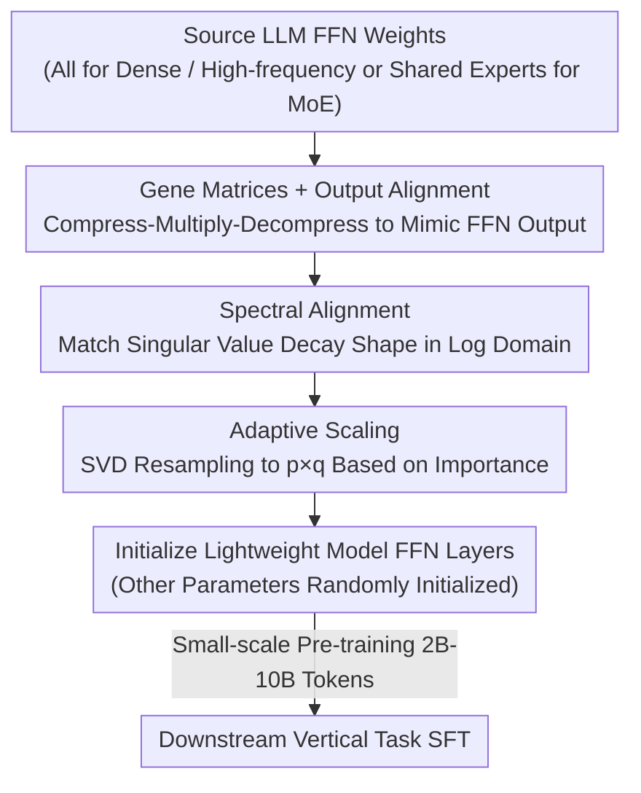

# Inheriting Generalizable Knowledge from LLMs to Diverse Vertical Tasks

**Conference**: ICLR 2026  
**OpenReview**: [https://openreview.net/forum?id=m38vyzeoO0](https://openreview.net/forum?id=m38vyzeoO0)  
**Code**: None  
**Area**: Model Compression / Knowledge Transfer / Efficient Pre-training  
**Keywords**: Knowledge Inheritance, Gene Matrix, Spectral Alignment, Adaptive Scaling, Lightweight Model Initialization

## TL;DR
This paper proposes MASA (Matrix-level Alignment and Scalable Adaptation), which uses a set of minimal "gene matrices" to align with the FFN weights of LLMs to extract generalizable knowledge (via output and spectral alignment). These matrices are then reshaped to arbitrary dimensions using SVD-based adaptive scaling to initialize the FFN layers of lightweight models. This allows an 877M small model to achieve over 85% of the performance of a 7B source model on various vertical tasks, requiring significantly less pre-training data and converging faster than random initialization, distillation, or pruning.

## Background & Motivation
**Background**: Large Language Models (LLMs) can generalize across tasks, and it is widely believed that a type of "task-agnostic, transferable" meta-knowledge is encoded within the model. Parameter-efficient fine-tuning (PEFT) methods like LoRA and adapters adapt to new tasks by modifying only a tiny fraction of parameters, suggesting that core general knowledge is consolidated in pre-trained weights. Research further indicates that this general knowledge is primarily concentrated in the FFN layers of the Transformer (supported by MoE models placing experts in FFNs where frequently activated experts are seen as carriers of shared knowledge).

**Limitations of Prior Work**: While the existence of general knowledge in LLM FFNs is confirmed, there has been little work on how to **explicitly extract and reuse** this knowledge. The Learngene framework in computer vision extracts transferable "learning genes" from large ViTs to initialize small models, but it has only been verified on small ViTs and never applied to LLMs.

**Key Challenge**: Traditional methods for transferring knowledge from large to small models, such as knowledge distillation and pruning, fail when the **capacity gap between the source and target models is large**. In distillation, an excessive teacher-student gap significantly weakens the effect, while aggressive pruning destroys model structure and function. The fundamental problem addressed here is: can we bypass end-to-end distillation or direct pruning by extracting a **size-decoupled** general knowledge representation that can be flexibly adapted to any small model?

**Goal**: The problem is decomposed into three sub-problems: (1) how to extract general knowledge from LLM FFNs into a minimal, fixed-size carrier; (2) how to reshape this carrier to match the parameter dimensions of any target small model; and (3) how to evaluate the quality of the extracted knowledge.

**Key Insight**: Borrowing from the Learngene idea of "extracting transferable modules," the authors perform two original tasks for LLMs: using square matrices to **align individual** FFN weights (rather than direct sub-block copying) and ensuring that the alignment preserves both functional equivalence and the **spectral structure** of the weight matrices—since singular value distributions are proven to be closely related to generalization ability.

**Core Idea**: Train a set of minimal "gene matrices" through dual alignment—**output alignment + spectral alignment**—to mimic LLM FFN weights and compress general knowledge into these matrices. Then, use SVD-based **adaptive scaling** to stretch or shrink them to target dimensions to directly initialize the FFN layers of lightweight models.

## Method

### Overall Architecture
MASA consists of two stages. **Knowledge Extraction Stage**: For each FFN block of the source LLM, a set of square matrices (gene matrices) is assigned. The LLM is frozen, and only these matrices are trained to align with FFN weights in terms of both function (output) and structure (spectrum). The general knowledge is "poured" into these tiny matrices (total gene matrices range from 11.8M–38.6M parameters, as small as 0.17% of the source model, requiring only 4M–10M tokens to converge). **Knowledge Inheritance Stage**: Fixed-size gene matrices are reshaped to the FFN dimensions of the target small model via SVD adaptive scaling to initialize its FFN layers (other parameters are randomly initialized). This is followed by a small amount of pre-training and finally SFT on downstream vertical task data.

For different source architectures, the alignment targets vary: for dense models (OLMo), all FFN weight matrices are aligned; for standard MoE (OLMoE), the activation frequency of experts across tasks is calculated, and high-frequency experts are aligned; for MoE with shared experts (DeepSeekMoE), the shared experts are aligned.

### Key Designs

**1. Gene Matrices and Output Alignment: Mimicking FFN Weight Functionality with Minimal Square Matrices**

To extract knowledge, a "compact container" is needed. MASA assigns a compact square matrix $M \in \mathbb{R}^{r\times r}$ to each FFN weight $W \in \mathbb{R}^{d_{in}\times d_{out}}$. Regardless of the source weight size, the same $r\times r$ matrix is used for alignment. Since the input $x\in\mathbb{R}^{d_{in}}$ dimension does not match $M$, a compression function $f_c$ rearranges the input into an $n\times r$ matrix ($n=\lceil d_{in}/r\rceil$), which is multiplied by $M$ and then reshaped back to $d_{out}$ dimensions using a decompression function $f_d$:

$$\tilde{x} = f_d(M \cdot f_c(x_{in})) \in \mathbb{R}^{d_{out}}$$

Output alignment ensures the gene matrix reproduces the response of the source weights by minimizing $L_{out} = |Wx_{in} - \tilde{x}|^2$. This guarantees that the gene matrix is **functionally** equivalent—producing the same output for the same input. However, the authors note that output alignment alone only learns "surface mapping" and fails to capture the internal knowledge structure, necessitating spectral alignment.

**2. Spectral Alignment: Matching Singular Value Decay in the Log Domain to Retain Structure Priors**

Why focus on singular values? Research shows that the spectral properties (singular value distribution) of weight matrices are closely related to generalization ability. Thus, functional consistency is insufficient; the gene matrix must also "resemble" the source weights structurally. SVD is performed on $W$ and $M$ to obtain singular values $\sigma_i$ and $\sigma'_i$. Because singular values often span several orders of magnitude, aligning them directly would be dominated by the largest values, ignoring the relative decay shape. Therefore, alignment is performed in the **log domain**, where singular values show a linear trend on a log-log scale, emphasizing decay shape over absolute magnitude:

$$L_{spec} = \sum_{i=1}^{r}(\log\sigma_i - \log\sigma'_i)^2$$

The final alignment objective is $L_{align} = L_{out} + \lambda L_{spec}$, where $\lambda$ controls the trade-off. This allows the gene matrix to retain the "knowledge geometry" of the LLM.

**3. Adaptive Scaling: Stretching Gene Matrices to Target Dimensions via SVD Importance Resampling**

Gene matrices are fixed at $r\times r$, but target FFN weights are $p\times q$. Simple random padding or truncation loses knowledge. MASA uses a two-step approach. First, SVD is performed on $M$: $M \approx U_r\Sigma V_r^\top$. Row and column norms are used as importance scores: $s^{(U)}_i = \|u_i^\top\|_2$ and $s^{(V)}_j = \|v_j\|_2$. Second, row and column resampling is performed: if $p\le r$, the top-$p$ rows of $U_r$ are selected by norm (preserving the **most important components**); if $p>r$, the top-$(p-r)$ rows are duplicated and appended (prioritizing the **most informative rows**). The same process maps $V_r$ to $V_q$, and the target matrix is reconstructed as $\hat{M} = U_p\Sigma V_q^\top \in \mathbb{R}^{p\times q}$. This **keeps the singular value matrix $\Sigma$ unchanged** and only adjusts singular vectors.

### Loss & Training
Gene matrices are trained using RedPajama-V2 as the alignment corpus (covering multiple domains like Wikipedia, arXiv, and GitHub, which is critical). The target is $L_{align} = L_{out} + \lambda L_{spec}$, updating only the gene matrices while freezing the LLM, converging within 4M–10M tokens. Lightweight models use the Llama dense architecture, with a pre-training learning rate of $4\times10^{-4}$ over 2B–10B tokens. In the SFT stage, the learning rate is $3\times10^{-5}$ using the AdamW optimizer. Dialogue generation tasks are trained for 100 epochs, while multiple-choice tasks are trained for 3 epochs.

## Key Experimental Results

Source LLMs include dense OLMo-7B, standard MoE OLMoE-7B, and DeepSeekMoE-16B. Target lightweight models range from 267M to 877M. Evaluation covers language understanding (BoolQ, HellaSwag, PIQA, etc.) and dialogue generation (DollyEval, S-NI, etc.).

### Main Results
Language Understanding (12L-267M, average score after 5B token pre-training):

| Method | Avg. |
|------|------|
| Scratch (Random Init) | 52.53 |
| Distillation | 51.70 |
| Pruning-EEP | 41.85 |
| MASA-OLMo | 53.40 |
| MASA-OLMoE | 53.38 |
| MASA-DeepSeek | **54.40** |

Dialogue Generation (12L-267M, Rouge-L average): MASA configurations (16.45–16.61) consistently outperformed Scratch (15.28), Distillation (15.15), and Pruning-EEP (8.91). At the 709M scale, 709M MASA-OLMo outperformed Scratch, Distillation, and Pruning-EEP by 3.83, 3.89, and 7.18 points respectively on the S-NI dataset.

Approaching Source Models (877M MASA, 10B pre-training + SFT): After inheriting OLMoE knowledge, the 877M MASA achieved **86.6% and 87.3%** of the 7B source model's performance on DollyEval and VicunaEval.

### Ablation Study
| Configuration | BoolQ | PIQA | DollyEval | S-NI | UnNI | Description |
|------|-------|------|-----------|------|------|------|
| MASA (Full) | 73.36 | 56.75 | 24.46 | 18.51 | 23.73 | 877M Full Model |
| w/o Spectral Alignment | 71.77 | 55.44 | 23.38 | 17.35 | 23.16 | Only output alignment, loss of priors |
| w/o Adaptive Scaling | 72.14 | 54.84 | 23.58 | 17.20 | 22.24 | Random/Truncated reshaping losses knowledge |

Effect of alignment matrix ratio $M/W$: Performance peaks at a 23% ratio (46.91 average SFT score). Increasing the ratio further leads to diminishing returns as low-energy spectral components with less generalization contribution are absorbed.

### Key Findings
- **Spectral Alignment and Adaptive Scaling are indispensable**: Removing either leads to consistent performance drops. Spectral alignment extracts generalization-related structural priors, while adaptive scaling enables lossless dimension matching.
- **Distillation and Pruning fail at high compression**: When the gap between source (7B) and target (sub-billion) is large, distillation suffers from the teacher-student gap, and pruning destroys structure. MASA bypasses this by extracting knowledge before adapting size.
- **Data Efficiency and Faster Convergence**: MASA-OLMo using 2B tokens outperformed Scratch using 5B tokens on DollyEval. It reduces pre-training data requirements by 2–5x on certain datasets and results in faster SFT convergence.
- **Cross-domain Alignment Data is Crucial**: Alignment using single-domain data significantly degrades performance compared to multi-domain data.

## Highlights & Insights
- **Decoupling knowledge from dimensions** is the most clever aspect: using fixed-size square matrices to hold knowledge and SVD resampling for adaptation allows one set of gene matrices to initialize various small models (267M–877M), avoiding the source-target coupling inherent in distillation and pruning.
- **Spectral Alignment** translates the theoretical observation that generalization relates to singular value distribution into an optimizable loss. Aligning in the log domain to focus on decay shape rather than absolute magnitude is a critical detail.
- **SVD Adaptive Scaling** preserves the singular value matrix $\Sigma$ while only modifying singular vectors based on importance. This approach is more robust than random truncation and could be applied to other tasks like model stitching or parameter reshaping.

## Limitations & Future Work
- Knowledge inheritance is limited to FFN layers; other parameters like attention remain randomly initialized. Whether transferable general knowledge exists in attention layers remains unexplored.
- Target models are limited to the Llama dense architecture; migration to heterogeneous architectures (e.g., MoE target models or non-Transformer structures) has not been verified.
- The "85%+ performance" claim is specific to certain datasets; performance varies across tasks (e.g., S-NI), so it shouldn't be generalized to all scenarios.
- Using row/column norms in adaptive scaling is a heuristic; its optimality and robustness under extreme scaling ratios require further analysis.

## Related Work & Insights
- **vs Learngene**: Learngene extracts "genes" (sub-blocks) from ViTs. MASA is the first to apply this to LLMs, replacing block copying with matrix-level alignment, spectral alignment, and SVD scaling to handle the large dimensions of LLM FFNs.
- **vs Knowledge Distillation**: Distillation degrades when capacity gaps are large. MASA extracts a size-agnostic representation first, avoiding the gap issues and outperforming distillation in experiments.
- **vs Pruning**: Pruning destroys structure at high compression ratios. MASA uses "reconstruction and initialization" rather than "trimming," remaining effective at very small scales.

## Rating
- **Novelty**: ⭐⭐⭐⭐⭐ (Systematic extraction and transfer of general knowledge from LLM FFNs using spectral alignment and SVD scaling is highly original.)
- **Experimental Thoroughness**: ⭐⭐⭐⭐ (Covers multiple source models, target sizes, and vertical tasks; however, lacks exploration of attention layers or heterogeneous architectures.)
- **Writing Quality**: ⭐⭐⭐⭐ (Clear motivation and formulas; theoretical depth partially relies on appendices.)
- **Value**: ⭐⭐⭐⭐⭐ (Provides an efficient path to building lightweight models with less data and faster convergence, highly practical for resource-constrained scenarios.)

<!-- RELATED:START -->

## Related Papers

- [\[ICLR 2026\] Knowledge Distillation as Decontamination? Revisiting the "Data Laundering" Concern in Classification Tasks](knowledge_distillation_as_decontamination_revisiting_the_data_laundering_concern.md)
- [\[ICLR 2026\] Exploring Knowledge Purification in Multi-Teacher Knowledge Distillation for LLMs](exploring_knowledge_purification_in_multi-teacher_knowledge_distillation_for_llm.md)
- [\[ACL 2026\] MeepleLM: A Virtual Playtester Simulating Diverse Subjective Experiences](../../ACL2026/model_compression/meeplelm_a_virtual_playtester_simulating_diverse_subjective_experiences.md)
- [\[ICML 2026\] SPEED-Bench: A Unified and Diverse Benchmark for Speculative Decoding](../../ICML2026/model_compression/speed-bench_a_unified_and_diverse_benchmark_for_speculative_decoding.md)
- [\[ICLR 2026\] Draft-based Approximate Inference for LLMs](draft-based_approximate_inference_for_llms.md)

<!-- RELATED:END -->
