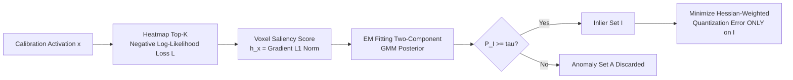

# Inlier-Centric Post-Training Quantization for Object Detection Models

**Conference**: ICLR 2026  
**OpenReview**: [https://openreview.net/forum?id=GN9otzf5o6](https://openreview.net/forum?id=GN9otzf5o6)  
**Code**: To be confirmed  
**Area**: Model Compression / Post-Training Quantization  
**Keywords**: Post-Training Quantization, Object Detection, Inlier-Anomaly Separation, EM, Heatmap Saliency  

## TL;DR
InlierQ decomposes object detection activations into "task-relevant inliers" and "anomalies caused by background clutter or sensor noise." It separates the two using gradient-aware voxel saliency scores combined with EM fitting for posterior probabilities. Quantization error minimization is performed exclusively on the inlier set, significantly improving 2D/3D camera and LiDAR detection accuracy under low-bit (W4A4) settings.

## Background & Motivation
- **Background**: Object detection consumes high computational power, making PTQ (Post-Training Quantization) the mainstream compression method for device deployment. While 8-bit quantization is largely lossless, accuracy drops significantly at low-bit (4-bit) settings.
- **Limitations of Prior Work**: Detectors evaluate a massive number of regions/voxels (2D pixels, 3D voxels), the vast majority of which correspond to background clutter or noise returned by sensors—referred to in this paper as **anomalies**. These anomalies **broaden the activation range** and **bias the distribution** toward task-irrelevant responses, forcing the limited quantization levels to cover useless values and resulting in insufficient resolution for truly informative inliers.
- **Key Challenge**: Traditional PTQ (e.g., BRECQ) treats **all** activations equally to minimize quantization error, allowing anomalies to dominate the quantization objective. Conversely, crude outlier suppression lacks a **criterion to distinguish anomalies from useful information**, risking the loss of meaningful features.
- **Goal**: Provide a principled inlier/anomaly separation standard to **concentrate quantization error minimization on the inlier subspace**, ensuring the method is label-free, drop-in, and requires only 64 calibration samples.
- **Core Idea**: **Task relevance $\neq$ activation magnitude**. Saliency is determined by the **gradient saliency** of the detection head's heatmap (which explicitly encodes object location and category confidence) rather than raw activation size. A two-component Gaussian mixture model with EM is used to posterioralize the saliency scores, followed by a hard cut for the inlier set where quantization optimization occurs.

## Method

### Overall Architecture
InlierQ processes models layer by layer: calculate a gradient-aware saliency score for each voxel (2D=pixel, 3D=voxel) $\to$ fit a two-component mixture distribution using EM to obtain inlier posterior probabilities $\to$ truncate the inlier set $I$ based on a threshold $\tau$ $\to$ minimize Hessian-weighted quantization error only on $I$. This entire pipeline is integrated into standard layer-wise sequential PTQ optimization (initial min-max for scale/zero-point, followed by iterative refinement).

### Key Designs

**1. Task-relevant loss: Focus on heatmap top-K to bind "importance" to objects rather than magnitude.** The ultimate goal of quantization is to minimize the change in task loss $\mathbb{E}[L(x+\Delta x_S)-L(x)]$ caused by activation perturbation $\Delta x_S = x_q - x$. To ensure the gradient/Hessian reflects "task relevance," the authors design an auxiliary loss focusing on salient activations instead of using raw task loss: for each channel (category), the top-K largest responses in the heatmap are used for negative log-likelihood $L(x;w) = -\frac{1}{KC}\sum_{k=1}^{K}\sum_{c=1}^{C}\log H_{[k],c}$. Since the heatmap explicitly encodes object location and confidence, this loss naturally concentrates gradients on "where the objects are," rather than being biased by high-amplitude background noise. The appendix proves that under this loss, the expected Hessian equals the Fisher Information Matrix (FIM), allowing for the approximation of the Hessian via the outer product of gradients.

**2. Voxel saliency score: Using gradient L1 norm as a modality-invariant scoring function.** For each voxel, the saliency score is defined as the L1 norm of the loss gradient with respect to the activation vector dimensions: $h(x) = \sum_{m=1}^{C}\left|\frac{\partial L(x;w)}{\partial x_m}\right|$. This measures "how sensitive the loss is to perturbations of this voxel"—higher sensitivity indicates higher task criticality. An interesting observation (Fig. 3) is that while Camera and LiDAR distributions differ greatly in the **raw gradient domain**, they exhibit a consistent, **modality-invariant distribution shape** once mapped to the **saliency score space**, allowing the same inlier/anomaly separation mechanism to be reused across sensors.

**3. EM posterior + threshold hard cut for the inlier set.** The saliency scores are modeled as a two-component Gaussian mixture (one for inliers, one for anomalies). After EM fitting, the posterior is obtained as $P(I\mid h(x)) = \frac{P(h(x)\mid I)\,P(I)}{\sum_{D\in\{I,A\}} P(h(x)\mid D)\,P(D)}$. The inlier set is defined as voxels with a sufficiently high posterior $I := \{x \mid P(I\mid h(x)) \ge \tau\}$, where $\tau$ controls the precision/recall trade-off. This step transforms the definition of "what is an anomaly" from a heuristic threshold into a probabilistic, interpretable layer-wise classification.

**4. Inlier-centric quantization objective: Minimizing curvature-weighted error only in the inlier subspace.** After decomposing the voxel space into $V = I \cup A$, the quantization objective is rewritten to minimize the Hessian-weighted perturbation for inliers: $\arg\min_S \mathbb{E}_{x\in I}\left[\Delta x_S^\top H(x)\,\Delta x_S\right]$, explicitly discarding contributions from anomalies. The authors empirically verify that $\mathbb{E}_{x\sim V}[f]\approx\mathbb{E}_{x\sim I}[f]$—meaning the inlier subspace is sufficient for general representation, and rejected anomalies contain almost no task information. Intuitively, as anomalies participate in the quantization objective, they squeeze the precious quantization levels in low-bit settings; removing them allocates the full resolution to truly useful inliers.

## Key Experimental Results

### Main Results (Focus on W4A4, unit mAP / NDS)

| Task | Model (Modality) | Metric | BRECQ | LiDAR-PTQ | InlierQ (Ours) |
|------|------------|------|-------|-----------|----------------|
| 2D | RetinaNet (C) | mAP | 34.0 | 34.4 | **34.7** |
| 2D | Faster R-CNN (C) | mAP | 32.7 | 34.3 | **34.7** |
| 3D | DETR3D (C) | mAP / NDS | 24.8 / 33.8 | 25.2 / 34.0 | **26.4 / 35.2** |
| 3D | CenterPoint (L) | mAP / NDS | 43.4 / 56.3 | 39.5 / 54.0 | **46.6 / 58.1** |

- W8A8 is almost lossless across methods; W4A8 shows a slight lead; **W4A4 shows the most significant advantage**: on 3D LiDAR, Ours outperforms BRECQ by +3.2% mAP (46.6 vs 43.4), and on 2D Faster R-CNN, Ours outperforms BRECQ by +2.0%.

### Ablation Study (Table 2, mAP)

| Task/Modality | heatmap top-K | inlier | anomaly | mAP |
|-----------|:---:|:---:|:---:|----|
| 2D Camera | - | - | ✓ | 32.5 |
| 2D Camera | ✓ | - | ✓ | 34.5 |
| 2D Camera | ✓ | ✓ | - | **34.7** |
| 3D LiDAR | - | - | ✓ | 44.2 |
| 3D LiDAR | ✓ | - | ✓ | 45.7 |
| 3D LiDAR | ✓ | ✓ | - | **46.6** |

### Key Findings
- **Heatmap top-K contributes significantly**: Adding top-K selection yields a +1.0~2.0% mAP gain even for anomaly-only optimization, proving that focusing modeling on high-confidence regions is beneficial.
- **Inlier-only is optimal**: Inlier-only optimization outperforms anomaly-only and joint inlier+anomaly optimization—confirming that anomalies contain almost no task information and their inclusion degrades performance.
- **Sweet spot for K**: Performance peaks when top-K matches the **K used during training** (DETR3D=300, CenterPoint=500). Excessively large K introduces too many task-irrelevant regions, contaminating the inlier set.
- **$\tau$ is monotonically controllable**: As the threshold becomes stricter, inlier set performance increases while anomaly set performance decreases. This transition is smooth and monotonic for both Camera and LiDAR, indicating a stable and interpretable posterior partition.

## Highlights & Insights
- **Redefining "outlier" as "anomaly"**: Instead of judging by "abnormally large magnitude," it is judged by "task irrelevance"—using heatmap gradient saliency rather than activation magnitude. This is the fundamental difference from outlier suppression routes like SmoothQuant/SVDQuant.
- **Modality-invariant saliency space**: The convergence of disparate Camera and LiDAR gradient distributions into a consistent saliency space is an elegant and practical observation, enabling a unified framework across 2D/3D and Camera/LiDAR.
- **Lightweight and deployable**: Label-free, drop-in, and requires only 64 calibration samples. The detection head remains in FP16, making it easy to integrate into existing PTQ pipelines from an engineering perspective.

## Limitations & Future Work
- **Dependency on heatmap heads**: The method relies on heatmap top-K to construct task-relevant loss (fitting architectures like CenterPoint/DETR3D with heatmap queries naturally). Adaptation for detectors without heatmap outputs (e.g., pure anchor-based or DETR variants without heatmaps) has not yet been discussed.
- **Hyperparameter tuning for $\tau$ and K**: While the sweet spot for K is the training K and $\tau$ is monotonic, they remain task-specific hyperparameters lacking an automatic selection mechanism.
- **Gains concentrated in low-bit settings**: W8A8 results are nearly identical to baselines; the value of the method is primarily realized in aggressive settings like W4A4, with limited gains in middle-bit scenarios.
- **No coverage of W2/mixed-precision or end-to-end latency**: Experiments conclude at W4A4 quantization error and mAP, without providing actual inference speedup or energy consumption figures.

## Related Work & Insights
- **PTQ Baselines**: Adaround and BRECQ (Hessian/FIM-guided block-wise reconstruction) serve as the foundation for the optimization framework. LiDAR-PTQ, which aligns regression and classification losses to task objectives, is used as another baseline.
- **Outlier suppression**: SmoothQuant (softens outliers via per-channel scaling), SVDQuant (suppresses high-energy components), and DMQ (learnable per-channel scaling). While these address "magnitude extremes," this work addresses "task irrelevance," making them complementary rather than competitive.
- **Insight**: Upgrading the question of "what to keep during quantization" from a signal statistics problem to a **task relevance problem** using detection head (heatmap) gradients as a proxy. This logic is transferable to other dense prediction tasks like segmentation or tracking that also involve "massive background voxels."

## Rating
- **Novelty**: ⭐⭐⭐⭐ —— Redefining "anomalies" in quantization through task relevance (heatmap gradient saliency + EM posterior) rather than magnitude, and verifying modality invariance in saliency space, offers a fresh perspective.
- **Experimental Thoroughness**: ⭐⭐⭐⭐ —— Covers four detectors across 2D/3D and Camera/LiDAR with multi-bit settings. Ablations (heatmap/inlier/anomaly, K, $\tau$) are comprehensive, though actual speedup/energy and lower-bit data are missing.
- **Writing Quality**: ⭐⭐⭐⭐ —— Clear logic from motivation to formulas to experiments. Visualizations (distribution shifts, modality invariance) are intuitive; formula derivation is slightly dense.
- **Value**: ⭐⭐⭐⭐ —— Lightweight, drop-in, with clear gains for low-bit detection deployment, offering practical value for edge-side detection in fields like autonomous driving.

<!-- RELATED:START -->

## Related Papers

- [\[ICLR 2026\] PTQ4ARVG: Post-Training Quantization for AutoRegressive Visual Generation Models](ptq4arvg_post-training_quantization_for_autoregressive_visual_generation_models.md)
- [\[ICLR 2026\] Post-Training Quantization for Video Matting](post-training_quantization_for_video_matting.md)
- [\[ICLR 2026\] Training Dynamics Impact Post-Training Quantization Robustness](training_dynamics_impact_post-training_quantization_robustness.md)
- [\[ICLR 2026\] Gradient-Aligned Calibration for Post-Training Quantization of Diffusion Models](gradient-aligned_calibration_for_post-training_quantization_of_diffusion_models.md)
- [\[ICLR 2026\] SliderQuant: Accurate Post-Training Quantization for LLMs](sliderquant_accurate_post-training_quantization_for_llms.md)

<!-- RELATED:END -->
