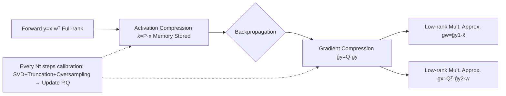

# INSTANT: Compressing Gradients and Activations for Resource-Efficient Training

**Conference**: ICLR 2026  
**OpenReview**: [https://openreview.net/forum?id=P2q6Y7UweV](https://openreview.net/forum?id=P2q6Y7UweV)  
**Code**: Open-sourced (INSTANT link provided in the paper)  
**Area**: model_compression  
**Keywords**: Efficient Training, Backpropagation Acceleration, Activation Compression, Gradient Compression, Low-rank Projection, Calibrated Subspace  

## TL;DR
INSTANT simultaneously projects the activation $x$ and the output gradient $g_y$ during backpropagation into their respective calibrated low-rank subspaces. By replacing full-rank matrix multiplications with low-rank multiplications, it reduces the backpropagation computational cost by 15× and activation memory by 32× with negligible accuracy loss.

## Background & Motivation
**Background**: While inference-side acceleration (quantization, architecture pruning) has been extensively studied, **direct training within resource-constrained budgets** for deep models remains difficult—backpropagation is both computationally expensive and memory-intensive. Existing memory-saving works (such as ESPACE and SVD-based methods) mostly rely on Singular Value Decomposition (SVD) to construct low-rank spaces for activations or weights.

**Limitations of Prior Work**: ① Performing SVD at every step (complexity $O(n^3)$) introduces massive computational overhead, which actually slows down training; ② Methods like LBP-WHT using Walsh-Hadamard Transforms rely on "low-frequency" assumptions, making them effective only for low-frequency data like images, with limited compression ratios; ③ ESPACE uses a globally fixed subspace to compress activations, which leads to **error accumulation** as training progresses; ④ Most gradient compression works only compress **weight gradients** (e.g., GaLore), while the calculation of **activation gradients** still relies on high-cost full-rank backpropagation.

**Key Challenge**: To save memory, low-rank decomposition is required, but the decomposition itself (SVD) is expensive, causing a conflict between the goals of "saving memory" and "saving computation"; meanwhile, fixed subspaces save computation at the cost of accuracy loss.

**Goal**: To simultaneously eliminate both the **computational bottleneck** and the **memory bottleneck** of backpropagation, without being limited to low-frequency image data, making it applicable to various CV and NLP data distributions.

**Key Insight**: **This work is the first to systematically utilize the low-rank structure of activation gradients $g_y$**—the authors empirically found that BERT layers require only about 6 ranks to retain 95% of the energy in output gradients. Consequently, low-rank projection matrices $P$ and $Q$ are constructed for activations $x$ and gradients $g_y$ **individually** through **periodically calibrated updates**, rearranging expensive full-rank backpropagation into several low-rank multiplications. SVD is performed only occasionally during calibration rather than at every step.

## Method

### Overall Architecture
INSTANT keeps the forward pass $y = x w^\top$ unchanged (as modifying the forward pass is most likely to cause accuracy drops) and only modifies backpropagation. During the forward pass, the activation is compressed into $\hat{x}=Px$ and stored in memory (saving memory); during the backward pass, the output gradient is also compressed into a low-rank form, and these compressed tensors are used for low-rank multiplications to approximate the weight gradient $g_w$ and the input gradient $g_x$ (saving computation). The projection matrices $P$ (for activations) and $Q$ (for gradients) are updated via SVD calibration every $N_t$ steps, amortizing the $O(n^3)$ cost of SVD to an almost negligible level.

### Key Designs

**1. Dual Subspace Calibration for $P$ and $Q$: Tailored for Activations and Gradients**. Unlike LBP-WHT, which applies a universal projection to all tensors, INSTANT constructs separate projections for the activation $x$ and the output gradient $g_y$. The specific approach draws from ESPACE: SVD is performed on the activation autocorrelation $C_X=\mathbb{E}[xx^\top]=U\Sigma U^\top$ and the gradient autocorrelation $C_G=\mathbb{E}[g_y g_y^\top]$. Projections constructed from the left singular vectors $U$ minimize the reconstruction MSE. Unlike ESPACE, it **ompresses both activations and gradients** and **does not include the batch dimension in the decomposition**, making it better fit the key information of each individual tensor. This SVD is performed only once every $N_t$ steps during the calibration phase. During calibration, **low-cost data preprocessing** is used to accumulate only the autocorrelation statistics (rather than storing all batch data), ensuring that peak memory is not driven up by the calibration itself.

**2. Energy Threshold Truncation + Oversampling + Energy Compensation: Resisting Training Drift with a Smaller Rank**. Given an energy threshold $\epsilon\le1$, total energy is defined as $E=\sum_i\sigma_i^2=\|C_G\|_F^2$. The truncation index $k$ is the smallest integer satisfying $\sum_{i=1}^k\sigma_i^2\ge\epsilon\cdot E$, retaining only the top $k$ singular vectors $U_k$. However, as training progresses, the subspace calculated during calibration gradually becomes "outdated." Thus, the authors retain $p$ additional bases (**oversampling**), increasing the rank to $R_y=k+p$ to resist kernel basis drift. Furthermore, since discarding small singular values causes backpropagation reconstruction error to accumulate, an **energy offset** compensation is added. The final projection is written as:

$$Q = U_{k+p}^\top\cdot\Big(\sum_{i=1}^{k+p}\sigma_i^2\Big)^{-\frac12},\quad Q\in\mathbb{R}^{R_y\times L}$$

The activation side uses the same strategy to obtain $P\in\mathbb{R}^{R_x\times L}$. In experiments, $\epsilon$ is fixed at 95%, and only the oversampling $p$ is tuned as a hyperparameter.

**3. Low-rank Backpropagation Rearrangement: Replacing Two Full-rank Matrix Multiplications with Several Small Ones**. Vanilla backpropagation involves $g_w=g_y^\top x$ and $g_x=g_y w$, totaling $4LC_xC_y$ FLOPs per layer. Utilizing the low-rank properties $x\approx P^\top P x$ and $g_y\approx Q^\top Q g_y$, **associative rearrangement** is applied: the weight gradient is approximated as $g_w\approx(g_y^\top P^\top)(Px)=\hat{g}_{y1}\hat{x}$, and the input gradient is split into three low-rank multiplication steps: $\hat{g}_{y2}=Qg_y$, $\hat{g}_x=\hat{g}_{y2}w$, and $\tilde{g}_x=Q^\top\hat{g}_x$. Since $R_x+R_y\ll\min(L,C_x,C_y)$, the total cost drops to $2(R_x+R_y)(C_xC_y+LC_x+LC_y)$ FLOPs, which is significantly smaller than $4LC_xC_y$. For example, in a BERT block ($L=512, C_x=C_y=768$), setting $R_x=R_y=8$ can save approximately 27× FLOPs. $P$, $Q$, and $\hat{x}$ only exist during training, resulting in **zero inference overhead**. Additionally, it only modifies backpropagation without touching the optimizer states, making it **orthogonal and stackable** with optimizer compression methods like GaLore.

## Key Experimental Results

### Main Results (CV: EfficientFormer-L1 fine-tuning the last block, 5 datasets)

| Method | MFLOPs ↓ | Mem (MB) ↓ | mAcc ↑ |
|------|---------|-----------|--------|
| Vanilla | 1484 | 1.95 | 79.28 |
| Gradient Filtering | 24 | 0.04 | 68.29 |
| LBP-WHT-2 | 95 | 0.12 | 75.61 |
| LBP-WHT-8 | 1227 | 1.43 | 79.34 |
| INSTANT-0 | 270 | 0.16 | 77.64 |

Overall, in CV and NLP (BERT/DistilBERT + GLUE 6 datasets), INSTANT achieves up to **32× activation memory** and **15× computation** savings compared to vanilla fine-tuning, with an accuracy drop of only about **1%**.

### Ablation Study (Effectiveness of Key Designs)

| Configuration | Effect |
|------|------|
| Dual Subspace (Separate projection for activation/gradient) | Superior to universal single projection (LBP-WHT) |
| Oversampling $p$ | Resists kernel basis drift, reduces information loss (Validated in Sec. 4.4) |
| Energy Threshold $\epsilon=95\%$ | Fixed throughout, tuning only $p$ balances efficiency and accuracy |

### Key Findings
- **Activation Gradients are Naturally Low-rank**: By tracking output gradients of BERT layers on MRPC through random sampling, it was found that retaining 95% energy requires only $k=6$ ranks. Energy is highly concentrated on a few top eigenvalues—this provides empirical evidence for projecting gradients into small spaces.
- FLOPs and memory statistics consider only Linear layers (the most computationally heavy components). FLOPs are used as the metric instead of wall-clock time to exclude implementation details and focus on algorithmic efficiency gains.

## Highlights & Insights
- **First systematic utilization of the low-rank structure of activation gradients** for backpropagation acceleration, moving beyond the low-frequency assumptions of LBP-WHT to apply to various image and text distributions.
- The "calibration instead of per-step SVD" approach cleverly amortizes the $O(n^3)$ cost of low-rank decomposition, resolving the contradiction where "saving memory increases computation."
- **Orthogonal** to optimizer state compression (like GaLore) and incurs **zero inference overhead**, making it easy to integrate into existing training stacks.
- Oversampling + energy compensation serves as a precise fix for the "fixed subspace drift" issue found in ESPACE.

## Limitations & Future Work
- The method is primarily validated in **fine-tuning** scenarios; more evidence is needed regarding the calibration frequency/accuracy trade-off when training large models from scratch.
- Efficiency is measured in FLOPs rather than wall-clock time; the actual speedup of low-rank multiplications on hardware still depends on kernel implementations and tensor shapes.
- Hyperparameters like $N_t$, $\epsilon$, and $p$ need to be tuned per task (though $\epsilon$ is fixed at 95%); no universal rule is provided for the optimal oversampling amount across different architectures.
- The focus is on Linear layers; extensions to convolutional layers are in the appendix, and coverage of complex structures (attention internals, normalization layers) remains to be expanded.

## Related Work & Insights
- **Activation Compression**: Nguyen et al. 2024 used SVD to compress activations but per-step SVD is too expensive; ESPACE (Sakr & Khailany 2024) used periodically calibrated subspaces, but the global fixed nature led to error accumulation—INSTANT inherits the calibration idea while correcting drift via dual subspaces and oversampling.
- **Optimizer State Compression**: GaLore and its variants utilize the low-rank nature of **weight gradients** to save optimizer memory; INSTANT targets **activation gradients**, making the two orthogonal and combinable.
- **Activation Gradient Compression**: Gradient Filtering suffers from significant accuracy drops, while LBP-WHT is limited by low-frequency assumptions and low compression ratios—INSTANT uses SVD to break the low-frequency assumption and compress into even smaller spaces.
- Insight: For training acceleration, "which tensor is low-rank and how often the subspace is updated" is more critical than "what transform is used." Periodicalizing expensive decompositions and making projections modular components is a reusable paradigm for efficient training system design.

## Rating
- **Novelty**: ⭐⭐⭐⭐ First systematic use of activation gradient low-rank structure; the combination of dual subspace calibration and oversampling compensation is novel and well-motivated.
- **Experimental Thoroughness**: ⭐⭐⭐⭐ Covers CV (3 ViTs × 5 datasets) + NLP (2 models × GLUE 6 datasets), including gradient low-rankness visualization and ablations, though focused on fine-tuning.
- **Writing Quality**: ⭐⭐⭐⭐ The progression from problem statement to projection construction and low-rank backpropagation is clear; equations and figures are well-coordinated.
- **Value**: ⭐⭐⭐⭐ Zero inference overhead + orthogonality with optimizer compression + 15×/32× savings provide direct practical value for resource-constrained training.

<!-- RELATED:START -->

## Related Papers

- [\[ICLR 2026\] InfoScan: Information-Efficient Visual Scanning via Resource-Adaptive Walks](infoscan_information-efficient_visual_scanning_via_resource-adaptive_walks.md)
- [\[ICLR 2026\] SMixer: Rethinking Efficient-Training and Event-Driven SNNs](smixer_rethinking_efficient-training_and_event-driven_snns.md)
- [\[ICML 2026\] GradPower: Powering Gradients for Faster Language Model Pre-Training](../../ICML2026/model_compression/gradpower_powering_gradients_for_faster_language_model_pre-training.md)
- [\[ICLR 2026\] MoBE: Mixture-of-Basis-Experts for Compressing MoE-based LLMs](mobe_mixture-of-basis-experts_for_compressing_moe-based_llms.md)
- [\[ICML 2026\] TWLA: Achieving Ternary Weights and Low-Bit Activations for LLMs via Post-Training Quantization](../../ICML2026/model_compression/twla_achieving_ternary_weights_and_low-bit_activations_for_llms_via_post-trainin.md)

<!-- RELATED:END -->
