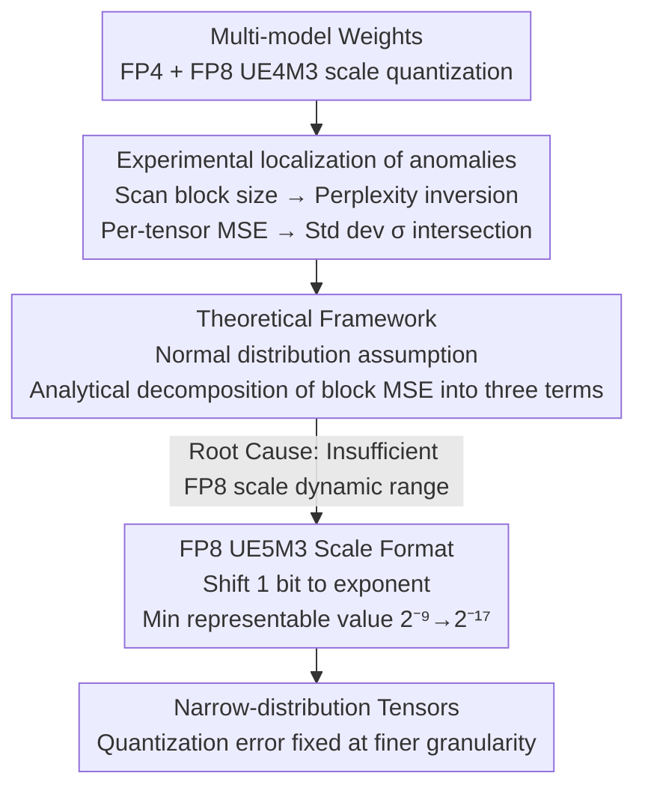

# Is Finer Better? The Limits of Microscaling Formats in Large Language Models

**Conference**: ICLR 2026  
**arXiv**: [2601.19026](https://arxiv.org/abs/2601.19026)  
**Code**: None  
**Area**: Model Compression  
**Keywords**: Microscaling quantization, FP4, quantization anomalies, dynamic range, LLM quantization

## TL;DR
Discovers and explains the counter-intuitive "finer-is-worse" anomaly in microscaling quantization—when block size decreases below a certain threshold, the limited dynamic range of the FP8 UE4M3 scale causes the quantization error of narrow-distribution tensors to increase instead. The paper proposes the FP8 UE5M3 scale format as a hardware-friendly solution.

## Background & Motivation
As the demand for LLM computation and memory grows, reducing numerical precision has become a critical optimization path. Microscaling formats achieve aggressive FP4-level compression by sharing block-wise scales and are natively supported by NVIDIA and AMD hardware (e.g., NVFP4 uses 16 FP4 elements sharing one FP8 UE4M3 scale).

Generally, intuition suggests: smaller block size $\to$ more accurate scale per block $\to$ lower quantization error. This holds true when using BF16 (16-bit) scales. However, when the scale is quantized to FP8 UE4M3, **perplexity inversion** occurs—on certain models, reducing the block size from 16 to 8 actually increases perplexity.

The discovery of this counter-intuitive phenomenon is of practical importance: the industry is actively pursuing smaller block sizes to improve quantization accuracy. If fundamental limits exist, design directions must be adjusted. Core Problem: Why is finer granularity sometimes worse? How can it be fixed?

## Method

### Overall Architecture
This paper does not invent a new quantization algorithm but rather explains a counter-intuitive observation: while smaller block sizes should allow scales to fit the data better, quantization errors unexpectedly rise in some models. The authors proceed through three steps: "Phenomenon $\to$ Root Cause $\to$ Fix." They first systematically scan the relationship between block size and perplexity across multiple models to isolate perplexity inversion to MSE anomalies in specific tensors. Then, assuming weights follow a normal distribution, they analytically decompose the block mean squared error into three terms to explain from first principles why narrow-distribution tensors perform worse at finer granularities. Finally, following the identified root cause of "insufficient scale dynamic range," they propose the FP8 UE5M3 scale format—changing only one bit—as a hardware-friendly solution.

### Key Designs

**1. Experimental localization of anomalies: Quantifying the root cause of "finer is worse"**

Intuition suggests smaller block sizes yield more precise scales, which is true when using 16-bit BF16 scales—all models show a monotonic decrease in perplexity as block size decreases. The problem arises when the scale itself is quantized to FP8 UE4M3: granite-3.3-8b exhibits perplexity inversion at block size 16, llama-3.1-8b at block size 8, while llama-2-7b does not invert at all. To find the source of the variance, the authors perform per-tensor MSE analysis, finding that approximately 25% of blocks have higher errors at finer granularity. The relationship between MSE and weight standard deviation $\sigma$ reveals an intersection point: when $\sigma < 2\times10^{-2}$, the MSE of block size 8 is higher than that of block size 16. This intersection line explains the differences between models—models with narrower weight distributions like Granite fall on the "narrow distribution" side of the intersection and are hit earliest and most severely by inversion.

**2. Theoretical Framework: Analytical decomposition of block MSE using normal distribution assumptions**

After identifying narrow distributions as the cause, the authors explain "how narrow" and "why inversion occurs." Assuming weight $X \sim \mathcal{N}(0, \sigma)$ within a block, the quantized mean squared error is decomposed into three independent contributions:

$$\text{MSE}_Z = \text{MSE}_{Z,\,x_i \neq x_{\max}} + \text{MSE}_{Z,\,x_i = x_{\max}} + \text{MSE}_{Z,\,s=0}$$

Where $\text{MSE}_{Z,\,x_i \neq x_{\max}}$ is the quantization error of ordinary elements, determined by the discretization of scale $s_k$ and the FP4 element quantization; $\text{MSE}_{Z,\,x_i = x_{\max}}$ is the error of the maximum element in the block, which is 0 when the scale is not quantized but non-zero otherwise; $\text{MSE}_{Z,\,s=0}$ is the error when the entire block is rounded to zero, triggered when $x_{\max} < s_{\min}/2$. This analytical expression aligns with experimental data to a degree of $\chi^2 \approx 4 \times 10^{-8}$, confirming the root cause: the scales of narrow-distributed blocks are inherently small, and the minimum non-zero value representable by UE4M3 is only $2^{-9}$. The limited dynamic range cannot accurately represent these small scales—as blocks get finer, the relative weight of the maximum element increases, making the second and third error terms more prominent, thus leading to worse performance.

**3. FP8 UE5M3 Scale Format: Fixing the root cause by shifting one bit**

Since the root cause is the insufficient dynamic range of the scale, the most direct fix is to expand that range. In the 8-bit unsigned FP8 scale, one bit was underutilized. The authors shift this bit from the mantissa to the exponent: changing UE4M3 (4-bit exponent + 3-bit mantissa, min value $2^{-9}$) to UE5M3 (5-bit exponent + 3-bit mantissa, min value $2^{-17}$). The mantissa logic remains identical, merely processing one additional exponent bit. This change extends the minimum representable scale by 256 times ($2^{-9} \to 2^{-17}$), covering the small scales required by narrow-distribution tensors. This path was chosen over more complex schemes because hardware complexity is primarily driven by mantissa processing; the overhead of one extra exponent bit is negligible, and scale generation can reuse existing FP8 E5M2 quantization logic, making deployment nearly zero-cost.

As a comparison, NVIDIA's current approach with NVFP4 uses per-tensor scales to pre-amplify narrow distributions. However, this has two weaknesses: it is sensitive to outliers (a single large value can bias the entire tensor scale), and it requires calculating absmax or pre-calibration during inference. UE5M3 provides sufficient dynamic range from the scale side, achieving better or comparable results without any per-tensor scaling.

## Key Experimental Results

### Main Results (FP4 quantization, block size 8)

| Model | Format | Wiki PPL↓ | PIQA↑ | HellaSwag↑ | GSM8K↑ | MMLU↑ |
|------|------|----------|-------|-----------|--------|------|
| granite-3.3-8b | BF16 | 4.72 | 80.41 | 61.49 | 62.47 | 60.55 |
| granite-3.3-8b | UE4M3 | 7.43 | 76.50 | 55.98 | 32.37 | 48.82 |
| granite-3.3-8b | UE4M3-S | 5.39 | 78.84 | 58.86 | 44.88 | 55.23 |
| granite-3.3-8b | **UE5M3** | **5.04** | **79.98** | **60.26** | **56.17** | **57.51** |
| llama-3.1-8b | BF16 | 6.24 | 79.87 | 60.05 | 50.49 | 63.28 |
| llama-3.1-8b | UE4M3 | 7.23 | 78.29 | 57.72 | 32.30 | 56.18 |
| llama-3.1-8b | **UE5M3** | **6.79** | **78.84** | **58.94** | **42.15** | **60.97** |

### Ablation: MSE Three-term Decomposition

| $\sigma$ Range | Dominant Error Term | Explanation |
|-------------|----------|------|
| Large ($>0.02$) | $\text{MSE}_{x_i \neq x_{\max}}$ | Quantization error of ordinary elements dominates |
| Medium (~$0.005$) | $\text{MSE}_{x_i = x_{\max}}$ | Scale quantization error of the max element is significant |
| Small ($<0.001$) | $\text{MSE}_{s=0}$ | Zeroing error for the entire block dominates |

### Key Findings
- **Ours** (UE5M3) outperforms UE4M3 + per-tensor scaling on granite-3.3-8b: GSM8K improved from 44.88 to 56.17 (**Gain** +11.3%).
- The theoretical framework applies to various distributions (Normal, Uniform, Laplace, etc.) and formats (FP4/INT4/FP6 scale).
- Anomalies are more severe in models with narrow weight distributions, such as the SSM model mamba-codestral-7b.
- As block size decreases, the relative weight of the $\text{MSE}_{x_i=x_{\max}}$ term increases—explaining why finer granularity is worse.

## Highlights & Insights
- Discovering the counter-intuitive "finer = worse" phenomenon itself is highly valuable—it serves as an important warning to the industry's blind pursuit of smaller block sizes.
- The precision of the theoretical framework is impressive ($\chi^2$ at $10^{-8}$ level) and is easily extendable to new formats.
- The UE5M3 solution is elegantly simple—attaining a 256x dynamic range expansion by reallocating just 1 bit, with minimal hardware changes.

## Limitations & Future Work
- Only weight quantization was analyzed; the anomalous behavior of activation quantization warrants further study.
- The maximum range of UE5M3 extends from $2^{15}$ (UE4M3) to $2^{31}$, which may involve trade-offs for large outliers.
- The theoretical framework assumes a normal distribution; while experimental validation shows good alignment, a rigorous proof is still lacking.

## Related Work & Insights
- **vs NVFP4**: NVFP4 uses UE4M3 + per-tensor scaling, whereas UE5M3 achieves better results without per-tensor scaling.
- **vs BlockDialect**: BlockDialect extends element representation via codebooks; UE5M3 solves the problem from the scale side, and the two are orthogonal and combinable.

## Rating
- Novelty: ⭐⭐⭐⭐⭐ Discovered a new quantization anomaly and provided a rigorous theoretical explanation.
- Experimental Thoroughness: ⭐⭐⭐⭐⭐ Multiple models (LLM/SSM/Hybrid), multiple formats, perfect alignment between theory and experiment.
- Writing Quality: ⭐⭐⭐⭐⭐ The narrative logic from phenomenon to theory to solution is clear and fluid.
- Value: ⭐⭐⭐⭐⭐ Directly impacts hardware design and quantization practices.

<!-- RELATED:START -->

## Related Papers

- [\[ICLR 2026\] MicroMix: Efficient Mixed-Precision Quantization with Microscaling Formats for Large Language Models](micromix_efficient_mixed-precision_quantization_with_microscaling_formats_for_la.md)
- [\[ICLR 2026\] Knowledge Fusion of Large Language Models Via Modular Skillpacks](knowledge_fusion_of_large_language_models_via_modular_skillpacks.md)
- [\[ICLR 2026\] Distillation of Large Language Models via Concrete Score Matching](distillation_of_large_language_models_via_concrete_score_matching.md)
- [\[ICLR 2026\] Entropy-Based Block Pruning for Efficient Large Language Models](entropy-based_block_pruning_for_efficient_large_language_models.md)
- [\[ICLR 2026\] MobileLLM-R1: Exploring the Limits of Sub-Billion Language Model Reasoners with Open Training Recipes](mobilellm-r1_exploring_the_limits_of_sub-billion_language_model_reasoners_with_o.md)

<!-- RELATED:END -->
