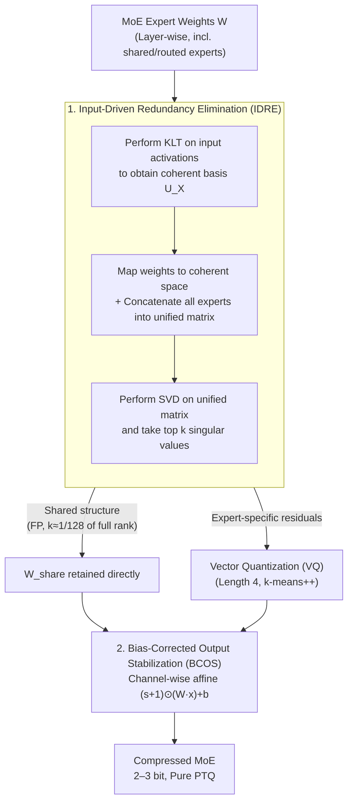

# KBVQ-MoE: KLT-guided SVD with Bias-Corrected Vector Quantization for MoE Large Language Models

**Conference**: ICLR 2026  
**arXiv**: [2602.11184](https://arxiv.org/abs/2602.11184)  
**Code**: None  
**Area**: Model Compression  
**Keywords**: MoE quantization, vector quantization, KLT transform, SVD redundancy elimination, bias correction

## TL;DR
The authors propose KBVQ-MoE, the first vector quantization framework specifically designed for MoE architectures. By utilizing KLT-guided SVD for Input-Driven Redundancy Elimination (IDRE) and Bias-Corrected Output Stabilization (BCOS), it achieves a 10%+ accuracy improvement over existing methods under 2-bit quantization.

## Background & Motivation
MoE models (e.g., Qwen3-30B-A3B, Mixtral-8x7B) achieve a balance between performance and efficiency through sparse expert activation. however, their massive parameter counts make deployment challenging (Qwen3-80B-A3B requires over 160GB of VRAM).

Vector Quantization (VQ) has demonstrated strong potential for the ultra-low bit compression of dense LLMs by mapping weight vectors to the nearest codewords in a discrete codebook. However, its direct application to MoE faces two critical obstacles:

**Inter-expert Redundant Representation**: MoE experts frequently capture similar feature patterns. VQ repeatedly quantizes similar representations for each expert, leading to inefficient utilization of limited codebook capacity.

**Amplification of Cumulative Output Bias by Expert Aggregation**: Quantization errors accumulate across layers to produce bias. In MoE, the weighted aggregation of multiple experts further amplifies this bias, resulting in more severe distribution shifts than in dense LLMs.

Core Idea: First, KLT+SVD is used to extract shared weight structures across experts (retained in full precision), applying VQ only to expert-specific components. Subsequently, channel-level affine correction is applied to fix distribution shifts.

## Method

### Overall Architecture
KBVQ-MoE aims to compress MoE weights to 2–3 bits without collapse. The mechanism involves separating redundant and essential components followed by a correction step. It follows a two-step process: first, Input-Driven Redundancy Elimination (IDRE) uses KLT-guided SVD to decompose each expert's weights into two parts—a structure shared by all experts (retained in full precision) and expert-specific residuals; only these residuals are subjected to low-bit Vector Quantization (VQ). Second, Bias-Corrected Output Stabilization (BCOS) adds an affine correction to each output channel following VQ to pull the mean and variance drifts caused by quantization back to full-precision levels. The entire pipeline is:

$$W \xrightarrow[\text{KLT+SVD}]{\text{IDRE}} \underbrace{W_{\text{share}}}_{\text{Shared Part}} + \underbrace{W_{\text{quant}}}_{\text{Specific Part}} \xrightarrow[\text{Bias Correction}]{\text{BCOS}} W_{\text{share}} + W_{\text{quant}}^{\text{VQ}} + (s, b)$$

The method is pure Post-Training Quantization (PTQ) and requires no re-training. The VQ step employs a standard configuration: a vector length of 4, with the codebook initialized via k-means++ and converged over 100 iterations. Input statistics for IDRE and output statistics for BCOS are estimated based on the same calibration data (256 samples from Red Pajama with a sequence length of 4096). The entire experiment can be completed on a single NVIDIA RTX A6000.

### Key Designs

**1. Input-Driven Redundancy Elimination (IDRE): Extracting shared expert weights for full-precision retention to prevent VQ from wasting codewords.**

MoE experts often learn similar feature patterns. If VQ is performed independently for each expert, the limited codebook capacity is repeatedly occupied by these redundant structures. IDRE identifies and handles common structures across experts in three steps: first, perform KLT on input activations to compute the covariance matrix $C_X = \frac{1}{B-1}X^TX$ and its eigen-decomposition, yielding orthogonal bases $U_X = U_{\text{KLT}} \Lambda_{\text{KLT}}^{1/2}$ sorted by energy. Second, map weights into this input-coherent space $\hat{W} = WU_X$, ensuring subsequent structural analysis is guided by input principal directions rather than blind decomposition in weight space. Finally, concatenate the transformed weights of all $n$ experts vertically into a unified matrix $\bar{W} \in \mathbb{R}^{(n \cdot oc) \times ic}$, perform SVD, and select the subspace corresponding to the top $k$ singular values as the shared structure, then map it back to the original space $U_{\text{share}} = U^T \cdot U_X^{-1}$. This single SVD processes redundancies across all experts simultaneously, while KLT ensures the extracted shared directions are statistically significant regarding the input. The truncation rank $k$ is approximately $1/128$ of the full rank, so the parameter overhead for the FP shared part is only about 0.12%. Only the remaining specific residuals are passed to VQ, focusing the codebook capacity on truly non-redundant information.

**2. Bias-Corrected Output Stabilization (BCOS): Restoring distribution shifts amplified by expert aggregation using near-zero-cost affine transformations.**

Quantization errors accumulate layer-by-layer as bias, and MoE's weighted aggregation of multiple expert outputs further amplifies this bias, making distribution shifts more severe than in dense LLMs. BCOS applies a channel-wise affine correction to the output of the VQ-quantized specific weights $W_{\text{quant}}$:

$$\mathbf{y}_{\text{corr}} = (s+1) \odot (W_{\text{VQ}}x) + b$$

Scaling and offset parameters are used to align the second-order statistics of the quantized output with the full-precision output per channel, where $s_j \approx \frac{\sigma_{y_j}}{\sigma_{\hat{y}_j}} - 1$ and $b_j = \mu_{y_j} - (1+s_j)\mu_{\hat{y}_j}$. This ensures the mean and variance of each channel return to full-precision levels. These parameters have a closed-form solution under the Minimum Mean Square Error (MMSE) criterion and can be calculated directly from calibration data statistics without additional training. Each layer requires only $2 \cdot oc$ additional parameters, making computational and storage overhead negligible.

## Key Experimental Results

### Main Results (Multiple Models, Multiple Bit-widths)

| Model | Bit | Method | PPL(↓) | Avg. Acc(↑) |
|------|------|------|--------|-------------|
| Qwen1.5-MoE-A2.7B | FP16 | — | 7.22 | 68.07 |
| Qwen1.5-MoE-A2.7B | 3-bit | VQ | 11.47 | 55.94 |
| Qwen1.5-MoE-A2.7B | 3-bit | GPTQ | 7.58 | 66.36 |
| Qwen1.5-MoE-A2.7B | 3-bit | **KBVQ-MoE** | **7.74** | **67.99** |
| Qwen3-30B-A3B | 2-bit | VQ | 115.30 | 30.61 |
| Qwen3-30B-A3B | 2-bit | **KBVQ-MoE** | **11.87** | **63.37** |
| Mixtral-8x7B | 3-bit | GPTQ | 4.17 | 77.43 |
| Mixtral-8x7B | 3-bit | **KBVQ-MoE** | **4.07** | **78.35** |

### Ablation Study (Qwen3-30B-A3B, 3-bit)

| IDRE | BCOS | PPL | ARC-E | ARC-C | HellaSwag |
|------|------|-----|-------|-------|-----------|
| ✗ | ✗ | 18.72 | 57.83 | 40.87 | 63.23 |
| ✓ | ✗ | 11.67 | 71.35 | 50.55 | 73.51 |
| ✗ | ✓ | 14.32 | 65.49 | 47.33 | 68.37 |
| ✓ | ✓ | **9.26** | **—** | **—** | **—** |

### Key Findings
- Qwen1.5-MoE 3-bit quantization achieves 67.99% accuracy, nearly identical to the FP16 accuracy of 68.07%—a loss of only 0.08%.
- For Qwen3-30B-A3B 2-bit: KBVQ-MoE reduces PPL by 6 points and improves accuracy by over 10% compared to direct VQ.
- After IDRE eliminates redundancy, expert output similarity decreases significantly (verified by comparative figures).
- BCOS effectively fixes distribution shifts—corrected channel means and variances align precisely with FP.
- The contribution of IDRE is greater than that of BCOS (PPL reduction of 7 vs 4.4), but the two are most effective when combined.

## Highlights & Insights
- Systematically addresses the specific problems of VQ in MoE architectures—redundancy waste and bias amplification—for the first time.
- The KLT-guided SVD design is elegant; weight space alignment driven by input statistics makes redundancy extraction more precise.
- The closed-form solution for BCOS is simple and practical, requiring only calibration data statistics without additional training.
- Maintains usable performance even at extremely low bits (2-bit), indicating a high compression limit for the method.

## Limitations & Future Work
- Retaining the shared structure in full precision increases storage; the selection of truncation rank $k$ may require per-layer tuning.
- KLT assumes the input distribution is stationary; dynamic inputs may result in suboptimal KLT bases.
- Evaluation was limited to the inference (PTQ) setting; integration with QAT may further improve results.
- Scalability on larger MoE models (e.g., Qwen3-80B-A3B) has not yet been verified.

## Related Work & Insights
- **vs GPTQ/MoEQuant**: Scalar quantization methods perform poorly at $\le 3$ bits; KBVQ-MoE leverages the structural advantages of VQ.
- **vs VPTQ/AQLM**: General VQ methods do not account for expert redundancy in MoE, leading to suboptimal results when applied directly.

## Rating
- Novelty: ⭐⭐⭐⭐ The combination of KLT+SVD+VQ+Affine Correction is novel, though individual components have precedents.
- Experimental Thoroughness: ⭐⭐⭐⭐⭐ Evaluated across 4 models, 2/3-bit settings, 7 datasets, with full ablation studies.
- Writing Quality: ⭐⭐⭐⭐ Detailed method descriptions and clear formula derivations.
- Value: ⭐⭐⭐⭐⭐ As the first MoE-specific VQ framework, the near-lossless 3-bit quantization is highly practical.

<!-- RELATED:START -->

## Related Papers

- [\[ICLR 2026\] TD-MoE: Tensor Decomposition for MoE Models](td-moe_tensor_decomposition_for_moe_models.md)
- [\[ICLR 2026\] MoBE: Mixture-of-Basis-Experts for Compressing MoE-based LLMs](mobe_mixture-of-basis-experts_for_compressing_moe-based_llms.md)
- [\[ICLR 2026\] TurboQuant: Online Vector Quantization with Near-Optimal Distortion Rate](turboquant_online_vector_quantization_with_near-optimal_distortion_rate.md)
- [\[ICLR 2026\] Steering MoE LLMs via Expert (De)Activation](steering_moe_llms_via_expert_deactivation.md)
- [\[ICLR 2026\] Tequila: Trapping-free Ternary Quantization for Large Language Models](tequila_trapping-free_ternary_quantization_for_large_language_models.md)

<!-- RELATED:END -->
