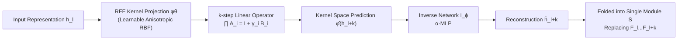

# KDP: Simplifying Representation Dynamics in Kernel Space

**Conference**: ICLR 2026  
**OpenReview**: [https://openreview.net/forum?id=262LUKGdQn](https://openreview.net/forum?id=262LUKGdQn)  
**Code**: TBD  
**Area**: Model Compression / LLM Layer Pruning  
**Keywords**: Layer Pruning, Kernel Method, Random Fourier Features, Slow Manifold, LLM Compression  

## TL;DR
Viewing the forward propagation of LLMs as a discrete dynamical system, it is observed that representations become highly similar after adjacent layers enter a "slow manifold." By projecting representations into a kernel space—where non-linear inter-layer transformations can be linearly approximated—and using a simple network for the inverse transformation, continuous Transformer layers can be folded. This achieves approximately 25% parameter reduction without requiring full-model fine-tuning.

## Background & Motivation

**Background**: Layer pruning is becoming a popular direction for LLM compression because it naturally accelerates inference, reduces model size, and does not require special operator support. The dominant paradigms involve "removing redundant layers" (e.g., ShortGPT, SLEB) or "replacing layers with compact modules" (e.g., LaCo, Streamline). Research has primarily focused on **where to prune** (selection criteria) and **how to recover performance** (fine-tuning or distillation).

**Limitations of Prior Work**: This trajectory largely ignores the intrinsic properties of internal model dynamics. Pruning is treated as an engineering problem of "constructing a smaller sub-network" without questioning why consecutive layers are similar or if such similarity can be replaced by a simpler function. Consequently, deleting layers often leads to significant performance degradation, necessitating expensive post-training (retraining/distillation) to recover performance.

**Key Challenge**: A significant phenomenon in LLMs is that **representations learned by adjacent layers are highly similar** (high similarity across multiple consecutive layers observed via CKA and cosine similarity). Intuitively, "similarity = redundancy = replaceability." However, replacing non-linear Transformer blocks with linear functions in the original space loses fine-grained, low-variance but task-relevant information (outlier features are critical for performance). **Linear approximation in the original representation space incurs excessive loss**—this is the key challenge.

**Goal**: Find a Hilbert space (kernel space) where complex inter-layer dynamics become linearly approximable, thereby achieving efficient layer pruning through "kernelized linearization" without **fine-tuning the entire model on downstream tasks**.

**Core Idea**: The authors note a key empirical fact—**inter-layer similarity measured in kernel space is significantly higher than in the original space** (CKA is generally higher than cosine similarity). This suggests that kernel space is better at modeling high-dimensional representation relationships (consistent with SVM intuition) and is thus more suitable for linear simplification. Consequently, **Kernelized Dynamics Pruning (KDP)** is proposed: project representations $h$ into kernel space via a learnable Random Fourier Features map $\varphi(\cdot)$, such that $\varphi(h_{l+1}) \approx A_l \varphi(h_l)$ holds, and then learn an inverse network to map back to the original space to replace the entire block of layers.

## Method

### Overall Architecture

KDP reformulates "pruning a sequence of continuous Transformer layers" as "finding an optimal geometric embedding in a Reproducing Kernel Hilbert Space (RKHS)." The process consists of two steps: first, **jointly train** the multi-layer non-linear transformations into a sequence of linear operators in kernel space; second, train an **inverse transformation network** to map kernel space predictions back to the original representation space. Finally, the "kernel projection $\rightarrow$ linear operator $\rightarrow$ inverse mapping" sequence is folded into a lightweight replacement module $S$ that replaces the pruned blocks $F_l, \dots, F_{l+k}$.

Selection Criteria: Sensitive layers in the first and last 10% of the model are excluded. All candidate continuous blocks (up to length $K_{max}$) are then ranked by the CKA similarity of the outputs of the first and last layers. The blocks with the highest scores are selected for kernel linearization.

### Key Designs

**1. Slow Manifold Hypothesis: Viewing Forward Propagation as a Discrete Dynamical System.** Residual connections $h_{l+1}(x) = h_l(x) + f_l(\mathrm{Norm}(h_l(x)))$ naturally resemble a discrete-time dynamical system, where $f_l$ is the "velocity vector" perturbing the current state. When adjacent layers are highly similar, the relative norm of the update vector is very small, i.e., $\|f_l(\mathrm{Norm}(h_l))\| \ll \|h_l\|$, indicating the system trajectory has entered a "slow manifold." Short-range evolution on a slow manifold can be described by simpler functions (first-order linear approximations)—a common practice in model order reduction for PDE in numerical analysis. However, since Transformer forward passes are inherently non-linear, direct linearization in the original space loses critical non-linear feature interactions, necessitating a change of space.

**2. Learnable RFF Kernel: Straightening Non-linear Transformations in Kernel Space.** The authors use Random Fourier Features to approximate a **data-driven anisotropic Gaussian RBF kernel**, mapping $h$ to low-dimensional features $\varphi(x) = \tfrac{1}{\sqrt{m}}\big(\cos(W^\top x + b)^\top,\ \sin(W^\top x + b)^\top\big)^\top$, such that $k(x,y)\approx\varphi(x)^\top\varphi(y)$. Unlike standard RFF using preset spectral distributions, the covariance matrix of frequency sampling $\Sigma = D + LL^\top$ is **learnable** ($D=\mathrm{diag}(\exp(\lambda))$ for diagonal terms, $L\in\mathbb{R}^{d\times r}$ as a low-rank factor, $r\ll d$), which is equivalent to learning a kernel $k(x,y)=\exp(-\tfrac{1}{2}(x-y)^\top\Sigma^{-1}(x-y))$ adaptive to the data metric. The core objective is to make the inter-layer transformation approximately linear in this space: $\varphi(h_{l+1})\approx A_l\varphi(h_l)$. Theoretically, Theorem 1 provides a $k$-step error bound $E_{k,l}\le \sqrt{L_{ERM}+CB_A^2R_\varphi^2\sqrt{2m\log(2m/\delta)/n}}\cdot\sum_{j}B_A^{k-1-j}$, converging at $O(1/\sqrt{n})$; Theorem 2 further proves that at sufficiently high dimensions, the total risk in kernel space is **strictly lower** than linear approximation in the original space, providing a theoretical foundation for the method.

**3. Kernel Linearization Joint Training + Residual-Preserving Operator Parameterization.** Kernel parameters $\theta$ and multi-step linear operators $\{A_i\}_{i=1}^{K_{max}}$ are jointly optimized for candidate blocks. The loss consists of a reconstruction term and a weighted cosine similarity term: $\arg\min_{\theta,\{A_i\}}\sum_i\sum_x\big(\|A_i\varphi_\theta(h_{l+i-1})-\varphi_\theta(h_{l+i})\|^2 + (1 - W\odot\cos(\cdot,\cdot))\big)$. The cosine term is modulated by a **position weight matrix $W$**, giving higher weights to later tokens in the sequence (as prediction deviation increases with sequence position). To achieve stability and preserve the additive structure of LLM forward passes, operators are parameterized as $A_i = I + \gamma_i B_i$ and initialized using Ordinary Least Squares (OLS) solutions in the current kernel space at each iteration to accelerate convergence.

**4. Inverse Transformation Network and Norm Compensation.** The $k$-step prediction in kernel space $\hat\varphi(h_{l+k}) = \prod_i \hat A_i\,\hat\varphi_\theta(h_l)$ must be mapped back to the original space to replace layers. The inverse network $I_\phi:\mathbb{R}^{2m}\to\mathbb{R}^d$ is trained with MSE to reconstruct $\hat h_{l+k}$, intentionally designed as a two-layer MLP with scalar scaling: $I(x):=\alpha\cdot\mathrm{MLP}(x)$. The authors observe that the repeated application of linear operators $\{A_i\}$ causes significant norm decay in kernel space representations. The scaling factor $\alpha$ is used to **explicitly compensate for this norm decay**, allowing original representation scales to be recovered more stably. Experiments show that Step 1 (Kernel Linearization) dominates pruning performance, while Step 2 primarily serves the inverse mapping role.

## Key Experimental Results

Setup: Six open-source models (LLaMA2-7B/13B, LLaMA3-8B, LLaMA3.1-8B, OPT-2.7B/6.7B) with ~25% parameter pruning; 4000 mixed calibration samples for training; evaluated on 15 benchmarks (classification + generation).

### Main Results (Classification Tasks, Retained Performance %)

| Model | Method | Pruning Ratio | Avg. | RP.(%) |
|------|------|--------|------|--------|
| LLaMA2-7B | Dense | 0% | 59.14 | 100.0 |
| | SLEB | 20.1% | 47.02 | 79.5 |
| | Streamline† | 27.0% | 48.37 | 81.8 |
| | SliceGPT† | 25.4% | 44.77 | 75.7 |
| | w/o Kernel | 24.8% | 34.28 | 58.0 |
| | **Ours** | 22.8% | **53.11** | **89.9** |
| | Ours† | 22.8% | 52.52 | 88.8 |
| LLaMA2-13B | Dense | 0% | 64.45 | 100.0 |
| | ShortGPT | 24.6% | 54.53 | 84.6 |
| | **Ours** | — | — | **+8.3% vs best** |
| LLaMA3-8B | **Ours** | — | — | **+9.3% vs best** |

The retained performance of KDP exceeds the best baseline on the three models by **9.1% / 8.3% / 9.3%**, respectively, and recovers performance **entirely without post-training**.

### Ablation Study

| Comparison | Conclusion |
|--------|------|
| w/o Kernel (Pruning without kernelization) | Average retention rate dropped by **31.9 / 23.1 / 18.9** percentage points across three models, proving kernel space simplification is key. |
| Kernel vs. Original Space Linear Approx. (Table 3) | Kernel space has lower fitting error, empirically supporting Theorem 2. |
| Step 1 vs. Step 2 (Fig. 3) | Step 1 loss converges rapidly within 100 epochs as cosine similarity rises, dominating performance; Step 2 handles inverse mapping. |
| $B_A$, $R_\varphi$ Evolution (Fig. 5) | $R_\varphi$ remains <1.5, $B_A$ decreases rapidly before converging, validating the benign error bound of Theorem 1. |

### Key Findings
- **Kernel Space Similarity > Original Space Similarity**: CKA is consistently higher than cosine similarity, serving as the empirical premise for the method.
- **SST-2 Phenomenon**: On simple binary classification tasks, other methods show significant performance drops (erroneous pruning of coarse-grained info), while KDP remains stable, indicating its ability to preserve core coarse-grained capabilities.
- **Outlier Fitting**: Kernel space predictions capture not only the overall trend of representations but also accurately fit outliers that are critical for performance.

## Highlights & Insights
- **Perspective Innovation**: Reformulates layer pruning from "constructing a small network" to "searching for a geometric embedding in RKHS where complex dynamics reveal intrinsic simplicity," which is theoretically sound and empirically effective.
- **Dual Theory + Experiment**: Provides a $k$-step linearization error bound (converging at $O(1/\sqrt{n})$) and a total risk theorem proving kernel space superiority, while using training curves of $B_A$ and $R_\varphi$ to map abstract theoretical constants to observable experimental values.
- **No Post-training Required**: Pruning is completed using only local representation supervision (4000 calibration samples), bypassing the expensive full-model fine-tuning/distillation required by most layer pruning methods—a practical engineering advantage.
- **Learnable Anisotropic Kernel**: Making RFF frequency distribution learnable via low-rank + diagonal covariance fits the data better than standard RFF with fixed spectral distributions, identifying a key detail for implementing kernel methods in LLMs.

## Limitations & Future Work
- **Fixed 25% Pruning Ratio and $K_{max}$**: The paper validates primarily around 25% compression. At more aggressive rates (e.g., 40%+), the error accumulation factor $\sum B_A^{k-1-j}$ might escalate, requiring further investigation into the stability of long block replacement.
- **Boundary of Slow Manifold Hypothesis**: The method relies on "high similarity between adjacent layers $\rightarrow$ entering slow manifold." Gains may be limited for models or segments where similarity is inherently low (e.g., first/last layers, certain non-LLaMA architectures), necessitating the exclusion of the first and last 10% of layers.
- **Norm Decay in Inverse Networks**: Although compensated by a scaling factor $\alpha$, norm decay exposes inherent numerical instability in sequential linear operator multiplication in kernel space. Robust operator constraints (e.g., spectral normalization) are worth exploring.
- **Generative Tasks are only "Comparable"**: On PPL/ROUGE generative benchmarks, KDP is only "comparable." Classification gains are more pronounced; there is room for improvement in maintaining generative quality.

## Related Work & Insights
- **Layer Pruning Paradigms**: ShortGPT, SLEB (direct layer removal via metrics without retraining), LaCo, Streamline, SliceGPT, LLM-Pruner (prune/replace then retrain for recovery). KDP differs by neither simply deleting layers nor relying on retraining, but by "folding" blocks via kernel space linearization.
- **Kernel Methods / RFF**: Rahimi & Recht's Random Fourier Features and Universal Kernel theory provide the basis for Lemma 1 (Existence). The intuition of high-dimension separability in SVMs is the source for "higher similarity in kernel space."
- **Dynamical Systems Perspective**: Viewing residual networks as discrete dynamical systems and borrowing model order reduction from PDE numerical analysis serves as a bridge between "representation similarity" and "computational redundancy." This cross-disciplinary perspective is inspiring for other compression/acceleration work like early exiting or token merging.
- **Insight**: Representation similarity does not imply information uselessness. The key is "looking from a different space"—the same representations may exhibit a far simpler structure in the appropriate kernel space. This idea could extend to KV cache compression and cross-layer parameter sharing.

## Rating
- **Novelty**: ⭐⭐⭐⭐⭐ Reformulating layer pruning as an RKHS geometric embedding search + slow manifold dynamical perspective is a rare, self-consistent, and original entry point.
- **Experimental Thoroughness**: ⭐⭐⭐⭐ 6 models × 15 benchmarks + 6 baselines + multiple ablations (w/o kernel, kernel vs. original space, training dynamics, norm evolution) is solid; points deducted for single compression ratio and "only comparable" generative performance.
- **Writing Quality**: ⭐⭐⭐⭐ Clear logic from motivation to theory to method and experiments. Theorem and chart correspondences are well-placed. Dense kernel and dynamical systems terminology may pose a barrier for non-kernel method readers.
- **Value**: ⭐⭐⭐⭐ Pruning 25% of parameters and significantly leading baselines without post-training shows strong engineering utility. The theoretical framework provides reusable analysis tools for future kernel-space compression research.

<!-- RELATED:START -->

## Related Papers

- [\[ICLR 2026\] MaskPro: Linear-Space Probabilistic Learning for Strict (N:M)-Sparsity on LLMs](maskpro_linear-space_probabilistic_learning_for_strict_nm-sparsity_on_llms.md)
- [\[ICLR 2026\] Training Dynamics Impact Post-Training Quantization Robustness](training_dynamics_impact_post-training_quantization_robustness.md)
- [\[ICLR 2026\] NerVE: Nonlinear Eigenspectrum Dynamics in LLM Feed-Forward Networks](nerve_nonlinear_eigenspectrum_dynamics_in_llm_feed-forward_networks.md)
- [\[ICLR 2026\] Study of Training Dynamics for Memory-Constrained Fine-Tuning (TraDy)](study_of_training_dynamics_for_memory-constrained_fine-tuning.md)
- [\[ICLR 2026\] LS-Merge: Merging Language Models in Latent Space](ls-merge_merging_language_models_in_latent_space.md)

<!-- RELATED:END -->
