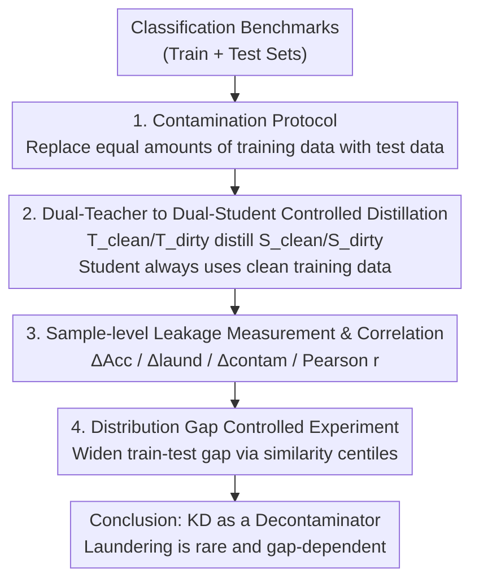

# Knowledge Distillation as Decontamination? Revisiting the "Data Laundering" Concern in Classification Tasks

**Conference**: ICLR 2026  
**OpenReview**: [https://openreview.net/forum?id=W8VCH9x1HZ](https://openreview.net/forum?id=W8VCH9x1HZ)  
**Code**: https://github.com/hengyu-luo/kd-revisiting-data-laundering-concern  
**Area**: Model Compression  
**Keywords**: Knowledge Distillation, Data Contamination, Data Laundering, Evaluation Integrity, Classification Tasks  

## TL;DR
The authors systematically examine the severity of "data laundering" (where a contaminated teacher smuggles test set knowledge to a clean student via distillation) across eight classification benchmarks. They find that the inflated accuracy caused by laundering is much smaller than direct contamination and statistically insignificant in most cases. Furthermore, they demonstrate that laundering and direct contamination are distinct phenomena driven by different mechanisms, primarily appearing when there is a large gap between training and test distributions—concluding that knowledge distillation acts more as a "decontaminating" filter than a leakage amplifier.

## Background & Motivation
**Background**: Benchmark contamination (test set leakage into training corpora leading to inflated scores) has been repeatedly shown to undermine the credibility of evaluations, prompting calls for contamination detection and training provenance transparency. Building on this, Mansurov et al. (2025) proposed a more subtle form of contamination called "data laundering": a teacher model contaminated by the test set can transfer benchmark-related knowledge to a student **trained only on clean data** during knowledge distillation, thereby inflating the student's evaluation scores even though the student has never directly seen the test set.

**Limitations of Prior Work**: The work that established the concept of laundering suffered from two major flaws. First, it used a student model derived by shearing `bert-base-uncased` down to 2 layers rather than using a pre-trained 2-layer model, causing the student to be near a random baseline and making results indistinguishable from noise. Second, it failed to compare the magnitude of laundering against direct contamination or systematically explore the conditions under which laundering occurs. Consequently, the prevalence, severity, and driving mechanisms of laundering remained unknown.

**Key Challenge**: Concerns about laundering are reasonable but lack quantification. If the laundering effect is weak, distillation could be viewed as a means to **mitigate the risk of direct data exposure**; however, if it is strong, distillation becomes a hidden channel for spreading contamination. These opposing conclusions lead to very different guidelines for the safe use of KD.

**Goal**: This paper decomposes the problem into three questions: (1) How prevalent and significant is laundering across mainstream benchmarks? (2) Is it merely a "diluted version" of direct contamination, or an independent mechanism? (3) Under what conditions does it emerge?

**Key Insight**: The authors focus on **classification tasks** because the classification setup is simple and controllable, approximating broader settings from sequence generation to ranking. Furthermore, modern NLP applications like NER and Word Sense Disambiguation are still modeled as classification problems. By strictly distinguishing control groups of "Teacher/Student/Baseline × Clean/Dirty," the transmission path of test set knowledge can be uniquely isolated to the teacher.

**Core Idea**: Using an eight-model controlled experiment setup, the study quantifies and compares the accuracy gains and sample-level impacts of "direct contamination" versus "laundering." It then validates the trigger conditions for laundering through experiments that artificially widen the training-test distribution gap, transforming qualitative "laundering concerns" into measurable conclusions.

## Method
### Overall Architecture
Rather than proposing a new model, the paper builds a **controlled measurement framework** to decouple laundering from direct contamination. The core setup involves: for each benchmark, training a clean teacher $T_{clean}$ (on the original training set) and a dirty teacher $T_{dirty}$ (on a training set contaminated by the test set) using `bert-base-uncased`. These two teachers then distill knowledge into a smaller student, `distilbert-base-uncased`, resulting in $S_{clean}$ and $S_{dirty}$. The critical constraint is: **the student's distillation process always uses only the clean training set**, with the only variable being whether the teacher is contaminated. Thus, any change in the student's score must originate from test set knowledge transmitted by the teacher, rather than direct data exposure. Additionally, clean/dirty baselines ($B_{clean}$, $B_{dirty}$) are fine-tuned directly on the student architecture as a reference for "direct contamination." This allows gains on $B/T$ (direct contamination) and $S$ (laundering) to be compared on the same scale.

After measuring the magnitude, the framework drills down to the sample level, calculating the change in difficulty for each test sample under laundering versus contamination and computing their correlation to determine if laundering is simply a scaled-down version of contamination. Finally, by partitioning the training set based on similarity centiles to artificially create distribution gaps, the triggering conditions for laundering are verified.

### Key Designs
**1. Contamination Protocol: Equal-amount replacement to ensure "only leakage increased, not data volume"**

To quantify contamination, controllable dirty datasets must be constructed. For each benchmark, the authors use **replacement-based injection**: the full test set is injected into the training set while an equal number of original training samples are removed, keeping the training set size constant. This addresses a potential flaw in controlled experiments—if test samples were simply "added," the improvement in the dirty model might be confounded by "increased training data." Equal replacement ensures the **only difference** between $B_{dirty}$/$T_{dirty}$ and their clean counterparts is exposure to the test set. All experiments are repeated with 5 random seeds to ensure robustness. (Note: in the distribution gap experiments, because each centile training set is small, the "add" mode is used to prevent underfitting.)

**2. Dual-Teacher to Dual-Student Controlled Distillation: Isolating the laundering path**

This is the central pillar of the framework. Soft-label distillation (forward KL divergence) is used to pass teacher knowledge to the student, while the **student only accesses the clean training set**. The significance of this design is that the student never directly sees test samples; if its score increases, it must be because the dirty teacher carried test set patterns within the soft labels. By defining laundering gain as $\Delta\text{Acc}_S = \text{Acc}(S_{dirty}) - \text{Acc}(S_{clean})$ and direct contamination gain as $\Delta\text{Acc}_B$ or $\Delta\text{Acc}_T$, both can be compared. To ensure conclusions are not dependent on a specific teacher, the authors also used modern lightweight LLMs like Llama-3.2-1B and Qwen3-0.6B as teachers. Even when these teachers achieved near-perfect scores on contaminated benchmarks, the students' laundering gains remained small (e.g., Llama teacher gained 25.8% on tweet sentiment, while the student gained only 1.91%), proving that distillation itself acts as an information bottleneck.

**3. Sample-level Leakage Measurement & Correlation: Determining if laundering is "diluted contamination"**

Benchmark-level averages alone cannot determine if laundering and contamination share the same mechanism. The author defines the difficulty of a sample $x_i$ under model $M$ as $D(x_i, M) = 1 - P(y_i \mid x_i; M)$ (the probability of predicting the incorrect label). Two sample-level leakage effects are then defined:

$$\Delta_{\text{laund}}(x_i) = D(x_i, S_{dirty}) - D(x_i, S_{clean}), \quad \Delta_{\text{contam}}(x_i) = D(x_i, B_{dirty}) - D(x_i, B_{clean}).$$

The Pearson correlation coefficient $r(C) = \mathrm{cov}(l, c) / (\sigma_l \sigma_c)$ is calculated for each benchmark. This coefficient is scale-invariant, allowing the comparison of whether the two phenomena "hit the same samples" without being affected by the absolute magnitude of the effects. If laundering were merely diluted contamination, samples most sensitive to contamination should also be most sensitive to laundering, resulting in high correlation. However, correlations were generally far below the 0.7 threshold for strong correlation, suggesting different mechanisms. Visualizations sorted by difficulty further show that while contamination effects increase monotonically with sample difficulty, laundering effects are scattered and non-monotonic.

**4. Distribution Gap Controlled Experiment: Pinpointing laundering triggers**

Observing that laundering is highly benchmark-dependent (e.g., more evident in tweet sentiment) and that these benchmarks often have lower train-test similarity, the authors hypothesize that **laundering is more likely to occur when the training-test distribution gap is large**. To verify causality, they conducted experiments on `emotion` and `rotten_tomatoes` by artificially widening the gap: for each class, they calculated the test set centroid and partitioned training samples into five equal centiles based on semantic similarity to the centroid. Aggregating across classes yielded five global training sets, Level 1 to Level 5, where Level 1 is most similar to the test set (smallest gap) and Level 5 is least similar (largest gap). After rerunning the teacher/student/baseline process, they found that direct contamination effects remained stable across levels, while laundering effects became **statistically more significant and, in some cases, larger in magnitude** as the gap widened (e.g., emotion student gain rose from 5.9 at Level 1 to 8.2 at Level 5). This elevates the distribution gap from a correlation to a causal piece of evidence.

## Key Experimental Results

### Main Results: Comparing Direct Contamination vs. Laundering Gains
Across 8 benchmarks, direct contamination (baseline) gains were generally massive and highly significant, whereas gains after distillation from a dirty teacher (student) were heavily compressed, remaining tiny or non-significant for most benchmarks.

| Benchmark | Direct Contamination Gain ΔAcc_B | Laundering Gain ΔAcc_S | Note |
|-----------|---------------------------------|------------------------|------|
| 20newsgroups| 11.91% | 1.42%** | Heavily compressed |
| AGNews | 6.7% | 0.65%*** | Significant but tiny |
| tweet_sentiment | 25.66% | 3.25%*** | Most obvious laundering |
| banking77 | ~5.3% | 2.2 (ns) | Non-significant |
| emotion | 4.89% | 0.7%** | Tiny |
| IMDb | 6.9% | 0.7%** | Tiny |
| rotten_tomatoes | 13.3% | 0.6 (ns) | Non-significant |
| SNLI | 13.1% | 5.8 (ns) | Non-significant (interference from underfitting) |

> Note: While the abstract claims "insignificant except for two cases," Section 4.1 specifies banking77, rotten_tomatoes, and SNLI as non-significant. The general conclusion remains consistent—laundering gains are far smaller than direct contamination.

### Sample-level Correlation: Laundering vs. Contamination
Pearson correlations for all benchmarks were far below the 0.7 strong correlation threshold, with the highest at 0.32 and SNLI being slightly negative, supporting the "different mechanisms" conclusion.

| Benchmark | r(C) | Benchmark | r(C) |
|-----------|------|-----------|------|
| 20newsgroups | 0.30*** | IMDb | 0.30*** |
| AGNews | 0.32*** | rotten_tomatoes | 0.12* |
| banking77 | 0.13 (ns) | SNLI | -0.03*** |
| emotion | 0.26*** | tweet_sentiment | 0.31*** |

### Key Findings
- **Distillation is a Bottleneck, Not an Amplifier**: On `tweet_sentiment`, the 25.66% contamination gain for the baseline was compressed to 3.25% for the distilled student; on `20newsgroups`, 11.91% shrank to 1.42%. This is the core evidence—KD generally weakens rather than propagates contamination.
- **Stronger Teachers Do Not Help Much**: Replacing the teacher with Llama-3.2-1B / Qwen3-0.6B resulted in tiny student gains even when the teacher was nearly perfect on dirty benchmarks (Llama Teacher +25.8% → Student +1.91%), indicating the bottleneck lies in the distillation process.
- **Laundering is Not Diluted Contamination**: Sample-level correlations were universally < 0.32, and laundering effects showed no monotonic relationship with sample difficulty, unlike contamination.
- **Distribution Gap is a Trigger**: Widening the train-test gap kept direct contamination stable but made laundering effects more significant and sometimes larger, turning correlation into causal evidence.

## Highlights & Insights
- **Turning "Conceptual Panic" into "Measurable Conclusions"**: Laundering was previously only qualitatively proposed with flawed experiments. This paper quantifies its prevalence, magnitude, mechanism, and triggers using an eight-model control setup, making the methodological rigor a primary contribution.
- **Clean Variable Isolation**: The student's exclusive use of clean data and the equal-replacement contamination protocol effectively lock the "test knowledge" propagation path to the teacher, providing a clean causal attribution.
- **Counter-intuitive Positive Conclusion**: Instead of fearing that KD spreads contamination, one might view KD as a **decontamination method**. In an era where large models may have widely encountered benchmarks, distillation can act as a buffer against test set leakage.
- **Centile-based Distribution Gap Construction**: Using similarity centiles to the test set centroid to create a controllable gap gradient is a clean and reusable experimental setup for studying distribution shift sensitivities.

## Limitations & Future Work
- **Scope Limited to Classification**: The study only covers classification; whether laundering is equally mild in sequence generation or ranking remains unverified. Previous work in ranking distillation suggests that even <0.1% teacher exposure can boost student performance, indicating higher risks in other tasks.
- **Modern LLM Teacher Contamination**: Pre-training data for Llama/Qwen likely already covers these benchmarks, which the authors admit might inflate observed gains and compromise controlled conditions.
- **SNLI Anomalies**: The large gap between the clean student and clean baseline (attributed to lack of early stopping and task difficulty) makes the magnitude of laundering on SNLI harder to compare horizontally.
- **Boundary of Conclusions**: Laundering is "mild" relative to direct contamination. It can still be significant on benchmarks with extremely large distribution gaps, meaning vigilance is still required if a benchmark falls into that category.

## Related Work & Insights
- **vs. Mansurov et al. (2025)**: They first proposed data laundering but used non-pretrained, 2-layer students and lacked comparison with direct contamination. This paper uses pretrained DistilBERT students and an eight-model control setup to fill gaps in magnitude, mechanism, and conditions, leading to the more optimistic conclusion that "KD is a decontaminator."
- **vs. Benchmark Contamination Detection (Magar & Schwartz 2022; Golchin & Surdeanu 2024, etc.)**: While those works focus on detecting if test sets leaked into training corpora, this paper focuses on the severity of contamination when propagated through the hidden channel of distillation.
- **vs. Ranking Distillation Leakage (Suresh Kalal et al. 2024) / Backdoor Distillation (Hong et al. 2023)**: These works show that KD can propagate small exposures or malicious behaviors in ranking and security contexts. This paper's more optimistic result in classification suggests that "task type determines if KD acts as an amplifier or a filter."

## Rating
- Novelty: ⭐⭐⭐⭐ Does not propose a new model but performs a rigorous, systematical quantification of a neglected leakage channel with counter-intuitive results.
- Experimental Thoroughness: ⭐⭐⭐⭐ 8 benchmarks × 5 seeds × multiple distillation targets × multiple teachers + causal gap experiments; only the LLM teacher portion suffers from pre-training contamination issues.
- Writing Quality: ⭐⭐⭐⭐ Clearly structured around three questions; experimental setup is well-explained.
- Value: ⭐⭐⭐⭐ Provides actionable conclusions on whether KD can be used safely and how to view laundering risks, offering practical guidance for evaluation integrity.

<!-- RELATED:START -->

## Related Papers

- [\[ACL 2025\] Data Laundering: Artificially Boosting Benchmark Results through Knowledge Distillation](../../ACL2025/model_compression/data_laundering_artificially_boosting_benchmark_results_through_knowledge_distil.md)
- [\[ICLR 2026\] Pedagogically-Inspired Data Synthesis for Language Model Knowledge Distillation](pedagogically-inspired_data_synthesis_for_language_model_knowledge_distillation.md)
- [\[ICLR 2026\] Inheriting Generalizable Knowledge from LLMs to Diverse Vertical Tasks](inheriting_generalizable_knowledge_from_llms_to_diverse_vertical_tasks.md)
- [\[ICLR 2026\] SGD-Based Knowledge Distillation with Bayesian Teachers: Theory and Guidelines](sgd-based_knowledge_distillation_with_bayesian_teachers_theory_and_guidelines.md)
- [\[ICLR 2026\] In Good GRACES: Principled Teacher Selection for Knowledge Distillation](in_good_graces_principled_teacher_selection_for_knowledge_distillation.md)

<!-- RELATED:END -->
